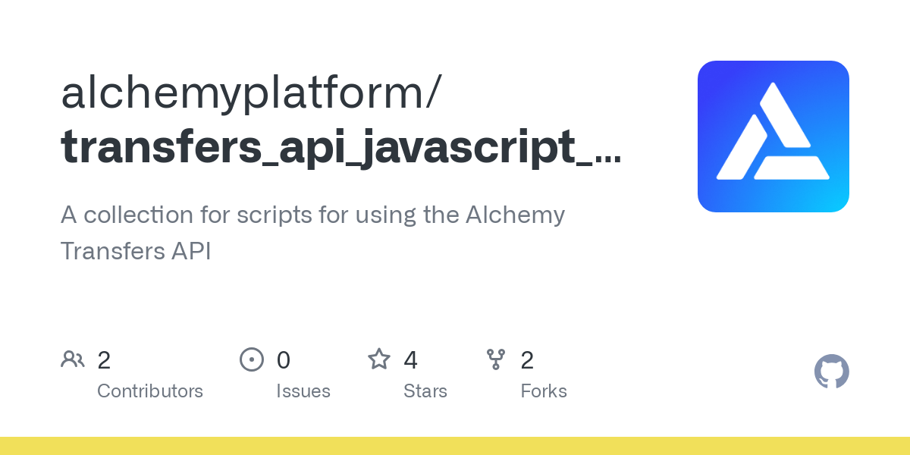

<Info>
  This tutorial uses the **[alchemy\_getAssetTransfers](/reference/alchemy-getassettransfers)** endpoint.
</Info>

If you just need the script for this tutorial refer to the below Recipe or continue reading for more

🔄

Script to Get NFTs Minted by an Address

Open Recipe

Some of the reasons why you'd want to get NFTs minted by an address include:

* Displaying all NFTs minted by a user (created and sent to their address)
* Displaying all NFTs minted by a contract (shows you how many have been created)
* Understand which NFTs were "first owned" or originally minted by a given address

Surprisingly, this type of information is not easy to gather with the current [Ethereum API](https://docs.alchemy.com/alchemy/apis/ethereum). That's why Alchemy builds a higher level \[Enhanced APIs ([https://docs.alchemy.com/alchemy/enhanced-apis](https://docs.alchemy.com/alchemy/enhanced-apis)) to make building in Web3 much easier.

**In this tutorial, we'll be leveraging Alchemy's [Transfers API](/reference/transfers-api)(`alchemy_getAssetTransfers`) to fetch all NFTs minted by a particular account address.**

***

## What happens when NFTs are minted?

Under the hood, when an NFT is minted, it is transferred from the [null address](https://etherscan.io/address/0x0000000000000000000000000000000000000000): 0x0000000000000000000000000000000000000000 to the user account or contract that minted it.

All token **creations** and **destructions** typically are **from** and **to** the null address respectively, so it's a good filter when looking for mint or burns events.

This on-chain minting emits a standard [transfer event](/reference/transfers-api#what-are-transfers) since the asset is being *transferred* from one account to another.

Since we can filter for transfer events using the \[Transfers API]ref:transfers-api), we can easily fetch NFT mints with the right parameter specification!

***

## How to get NFT Mint Events

In order to fetch NFTs minted by a given address we'll need to specify a few things in our [`alchemy_getAssetTransfers`](/reference/alchemy-getassettransfers) request:

* `fromAddress`: where the transaction originated from, in our case that’s always 0x0000000000000000000000000000000000000000
* `toAddress`: the address we want to see mints from (NFTs go **to** the address that minted them)
* `fromBlock`: the starting time range we want to fetch NFT mints over (defaults to `latest`)
* `toBlock`: the ending time range we want to fetch NFT mints over (defaults to `latest`)
* `category`: the type of transfer events we care about, in our case we want to see NFTs which are ERC721 and ERC1155 events

Once we've specified these inputs we can send the request!

***

### Example: Getting NFT Mint Events

To demonstrate how to get the NFT mint events from an address we're going to walk through an example using the address [0x5c43B1eD97e52d009611D89b74fA829FE4ac56b1](https://etherscan.io/address/0x5c43B1eD97e52d009611D89b74fA829FE4ac56b1) and get all NFT mint events from block 0 to latest.

<Check>
  For a no-code demonstration of this request, check out Alchemy's [Composer tool](https://composer.alchemyapi.io/?composer_state=%7B%22chain%22%3A0%2C%22network%22%3A0%2C%22methodName%22%3A%22alchemy_getAssetTransfers%22%2C%22paramValues%22%3A%5B%7B%22excludeZeroValue%22%3Atrue%2C%22fromBlock%22%3A%220x0%22%2C%22toBlock%22%3A%22latest%22%2C%22fromAddress%22%3A%220x0000000000000000000000000000000000000000%22%2C%22toAddress%22%3A%220x5c43B1eD97e52d009611D89b74fA829FE4ac56b1%22%2C%22category%22%3A%5B%22external%22%2C%22erc721%22%2C%22erc1155%22%5D%7D%5D%7D)!
</Check>

Follow along with any of the code examples below to make the request.

### Alchemy SDK (Recommended)

[Alchemy's SDK](/reference/alchemy-sdk-quickstart) allows us to more efficiently interact with Alchemy's endpoints and make JSON-RPC requests.

[](https://github.com/alchemyplatform/transfers_api_javascript_scripts/blob/main/javascript/alchemyweb3/nft-mints/nft-mints-alchemyweb3.js)

[github.com](https://github.com/alchemyplatform/transfers_api_javascript_scripts/blob/main/javascript/alchemyweb3/nft-mints/nft-mints-alchemyweb3.js)

[transfers\_api\_javascript\_scripts/nft-mints-alchemyweb3.js at main · alchemyplatform/transfers\_api\_javascript\_scripts](https://github.com/alchemyplatform/transfers_api_javascript_scripts/blob/main/javascript/alchemyweb3/nft-mints/nft-mints-alchemyweb3.js)

NFT Mints GitHub Repo

Ensure you are inside your project folder and type the following command in the terminal:

<CodeGroup>
  ```shell Shell
  npm install alchemy-sdk
  ```
</CodeGroup>

#### 2. Create a file for the script

In your current directory, create a new file called `nft-mints-alchemy-sdk.js`

Use your favorite file browser, code editor, or just directly in the terminal using the `touch` command like this:

<CodeGroup>
  ```shell Shell
  touch nft-mints-alchemy-sdk.js
  ```
</CodeGroup>

#### 3. Write script!

Copy and paste in the following code snippet into your new file: `nft-mints-alchemy-sdk.js`

<CodeGroup>
  ```javascript nft-mints-alchemy-sdk.js
  // Setup: npm install alchemy-sdk
  import { Alchemy, Network } from "alchemy-sdk";

  const config = {
    apiKey: "<-- ALCHEMY APP API KEY -->",
    network: Network.ETH_MAINNET,
  };
  const alchemy = new Alchemy(config);

  // Address we want get NFT mints from
  const toAddress = "0x5c43B1eD97e52d009611D89b74fA829FE4ac56b1";

  const res = await alchemy.core.getAssetTransfers({
    fromBlock: "0x0",
    fromAddress: "0x0000000000000000000000000000000000000000",
    toAddress: toAddress,
    excludeZeroValue: true,
    category: ["erc721", "erc1155"],
  });

  // Print contract address and tokenId for each NFT (ERC721 or ERC1155):
  for (const events of res.transfers) {
    if (events.erc1155Metadata == null) {
      console.log(
        "ERC-721 Token Minted: ID- ",
        events.tokenId,
        " Contract- ",
        events.rawContract.address
      );
    } else {
      for (const erc1155 of events.erc1155Metadata) {
        console.log(
          "ERC-1155 Token Minted: ID- ",
          erc1155.tokenId,
          " Contract- ",
          events.rawContract.address
        );
      }
    }
  }
  ```
</CodeGroup>

#### 4. Run script!

Now, on your command line, you can run the script by calling:

<CodeGroup>
  ```shell shell
  node nft-mints-alchemy-sdk.js
  ```
</CodeGroup>

### Node-Fetch

If you're using [`node-fetch`](https://www.npmjs.com/package/node-fetch) a lightweight, common module that brings the Fetch API to Node.js and allows us to make our HTTP requests, below is a code snippet for the request you'd make!

[](https://github.com/alchemyplatform/transfers_api_javascript_scripts/blob/main/javascript/fetch/nft-mints/nft-mints-fetch.js)

[github.com](https://github.com/alchemyplatform/transfers_api_javascript_scripts/blob/main/javascript/fetch/nft-mints/nft-mints-fetch.js)

[transfers\_api\_javascript\_scripts/nft-mints-fetch.js at main · alchemyplatform/transfers\_api\_javascript\_scripts](https://github.com/alchemyplatform/transfers_api_javascript_scripts/blob/main/javascript/fetch/nft-mints/nft-mints-fetch.js)

NFT Mints GitHub Repo

#### 1. Create a file.

In your current directory, create a new file called `nft-mints-fetch.js` using your favorite file browser, code editor, or just directly in the terminal using the `touch` command like this:

<CodeGroup>
  ```shell nft-mints-fetch-file.js
  touch nft-mints-fetch.js
  ```
</CodeGroup>

#### 2. Write script!

Copy and paste in the following code snippet into your new file: `nft-mints-fetch.js`

<CodeGroup>
  ```javascript nft-mints-fetch.js
  import fetch from 'node-fetch';

    // Replace with your Alchemy API key:
    const apiKey = "demo"
    const baseURL = `https://eth-mainnet.g.alchemy.com/v2/${apiKey}`;
    const fetchURL = `${baseURL}`;

    // Address we want get NFT mints from
    const toAddress = "0x5c43B1eD97e52d009611D89b74fA829FE4ac56b1";

    let data = JSON.stringify({
    "jsonrpc": "2.0",
    "id": 0,
    "method": "alchemy_getAssetTransfers",
    "params": [
      {
        "fromBlock": "0x0",
        "fromAddress": "0x0000000000000000000000000000000000000000",
        "toAddress": toAddress,
        "excludeZeroValue":true,
        "category": ["erc721","erc1155"]
      }
    ]
  });

    var requestOptions = {
      method: 'POST',
      headers: { 'Content-Type': 'application/json' },
      body: data,
      redirect: 'follow'
    };

    fetch(fetchURL, requestOptions)
      .then((res) => {
        return res.json()
      })
      .then((jsonResponse) => {
        //Print token name / asset value
        //console.log(jsonResponse)
        for (const events of jsonResponse.result.transfers) {
            if (events.erc1155Metadata == null) {
              console.log("ERC-721 Token Minted: ID- ", events.tokenId, " Contract- ", events.rawContract.address);
            }
            else{
              for (const erc1155 of events.erc1155Metadata) {
              console.log("ERC-1155 Token Minted: ID- ", erc1155.tokenId, " Contract- ", events.rawContract.address);
              }
            }
        }
      })
      .catch((err) => {
        // handle error
        console.error(err);
      });
  ```
</CodeGroup>

#### 3. Run script!

Now, on your command line, you can execute the script by calling:

<CodeGroup>
  ```shell shell
  node nft-mints-fetch.js
  ```
</CodeGroup>

### Axios

If you're using Javascript [`axios`](https://www.axios.com/), a promise-based HTTP client for the browser and Node.js which allows us to make a raw request to the Alchemy API, below is a code snippet for the request you'd make!

[](https://github.com/alchemyplatform/transfers_api_javascript_scripts/blob/main/javascript/axios/nft-mints/nft-mints-axios.js)

[github.com](https://github.com/alchemyplatform/transfers_api_javascript_scripts/blob/main/javascript/axios/nft-mints/nft-mints-axios.js)

[transfers\_api\_javascript\_scripts/nft-mints-axios.js at main · alchemyplatform/transfers\_api\_javascript\_scripts](https://github.com/alchemyplatform/transfers_api_javascript_scripts/blob/main/javascript/axios/nft-mints/nft-mints-axios.js)

NFT Mints GitHub Repo

#### 1. Create a file.

In your current directory, create a new file called `nft-mints-axios.js` using your favorite file browser, code editor, or just directly in the terminal using the `touch` command.

<CodeGroup>
  ```shell nft-mints-axios-file.js
  touch nft-mints-axios.js
  ```
</CodeGroup>

#### 2. Write script!

Copy and paste in the following code snippet into your new file: `nft-mints-axios.js`

<CodeGroup>
  ```javascript nft-mints-axios.js
  import axios from 'axios';

    // Replace with your Alchemy API key:
    const apiKey = "demo"
    const baseURL = `https://eth-mainnet.g.alchemy.com/v2/${apiKey}`;
    const axiosURL = `${baseURL}`;

    // Address we want get NFT mints from
    const toAddress = "0x5c43B1eD97e52d009611D89b74fA829FE4ac56b1";

    let data = JSON.stringify({
    "jsonrpc": "2.0",
    "id": 0,
    "method": "alchemy_getAssetTransfers",
    "params": [
      {
        "fromBlock": "0x0",
        "fromAddress": "0x0000000000000000000000000000000000000000",
        "toAddress": toAddress,
        "excludeZeroValue":true,
        "category": ["erc721","erc1155"]
      }
    ]
  });

    var requestOptions = {
      method: 'post',
      headers: { 'Content-Type': 'application/json' },
      data: data,
    };

    const res = await axios(axiosURL, requestOptions);

    // Print contract address and tokenId for each NFT:
    for (const events of res.data.result.transfers) {
        if (events.erc1155Metadata == null) {
          console.log("ERC-721 Token Minted: ID- ", events.tokenId, " Contract- ", events.rawContract.address);
        }
        else{
          for (const erc1155 of events.erc1155Metadata) {
          console.log("ERC-1155 Token Minted: ID- ", erc1155.tokenId, " Contract- ", events.rawContract.address);
          }
        }
    }
  ```
</CodeGroup>

#### 3. Run script!

Now, on your command line, you can execute the script by calling:

<CodeGroup>
  ```shell shell
  node nft-mints-axios.js
  ```
</CodeGroup>

***

## How to process the API response

Now that we have made a query and can see the response, let's learn how to handle the returned data.

### Raw API Response:

Without parsing the response, we have a console log that looks like this:

<CodeGroup>
  ```javascript javascript
  {
    [
    {
      "blockNum": "0xc75329",
      "hash": "0xd89b54cb5aca6f501d43ee3363dcc892d31d1c185c9059c22d686ca0a1b93314",
      "from": "0x0000000000000000000000000000000000000000",
      "to": "0x5c43b1ed97e52d009611d89b74fa829fe4ac56b1",
      "value": null,
      "erc721TokenId": "0x0000000000000000000000000000000000000000000000000000000000000012",
      "erc1155Metadata": null,
      "tokenId": "0x0000000000000000000000000000000000000000000000000000000000000012",
      "asset": "BURN",
      "category": "erc721",
      "rawContract": {
        "value": null,
        "address": "0x18a808dd312736fc75eb967fc61990af726f04e4",
        "decimal": null
      }
    },
    ...
    {
      "blockNum": "0xd8315a",
      "hash": "0x270aa9026d69b0924341e0ce60b24182f1f2af8a4bcc752b8e65595bdeca565f",
      "from": "0x0000000000000000000000000000000000000000",
      "to": "0x5c43b1ed97e52d009611d89b74fa829fe4ac56b1",
      "value": null,
      "erc721TokenId": "0x00000000000000000000000000000000000000000000000000000000000000fb",
      "erc1155Metadata": null,
      "tokenId": "0x00000000000000000000000000000000000000000000000000000000000000fb",
      "asset": null,
      "category": "erc721",
      "rawContract": {
        "value": null,
        "address": "0x947600ad1ad2fadf88faf7d30193d363208fc76d",
        "decimal": null
      }
    }
  ]
  }
  ```
</CodeGroup>

### Understanding API Response:

Below are the components of the each transfer in our response.

* `blockNum`: the block number where an NFT mint event occurred, in `hex`

* `hash`: the transaction hash of NFT minting transaction

* `from`: where the transaction originated from, in our case that’s always 0x0000000000000000000000000000000000000000

* `to`: the address we want to see mints from (NFTs go to \*\*\*\* the address that minted them), should be the same address specified in our request

* `value`: the amount of ETH transferred, should always be `null` in our case since we're only looking at NFT mints, not sales

* `erc721TokenId`: the ERC721 token ID. `null` if not an ERC721 token transfer.

* `erc1155Metadata`: a list of objects containing the ERC1155 `tokenId` and `value`. `null` if not an ERC1155 transfer

* `tokenId`: the token ID for ERC721 tokens or other NFT token standards

* `asset`: `ETH` or the token's symbol. `null` if not defined in the contract and not available from other sources.

* `rawContract`

  * `value`: `null` since we're looking at ERC721 & ERC1155 transfer
  * `address`: NFT contract address
  * `decimal`: `null`

### Printing out the token `type`, `tokenId` and contract `address`

There's lots of information we can pull from this response. One example you may be interested in displaying are: NFT contract standard (`ERC721` or `ERC1155`), `contractAddress`, and `tokenId`

With our queried response saved as a JSON object, we can index through the transfers. In particular, we first access the transfers list and then iterate accross a few key parameters: `erc1155Metadata` , `tokenId`, and `rawContract`.

The steps we want to take are:

1. Loop through all transfers in the result

2. Check whether the returned transfer is ERC1155 or not

   1. If so, loop through tokens within ERC1155
      1. print `tokenId` and `address` for each
   2. If not, assume transfer is ERC721
      1. print `tokenID` of contract and address

<CodeGroup>
  ```javascript nft-mints.js
  for (const events of res.data.result.transfers) {
        if (events.erc1155Metadata == null) {
          console.log("ERC-721 Token Minted: ID- ", events.tokenId, " Contract- ", events.rawContract.address);
        }
        else{
          for (const erc1155 of events.erc1155Metadata) {
          console.log("ERC-1155 Token Minted: ID- ", erc1155.tokenId, " Contract- ", events.rawContract.address);
          }
        }
    }
  ```
</CodeGroup>

If you followed along, your response should look like the following:

<CodeGroup>
  ```python python
  ERC-721 Token Minted: ID-  0x0000000000000000000000000000000000000000000000000000000000000012  Contract-  0x18a808dd312736fc75eb967fc61990af726f04e4
  ERC-721 Token Minted: ID-  0x000000000000000000000000000000000000000000000000000000000000003c  Contract-  0x82c7c02a52b75387db14fa375938496cbb984388
  ERC-721 Token Minted: ID-  0x000000000000000000000000000000000000000000000000000000000000004d  Contract-  0x82c7c02a52b75387db14fa375938496cbb984388
  ERC-721 Token Minted: ID-  0x0000000000000000000000000000000000000000000000000000000000000348  Contract-  0x7ecb204fed7e386386cab46a1fcb823ec5067ad5
  ERC-721 Token Minted: ID-  0x0000000000000000000000000000000000000000000000000000000000000349  Contract-  0x7ecb204fed7e386386cab46a1fcb823ec5067ad5
  ERC-721 Token Minted: ID-  0x000000000000000000000000000000000000000000000000000000000000034a  Contract-  0x7ecb204fed7e386386cab46a1fcb823ec5067ad5
  ERC-1155 Token Minted: ID-  0x01  Contract-  0xc4c377565a4b9eb6e657c2422bd33b6e4859b041
  ERC-721 Token Minted: ID-  0x0000000000000000000000000000000000000000000000000000000000000b6e  Contract-  0x72d47d4d24018ec9048a9b0ae226f1c525b7e794
  ERC-721 Token Minted: ID-  0x000000000000000000000000000000000000000000000000000000000000026d  Contract-  0x947600ad1ad2fadf88faf7d30193d363208fc76d
  ERC-721 Token Minted: ID-  0x00000000000000000000000000000000000000000000000000000000000000fb  Contract-  0x947600ad1ad2fadf88faf7d30193d363208fc76d
  ```
</CodeGroup>

And that's it! You've now learned how to fetch NFT mints for an address on Ethereum! If you enjoyed this tutorial for getting NFTs minted by an address, give us a tweet [@Alchemy](https://twitter.com/Alchemy)! (Or give the author [@crypt0zeke](https://twitter.com/crypt0zeke) a shoutout!)

Also, join our [Discord server](https://www.alchemy.com/discord) to meet other blockchain devs, builders, and entrepreneurs!
