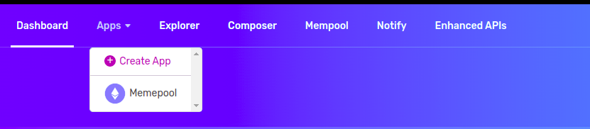
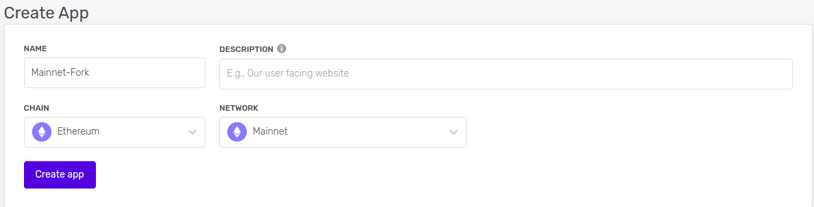
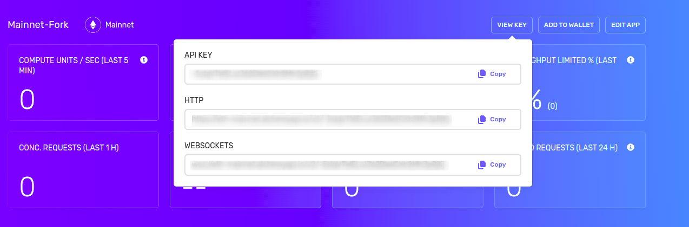
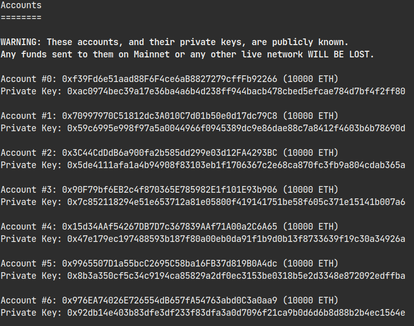
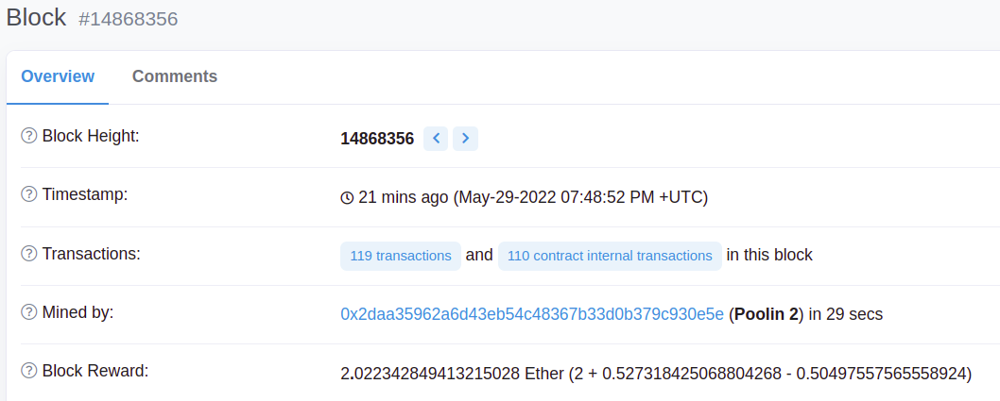

Using the [available testnets](https://www.alchemy.com/overviews/what-are-testnets) to deploy your smart contracts is a great way to test them in a low-cost and low-risk environment. These testnets act and perform similarly to the Mainnet but they do not share the same transactions and data.

For certain projects, you may need to interact with previously deployed contracts, past transactions, and other historical data on the Mainnet. Forking Mainnet allows you to work with the most recent state of the Mainnet in order to test your projects on a local blockchain. Let’s see why and how we can do this:

***

# Why Fork Mainnet?

## Interact with previously deployed contracts

Your smart contract may need to interact with existing smart contracts. Forking Mainnet allows you to work with deployed contracts to understand any risks and vulnerabilities before deploying to the Mainnet. It also allows your smart contract to use any data from the Mainnet that would be unavailable on a testnet. This could be critical to how your contract functions.

## Impersonate Other Accounts

Hardhat allows you to impersonate any Ethereum account on your local blockchain using the [`impersonateAccount` method.](https://hardhat.org/hardhat-network/reference#hardhat_impersonateaccount) This is useful if you would like to see the results when a certain account interacts with your smart contract. An example of this would be impersonating how a certain DAO member would interact with a deployed escrow smart contract as a seller.

## Work with Complex Protocols

Web3 Protocols continue to grow in reach and complexity. This growth requires that testing take place in an environment where any downstream effects of additions can be viewed. Forking mainnet allows you to see these changes and adapt to them before live deployment.

***

## Required Tools

1. [A free Alchemy Account](https://alchemy.com/?a=1a16e957af)
2. [Hardhat](https://hardhat.org/)
3. Any Command Line Interface (CLI)

***

## Setting up Alchemy

In order to fork Mainnet, we will need to connect to the Ethereum network. The simplest way to do this is by creating [a free Alchemy account here](https://alchemy.com/?a=1a16e957af). An Alchemy account includes access to a full Ethereum archive node.

Full archive nodes are types of nodes that contain all the information about a blockchain from the genesis or original block. This is useful when forking Mainnet as you will be able to work with the historical data of the Ethereum blockchain that can be used in your local environment.

## Creating an App and API Key

After creating your Alchemy account, you will need to create an app in the [Alchemy Dashboard](https://dashboard.alchemyapi.io) in order to generate an API key.

By navigating to the 'Apps' label in the navigation bar of the Alchemy Dashboard, you can create a new app by clicking on the 'Create App' button.



Creating an App on the Alchemy Dashboard

Since we will be forking Mainnet, make sure to use the following settings when creating your application:

* **Name**: Mainnet-Fork (or whatever you would like)

* **Description**: Description of what your app does so you can keep track

* **Chain**: Ethereum

* **Network**: Mainnet



Creating a description for your app

Once the app has been successfully created, navigate to the 'View Key ' button in the App menu in order to see your API key for this app. These details will later be used to connect to Mainnet to complete the fork.



Your API Key, HTTP, and Websockets address

***

## Setting Up Hardhat

Now that we have our [Alchemy account](https://alchemy.com/?a=1a16e957af) setup and an app created, you need to connect your configuration with Hardhat. Hardhat will allow you to fork Mainnet to a local blockchain so that we can test and deploy our smart contracts.

### Installing Hardhat

Installing Hardhat can be done by using npm which is included when you [install Node.js](https://nodejs.org/en/). If you are unsure if you have installed Node.js, you can run the command `node -v` in your terminal. This will return the version number of Node.js you have installed. For example v18.2.0

Let's start by creating a new directory for this project by running the following commands in the terminal:

<CodeGroup>
  ```shell shell
  mkdir mainnet_fork

  cd mainnet_fork
  ```
</CodeGroup>

After creating the directory for our project, we can install Hardhat using npm in the terminal:

<CodeGroup>
  ```shell shell
  npm install --save-dev hardhat
  ```
</CodeGroup>

***

## Connecting Alchemy with Hardhat

Now that we have successfully installed Hardhat, let’s connect it with our Alchemy API credentials we created earlier to perform the fork of Ethereum.

The simplest way to do this is by running the following command in the terminal:

<CodeGroup>
  ```shell shell
  npx hardhat node --fork https://eth-mainnet.g.alchemy.com/v2/<YOUR API KEY>
  ```
</CodeGroup>

This command will execute the Hardhat package and create a fork of Mainnet.

You should then see a welcome message and options on what you can do. Select `Create a JavaScript project`:

<CodeGroup>
  ```sql sql
  888    888                      888 888               888
  888    888                      888 888               888
  888    888                      888 888               888
  8888888888  8888b.  888d888 .d88888 88888b.   8888b.  888888
  888    888     "88b 888P"  d88" 888 888 "88b     "88b 888
  888    888 .d888888 888    888  888 888  888 .d888888 888
  888    888 888  888 888    Y88b 888 888  888 888  888 Y88b.
  888    888 "Y888888 888     "Y88888 888  888 "Y888888  "Y888

  👷 Welcome to Hardhat v2.12.2 👷‍

  ? What do you want to do? … 
  ❯ Create a JavaScript project
    Create a TypeScript project
    Create an empty hardhat.config.js
    Quit
  ```
</CodeGroup>

Agree to all the defaults (project root, adding a `.gitignore`, and installing all sample project dependencies):

<CodeGroup>
  ```shell shell
  ✔ What do you want to do? · Create a JavaScript project
  ✔ Hardhat project root: · /Users/user/docs/new
  ✔ Do you want to install this sample project's dependencies with npm (@nomiclabs/hardhat-waffle ethereum-waffle chai @nomiclabs/hardhat-ethers ethers)? (Y/n) · y
  ```
</CodeGroup>

Hardhat will then generate a `hardhat.config.js` file for us along with a couple of folders with sample code we can work with, including `contracts`, `scripts`, and `test`.

To check if everything works properly, run:

<CodeGroup>
  ```shell shell
  npx hardhat test
  ```
</CodeGroup>

You have now created a fork of the latest Mainnet block as well as 20 Test Wallet addresses that can be used for development and testing on this local blockchain.



Test Wallets from Hardhat

To confirm that we have forked the latest block from Mainnet, you can send the following curl request into the terminal:

<CodeGroup>
  ```curl curl
  curl --location --request POST 'localhost:8545/' \ 
  --header 'Content-Type: application/json' \ 
  --data-raw '{ 
  	"jsonrpc":"2.0", 
  	"method":"eth_blockNumber", 
  	"params":[], 
  	"id":83 
  	}'
  ```
</CodeGroup>

You should then receive a response like the one below but your `result` will be different:

<CodeGroup>
  ```json json
  {"jsonrpc":"2.0","id":83,"result":"0xe2df84"}
  ```
</CodeGroup>

The `result` value is the hexadecimal number of the latest Mainnet block. By using a [Hex converter](https://www.rapidtables.com/convert/number/hex-to-decimal.html), you take the block number and reference it with Etherscan to validate that the timestamp is recent.



Etherscan Block Data

***

## Wrapping Up

Now you have a blockchain that runs a forked version of Mainnet locally! We can use this network to deploy and test our smart contracts without the costs of a live Mainnet deployment. This is a great way to understand how your contract or dApp will work on Mainnet by using the historical data and the test wallets available to you through Hardhat.

If you are looking for inspiration on what projects to build, join our free [Road to Web3 course](/docs/welcome-to-the-road-to-web3) where you will learn Web3 by completing weekly projects and learning challenges!
