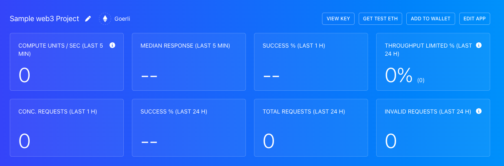

Hardhat is a popular Ethereum development environment for compiling, deploying, debugging and testing smart contracts.

You need at least two requirements to set up Hardhat for your project:

1. An Alchemy HTTP endpoint to make blockchain queries.
2. A MetaMask testnet account private key with funds in it.

## Step 1: Create an Alchemy Account

* Go to [https://www.alchemy.com/](https://alchemy.com/?a=setup-hardhat) and create an account.
* In the [Dashboard](https://dashboard.alchemy.com/), select the 'Create App' button.
* Enter a name and description, whatever you want to call it; we called it 'Sample web3 project' and described it as 'Learning how to interact with live smart contracts'.


* Select 'Ethereum' for Chain and 'Goerl' for Network.
* Select 'Create App' and select your newly-created project from the list in your Dashboard.



* Select 'View Key'
* We will need the 'HTTPS' key for Step #4, so keep this tab open!

## Step 2. Install a Web3 Wallet

You will also need a web3 wallet like Apex, Coinbase, or Metamask installed to access the testing networks on Ethereum. Take a look at the [How to Install a Web3 Wallet](/docs/how-to-install-a-web3-wallet) guide for instructions on how to set up one of these wallets.

We will use MetaMask for this tutorial - in your testing browser of preference, go to [https://metamask.io/](https://metamask.io/) and install the plugin. This is your portal to Web3 - very important!

## Step 3: Acquire Goerli ETH

<Info>
  Download a separate browser to the one you regularly use -- presumably, the one that contains a MetaMask wallet you regularly use -- and download the wallet extension there. So if you mainly use Brave Browser, download a Google Chrome browser and install the MetaMask wallet extension there. If you use Safari, download Google Chrome and so on... This can be your browser specific for testing - in this way, we remove any risk of accidentally using funds or private keys associated with your regularly used wallets.
</Info>

* As suggested above, hopefully, you are in a separate browser from the one you regularly use.
* In MetaMask, select the icon in the top right and select 'Create Account' - give your wallet a name that you'll remember! We called it "Test Account".
* The easiest way to get some test Goerli ETH is to go to [https://goerlifaucet.com/](https://goerlifaucet.com/)


* In MetaMask, select the 'Goerli Test Network' from the 'Networks' drop-down menu.
* Copy-paste your MetaMask public address, from your newly-created test account, into the UI
* Wait a few moments, and your wallet should be funded!

## Step 4: Set Up Hardhat Project Structure

This is a generic setup document, so please make sure to name and configure your Hardhat project to the project you are currently working on!

* In a folder of your choice, run `mkdir [NAME OF YOUR HARDHAT PROJECT],` e.g. `mkdir test-project`
* `cd` into that project, e.g. `cd test-project`
* Run `npm init -y`
* Run `npm install dotenv`
* Run `npm install --save-dev hardhat`
* Run `npx hardhat` - you will get the following UI:


* Select 'Create a Javascript project'

* You will then get a few more options, such as if you want to create a `.gitignore` and install some dependencies like in the following image:


**Select yes to all of these options!**

It might take a minute or two to install everything!

* Your project should now contain the following: **Files: node\_modules, package.json, hardhat.config.js, package-lock.json, README.md** **Folders: scripts, contracts**

* Go ahead and delete the `deploy.js` in the `/scripts` directory - **not the directory itself!** Also, delete the `Lock.sol` in the `/contracts` directory - **, not the directory itself!**

* Open the hardhat.config.js file, delete its contents entirely, and copy-paste the following:

<CodeGroup>
  ```javascript javascript
  require('dotenv').config(); //all the key value pairs are being made available due to this lib
  require("@nomicfoundation/hardhat-toolbox");
      
  module.exports = {
    solidity: "0.8.17",
    networks: {
      goerli: {
        url: `${process.env.ALCHEMY_GOERLI_URL}`,
        accounts: [`0x${process.env.GOERLI_PRIVATE_KEY}`],
      }
    }
  };
  ```
</CodeGroup>

Did you catch how we are sourcing the url and accounts variables in this file? We are loading them up from process.env using the dotenv library we installed at the beginning of this step. This functionality allows us to have project-wide environment variables without having to explicitly define them in every file needed.

Any file that has the: `require('dotenv').config();` statement at the top will automatically load any variables in the root's `.env` file.

Right now, nothing will run as there aren't any environment variables! This is because we don't yet have a `.env` file to load them from.

## Step 5: Set up .env

* In your project's root folder, run `touch .env`
* Open the `.env` file and copy-paste the following contents:

<CodeGroup>
  ```json json
  ALCHEMY_GOERLI_URL=
  GOERLI_PRIVATE_KEY=caed4r3d92c1548cf7536c290e6a1871757fb5fea5721dea3a08c6d4abcd16cf
  ```
</CodeGroup>

* Copy-paste your Alchemy HTTPS Endpoint to the `ALCHEMY_GOERLI_URL` variable declaration above!

Remove the sample private key from above and copy-paste your own (from the account you loaded with Goerli ETH in Step #3) - we only included it as an example of what a variable should look like in the .env file

<Info>
  You can get your private key by going to MetaMask, then selecting the menu vertical ellipsis icon ⋮ in the top right, then Account Details, and then Export Private Key.

  Notice, in your .env, there is no need for "" or ; - just paste the value directly after the =
</Info>

* Now, any file that loads the .env file by placing `require('dotenv').config();` at the top will have access to the variables in that file by using process.env!

* Your hardhat.config.js will now work and load the .env variables and values correctly!
