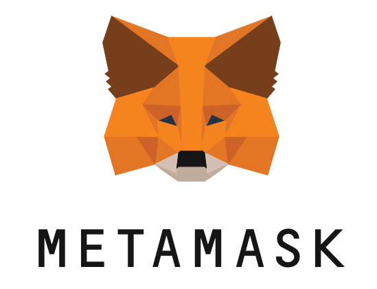
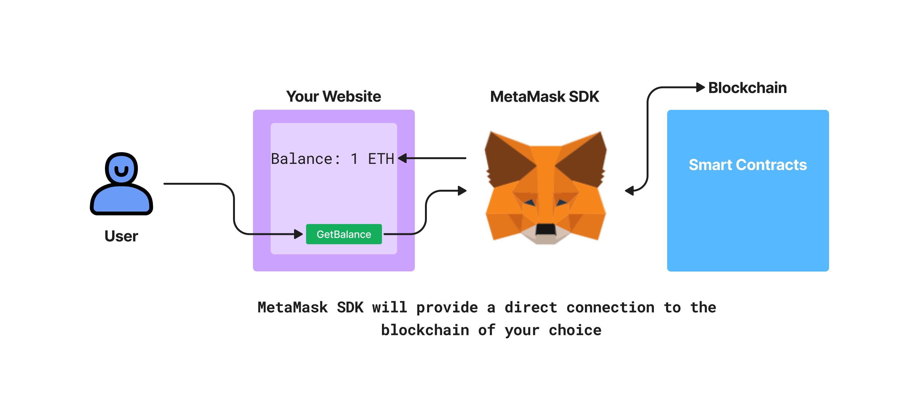
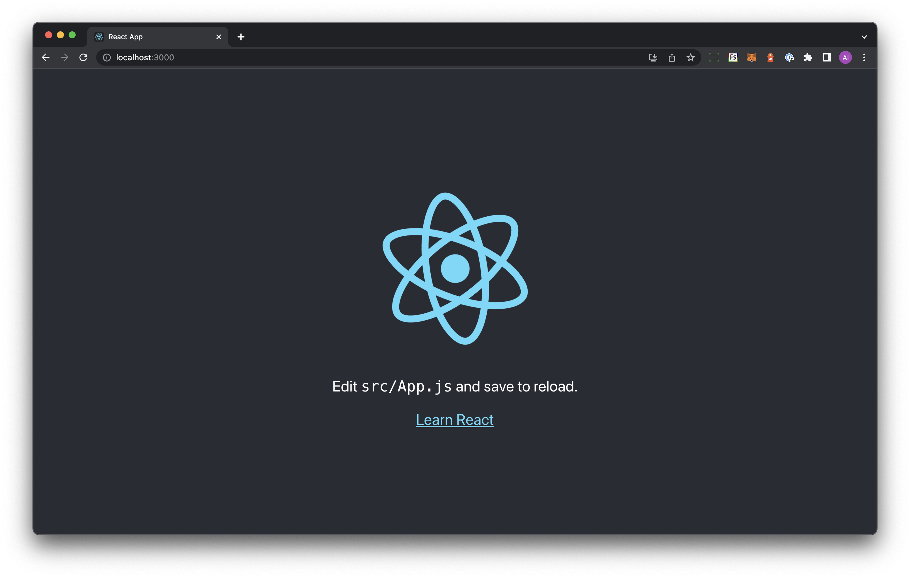
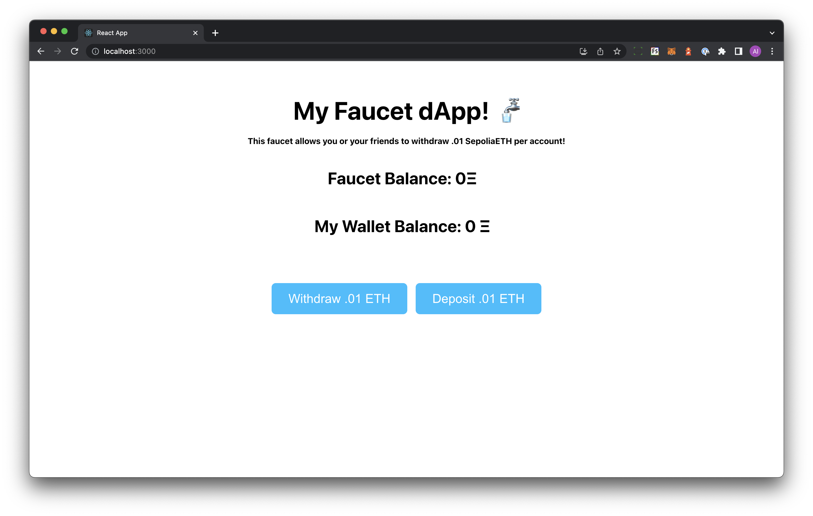
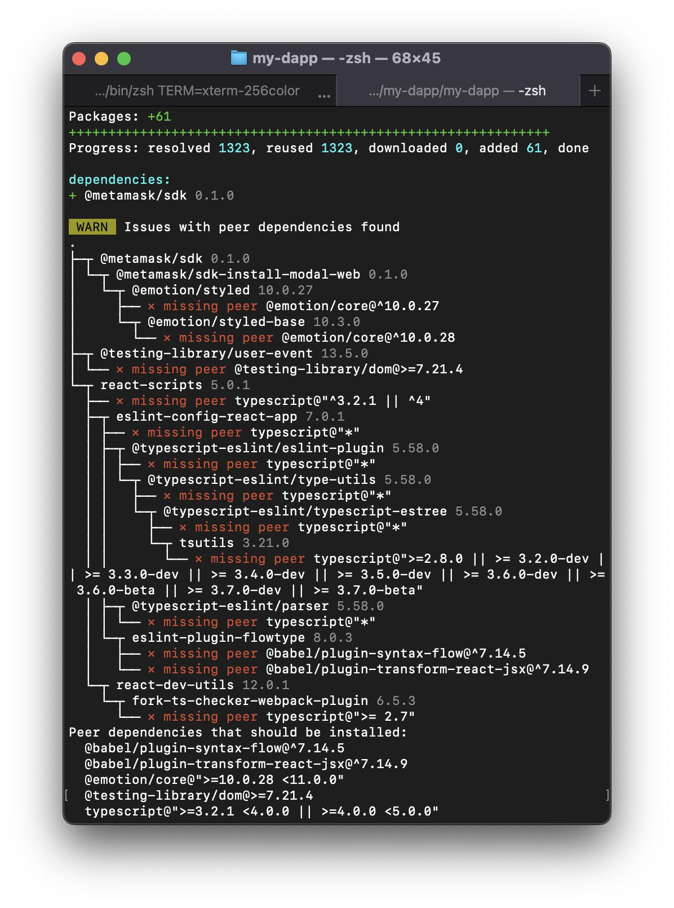
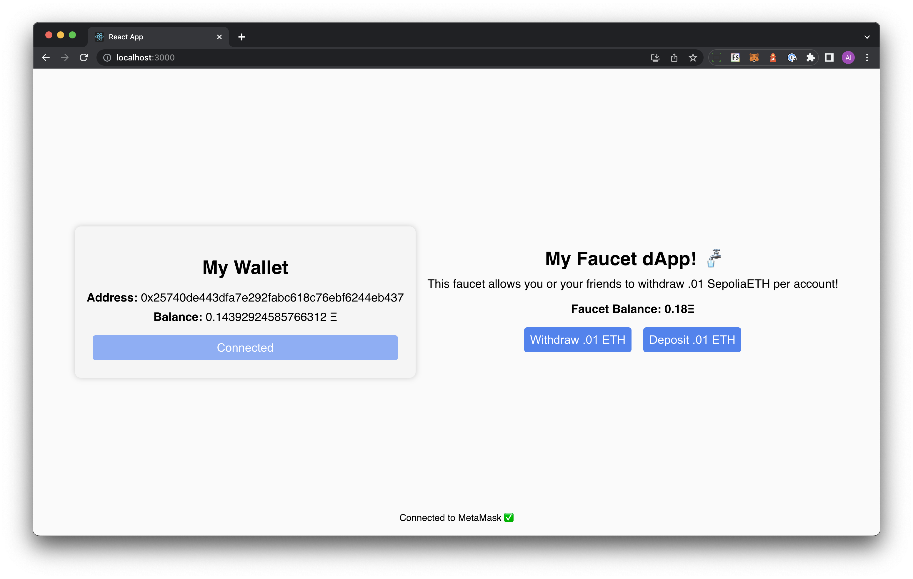

# Build a Full-stack dApp using MetaMask SDK

> If you want an awesome wallet experience, [here is a guide](/docs/how-to-add-alchemy-rpc-endpoints-to-metamask) on how to switch the native RPC endpoint on your MetaMask wallet to an Alchemy RPC endpoint - this will let you see analytics on your own wallet activity! 🔥

## 1. Introduction

This tutorial will cover how to:

* deploy a simple smart contract
* set up a front-end UI
* use the MetaMask SDK to establish a bridge connection between your front-end and a blockchain (Ethereum, Arbitrum, Sepolia, etc)

Feel free to write your own smart contract, otherwise we'll use a simple `Faucet.sol` smart contract as the defacto database to our React front-end as an easy example of how to power a website using a smart contract - how cool! Once we deploy a smart contract to the Sepolia test network, we'll use the powerful MetaMask SDK to establish a connection to our front-end. Here's a visual of the application stack you'll build in this tutorial:



Let's go! 🏃‍♀️

## 2. Pre-Requisites

This tutorial requires the following are installed in order to run a successful local development environment:

1. Install [Node.js](https://nodejs.org/en). You need version `14.5.0`or higher.
2. Install [PNPM](https://pnpm.io/): To install PNPM, run the following command in Terminal:

<CodeGroup>
  ```bash bash
  npm install -g pnpm
  ```
</CodeGroup>

> Hint: If you're building React-based apps, you might want to consider using PNPM instead of NPM for package management. PNPM is more space-efficient than NPM, which means it can save you disk space and reduce installation times. Additionally, PNPM is supported by most React-based apps, so you can use it with tools like Create React App without any issues. This tutorial will use PNPM because pnpm is cool and fast! 🔥

## 3. Build the front-end

### Set up using `npx create-react-app`

1. Open a terminal on your computer and `cd` into a directory of your choice

> You'll see `cd` a lot in this tutorial! `cd` is a terminal command that stands for `Change Directory`. 👀

2. Run `npx create-react-app my-dapp`
3. After installation, your terminal should show, the next steps: run `cd my-dapp` and then run `npm start` - this should start up your very own local development server!

Good looks! 🔥 You've just gotten the starter code React app up and running on `http://localhost:3000/`:



As the app says, let's edit the `App.js` file in the `/src` folder and connect this website to a smart contract already deployed Sepolia test network.

### Customize and Style Application

The smart contract we'll integrate with is a Sepolia-based faucet smart contract. A faucet smart contract is cool because we can deposit some SepoliaETH to the smart contract and you can have your buddies withdraw to their own accounts - and we'll faciliate this with our brand new application of course!

Let's add some simple customizations and styling to our application:

1. Copy-paste the following into your `App.js` file:

<CodeGroup>
  ```js js
  import { useState } from "react";
  import "./App.css";

  function App() {
    const [walletBalance, setWalletBalance] = useState(0);
    const [faucetBalance, setFaucetBalance] = useState(0);
    return (
      <div className="container">
        <h1 className="title">
          My Faucet dApp! 🚰
          <span className="subtitle">
            This faucet allows you or your friends to withdraw .01 SepoliaETH per
            account!
          </span>
        </h1>
        <div className="balance-container">
          <h2 className="balance-item">Faucet Balance: {faucetBalance}Ξ</h2>
          <h2 className="balance-item">My Wallet Balance: {walletBalance} Ξ</h2>
        </div>
        <div className="button-container">
          <button className="button">Withdraw .01 ETH</button>
          <button className="button">Deposit .01 ETH</button>
        </div>
      </div>
    );
  }

  export default App;
  ```
</CodeGroup>

This code forms the basic structure of your user-facing application. Notice, we are setting up two buttons:

* `Withdraw .01 ETH`
* `Deposit .01 ETH`

But clicking them doesn't do anything just yet! We'll need to rig em up to the blockchain! ⚡️

2. For css styling, copy-paste the following into your `App.css` file:

<CodeGroup>
  ```css css
  .container {
    display: flex;
    flex-direction: column;
    align-items: center;
    margin: 2rem;
  }

  .title {
    font-size: 3rem;
    margin-bottom: 1rem;
    text-align: center;
  }

  .subtitle {
    display: block;
    font-size: 1rem;
    margin-top: 1rem;
  }

  .balance-container {
    display: flex;
    flex-direction: column;
    align-items: center;
    margin-bottom: 2rem;
  }

  .balance-item {
    font-size: 2rem;
    margin-right: 1rem;
  }

  .button-container {
    display: flex;
    justify-content: center;
    overflow: hidden;
    margin-top: 2rem;
    margin-bottom: 2rem;
  }

  .button {
    font-size: 1.5rem;
    padding: 1rem 2rem;
    background-color: #00bfff;
    color: white;
    border: none;
    border-radius: 0.5rem;
    cursor: pointer;
    transition: background-color 0.3s ease-in-out;
    margin-right: 1rem;
  }

  .button:last-child {
    margin-right: 0;
  }

  .button:hover {
    background-color: #0077b3;
  }

  .button:active {
    background-color: #005580;
  }

  @media screen and (max-width: 768px) {
    .title {
      font-size: 2rem;
    }

    .balance-item {
      font-size: 1.5rem;
    }

    .button {
      font-size: 1rem;
      padding: 0.5rem 1rem;
    }
  }
  ```
</CodeGroup>

Your app on `http://localhost:3000` should now look like this:



The front-end looks decent enough! But wait... the buttons don't work... Well, that's because they're not rigged to anything yet! In the next step, we'll use the MetaMask SDK to programmatically connect this application to the Sepolia test network (or any chain you prefer!) and read/write to a faucet smart contract located at: [https://sepolia.etherscan.io/address/0x9bdcbc868519cf2907ece4e9602346c3fc9e6c8e](https://sepolia.etherscan.io/address/0x9bdcbc868519cf2907ece4e9602346c3fc9e6c8e).

> Calling all you styling and UX gurus! 📞 How can you make this UI/UX experience better for the user? 👀

## 4. Use the [MetaMask SDK](https://metamask.io/sdk/) to Connect to a Blockchain

Now that a working front-end is built, let's turn this application into a *decentralized* application by connecting it to a *decentralized* blockchain network, in our case to [this faucet smart contract](https://sepolia.etherscan.io/address/0x9bdcbc868519cf2907ece4e9602346c3fc9e6c8e) on the Sepolia network.

1. In the terminal where your project is running, start a new tab and run `pnpm i @metamask/sdk`

You should see the `@metamask/sdk` get installed as a project dependency! (You can verify this by checking the `dependencies` in your project's `package.json` file!) Your terminal might also show additional peer dependencies that need to be installed, like this:



You must install each needed dependency one-by-one! Just copy-paste each dependency name and `pnpm install` it, like this:

<CodeGroup>
  ```bash bash
  pnpm install "@babel/plugin-syntax-flow@^7.14.5"
  ```
</CodeGroup>

> If you get a `zsh: no matches found: @babel/plugin-syntax-flow@^7.14.5`, remember to wrap the package names in string quotations, this means your shell is treating the package as a file instead of a package. Wrap the package name it is complaining about, including `@version` numbers, in string quotations for the shell to know it is a package and no longer show an error like that. 👀

Keep doing this until your terminal no longer lists additional peer dependencies to install. 🏗️

2. We'll also use ethers.js, run `pnpm i ethers`

3. Now, let's make some changes to our React code and add a buuuunch of functionality that, thanks to the MetaMask SDK, we can easily port into our application. In your `App.js`, copy-paste the following:

<CodeGroup>
  ```js js
  import MetaMaskSDK from "@metamask/sdk";
  import { ethers } from "ethers";
  import { useEffect, useState } from "react";
  import "./App.css";

  // MetaMask SDK initialization
  const MMSDK = new MetaMaskSDK();
  const ethereum = MMSDK.getProvider(); // You can also access via window.ethereum

  // This app will only work on Sepolia to protect users
  const SEPOLIA_CHAIN_ID = "0xAA36A7";

  // Faucet contract initialization
  const provider = new ethers.providers.Web3Provider(ethereum, "any");
  const FAUCET_CONTRACT_ADDRESS = "0x9BdCbC868519Cf2907ECE4E9602346c3fC9e6c8e";
  const abi = [
  	{
  		"inputs": [],
  		"name": "withdraw",
  		"outputs": [],
  		"stateMutability": "nonpayable",
  		"type": "function"
  	},
  ];
  const faucetContract = new ethers.Contract(
    FAUCET_CONTRACT_ADDRESS,
    abi,
    provider.getSigner()
  );

  function App() {
    // useState hooks to keep track of changing figures
    const [walletBalance, setWalletBalance] = useState(0);
    const [faucetBalance, setFaucetBalance] = useState(0);
    const [buttonText, setButtonText] = useState("Connect");
    const [buttonDisabled, setButtonDisabled] = useState(false);
    const [onRightNetwork, setOnRightNetwork] = useState(false);
    // array populated by MetaMask onConnect
    const [accounts, setAccounts] = useState([]);
    const [isConnected, setIsConnected] = useState(
      accounts && accounts.length > 0
    );

    // MetaMask event listeners
    ethereum.on("chainChanged", handleNewNetwork);
    ethereum.on("accountsChanged", (newAccounts) => {
      handleNewAccounts(newAccounts);
      updateBalances();
    });

    // any time accounts changes, toggle state in the Connect button
    useEffect(() => {
      setIsConnected(accounts && accounts.length > 0);
    }, [accounts]);

    useEffect(() => {
      if (isConnected) {
        setButtonText("Connected");
        setButtonDisabled(true);
      } else {
        setButtonText("Connect");
        setButtonDisabled(false);
      }
    }, [isConnected]);

    // any time accounts changes, update the balances by checking blockchain again
    useEffect(() => {
      updateBalances();
    }, [accounts]);

    // helper function to protect users from using the wrong network
    // disables the withdraw/deposit buttons if not on Sepolia
    async function handleNewNetwork() {
      const chainId = await ethereum.request({
        method: "eth_chainId",
      });
      console.log(chainId);
      if (chainId != 0xaa36a7) {
        setOnRightNetwork(false);
      } else {
        setOnRightNetwork(true);
      }
    }

    // uses MM SDK to query latest Faucet and user wallet balance
    async function updateBalances() {
      if (accounts.length > 0) {
        const faucetBalance = await ethereum.request({
          method: "eth_getBalance",
          params: [FAUCET_CONTRACT_ADDRESS, "latest"],
        });
        const walletBalance = await ethereum.request({
          method: "eth_getBalance",
          params: [accounts[0], "latest"],
        });
        setFaucetBalance(Number(faucetBalance) / 10 ** 18);
        setWalletBalance(Number(walletBalance) / 10 ** 18);
      }
    }

    // handles user connecting to MetaMask
    // will add Sepolia network if not already a network in MM
    // will switch to Sepolia (bug, can't currently do this)
    async function onClickConnect() {
      try {
        const newAccounts = await ethereum.request({
          method: "eth_requestAccounts",
        });
        handleNewAccounts(newAccounts);
        try {
          await window.ethereum.request({
            method: "wallet_switchEthereumChain",
            params: [{ chainId: SEPOLIA_CHAIN_ID }], // Check networks.js for hexadecimal network ids
          });
        } catch (e) {
          if (e.code === 4902) {
            try {
              await window.ethereum.request({
                method: "wallet_addEthereumChain",
                params: [
                  {
                    chainId: SEPOLIA_CHAIN_ID,
                    chainName: "Sepolia Test Network",
                    rpcUrls: [
                      "https://eth-sepolia.g.alchemy.com/v2/amBOEhqEklW5j3LzVerBSnqoV_Wtz-ws",
                    ],
                    nativeCurrency: {
                      name: "Sepolia ETH",
                      symbol: "SEPETH",
                      decimals: 18,
                    },
                    blockExplorerUrls: ["https://sepolia.etherscan.io/"],
                  },
                ],
              });
            } catch (e) {
              console.log(e);
            }
          }
        }
        setIsConnected(true);
        handleNewNetwork();
        console.log(onRightNetwork);
      } catch (error) {
        console.error(error);
      }
    }

    // hook to change state
    function handleNewAccounts(newAccounts) {
      setAccounts(newAccounts);
    }

    // withdraws .01 ETH from the faucet
    async function withdrawEther() {
      console.log(ethereum);
      // const provider = await alchemy.

      const tx = await faucetContract.withdraw({
        from: accounts[0],
      });
      await tx.wait();
      updateBalances();
    }

    // deposits .01 ETH to the faucet
    async function depositEther() {
      const signer = await provider.getSigner();

      const tx_params = {
        from: accounts[0],
        to: FAUCET_CONTRACT_ADDRESS,
        value: "10000000000000000",
      };

      const tx = await signer.sendTransaction(tx_params);
      await tx.wait();
      updateBalances();
    }

    return (
      <div className="container">
        <div className="wallet-container">
          <div className="wallet wallet-background">
            <div className="balance-container">
              <h1 className="address-item">My Wallet</h1>
              <p className="balance-item">
                <b>Address:</b> {accounts[0]}
              </p>
              <p className="balance-item">
                <b>Balance:</b> {walletBalance} Ξ
              </p>
              <button
                className="button"
                onClick={onClickConnect}
                disabled={buttonDisabled}
              >
                {buttonText}
              </button>
            </div>
          </div>
        </div>
        <div className="faucet-container">
          <h1 className="title">My Faucet dApp! 🚰</h1>
          <p className="subtitle">
            This faucet allows you or your friends to withdraw .01 SepoliaETH per
            account!
          </p>
          <h2 className="balance-item">Faucet Balance: {faucetBalance}Ξ</h2>
          <div className="button-container">
            <button
              onClick={withdrawEther}
              className="button"
              disabled={!isConnected || !onRightNetwork}
            >
              Withdraw .01 ETH
            </button>
            <button
              onClick={depositEther}
              className="button"
              disabled={!isConnected || !onRightNetwork}
            >
              Deposit .01 ETH
            </button>
          </div>
        </div>
        <div className="footer">
          {isConnected
            ? "Connected to MetaMask ✅"
            : "Not connected to MetaMask ❌"}
        </div>
      </div>
    );
  }

  export default App;
  ```
</CodeGroup>

Let's do a quick breakdown of the important code components above, starting with:

#### The MetaMask SDK initialization:

<CodeGroup>
  ```js js
  // MetaMask SDK initialization
  const MMSDK = new MetaMaskSDK();
  const ethereum = MMSDK.getProvider();
  ```
</CodeGroup>

Easy... 2 lines of code! 💥

#### Creating a Contract Instance instance using [ethers.js](https://docs.ethers.org/v5/)

<CodeGroup>
  ```js js
  // Faucet contract initialization
  const provider = new ethers.providers.Web3Provider(ethereum, "any");
  const FAUCET_CONTRACT_ADDRESS = "0x9BdCbC868519Cf2907ECE4E9602346c3fC9e6c8e";
  const abi = `[
  	{
  		"inputs": [],
  		"name": "withdraw",
  		"outputs": [],
  		"stateMutability": "nonpayable",
  		"type": "function"
  	},
  ]`;
  const faucetContract = new ethers.Contract(
    FAUCET_CONTRACT_ADDRESS,
    abi,
    provider.getSigner()
  );
  ```
</CodeGroup>

This code snippet:

* initializes a `provider` by plugging in the `ethereum` object (fetched using the MM SDK) into the ethers `Web3Provider`
* declares the `FAUCET_CONTRACT_ADDRESS` (can be found [here](https://sepolia.etherscan.io/address/0x9bdcbc868519cf2907ece4e9602346c3fc9e6c8e)), the `abi` of the `Faucet`'s `withdraw` method (necessary for our website to be able to communicate with the smart contract)
* using all of the above, a `faucetContract` instance is created - this will be used to interact directly with the smart contract

#### Calling the Faucet's `withdraw` function

<CodeGroup>
  ```js js
  // withdraws .01 ETH from the faucet
    async function withdrawEther() {
      console.log(ethereum);
      // const provider = await alchemy.

      const tx = await faucetContract.withdraw({
        from: accounts[0],
      });
      await tx.wait();
      updateBalances();
    }
  ```
</CodeGroup>

Using the `faucetContract` instance, you can directly call the `withdraw` function.

> Note: the `abi` we are using is a minimal version that does not contain the entire contract interface! 👀

#### Donating `.01 ether` to the Faucet

<CodeGroup>
  ```js js
  // deposits .01 ETH to the faucet
    async function depositEther() {
      const signer = await provider.getSigner();

      const tx_params = {
        from: accounts[0],
        to: FAUCET_CONTRACT_ADDRESS,
        value: "10000000000000000",
      };

      const tx = await signer.sendTransaction(tx_params);
      await tx.wait();
      updateBalances();
    }
  ```
</CodeGroup>

Since the `Faucet` contract contains a `receive` function, we can send it some ether as if it was any regular account. ⬆️

## 5. Add Final Styling 🎨

Your application must look like a total mess right now! No worries, let's add some basic styling to make it look a little better!

1. In your `App.css` file, copy-paste the following code snippet:

<CodeGroup>
  ```css css
  .container {
    display: flex;
    justify-content: center;
    align-items: center;
    height: 100vh;
    font-family: sans-serif;
    background-color: #fafafa;
  }

  .wallet-container {
    background-color: #f5f5f5;
    border-radius: 10px;
    box-shadow: 0 0 10px rgba(0, 0, 0, 0.2);
    padding: 20px;
    margin-right: 20px;
    min-width: 300px;
  }

  .wallet {
    display: flex;
    flex-direction: column;
    align-items: center;
  }

  .wallet .account-address {
    font-size: 20px;
    margin: 0;
  }

  .wallet .balance-container {
    display: flex;
    flex-direction: column;
    margin-top: 10px;
    text-align: center;
  }

  .balance-item {
    font-size: 20px;
    margin-top: 10px;
  }

  .faucet-container {
    display: flex;
    flex-direction: column;
    justify-content: center;
    align-items: center;
  }

  .title {
    font-size: 32px;
    margin: 0;
    margin-bottom: 10px;
    text-align: center;
  }

  .subtitle {
    font-size: 20px;
    margin: 0;
    margin-bottom: 20px;
    text-align: center;
  }

  .balance-item {
    font-size: 20px;
    margin: 0;
    margin-bottom: 10px;
    text-align: center;
  }

  .button-container {
    display: flex;
    justify-content: center;
    align-items: center;
  }

  .button {
    background-color: #4285f4;
    border: none;
    border-radius: 5px;
    color: white;
    cursor: pointer;
    font-size: 20px;
    margin: 10px;
    padding: 10px;
    text-align: center;
    text-decoration: none;
    transition: all 0.2s ease-in-out;
  }

  .button:hover {
    background-color: #ff9933;
  }

  .button:active {
    background-color: #ff9933;
    transform: translateY(2px);
  }

  .button[disabled] {
    background-color: #87aff9;
    cursor: not-allowed;
  }

  .connect-button-container {
    display: flex;
    justify-content: center;
    align-items: center;
    margin-top: 20px;
  }

  .footer {
    position: absolute;
    bottom: 20px;
    left: 0;
    right: 0;
    text-align: center;
    font-size: 16px;
  }
  ```
</CodeGroup>

## 6. Final Application View



Woot woot!! You've just set up a full-stack decentralized application thanks to the help of the [MetaMask SDK](https://metamask.io/sdk/).

Feel free to withdraw or deposit to the faucet as much as you want, although please note an account can only ever withdraw once from the test faucet!

## 7. Final Challenges

If you want to continue improving your skills, here are some suggestions to make this dApp better:

* What other powers can the MetaMask SDK provide your application?
* Calling all front-end gurus! The styling needs some work!
* Can you completely replace the smart contract used in this application? It shouldn't be too difficult, everything is there as a template for you - just replace the important details such as `CONTRACT_ADDRESS` and `abi`.

Congrats on building a full-stack dapp!! Feel free to use this as a template for more dapp-building! 🔥
