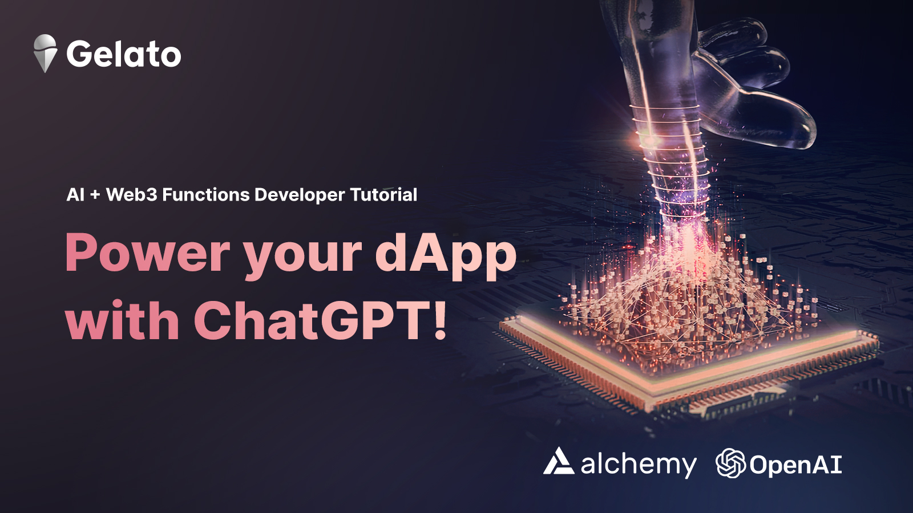
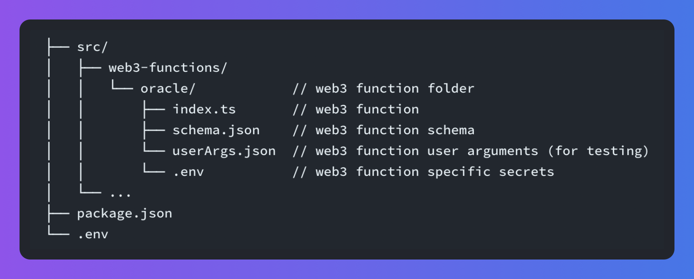
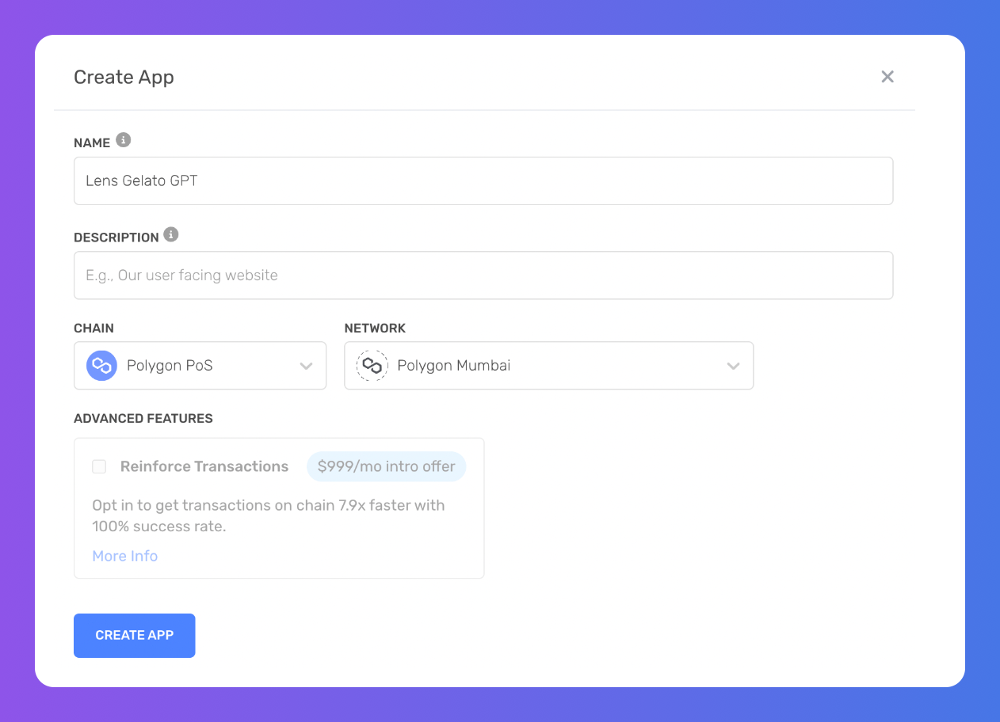
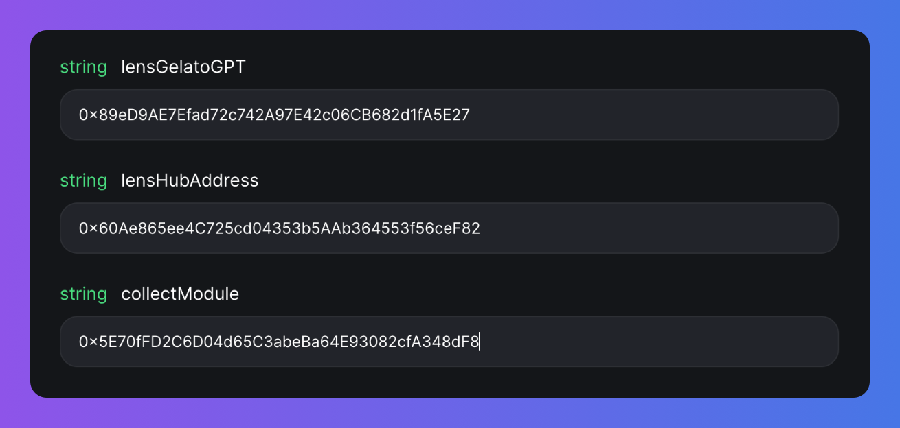
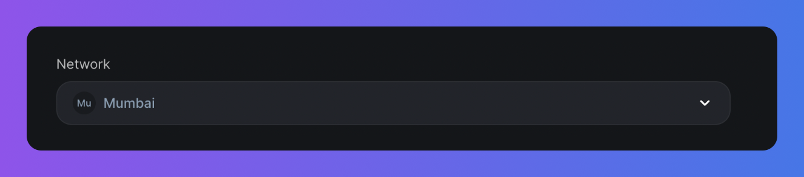
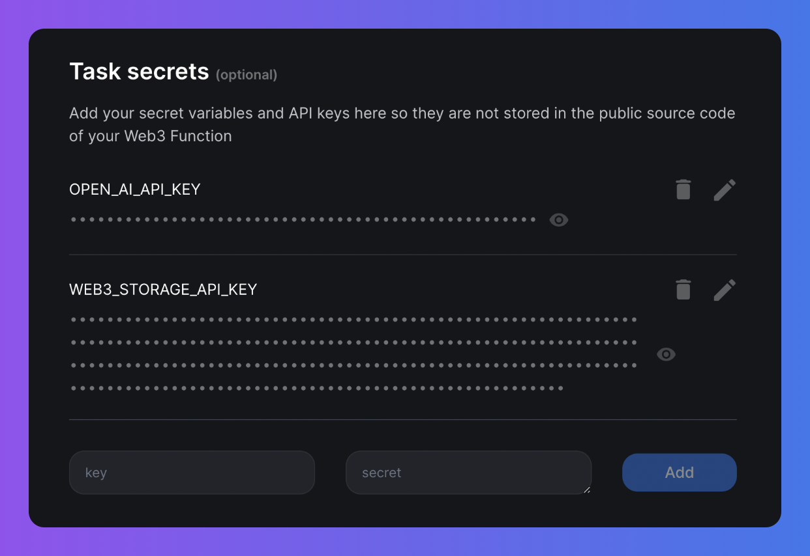
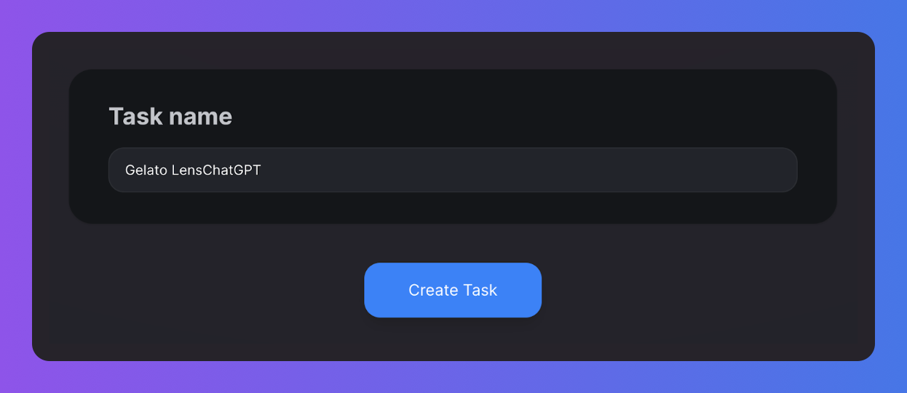
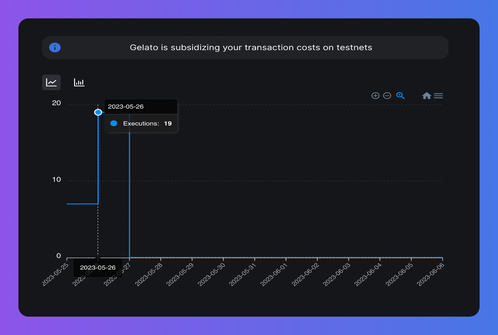

The integration of AI with web3 can revolutionize sectors such as software development, DeFi, gaming, and social media, by enabling autonomous decision-making and predictive capabilities. For example, a blockchain-employed AI can write and merge code for businesses autonomously, marking a new era in software development. Furthermore, machine learning is utilized in DeFi for predictive analysis and dynamic adjustments, while AI in gaming and social media enhances user experiences and personalizes content.

This tutorial demonstrates how [Gelato’s Web3 Functions](https://docs.gelato.network/developer-services/web3-functions) allows smart contracts to harness AI, specifically by linking to OpenAI's ChatGPT API for content creation based on prompts. The application is designed to generate creative content and automate its production every 8 hours, utilizing Gelato’s Web3 Functions' ability to interact with off-chain data seamlessly.

## AI enabled automatic posting on social media

Let's dive into the workflow of our application, which begins with the [LensGelatoGPT smart contract](https://github.com/gelatodigital/w3f-lensgpt-tutorial/blob/main/contracts/LensGelatoGPT.sol). This contract handles the management of prompts for automated content creation using AI. It communicates with the Lens Protocol master contract, the [LensHub.sol](https://docs.lens.xyz/docs/lenshub), to make sure all actions are performed by the rightful profile owners and to keep track of the prompts for each profile.

LensHub.sol serves as the heart of the system, interfacing with all interactions within the [Lens Protocol](https://docs.lens.xyz/docs/what-is-lens).

Gelato’s Web3 Functions code then invokes the [OpenAI API](https://openai.com/blog/openai-api) to generate creative content, guided by the prompts obtained from the LensGPT Smart Contract. Following this, the Lens Publication Metadata is obtained and validated using the [LensClient](https://docs.lens.xyz/docs/lensclient-sdk). Once validated, the content is encapsulated in the metadata, and uploaded to IPFS using the [Web3Storage](https://web3.storage/) API.

Finally the postData object is created which is then encoded into the call data for the LensHub contract's "**post**" function & then published on the Lens Protocol.

The culmination of this entire process is the appearance of your content on [Lenster](https://lenster.xyz/), a social media web application built using Lens Protocol. This intricate off-chain process, from content creation to its publication, is seamlessly executed, thanks to Gelato’s Web3 Functions and to Alchemy's top-notch blockchain infrastructure!

## Prerequisites

Ensure you have the following before you start:

* Signed up for the [Gelato Web3 Functions beta](https://form.typeform.com/to/RrEiARiI).
* Installed Node.js v16+, NPM, and Git.
* Set up a Web3 wallet in your browser, such as [MetaMask](https://metamask.io/).
* Account created on [Alchemy](https://www.alchemy.com/), [Web3 storage](https://web3.storage/) & [Open AI](https://openai.com/blog/openai-api)

Once set up, we can dive in!

## Set Up Your Dev Environment

Start by cloning the Gelato Web3 Functions lensgpt Repository:

`git clone https://github.com/gelatodigital/lensgpt-tutorial.git`

Install the dependencies:

`yarn install`

### Code Structure

The code structure should look like this:



### Configure Secrets

* Alchemy ID
* Private Key
* An OpenAI Key
* A Web3.Storage Key

**Obtain Alchemy ID & Private Key:** Locate the `.env.template` file in your root folder, copy it and rename the copy to `.env`. These keys are only required if deploying your smart contract to testnet/mainnet.

Here are the steps for acquiring these:

**Acquiring an Alchemy ID**

* **Sign Up for a free Alchemy Account**

  Creating an account with Alchemy is simple, sign up for free [here](https://www.alchemy.com/homepage).

* **Create an Alchemy App**

  You need an API key to authenticate your requests. You can create API keys from the dashboard. Navigate to “Create App” and fill in the details to get your new key and paste it in .env.



**Acquiring a Private Key**

Go to your Metamask wallet and do the following:

* Click on the three dots next to ‘Account Address’
* Then click on ‘Account Details’
* Export the private key
* Enter your Metamask wallet password
* Copy the private key & paste it in .env

***

**Obtain OpenAI and Web3.Storage Keys**

Find the .env.template file in the web3-functions/lens-ai directory. Again, make a copy of it and rename the copy to .env and put the API keys.

Sign in on the [Web3 Storage](https://web3.storage/) website using either your GitHub or email, navigate to your account section and generate a new API Token.

For the [OpenAI](https://openai.com/blog/openai-api) API Key, visit the OpenAI website, create a new secret key by filling out the provided form, and note down the secret key shown. Once obtained, these keys need to be entered into the newly created .env file.

Now you're all set to get started!

## Code Explanation

The [LensGelatoGPT](https://github.com/gelatodigital/lensgpt-tutorial/blob/main/contracts/LensGelatoGPT.sol) smart contract plays a crucial role in managing prompts for automated content creation with AI, interacting seamlessly with the [LensHub contract](https://docs.lens.xyz/docs/lenshub).

One of the vital functions is communicating with LensHub to verify profile ownership when prompts are set or removed. It ensures that only rightful owners can set the prompts acting as stimuli for AI-generated content.

In the LensGelatoGPT contract, the LensHub's `getDispatcher` function is utilized within the setPrompt function. This is to ascertain that the dispatcher for a profile is set to the dedicated msg.sender proxy contract. This confirms that only authorized entities can set prompts for AI-generated content on the profiles.

The [dedicated msg.sender](https://docs.gelato.network/developer-services/web3-functions/contract-address) proxy contract, a unique feature of Web3 functions, acts as a transaction middleware, routing them to the designated destination contract.

Now, let's take a look at the main functions of the **LensGelatoGPT contract:**

### LensGelatoGPT contract

* **setPrompt:** This function allows a profile owner to set a prompt for their profile. The prompt acts as the input for the AI content generator. It validates the ownership using the LensHub contract and ensures the fee for the transaction is correct.

  <CodeGroup>
    ```sol sol
    function setPrompt(uint256 _profileId, string calldata _prompt) external payable onlyProfileOwner(_profileId) {
        require(msg.value == fee, "LensGelatoGPT.setPrompt: fee");
        require(bytes(_prompt).length <= 160, "LensGelatoGPT.setPrompt: length");
        require(lensHub.getDispatcher(_profileId) == dedicatedMsgSender, "LensGelatoGPT.setPrompt: dispatcher");

        _profileIds.add(_profileId);
        promptByProfileId[_profileId] = _prompt;
    }
    ```
  </CodeGroup>

* **stopPrompt:** This function allows a profile owner to remove a prompt from their profile, effectively stopping AI content generation. Ownership is again verified through LensHub.

  <CodeGroup>
    ```sol sol
    function stopPrompt(uint256 _profileId) external onlyProfileOwner(_profileId) {
        require(_profileIds.contains(_profileId), "LensGelatoGPT.stopPrompt: 404");

        _profileIds.remove(_profileId);
        delete promptByProfileId[_profileId];
    }
    ```
  </CodeGroup>

* **getPaginatedPrompts:** This function is used to fetch a paginated list of prompts. It returns an array of Prompt structs, which includes the profile ID and the associated prompt.

  <CodeGroup>
    ```sol sol
    function getPaginatedPrompts(uint256 _from, uint256 _to) external view returns (Prompt[] memory prompts) {
        require(_from < _to, "LensGelatoGPT.getPaginatedPrompts: _to");
        require(_from <= _profileIds.length(), "LensGelatoGPT.getPaginatedPrompts: _from");

        if (_to >= _profileIds.length()) {
            _to = _profileIds.length();
        }

        prompts = new Prompt[](_to - _from);

        for (uint256 i = _from; i < _to; i++) {
            uint256 profileId = _profileIds.at(i);

            // Filter out users with wrong Dispatcher on Lens
            if (lensHub.getDispatcher(profileId) != dedicatedMsgSender) {
                continue;
            }

            prompts[i - _from] = Prompt(profileId, promptByProfileId[profileId]);
        }
    }
    ```
  </CodeGroup>

* **collectFee:** This function enables the collection of fees accrued from setting prompts. It can only be executed by the contract's ProxyAdmin.

  <CodeGroup>
    ```sol sol
    function collectFee(address payable _to) external onlyProxyAdmin {
        _to.sendValue(address(this).balance);
    }
    ```
  </CodeGroup>

***

### LensGelatoGPT Web3 Function

This fetches prompts from a smart contract, uses **OpenAI to generate text based on these prompts, uploads the generated content to IPFS, and then posts the content to Lens.**

Let's break down the key parts of the index.ts file and examine their role in the overall workflow:

**1. Importing necessary libraries and contract ABIs**

These import statements include various utilities necessary for the function to work correctly. Web3Function and Web3FunctionContext are required to define and interact with the function. Contract and utils from the ethers library are used for interacting with Ethereum smart contracts and general utilities (like address validation). OpenAI API is used to generate content. The lensHubAbi file contains the application binary interface (ABI) of the LensHub contract, which defines how to interact with it.

<CodeGroup>
  ```typescript typescript
  import { Web3Function, Web3FunctionContext } from "@gelatonetwork/web3-functions-sdk";
  import { Contract, utils } from "ethers";
  import { Configuration, OpenAIApi } from "openai";
  import { v4 as uuidv4 } from "uuid";
  import { Web3Storage, File, CIDString } from "web3.storage";
  import { lensHubAbi } from "../../../helpers/lensHubAbi";
  ```
</CodeGroup>

**2. Validate user arguments and secrets**

In this section, the function fetches the secrets (API keys) and user arguments (contract addresses) required to execute the function. If any of these are invalid or missing, the function will return an error.

Check [this](https://docs.gelato.network/developer-services/web3-functions/writing-web3-functions) to learn more about userArgs and secrets.

<CodeGroup>
  ```typescript typescript
  const WEB3_STORAGE_API_KEY = await secrets.get("WEB3_STORAGE_API_KEY");
  const OPEN_AI_API_KEY = await secrets.get("OPEN_AI_API_KEY");
  const lensGelatoGPTAddress = userArgs.lensGelatoGPT as string;
  const lensHubAddress = userArgs.lensHubAddress as string;
  const collectModuleAddress = userArgs.collectModule as string;
  ```
</CodeGroup>

**3. Fetching prompts from the LensGelatoGPT contract**

The function fetches a set of prompts from the LensGelatoGPT contract using the getPaginatedPrompts function. The function returns a specified range of prompts.

<CodeGroup>
  ```typescript typescript
  prompts.push(
    ...(await lensGelatoGpt.getPaginatedPrompts(
      nextPromptIndex,
      nextPromptIndex + NUMBER_OF_POSTS_PER_RUN
    ))
  );
  ```
</CodeGroup>

**4. Generate AI text and post it to LensHub**

This script runs through a list of prompts, generates content based on each prompt using the OpenAI API.The code then generates metadata for the content and validates it using LensClient.The validated metadata is then stored on IPFS using Web3Storage. The code then creates a data structure called postData with all the necessary data, including profileId, contentURI (the URL of the content on IPFS), and other module-related data.Finally, it creates an interface instance using the lensHubAbi and pushes a new object to the callDatas array with the lensHubAddress and the encoded function data for posting the data.

<CodeGroup>
  ```typescript typescript
  for (const prompt of nonEmptyPrompts) {
    // ...
    const response = await openai.createCompletion({ /* ... */ });
    text = response.data.choices[0].text as string;
    // ...
    cid = await storage.put([myFile]);
    contentURI = `https://${cid}.ipfs.w3s.link/publication.json`;
    // ...
    callDatas.push({
      to: lensHubAddress,
      data: iface.encodeFunctionData("post", [postData]),
    });
  }
  ```
</CodeGroup>

**5. Updating the execution state**

This section updates the storage state after each execution. It keeps track of the start time of the last run, and the index of the next prompt. This is used to determine whether it's time to run the function again, and which prompts should be processed in the next run.

<CodeGroup>
  ```typescript typescript
  if (lastIntervalRunFinished) {
    await storage.set("lastRunStartTime", blockTime.toString());
  }

  if (isLastRun) {
    await storage.set("nextPromptIndex", "0");
  } else {
    await storage.set(
      "nextPromptIndex",
      (nextPromptIndex + NUMBER_OF_POSTS_PER_RUN).toString()
    );
  }
  ```
</CodeGroup>

In summation: the function fetches prompts from a smart contract, generates AI-written text based on these prompts, posts this text to LensHub, and updates its state for the next run.

## Running Web3 Functions

### Deploying LensGelatoGPT Smart Contract

**Deploying on Mumbai Network**

Run this command in root of the project directory:

`npx hardhat run deploy/LensGelatoGPT.deploy.ts --network mumbai`

Copy the smart contract address

### Deploying Web3 Functions code

In userArgs.json file in the` web3-functions/lensChatGPT` folder replace **lensGelatoGPT** address with yours **deployed** address

Then run this command to deploy the Web3 Functions .They are stores on IPFS,to compile your Web3 Function and deploy it to IPFS, use

`npx hardhat w3f-deploy W3FNAME`

In our case:

`npx hardhat w3f-deploy lensChatGPT`

Once uploaded, Gelato Nodes will pin the file on your behalf on IPFS. If the upload was successful, you should get the IPFS CID of your Web3 Function returned.

✓ Web3Function deployed to ipfs.

✓ CID: \<YOUR\_IPFS\_CID>

To create a task that runs your Web3 Function every minute, visit:

> [https://beta.app.gelato.network/new-task?cid=](https://beta.app.gelato.network/new-task?cid=)\<YOUR\_IPFS\_CID>

### Creating a Web3 Function Task via the UI

1. **Go to the Link:** Click on the link you got when you set up your Web3 Function, the IPFS CID will already be there. This lets you look at the code of your Web3 Function.
2. **Enter user arguments:** Type in the arguments you entered in userArgs.Json file: **lensGelatoGPT, lensHubAddress, and collectModule**



3. **Choose Your Network:** Pick the network for your task to work on.



4. **Add Your Keys:** Put in your Web3 storage and OpenAI API keys.



5. **Give Life to Your Task:** Last but not least, you'll be asked to name your task. Hit the "Create Task" button, confirm the name and task creation with your wallet, et voila!



### Monitoring Your Task Performance

You can keep an eye on how your task is doing from your Web3 Functions Task dashboard. It's got everything you need:

* **Executions:** Check how many times your task has run on specific dates.
* **Task Logs:** Look at logs Web3 Function's code has sent out.
* **Code, Storage, & Secrets**: Review your code, storage details, and your secrets for additional insights.

With this dashboard, you'll have all the information about your task right at your fingertips.



## Conclusion

In this comprehensive guide, we've explored how to leverage the power of AI and blockchain through the integration of OpenAI, Web3 Storage, Lens Protocol, and Gelato. This represents a significant step forward in harnessing the potential of AI and Web3.

As we continue to witness the convergence of AI and blockchain, it's exciting to imagine the possibilities this synergy holds for various sectors. We hope this tutorial has equipped you with the knowledge to explore these potentials further.

Happy coding, and welcome to the internet of tomorrow!

## Dive Deeper with Gelato Web3 Functions

Web3 Functions provide an innovative solution for developers to create serverless, decentralized applications with ease. They enable seamless integration of smart contracts with off-chain data, bridging the gap between on-chain and off-chain worlds.

By leveraging Web3 Functions, developers can build robust, scalable, and decentralized web3 applications, supported by a reliable and resilient infrastructure.
