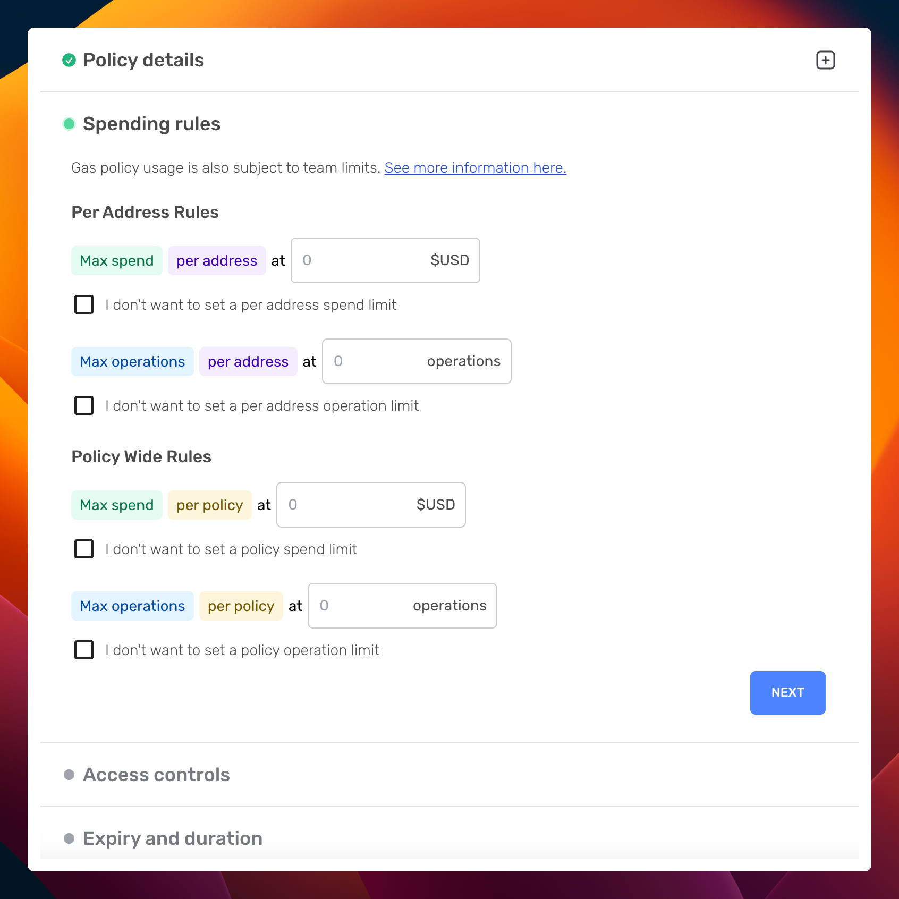
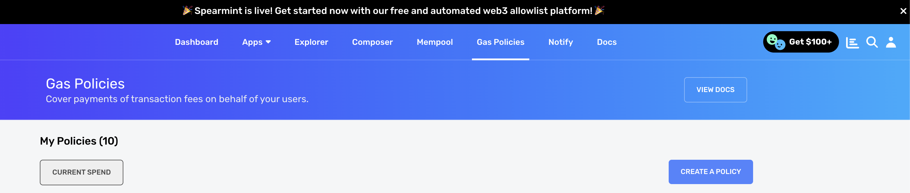
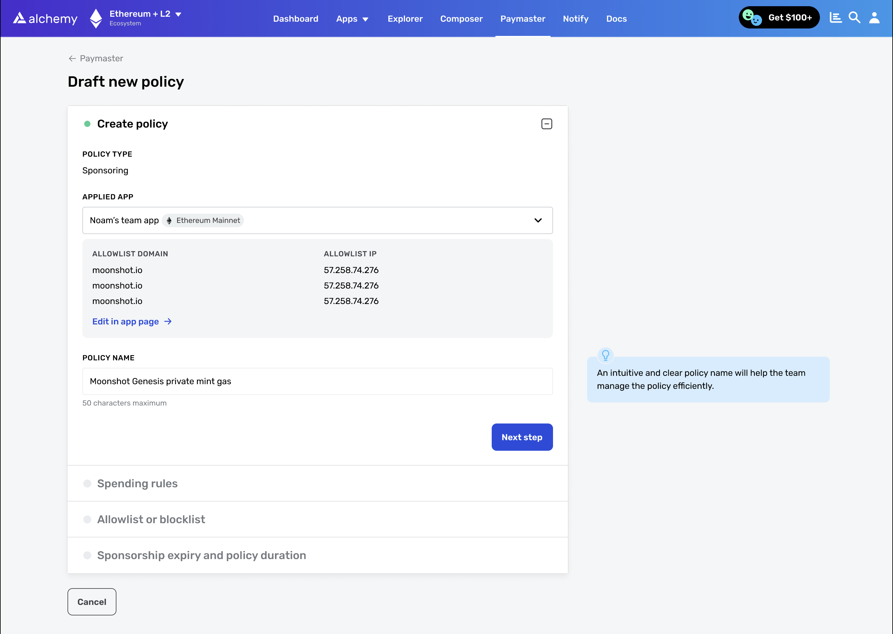
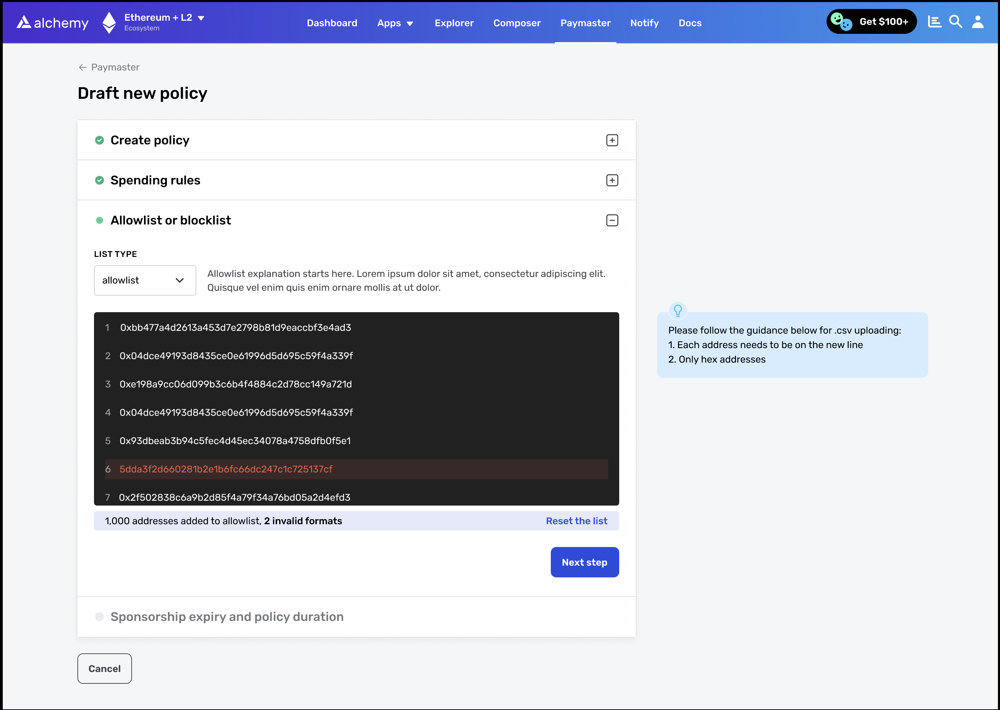
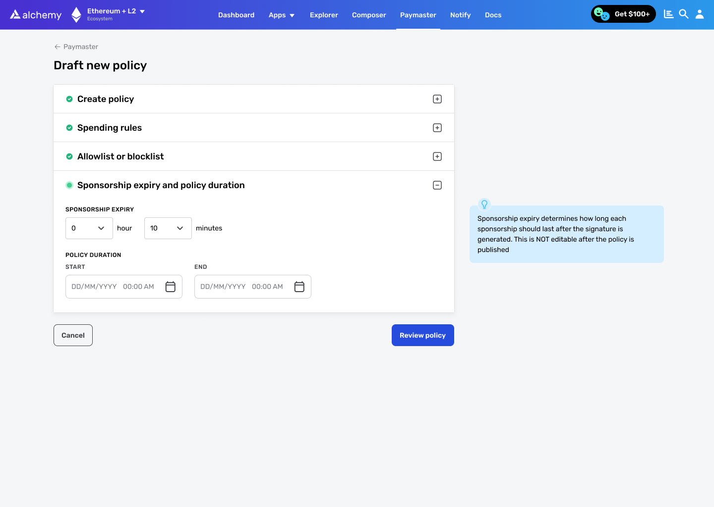
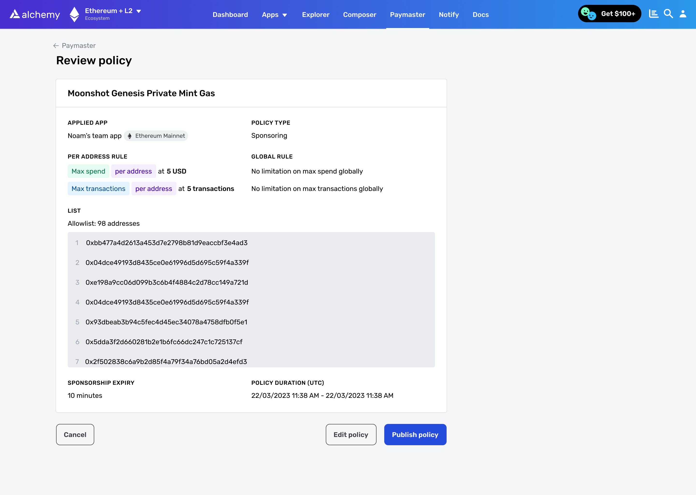

# What is a Gas Manager Policy?

Gas manager policies are rules defined by developers that govern how and when an application will sponsor a user's gas fees using a paymaster like Alchemy's [Gas Manager Coverage API](/reference/gas-manager-coverage-api-quickstart).

An example of spending rules is included in the screenshot below:

Creating a gas policy through Alchemy Dashboard

### Video Tutorial

Prefer a video guide? Watch the video below for a step-by-step walkthrough, or follow the written tutorial.

# How to Create a Gas Manager Policy

This guide demonstrates the steps to create a gas manager policy. Please note that if you're looking to set up a gas policy on Mainnets, a subscription to the Growth or Enterprise plan is required. Consider [upgrading your account](https://dashboard.alchemy.com/settings/billing) if necessary.

## Step 1: Create an Account and an Application

Start by [creating a new application](https://dashboard.alchemy.com/) or using an existing application and the associated chain.

<Info>
  We advise setting up an application on a test network like Sepolia or Mumbai as your new gas manager policy will directly associate with the application and network.
</Info>

***

## Step 2: Draft a New Policy

Log in and navigate to the "Gas Policies" section and click the [create a policy](https://dashboard.alchemy.com/gas-policies/new) button.

***

## Step 3: Set the Name and associated App for Gas Policy

Enter the name for your Gas Policy and set the Alchemy App you want to associate with it.

<Info>
  A Gas Policy can only be associated with one Alchemy App and it will only accept requests sent through the API key of associated app. All other requests will be rejected.
</Info>

***

## Step 4: Define the Spending Rules

Click "Next" and set up address levels and global rules if needed.

These rules help limit the amount of money or the number of user ops that can be sent from the gas manager policy.

***

## Step 5: Implement an Allowlist or Blocklist

You can set up an address allowlist or blocklist to allow the usage of the gas manager policy to a list of specific addresses, or to exclude a list of certain addresses from the policy.

***

## Step 6: Set the Policy's Duration

Define the duration of your policy, and the **sponsorship expiry period**, which is the period for which the Gas Manager signature (paymaster data) will remain valid once it is generated.

***

## Step 7: Publish Your Policy

When your policy is ready, publish it! Your policy becomes live if its date range includes the current time.

# Next Steps: Executing Gas Coverage

To use your gas manager for sponsoring user operations:

1. Retrieve your policy id and get your supported entry points via [`eth_supportedEntryPoints`](/reference/eth-supportedentrypoints).
2. For each user operation requiring a gas manager, call [`alchemy_requestGasAndPaymasterAndData`](/reference/alchemy-requestgasandpaymasteranddata) or [`alchemy_requestPaymasterAndData`](/reference/alchemy-requestpaymasteranddata) with the user operation details.
3. Use the returned `paymasterAndData` in the final user operation and submit it to a bundler using [`eth_sendUserOperation`](/reference/eth-senduseroperation).
4. The Gas Manager will then cover the gas fee for the submitted user operation.

***

What’s Next

Now that you created your first policy it's time to sponsor your first request!

* [Paymaster API Quickstart](/reference/paymaster-api-quickstart)
