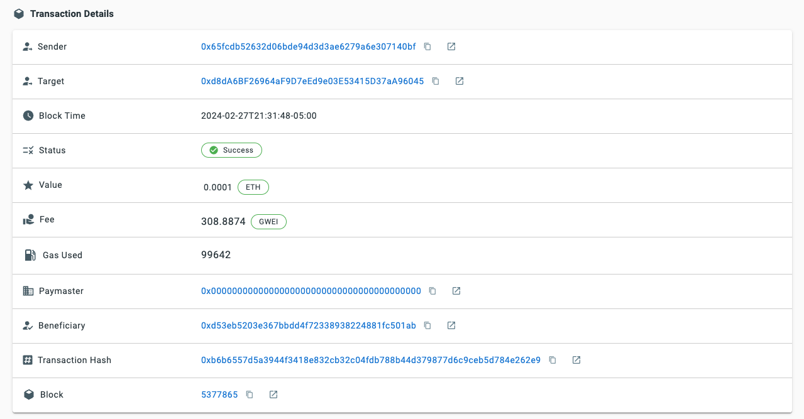

## Introduction

In this guide, we will walk you through the process of creating an [ERC-4337](https://eips.ethereum.org/EIPS/eip-4337) compliant Smart Contract Account (SCA) and executing an ETH transfer from it by sending a user operation with our [Account Abstraction SDK](https://github.com/alchemyplatform/aa-sdk/tree/main).

As web3 development increasingly favors SCAs, developers must become familiar with [Account Abstraction](https://docs.google.com/document/u/5/d/1RTFJF616LTaMv6oybyqby06gATrCDJnBNrQGN7PgD0c/edit) and understand how SCAs will be used within the web3 ecosystem. Fortunately, our AA-SDK makes the technical transition seamless - letting you focus on building your dapp while attaining all the benefits of using SCAs.

***

## Prerequisites

Before creating a SCA with this guide, you should possess skills and knowledge about the topics we are going over. We assume that you already have an understanding/experience with the following:

* The development of [smart contracts](https://www.alchemy.com/overviews/solidity-smart-contract) and their role in Ethereum
* Web3 Libraries like [viem](https://viem.sh/), [ethers](https://docs.ethers.org/v6/), or [web3](https://web3js.org/#/)
* Metamask or similar [crypto wallet](/docs/how-to-install-a-web3-wallet) usage
* JavaScript and (preferably) TypeScript
* [Account Abstraction](https://www.alchemy.com/account-abstraction) (ERC-4337) and how it works, conceptually

We also strongly recommend that you read our 4-part article series, [You Could Have Built Account Abstraction](https://www.alchemy.com/blog/account-abstraction), and our [Introduction to Account Abstraction for Developers](#) guide.

You will also need to make sure your [Node](https://nodejs.org/en) version is `v18.16.1` or above. You can check this by running `node –version` inside of your preferred terminal. If your Node version is not up-to-date, follow [these instructions](https://github.com/0xtito/alchemy-aa-sdk-initiate-tx#prerequisites) to ensure you can work through this guide. Now that you've made sure you have the required Node version, let's review this guide's accompanying repository!

***

## Developer Environment

We built a public GitHub [repository](https://github.com/alchemyplatform/creating-smart-contract-and-sending-userops) that you can fork and modify. If you prefer, you can create your own repo, adjusting your configuration according to whether you're using JavaScript or TypeScript and AA-core or AA-ethers.

The repository uses [npm](https://www.npmjs.com/) and [tsx](https://www.npmjs.com/package/tsx) to execute the code and displays the results directly in the terminal. More details on how to execute code can be found in the [README](https://github.com/alchemyplatform/creating-smart-contract-and-sending-userops/blob/main/README.md).

The rest of the tutorial assumes you are following along with our repository.

The ‘src’ folder within our repository is split into four different sections:

* Typescript + `aa-core` & `aa-alchemy`
* JavaScript + `aa-core` & `aa-alchemy`

The code snippets throughout this guide will use TypeScript with `aa-core` and `aa-alchemy`.

The [AA-core SDK](https://github.com/alchemyplatform/aa-sdk/tree/main/packages/core) is **type-safe** and built using viem. If you are unfamiliar with viem, it is a type-safe, lightweight alternative to web3.js and ethers.js. We recommend diving into their documentation to learn more.

We are creating the SCA on the [Sepolia testnet](https://www.alchemy.com/overviews/sepolia-testnet), so you won’t need to use real ETH for this guide. However, you will need SepoliaETH to transact on the testnet. You can get test ETH from [Alchemy's Sepolia faucet](http://sepoliafaucet.com).

Before we dive into the details of the guide, let us go over what we will be doing from a high level.

***

## Overview

The starting point typically involves a mnemonic phrase or private key when programmatically building with an Externally Owned Account ([EOA](https://ethereum.org/en/developers/docs/accounts/#externally-owned-accounts-and-key-pairs)). The process is similar here. Your EOA will be considered the owner of the SCA.

Your private key is still used to sign messages and [user operations](https://eips.ethereum.org/EIPS/eip-4337#definitions). However, transactions now gain much more flexibility, including:

1. Allowing for verifying various signing methods other than signing a tx with your private key alone
2. Permitting allowed wallets to send transactions on your behalf
3. Having session keys that enable wallet access rules for a set amount of time - the web3 equivalent to [JWT](https://jwt.io/)

However, creating an interface to programmatically interact with a SCA from scratch is tedious and adds many complicated moving parts.

The AA-SDK takes most of the responsibility off web3 developers so that you can focus on building great dapps and products yet still benefit from all Account Abstraction has to offer.

**We will separate our code into two scripts:**

1. One that creates an instance of our SCA, `createSmartAccountClient.ts`
2. A second one that sends our user operation, `index.ts`.

We will get started within our `createSmartAccountClient.ts` file located at `src/ts/createSmartAccountClient.ts.`

***

## Creating an Account

### 1. Importing Modules and Defining Constants

We will import the required modules and get the constants during the setup process.

#### 1a. Import Modules

<CodeGroup>
  ```typescript createSmartAccountClient.ts
  import {
    LocalAccountSigner,
    type SmartAccountSigner,
    sepolia,
  } from "@alchemy/aa-core";
  import { createModularAccountAlchemyClient } from "@alchemy/aa-alchemy";
  import * as dotenv from "dotenv";
  dotenv.config();
  ```
</CodeGroup>

There are three different libraries we are importing from: [dotenv](https://www.npmjs.com/package/dotenv), [@alchemy/aa-core](https://github.com/alchemyplatform/aa-sdk/tree/main/packages/core), and [@alchemy/aa-alchemy](https://github.com/alchemyplatform/aa-sdk/tree/main/packages/alchemy). dotenv allows developers to set [environment variables](https://kinsta.com/knowledgebase/what-is-an-environment-variable/) in a `.env` file and securely load those variables into your code.

`SmartAccountSigner,` `createModularAccountAlchemyClient,` and `LocalAccountSigner` will be vital to creating our SCA - with explanations of each to come below. Now that we have imported the necessary modules, we must initialize our constants and obtain our environment variables.

#### 1b. Get Constants

<CodeGroup>
  ```typescript createSmartAccountClient.ts
  const PRIV_KEY = process.env.PRIV_KEY!;
  const ALCHEMY_API_KEY = process.env.ALCHEMY_API_KEY!;
  ```
</CodeGroup>

Here we are retrieving our environment variables from our .env file. If you do not have a .env file, you must create one at the root of your directory and add your private key and Alchemy API key for Sepolia network.

At this point, your .env file should look like this:

<CodeGroup>
  ```typescript .env
  PRIV_KEY= <your-eoa-private-key>
  ALCHEMY_API_URL= <your-alchemy-api-url>
  ALCHEMY_API_KEY= <your-alchemy-api-key>
  ```
</CodeGroup>

We have also included a `.env.example` file in the [repository](https://github.com/alchemyplatform/creating-smart-contract-and-sending-userops/blob/main/.env.example) as a reference.

We are retrieving the private key from our `.env` file within the above code snippet. You could use your mnemonic phrase instead of a private key - however, we will only use a private key for our example.

Then, we import our Alchemy API key. You will want to ensure your API key is for the network "Ethereum Sepolia." If you still need to get a key, here is a quick [guide](/docs/alchemy-quickstart-guide) to get you started.

Now that we have the necessary modules and set the constants to create an account, we can begin working on our `smartAccountClient` function!

***

### 2. Create the Signer

<CodeGroup>
  ```typescript createSmartAccountClient.ts
  const signer: SmartAccountSigner =
    LocalAccountSigner.privateKeyToAccountSigner(`0x${PRIV_KEY}`);
  ```
</CodeGroup>

Before creating a SCA, we need to convert our imported private key into a standard private-key [account](https://github.com/alchemyplatform/aa-sdk/blob/main/packages/core/src/signer/local-account.ts).

`privateKeyToAccountSigner` is a function provided by `LocalAccountSigner` and returns an object containing a few properties.

<CodeGroup>
  ```typescript shell
  {
    signer: LocalAccountSigner {
      inner: {
        address: '0x9E61AA3EE687f2b5E46753Ee0fB9d797Ab36D231',
        signMessage: [AsyncFunction: signMessage],
        signTransaction: [AsyncFunction: signTransaction],
        signTypedData: [AsyncFunction: signTypedData],
        source: 'privateKey',
        type: 'local',
        publicKey: '0x0439124cfccaf26a20e25973fd57bd40899856242877d0d1fcdbe896e36968e8d9917c767d4a833f0efe0c1b2d181951d168b4532fedf6e8395a6c1f9b35f2744a'
      },
      signerType: 'local',
      signMessage: [Function: value],
      signTypedData: [AsyncFunction: value],
      getAddress: [AsyncFunction: value]
    }
  }
  ```
</CodeGroup>

The account itself is relatively simple!

**The properties worth highlighting are the:**

1. public-key pair of the private key we passed in
2. the address
3. the three async functions, specifically, `signMessage` and `signTransaction`.

These functions are executed the same way as we sign messages or transactions with an EOA today.

We now have our `LocalAccountSigner.` From here, we can create our `smartAccountClient` and, ultimately, a SCA controlled by the `signer` we just made!

***

### 3. Create the interface for the Modular Smart Account

Now it is time to create the interface for our Smart Contract Account! When creating an instance of an EOA, we need to establish what type of Smart Contract Account we want to use. In this case we will be using a Modular Account.

<CodeGroup>
  ```typescript createSmartAccountClient.ts
  export const smartAccountClient = await createModularAccountAlchemyClient({
    apiKey: ALCHEMY_API_KEY,
    chain,
    signer, // or any SmartAccountSigner
  });
  ```
</CodeGroup>

We are almost ready to use the `smartAccountClient` to send User Operations! First we need to fund our newly created Smart Contract Account with some ETH so it can send a UserOp.

***

### 4. Funding Your SCA

Within the example repository, you will see a folder named `scripts`. Within this folder are two files: `getCounterfactual.ts` and `sendEthToSCA.ts`.

At this point, we have created a signer linked to our SCA. However, if we try to send a user operation on-chain, an error will be thrown because the SCA has no ETH to make such an action.

When you send your first user operation that transfers ETH from a SCA, you will need gas for two reasons: the on-chain creation of the SCA and the specified amount of ETH to send.

Thus, we need to fund our SCA ahead of time. To do so, we will run both scripts.

The first is `getCounterfactual.ts`, which can be done from your terminal. While inside your repository, run:

<CodeGroup>
  ```Text shell
  npm run getCFaddress
  ```
</CodeGroup>

The `getCounterfactual.ts` script will import the `smartAccountClient` function we created above. We have a version of the `smartAccountClient` file inside a [helper](https://github.com/alchemyplatform/creating-smart-contract-and-sending-userops/tree/main/helpers) folder, but this is not required. Using this function we create a JSON file called `accountInfo` containing our counterfactual address. You should see this file at the root of your directory.

After the `accountInfo` file has been created and we have our counterfactual address, run:

<CodeGroup>
  ```Text shell
  npm run sendETH
  ```
</CodeGroup>

This command will send, by default, 0.1 ETH from the wallet derived from your private key to your counterfactual address.

Now we are ready to create our Smart Contract Account!

***

### 5. Deploying the Account and Sending ETH ( executing a `userOp` )

With our SCA properly initialized with ETH in its balance, we are ready to interact with the blockchain. We are moving on from `createSmartAccountClient.ts` and will begin working on `index.ts` in the same folder.

This file is the centerpiece of our guide. We bring in the interface we created in `createSmartAccountClient.ts` and submit our first user operation from that account.

**These are the two things that we need to do to achieve this:**

1. Deploy the SCA
2. Send ETH to another account

With ERC-4337 and Alchemy’s AA SDK you can do both in one line of code!

However, we would like to also wait for the user operation and tx receipt to see all of the details regarding our user operation and the transaction that included it.

#### 5a. Deploy SCA and Send Test ETH

So, as of now, we have created an instance of our SCA with a signer (owner) connected and pre-funded our SCA.

Thus, we are ready to deploy our contract account on-chain and send some ETH to any Ethereum address we want.

In our `src/ts/index.js` file in the `main` function, we use `parseEther`, a utility function from viem that is like [parseEthers](https://docs.ethers.org/v6/api/utils/#parseEther) from ethersjs, to set how much ETH we want to send to ADDR. By default, ‘ADDR’ is set to Vitalik’s address.

Then we call `sendUserOperation` on our `smartAccountClient` interface. This method makes an RPC request and places our user operation in the Bundler mempool. Let’s break down our work!

<CodeGroup>
  ```typescript index.ts
  import { smartAccountClient } from "./createSmartAccountClient";
  import { parseEther } from "viem";
  import type { SendUserOperationResult } from "@alchemy/aa-core";

  const ADDR = "0xd8dA6BF26964aF9D7eEd9e03E53415D37aA96045"; // replace with the adress you want to send SepoliaETH to, unless you want to send ETH to Vitalik :)

  /**
   * @description Creates a smart contract account, and sends ETH to the specified address (could be an EOA or SCA)
   * @note Seperating the logic to create the account, and the logic to send the transaction
   */
  export async function main() {
    const amountToSend: bigint = parseEther("0.0001");

    const result: SendUserOperationResult =
      await smartAccountClient.sendUserOperation({
        uo: {
          target: ADDR,
          data: "0x",
          value: amountToSend,
        },
      });

    console.log("User operation result: ", result);
  ```
</CodeGroup>

`sendUserOperation` takes an object keyed `uo` with three properties as an argument:

1. **target** - this will be our targeted address `ADDR` (i.e., the address we are sending ETH to)
2. **data** - this is our calldata - since we are sending ETH, calldata is not needed. Thus, we will pass in “0x”
3. **value** - the amount of ETH we are sending to `ADDR`

At this point, if you were to return and print `result`, you would see something resembling the following:

<CodeGroup>
  ```typescript shell
  User operation result:  {
    hash: '0xeaf610be923b70d148bd7b081d64f777ce9bd71a0b54fed47c7d1fa4e362fd41',
    request: {
      initCode: '0x',
      sender: '0x65FcDb52632d06bdE94d3D3Ae6279a6E307140Bf',
      nonce: '0x3',
      callData: '0xb61d27f6000000000000000000000000d8da6bf26964af9d7eed9e03e53415d37aa9604500000000000000000000000000000000000000000000000000005af3107a400000000000000000000000000000000000000000000000000000000000000000600000000000000000000000000000000000000000000000000000000000000000',
      signature: '0xfbe3df537914ef3f00b34330dbf5c09d7512443b21a916cccd9189cc266b4b893e6e4cc19f8df1b1fb880f00c65457b9a3836bd39625c406745fb0bad434f2321b',
      paymasterAndData: '0x',
      maxFeePerGas: '0x47bb1f',
      maxPriorityFeePerGas: '0x186a0',
      callGasLimit: '0x5000',
      verificationGasLimit: '0x13c5d',
      preVerificationGas: '0xb2c8'
    }
  }
  ```
</CodeGroup>

The User Operation **Result** is not the User Operation **Receipt**. The user operation still needs to be bundled and included in a block. The user operation result is more of a proof of submission than a receipt.

Thus, we will include the following code:

<CodeGroup>
  ```typescript typescript
    console.log(
      "\nWaiting for the user operation to be included in a mined transaction..."
    );

    const txHash = await smartAccountClient.waitForUserOperationTransaction(
      result
    );

    console.log("\nTransaction hash: ", txHash);

    const userOpReceipt = await smartAccountClient.getUserOperationReceipt(
      result.hash as `0x${string}`
    );

    console.log("\nUser operation receipt: ", userOpReceipt);

    const txReceipt = await smartAccountClient.waitForTransactionReceipt({
      hash: txHash,
    });

    return txReceipt;
  }

  main()
    .then((txReceipt) => {
      console.log("\nTransaction receipt: ", txReceipt);
    })
    .catch((err) => {
      console.error("Error: ", err);
    })
    .finally(() => {
      console.log("\n--- DONE ---");
    });
  ```
</CodeGroup>

We will break down each method call:

* `waitForUserOperationTransaction`

  * we attempt to fetch for the UserOperationReceipt. The UserOperationReceipt is returned once the user operation has been included in a block
  * Returns the transaction hash that includes the user operation

* `getUserOperationReceipt`

  * Passes in the hash provided in the UserOperationResult
  * It is worth noting that you must wait for the user operation to be included inside of a block for this method not to throw an error
  * Returns the UserOperationReceipt

* `waitForTransactionReceipt`

  * Pass in an object with only one required argument, which is the transaction hash
  * Returns the transaction receipt

Once you have included the code above, you can submit your first user operation and see the transaction hash, `UserOperationReceipt`, and the transaction receipt logged!

To execute our `main` function, we will run:

<CodeGroup>
  ```Text shell
  npm run execute:ts
  ```
</CodeGroup>

Now watch as your terminal returns all of the above!

<Warning>
  You might encounter an error such as: `Error: FailedToFindTransactionError: Failed to find transaction for user operation 0xeaf610be923b70d148bd7b081d64f777ce9bd71a0b54fed47c7d1fa4e362fd41`

  This usually means that the `waitForUserOperationTransaction` request timed out as it was waiting for the block including the UserOp to be mined. No worries! Plug your transaction hash into Jiffy Scan as described below and you should your mined transaction once its available on chain.
</Warning>

Once you see `‘--- DONE —’` in your terminal, go to [Jiffy Scan](https://jiffyscan.xyz/), and input your transaction hash (displayed in your terminal as `Transaction hash: 0xeaf6…`). Make sure you select the Sepolia network.

You will then see something similar to this:



Under the hood, our parent transaction includes three internal transactions that occur automatically:

1. Deposit ETH from the SCA (`Sender`) to the entry point address.
2. Transfer ETH from your SCA to the address we passed in (`Target`).
3. Transfer ETH from the Entry Point to the `Beneficiary` (likely the bundler).

With that, we have successfully submitted our first user operation!

***

## Conclusion

We created an instance of the `ModularAccountAlchemyClient` with a connected owner, created a Smart Contract Account, and sent ETH from it to another Ethereum account.

We hope this guide was helpful to you. If you have any questions or want to share what you have done, feel free to @ us on [Twitter](https://twitter.com/AlchemyPlatform) and chat with us and the community on our [Discord](https://discord.gg/alchemyplatform).

We encourage your feedback and want to hear about your experience using it!

Happy Buidling!
