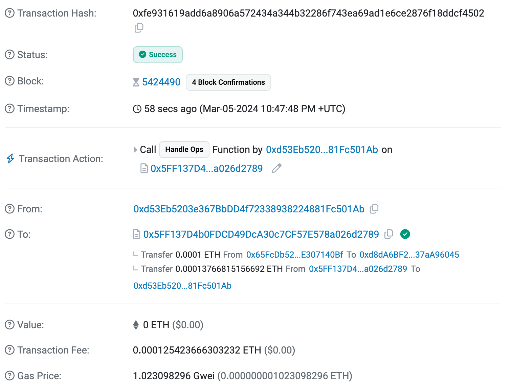

Learn how to use AA SDK and Gas Manager to sponsor `UserOps`

## Introduction

In this tutorial we will show you how you can use [Gas Manager](https://dashboard.alchemy.com/gas-manager) and [AA SDK](https://github.com/alchemyplatform/aa-sdk) to sponsor user operations. You will learn this by sending a simple demo user operation that sends a small amount of ETH to an address on Sepolia network. Our Gas Manager will pay for the gas fee to execute this `userOp` demonstrating the sponsorship part.

***

## Prerequisites

We assume that you have already gone through our [guide on sending user operations](/docs/creating-a-smart-contract-account-and-sending-userops) or already know how to send user operations using our [AA SDK](https://github.com/alchemyplatform/aa-sdk) ( `aa-core` ). This guide will expand upon using [Gas Manager](https://dashboard.alchemy.com/gas-manager) to sponsor the user operations. Therefore, in order to follow this guide you should already have:

* A smart contract account and the associated owner private key.
* Small amount of [SepoliaETH](https://www.alchemy.com/faucets/ethereum-sepolia) in your smart contract account that you will be sending to another address as part of the sponsored user operation.

***

## Developer Environment

We built a public GitHub [repository](https://github.com/alchemyplatform/sponsoring-userops) that you can fork and modify. If you prefer, you can create your own repo, adjusting configuration based on your needs. The repository uses [npm](https://www.npmjs.com/) and [tsx](https://www.npmjs.com/package/tsx) to execute the code and displays the results directly in the terminal. More details on how to execute code can be found in the [README](https://github.com/alchemyplatform/sponsoring-userops/blob/main/README.md). The rest of the tutorial assumes you are following along with our repository. Before we dive into the details of the guide, let us go over what we will be doing from a high level.

***

## Overview

The project will have two scripts namely `createSmartAccountClient.ts` and `index.ts`. The first script ( `createSmartAccountClient.ts` ) will create an instance of your smart contract account ( SCA ) through the private key that you will provide in the environment variables. That private key will be used to sign the user operations and will be considered the owner of the SCA. The second script ( `index.ts` ) will send a sponsored user operation ( i.e. the gas for the user operation will be paid by our Gas Manager ) to send some ETH from your SCA to a specified address.

***

## Environment Variables

If you forked the [Github repo ](https://github.com/alchemyplatform/sponsoring-userops)you will see a file named `.env.example`, that shows you the format in which you should create your `.env` file in the root of your project. It should have the following fields:

* `PRIV_KEY`: This is the private key of the EOA which is owner of your smart contract account.
* `ALCHEMY_API_KEY`: This is the API key for your Alchemy app. If you don't already have an app, please create one on your [Alchemy dashboard](https://dashboard.alchemy.com/apps) and be sure to specify the network to be `Ethereum Sepolia`.
* `PAYMASTER_POLICY_ID`: This is the policy id of your gas manager policy. Gas manager policies are rules defined by you that govern how and when an application will sponsor a user operation. This is what will allow you to send gasless user operations ( i.e. Alchemy's Gas Manager will pay for the gas fee to execute your user operations ). Create a new gas policy by following the [guide on creating gas policies](/docs/setup-a-gas-manager-policy) and get your policy id from there.

***

## Creating a SCA Instance

With our Environment variables set up, let's look into the `createSmartAccountClient.ts` script which creates an instance for your smart contract account linked with the Gas manager that can be used to send sponsored user operations.

<CodeGroup>
  ```typescript createSmartAccountClient.ts
  // Import the necessary packages
  import {
    LocalAccountSigner,
    type SmartAccountSigner,
    sepolia,
  } from "@alchemy/aa-core";
  import { createModularAccountAlchemyClient } from "@alchemy/aa-alchemy";
  import * as dotenv from "dotenv";
  dotenv.config();

  // Import the environment variables
  const PRIV_KEY = process.env.PRIV_KEY!;
  const ALCHEMY_API_KEY = process.env.ALCHEMY_API_KEY!;
  const PAYMASTER_POLICY_ID = process.env.PAYMASTER_POLICY_ID!;

  // Define the constants
  const chain = sepolia;
  const signer: SmartAccountSigner = LocalAccountSigner.privateKeyToAccountSigner(
    `0x${PRIV_KEY}`
  );

  /**
   * @description Creates a smart contract account that can be used to send user operations.
   * @returns The smart contract account owner + provider, as a signer, that can be used to send user operations from the SCA
   */

  // Client with the Gas Manager to sponsor gas.
  // Find your Gas Manager policy id at: dashboard.alchemy.com/gas-manager/policy/create
  export const smartAccountClient = await createModularAccountAlchemyClient({
    apiKey: ALCHEMY_API_KEY,
    chain,
    signer, // or any SmartAccountSigner
    gasManagerConfig: {
      policyId: PAYMASTER_POLICY_ID,
    },
  });
  ```
</CodeGroup>

The script:

* Imports the required modules from `aa-core` and `aa-alchemy`, environment variables and defines constants.
* Creates a `LocalAccountSigner` using your EOA private key.
* Creates an instance of a Modular Account client using `ModularAccountAlchemyClient`
* Links the instance to the local signer.
* Uses `gasManagerConfig` to link Gas Manager to client.
* Returns the `smartAccountClient`.

Let's expand on the Gas Manager parts of the script:

1. **The `PAYMASTER_POLICY_ID` environment variable**

   <CodeGroup>
     ```typescript createSmartAccountClient.ts
     const PAYMASTER_POLICY_ID = process.env.PAYMASTER_POLICY_ID!;
     ```
   </CodeGroup>

   You will also notice that we're importing the `PAYMASTER_POLICY_ID` environment variable. As explained in the [Environment Variables](#environment-variables) section, this is your Gas Manager policy id that will be used to link the Gas Manager to your SCA client.

2. **Linking Gas Manger to SCA Client**

   <CodeGroup>
     ```typescript createSigner.ts
     // Using Alchemy Gas Manager to sponsor the UserOps
       export const smartAccountClient = await createModularAccountAlchemyClient({
         apiKey: ALCHEMY_API_KEY,
         chain,
         signer, // or any SmartAccountSigner
         gasManagerConfig: {
           policyId: PAYMASTER_POLICY_ID,
         },
     });
     ```
   </CodeGroup>

   Finally we have the code block that actually links the gas manager to your SCA client using `gasManagerConfig` and the `PAYMASTER_POLICY_ID`. This is where the sponsorship magic happens ✨🪄

Now we have a SCA client linked to the Gas Manager and we're ready to start sending sponsored user operations using it!

***

## Sending the sponsored user operation ( `index.ts` )

Now let's look at the `index.ts` file which actually sends the sponsored user operation.

<CodeGroup>
  ```typescript index.ts
  /// Import the required functions and modules
  import { smartAccountClient } from "./createSmartAccountClient";
  import { parseEther } from "viem";
  import type { SendUserOperationResult } from "@alchemy/aa-core";

  // Define the constants
  const ADDR = "0xd8dA6BF26964aF9D7eEd9e03E53415D37aA96045"; // replace with the adress you want to send SepoliaETH to, unless you want to send ETH to Vitalik :)

  /**
   * @description Creates a smart contract account, and sends ETH to the specified address (could be an EOA or SCA)
   * @note Seperating the logic to create the account, and the logic to send the transaction
   */
  export async function main() {
    const amountToSend: bigint = parseEther("0.0001");

    const result: SendUserOperationResult =
      await smartAccountClient.sendUserOperation({
        uo: {
          target: ADDR,
          data: "0x",
          value: amountToSend,
        },
      });

    console.log("User operation result: ", result);

    console.log(
      "\nWaiting for the user operation to be included in a mined transaction..."
    );

    const txHash = await smartAccountClient.waitForUserOperationTransaction(
      result
    );

    console.log("\nTransaction hash: ", txHash);
  }

  main();
  ```
</CodeGroup>

It's a simple script that:

* Imports the `smartAccountClient` function from `createSmartAccountClient.ts`.
* Imports the `SendUserOperationResult` function from `aa-core`.
* Defines an address to send SepoliaETH to from the SCA.
* Send a sponsored user operation for sending `0.0001` SepoliaETH from the SCA to the specified address.
* Logs the user operation result.
* Gets the transaction hash corresponding to user operation ( `smartAccountClient.waitForUserOperationTransaction` )
* Logs the transaction hash

Run this script by executing the following command in your terminal:

<CodeGroup>
  ```typescript shell
  npm run index
  ```
</CodeGroup>

You should see an output like this in your terminal:

<CodeGroup>
  ```typescript shell
  User operation result:  {
    hash: '0xa8d12df332eafcf22c0cbc5200df0b1c2a1624ae1d25e2dd2696665a868f6406',
    request: {
      initCode: '0x',
      sender: '0x65FcDb52632d06bdE94d3D3Ae6279a6E307140Bf',
      nonce: '0x6',
      callData: '0xb61d27f6000000000000000000000000d8da6bf26964af9d7eed9e03e53415d37aa9604500000000000000000000000000000000000000000000000000005af3107a400000000000000000000000000000000000000000000000000000000000000000600000000000000000000000000000000000000000000000000000000000000000',
      signature: '0x2199fe71de1de41da6f9c715d02bb30e3a8688484ddc844e519abaebe0d02a6900f776d39f48da1a333a7591aa2e25927a8cb23b1b9ce1735af23239cf7d91371c',
      paymasterAndData: '0xc03aac639bb21233e0139381970328db8bceeb67000000000000000065e7a35a0000000000000000000000000000000000000000d440ab7f4eb2303f17d3abde43bb5a0ab84a1b4b8d6805b1b6a1adfdb1c3fff07a0b5f05a3e20504cb8d4fe81dc8e637d38063b825c9174f273a3cebb1fd87e51c',
      maxFeePerGas: '0x1944f83ce9',
      maxPriorityFeePerGas: '0x411bb500',
      callGasLimit: '0x5000',
      preVerificationGas: '0xba60',
      verificationGasLimit: '0x11a49'
    }
  }

  Waiting for the user operation to be included in a mined transaction...

  Transaction hash:  0xfe931619add6a8906a572434a344b32286f743ea69ad1e6ce2876f18ddcf4502
  ```
</CodeGroup>

Copy the `Transaction hash` from the output and search it on [Sepolia Etherscan ](https://sepolia.etherscan.io/). You will see the transaction details matching this format:



Notice how there's just one ETH transfer from your SCA, which is to transfer the specified amount of ETH ( in this case `0.0001` ETH ) from your SCA to the specified address. If we were not using the Gas Manager there would be another ETH transfer from your SCA for the payment of gas fee for executing this transaction but in this case the gas fee for this transaction is paid by Alchemy's Gas Manager so we have no such ETH transfer! Congratulations you just executed a sponsored user operation 🎉

***

## Conclusion

In this tutorial we learned how to send sponsored user operations using [AA-SDK](https://github.com/alchemyplatform/aa-sdk) and [Gas Manager](https://dashboard.alchemy.com/gas-manager)! This knowledge can be extremely valuable as you can abstract away the concept of "gas" ( gas fee ) from your dapp users by sending sponsored user operations for them.

In the next part of our AA series, we have used this knowledge to [build a gasless NFT minter dapp](#).

We hope this tutorial was helpful to you. If you have any questions or want to share what you have done, feel free to @ us on [Twitter](https://twitter.com/Alchemy) and chat with us and the community on our [Discord](https://discord.gg/alchemyplatform).

The AA SDK is still in beta, so we encourage your feedback and want to hear about your experience using it!

Happy Buidling!

***

## Want to stream notifications for mined userOperations?

Follow [this](/docs/how-to-use-custom-webhooks-to-get-push-notifications-for-mined-user-operations) guide to learn how to use Custom Webhooks and get real time alerts and receipts for mined userOperations.
