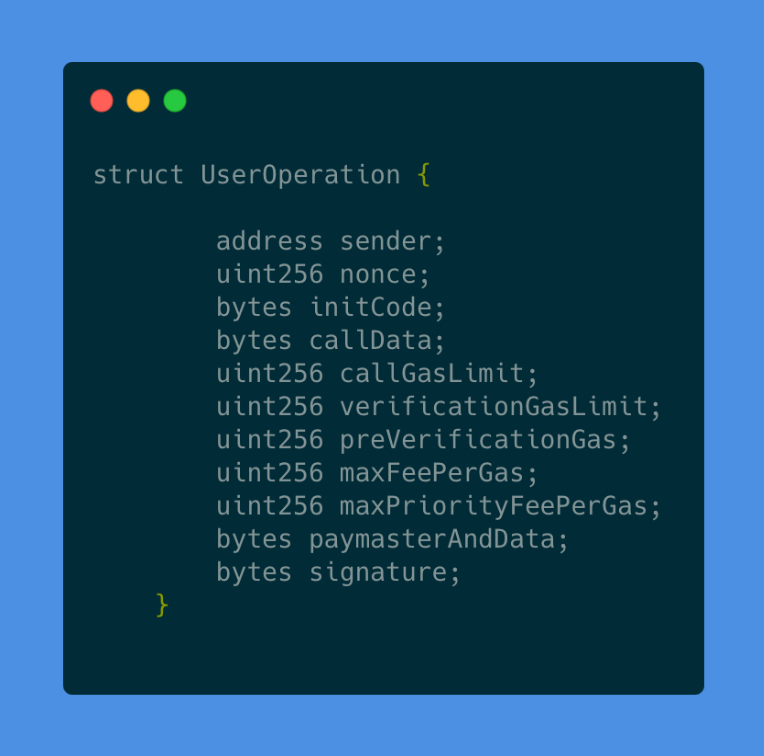

Account abstraction aims to make the end user experience of interacting with EVM-based blockchains more flexible and user-friendly. This new approach enables developers to introduce innovative solutions that were previously not possible, pushing the boundaries of what can be achieved in web3. By improving the user experience, account abstraction will enable the onboarding of a new wave of users, accelerating the mass adoption of crypto and web3 applications.

In this tutorial, we will compare account abstraction to traditional account setups, we will introduce you to some of the more exciting new use cases enabled by this technology and we will explain how you, as a web3 developer, could take advantage of this new paradigm using Alchemy's suite of tools.

## What is Account Abstraction?

At the heart of account abstraction lies the convergence of the concepts of [Externally Owned Addresses (EOAs)](https://ethereum.org/en/developers/docs/accounts/#externally-owned-accounts-and-key-pairs) and smart contracts, to produce what is called a Smart Contract Account (SCA). Under the Account Abstraction (AA) paradigm, instead of owning an EOA, an end user owns a SCA and all of the user's assets, such as ERC-20 tokens and NFTs, are held inside this SCA.

In essence, a SCA is just a conventional smart contract enhanced with special functions that enable it to send transactions to the blockchain on behalf of its owner. The real power of a SCA, however, lies in its flexibility. As a smart contract, a SCA can contain custom code that sets specific conditions for transactions. This capability allows SCAs to effectively serve as a customizable, rule-governed replacement for the traditional EOA.

The reason for the name "Account Abstraction" comes from the fact that with the added flexibility, it's possible to abstract the complexity of interacting with the blockchain away from the end user. This, in turn, makes it possible to bridge the gap that currently exists between web2 and web3 in terms of end user experience.

This tutorial focuses on the [ERC-4337](https://eips.ethereum.org/EIPS/eip-4337) standard, which implements AA on EVM-based chains by proposing an alternate mempool where users send a special object called a "[user operation](https://www.alchemy.com/learn/account-abstraction#terms)". This approach avoids the need for protocol-level changes. We'll elaborate on how these user operations work later in the tutorial.

## New Use Cases Enabled by Account Abstraction

### 1. Enabling authorization over assets inside a wallet

Because of how the conventional EOA model works, if someone knows the private key for an EOA, they have complete control over all the assets the account holds. With account abstraction, on the other hand, because it's programmable, it's now possible to enforce rules about what a given private key can do. You can now enforce custom rules of any level of complexity, like multi-signature requirements, time-lock conditions and limits on transfer amounts and frequency. You can even restrict what smart contracts the account can interact with.

### 2. Facilitating fee sponsorship

Currently, for a user to be able to transact on the blockchain, they need to have at least a small amount of the chain's native token in their EOA to cover gas fees. This introduces a significant friction point for the end user, as funding an EOA for the first time could be a challenging task involving [CEXes](https://coinmarketcap.com/alexandria/glossary/centralized-exchange-cex), [KYC](https://www.investopedia.com/terms/k/knowyourclient.asp) and [AML](https://www.investopedia.com/terms/a/aml.asp) requirements.

ERC-4337 introduces the concept of a "[paymaster](https://www.alchemy.com/learn/account-abstraction#terms)", an entity that can cover the transaction fees on behalf of the user. Instead of the user having to pre-fund their own SCA, a sponsoring dapp will connect the user's SCA to their paymaster. This way, the SCA creation process as well as future transactions will have no cost for the user.

### 3. Enhancing transaction fee payments

As mentioned before, ERC-4337 doesn't require any protocol-level changes which means that transaction fees need to be paid in ETH. However, thanks to the programmability of SCAs and the introduction of paymasters, it's now possible to enable the user to pay for fees using any ERC-20 token they like, for example a stablecoin or a dapp’s native token (AAVE, UNI, COMP, etc).

### 4. Account automation and pull transactions

In the conventional world of web2 many financial transactions inherently operate on a pull basis. For example, when paying for a subscription you don't actually need to take any action every month to pay for it, but instead the funds are pulled automatically from your payment method. Right now, for Ethereum and other EVM-based chains, the only type of transaction that exists is the push transaction, where the account owner needs to actively execute an action to send funds to a third party.

With account abstraction, on the other hand, it's now possible to grant access to a third-party to pull funds from your SCA automatically for a specified amount and with a specified periodicity. This allows for web2-like functionality in web3 applications, such as automatic payments and subscriptions.

### 5. Batch transactions

One of the hindrances with current dapps is having to approve multiple independent transactions to accomplish a single task. For example, when swapping USDC for ETH on Uniswap, you first have to sign a transaction approving the spending of USDC and then sign another one approving the actual swap. With account abstraction, you can now batch these two transactions into a single approval flow, which significantly improves the user experience.

### 6. Improved recovery mechanisms

Wallet security is one of the biggest problems web3 is facing right now. Unfortunately, [self-custody](https://www.alchemy.com/web3-wallets-overview) is too complex for the average user, and relying solely on centralized custodians [has its own set of risks](https://www.theblock.co/post/231022/ftx-celsius-voyager-blockfi-genesis-collapse-fed-report-charts). Account abstraction can enable more flexible account recovery options, such as social recovery methods. Social recovery, a method for securing a wallet [introduced by Vitalik Buterin](https://vitalik.ca/general/2021/01/11/recovery.html), allows for the recovery of the wallet with the help of a user's social network.

## Differences Between Traditional Wallets and AA Wallets

In a traditional wallet, a user owns a private key that controls an EOA and every interaction with a dapp requires the user's approval. From the developer's perspective, this means the wallet requires a signed transaction from the user that is then sent to a node to be included in the transaction mempool.

The ERC-4337 standard for Account Abstraction stipulates that transactions are initiated by a SCA acting on behalf of the user, instead of being initiated by an EOA as is typically the case. However, the user must first signal their intention to execute a transaction before the SCA can send it. This is done by issuing a specific message known as a **"user operation"**, or **userOp**.

Just as Ethereum transactions need to be signed by the account owner, userOps also need to be signed by the user. However, the signature here is more flexible compared to a traditional transaction. In Ethereum and other EVM-based chains, the only method allowed for signing transactions is the [ECDSA](https://en.wikipedia.org/wiki/Elliptic_Curve_Digital_Signature_Algorithm) algorithm. According to the ERC-4337 standard, a SCA could use other methods as well, such as BLS signatures.

Once the userOp has been signed, it's ready to be sent to the network, but its journey is slightly different than that of a traditional transaction. Rather than being sent directly to a node, userOps are sent off chain to a "[Bundler](https://www.alchemy.com/learn/account-abstraction#terms)". Since only EOAs can initiate transactions, this Bundler acts as an EOA, aggregating multiple userOps together and sending them to the user's SCA via a special smart contract called the "Entry Point".

If this new terminology feels overwhelming, don't worry. We can simplify the main differences with the following table:

| **Traditional EOAs**                                                          | **Account Abstraction**                                                                                                                                                                                            |
| ----------------------------------------------------------------------------- | ------------------------------------------------------------------------------------------------------------------------------------------------------------------------------------------------------------------ |
| The basic unit of execution is called a transaction.                          | The basic unit of execution is called a user operation or userOp.                                                                                                                                                  |
| Transactions are signed using the end user's private key                      | UserOps are signed by the end-user using any method supported by the SCA.                                                                                                                                          |
| Transactions are sent to an Ethereum node through an RPC call                 | UserOps are sent to a bundler through an RPC call                                                                                                                                                                  |
| Transactions are eventually packaged into a block and added to the blockchain | UserOps enter a userOp mempool and are eventually picked up and sent to the Entry Point for processing.                                                                                                            |
| The calldata for the transaction is processed by the target smart contract.   | The calldata for the userOp is processed by the SCA. Although this calldata could potentially invoke any function within the SCA, it typically aims to execute a specific function within a target smart contract. |

When shifting from developing traditional web3 applications to building under the Account Abstraction paradigm, developers need to understand two key aspects. Firstly, they need to understand the concept of account creation. Within the context of Account Abstraction, "account creation" doesn't actually refer to the creation of the SCA. Rather, it's about calculating the SCA's address. The actual deployment of the SCA only occurs when the user sends their first userOp to a bundler.

Secondly, the approach to sending transactions to the network changes under Account Abstraction. Instead of sending a transaction from an EOA, the user's wallet constructs a userOp that is then sent to a bundler. Just as in traditional Ethereum programming, there are numerous ways to accomplish this, ranging from manual, low-level coding where you personally create the userOp, fill in all the fields, and then sign it, to more convenient methods utilizing third-party tools like [Alchemy's AA SDK](/reference/account-abstraction-sdk).

## Understanding the Structure of a UserOp

To enhance our understanding of what a userOp does, let's take a closer look at its components. A userOp is represented as a \*\*`struct`, defined as follows:

* **sender:** This refers to the SCA’s address.
* **nonce:** A unique value used by the sender to prevent replay attacks.
* **initCode:** If supplied, this code will be responsible for the creation of the SCA. Further details on this process are explained in the sections below.
* **callData:** This represents the method call that will be executed on the SCA.
* **signature:** This is a sender-verified signature over the entire userOp.

Please note that parameters such as **callGasLimit, verificationGasLimit, preVerificationGas**, **maxPriorityFeePerGas** and **paymasterAndData** are not within the scope of this tutorial. These concepts will be explored in more detail in a subsequent guide.

The **sender**, **nonce**, and **signature** fields in a userOp align closely with their counterparts in a traditional transaction. However, the **initCode** and **callData** fields require further explanation.

**initCode**

As it's mentioned in the original ERC-4337 proposal, one of the cornerstones of Account Abstraction is retaining the ability of users to locally create their wallet and immediately start accepting funds, a feature inherent to Externally Owned Accounts (EOAs).

In order to achieve this, the standard proposes a factory contract equipped with a method to create an account, that is triggered the first time a user sends a userOp, creating a new SCA for the user.

The factory contract address, the function that creates the SCA (usually called \*\*`createAccount`), and its parameters are all contained within the **initCode** field. The parameters are the owner account address and a salt, all encoded in the form of a calldata field.

Fortunately, you won't have to concern yourself with this account-creation process, as libraries and SDKs like [Alchemy's AA SDK](/reference/account-abstraction-sdk) simplify it for you. By the way, if terms like "salt" and "factory" are new to you, just check out this great tutorial: [https://docs.alchemy.com/docs/create2-an-alternative-to-deriving-contract-addresses](/docs/create2-an-alternative-to-deriving-contract-addresses).

**callData**

While the **callData** field also exists in traditional transactions, its function within Account Abstraction differs. Here, **callData** refers to the code the SCA will execute. The specific function inside the SCA that this field calls is determined by the intended use of the SCA, and can therefore vary.

In the case of [Alchemy's AA SDK](/reference/account-abstraction-sdk), it offers a `UserOperation` method that triggers an `execute` function within an example SCA. This function accepts three parameters:

1. The target smart contract's address to which the transaction is sent
2. The value (in wei) sent with the transaction
3. Optional calldata to accompany the transaction

## Alchemy Suite of Account Abstraction Products

Alchemy offers a wide range of learning resources to make it easy for any developer to start building with Account Abstraction. You can learn more by visiting [Alchemy's Account Abstraction Hub](https://www.alchemy.com/learn/account-abstraction).

The main products offered by Alchemy for Account Abstraction are its SDK and API endpoints:

* **Account Abstraction SDK:** Enables creation of and interaction with ERC-4337 compliant SCAs by simplifying the use of account abstraction primitives, such as entry points, paymasters and bundlers.
* **Bundler API Endpoint**: Enables developers to submit userOps to the Bundler. For more information about the Bundler API see [our docs](/reference/bundler-api-endpoints).
* **Gas Manager Admin API Endpoint**: Enables developers to programmatically create, update and manage gas manager policies for their app.
* **Gas Manager Coverage API Endpoint:** Allows for sponsoring user operations on behalf of users, and abstracting away the concept of "gas" from them.

### Advantages of using Alchemy's AA Infrastructure

ERC-4337 introduces a multitude of novel concepts, creating a significant learning curve for many developers. In addition, several of these concepts are loosely defined within the standard, requiring developers to figure out how to practically implement them in their code.

Alchemy's AA SDK provides a ready-to-use solution, with ERC-4337-compliant implementations for all the relevant concepts introduced by the standard. Here are a few specific examples where Alchemy's AA SDK abstracts complexity away from the developer:

1. **userOp Signing**: While the ERC-4337 standard doesn't specify how the signing of a userOp should be implemented, it leaves it up to the developer to decide how to do it. While beneficial for innovation, this flexibility can pose challenges for developers who are new to the standard. With the AA SDK, you don't even need to worry about signing the userOp before sending it. The SDK takes care of this for you using the conventional private-key method. Moreover, if a different signing method is ever needed, the SDK enables you to easily do this customization.
2. **Gas management**: Many of a userOp's fields are related to gas: callGasLimit, verificationGasLimit, preVerificationGas, maxFeePerGas and maxPriorityFeePerGas. If you were to manually craft your own userOps, you'd have to deal with all these fields and work out the appropriate values for each one so that the userOp is handled correctly. The AA SDK takes care of this under the hood, saving you the trouble.
3. **Bundler functionality**: Technically, you could send your userOps directly to the Entry Point, but this would be similar to operating a node and sending your transactions directly to it. While doable, it's not as convenient as using a third-party infrastructure, like [Alchemy's AA Bundler Infrastructure](/reference/bundler-api-quickstart) and [AA SDK](/reference/account-abstraction-sdk).

## Potential Drawbacks for Account Abstraction

We already covered how Account Abstraction and the ERC-4337 proposal could offer many potential benefits to web3. We will now examine some potential challenges and drawbacks of Account Abstraction:

1. **Learning curve:** There is a steep learning curve associated with understanding the new concepts introduced by the proposal, as well as how to implement those concepts in practice. This increased complexity could slow down developer adoption in the short term.
2. **Security risks:** The proposal introduces new participants, such as the bundlers and the paypasters, which could potentially be exploited if not properly secured. Replay attacks are also a concern, as the way signatures and nonces are used is not specified in the standard, but left for the developer to implement them as they see fit.
3. **Potential for centralization:** While the proposal is aligned with Ethereum's decentralization ethos (for example by allowing anyone to run a bundler or a paymaster) it's still possible that if a few entities dominate these roles it could potentially lead to centralization.
4. **Maintenance Challenges**: The introduction of new elements in the ecosystem could make the network and the applications more difficult to maintain and monitor.
5. **Is more expensive**: Performing an action on-chain using a userOp is typically more expensive compared to sending a transaction from an EOA. That's because of all the overhead that makes AA possible, like, for example, the bundler that needs to be paid for its services and the validation of the userOps by the Entry Point.

## Conclusion

Now it's your opportunity to apply what you have learned. We recommend you take a look at our detailed [technical tutorial](/docs/creating-a-smart-contract-account-and-sending-userops), which provides step-by-step instructions, along with an accompanying Github repository with all the code you need to actually create a basic script that submits userOps to an Entry Point.

## Further Resources

Here is a list of recommended readings, tutorials, and resources for additional learning:

* [What is Account Abstraction (ERC-4337)?](https://www.alchemy.com/overviews/what-is-account-abstraction)
* [8 Benefits of Smart Contract Wallets](https://www.alchemy.com/overviews/smart-contract-wallet-benefits)
* [How do ERC-4337 smart contract wallets work?](https://www.alchemy.com/overviews/how-do-smart-contract-wallets-work)
* ["You Could Have Invented Account Abstraction" blog series by Alchemy](https://www.alchemy.com/blog/account-abstraction)
* [Understanding Account Abstraction](https://www.alchemy.com/learn/account-abstraction)
* [ERC-4337 Proposal](https://eips.ethereum.org/EIPS/eip-4337)
