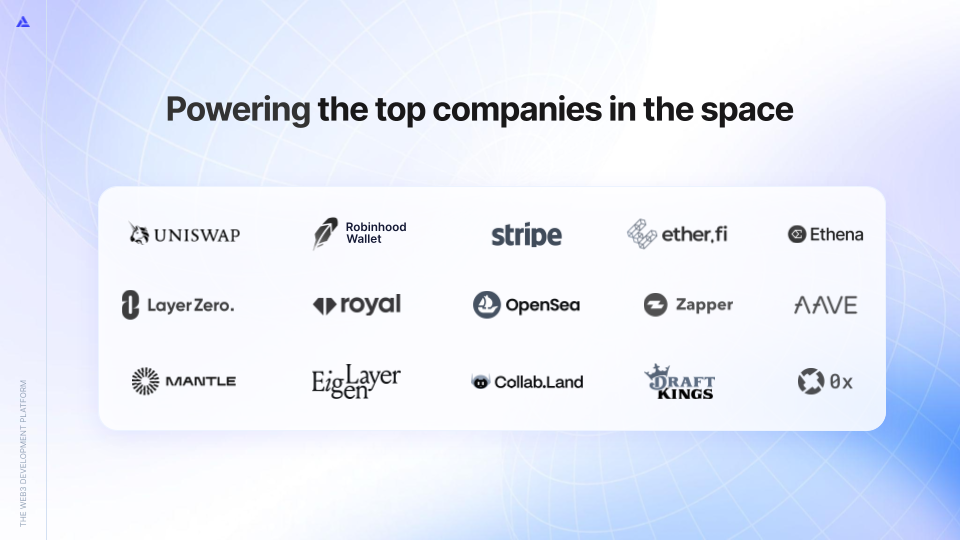
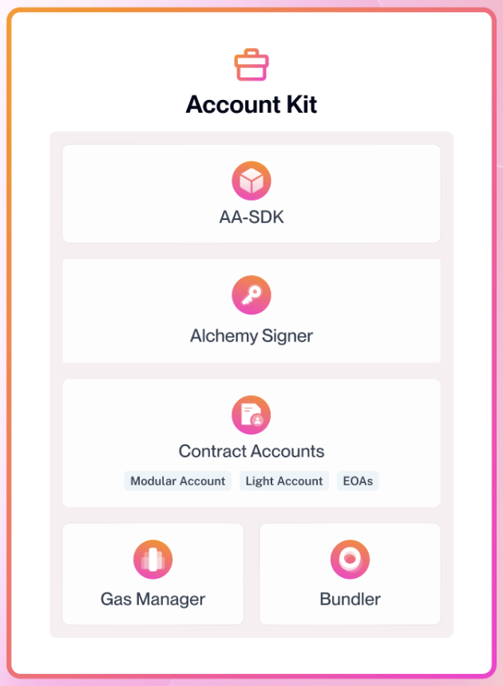
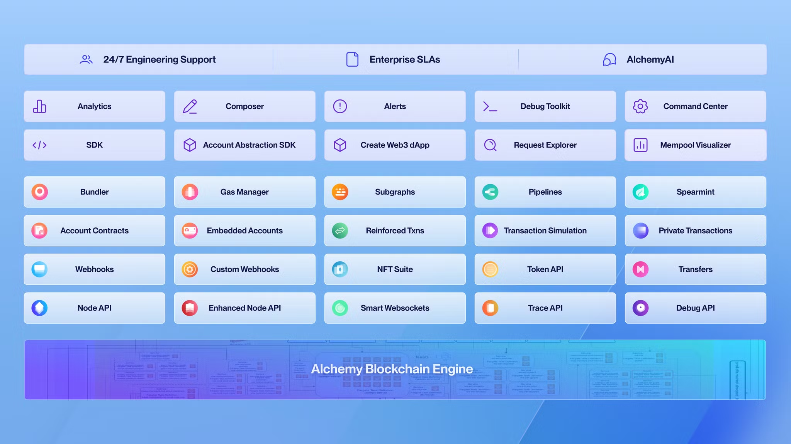
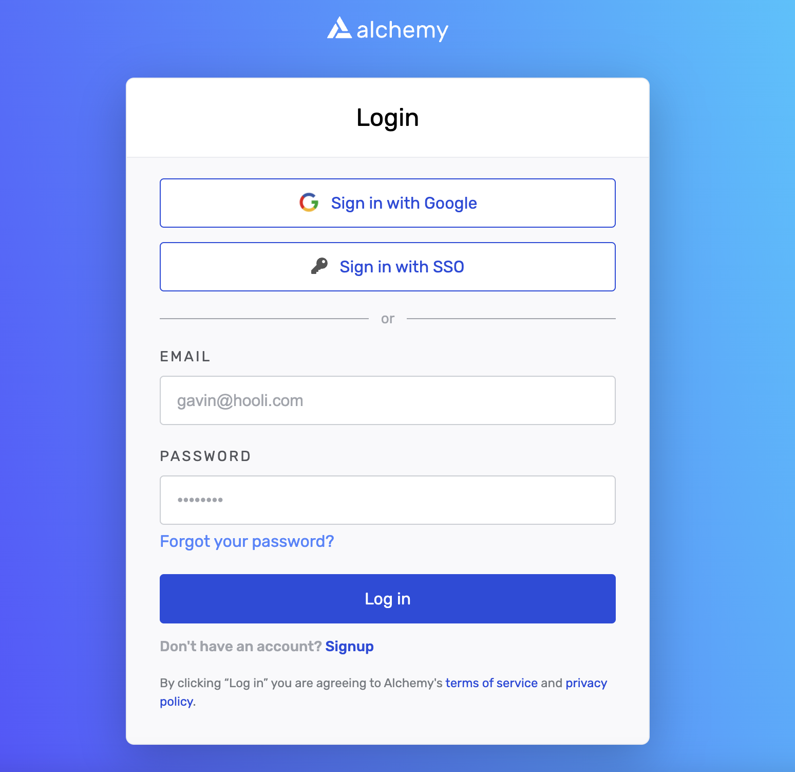
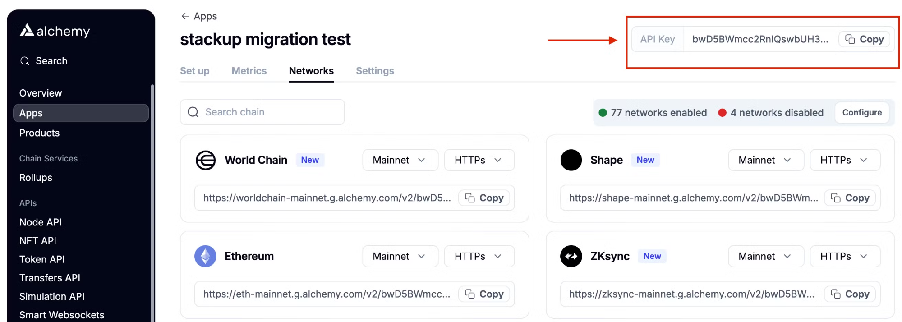
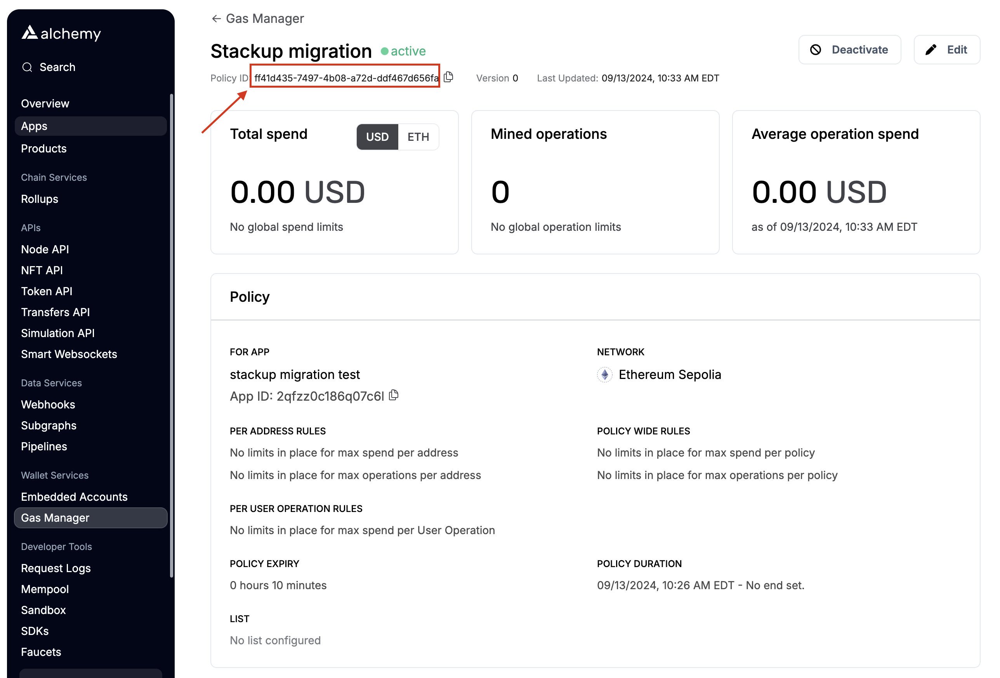

We’re thrilled to support your migration to Alchemy! This guide will walk you through the process and any necessary changes to your setup, and highlight the benefits of using our stack.

# Why Alchemy?

There are many unique benefits of using Alchemy, but here are the three biggest ones:

**1. We’re here for the long haul, with proven scale & reliability**

- Powered the largest companies in web3 & web2 for 7+ years.
- More experienced at building Internet-scale, global enterprise infrastructure than any other company in web3.
- Seen almost any issue that could happen to a chain (re-orgs, chain halt, dropped blocks, etc), and have workarounds and protections against these issues that others don’t.



Note: these are a few selected companies.

**2. We have the only full-stack toolkit you need to solve web3’s biggest problem** Open up [Alchemy’s Account Kit](https://accountkit.alchemy.com/), and you’ll have all the tools you need to solve web3’s biggest problem — user experience.

Build zero friction sign up and transaction flows with smart accounts. Sign up with email and social, login with passkeys, transact with sponsored gas, and checkout in one click with transaction batching.

Get up and running in minutes with the account kit, or swap out any pieces of the stack from signer to infra - Account Kit lets you build how YOU want to.



🙀 UI components COMING SOON!! It’s the last piece 🧩

**3. We offer you the full developer platform, on a silver platter, of course**

It doesn’t stop there. Alchemy is the only all-in-one developer platform. Start with Account Kit, but while you’re here, leverage the APIs & tools (RPC, subgraphs, NFT API, token balances, etc.) to build and scale your web3 app with ease.

When you join our ecosystem, you’re part of the flywheel of builders, chains, and services that evolves together, making the whole greater than the sum of its parts.



Alchemy Developer Platform - each box is one API or product you can rely on to build great blockchain apps.

# Migration Process

## 1. Create an Alchemy account

Go to the [Alchemy Dashboard](https://dashboard.alchemy.com/) and create an account if you haven’t already.



## 2. Create an App

1. Go to the [Apps dashboard](https://dashboard.alchemy.com/apps)
2. Click "Create new app”
3. Select the chain(s) you want to build on. Refer to our [Feature Support By Chain page](/reference/feature-support-by-chain) for details on feature availability across our supported chains.

<Info>
  For additional chain support, reach out on
  [discord](https://discord.com/invite/alchemyplatform).
</Info>

You will now have an API key to use for sending requests.



## 3. Sponsoring gas? Create a Gas Manager Policy

Create a policy in the [Gas Manager dashboard](https://dashboard.alchemy.com/gas-manager/policy/create/?a=api-docs) to sponsor gas for your users.

- A policy is a set of rules that define which user operations are eligible for gas sponsorship. To learn more about policy configuration, refer to our [setting up a gas manager policy](/docs/setup-a-gas-manager-policy) guide.
- Each policy can only be applied to **one app and one chain.** To sponsor gas on multiple chains, you must create multiple policies.

Once a policy is created, you will receive a policy id.



## 4. Update RPC calls

### **Migrate bundler API**

Migrating bundler API calls to estimate gas and send user operations is as simple as swapping out your RPC url since both Stackup and Alchemy follow the [ERC-4337](https://www.erc4337.io/) standard.

1. Replace RPC URL: `https://api.stackup.sh/v1/node/api_key` → `https://eth-mainnet.g.alchemy.com/v2/alchemy_api_key`

   - Include the desired chain in the alchemy rpc url
   - Replace alchemy_api_key with the key from step 2 (from [app dashboard](https://dashboard.alchemy.com/apps))

2. Use updated endpoint for all bundler API endpoints

   - Request params do not need to be changed as they are standardized
   - Add the additional alchemy method `rundler_maxPriorityFee` when estimating gas to set the priority fee

   | [**Stackup bundler endpoints**](https://docs.stackup.sh/docs/erc-4337-bundler-rpc-methods#eth_senduseroperation)       | [**Alchemy bundler endpoints**](/reference/bundler-api-endpoints)       |
   | ---------------------------------------------------------------------------------------------------------------------- | ----------------------------------------------------------------------- |
   | [eth_sendUserOperation](https://docs.stackup.sh/reference/eth-senduseroperation)                                       | [eth_sendUserOperation](/reference/eth-senduseroperation)               |
   | [eth_estimateUserOperationGas](https://docs.stackup.sh/docs/erc-4337-bundler-rpc-methods#eth_estimateuseroperationgas) | [eth_estimateUserOperationGas](/reference/eth-estimateuseroperationgas) |
   | [eth_getUserOperationReceipt](https://docs.stackup.sh/reference/eth-getuseroperationreceipt)                           | [eth_getUserOperationReceipt](/reference/eth-getuseroperationreceipt)   |
   | [eth_getUserOperationByHash](https://docs.stackup.sh/reference/eth-getuseroperationbyhash)                             | [eth_getUserOperationByHash](/reference/eth-getuseroperationbyhash)     |
   | [eth_supportedEntryPoints](https://docs.stackup.sh/reference/eth-supportedentrypoints)                                 | [eth_supportedEntryPoints](/reference/eth-supportedentrypoints)         |
   |                                                                                                                        | [rundler_maxPriorityFeePerGas](/reference/rundler-maxpriorityfeepergas) |

### **Migrate paymaster API (if sponsoring gas)**

1. Replace RPC URL: `https://api.stackup.sh/v1/paymaster/API_KEY` → `https://eth-mainnet.g.alchemy.com/v2/alchemy_api_key`

   - You no longer need a dedicated paymaster endpoint - use the same RPC url for both bundler and paymaster requests

2. Update RPC methods

   | [Stackup paymaster endpoints](https://docs.stackup.sh/reference/paymaster-api-endpoints) | [Alchemy gas manager endpoints](/reference/gas-manager-coverage-api-quickstart)                                        |
   | ---------------------------------------------------------------------------------------- | ---------------------------------------------------------------------------------------------------------------------- |
   | [pm_sponsorUserOperation](https://docs.stackup.sh/reference/pm-sponsoruseroperation)     | [alchemy_requestGasAndPaymasterAndData](/reference/alchemy-requestgasandpaymasteranddata) (recommended)                |
   | [pm_accounts](https://docs.stackup.sh/docs/paymaster-api-rpc-methods#pm_accounts)        | [alchemy_requestPaymasterAndData](/reference/alchemy-requestpaymasteranddata) (alternative if manually estimating gas) |

   1. [`pm_sponsorUserOperation`](https://docs.stackup.sh/reference/pm-sponsoruseroperation) → [`alchemy_requestGasAndPaymasterAndData`](/reference/alchemy-requestgasandpaymasteranddata)

      - Rather than needing to estimate gas before requesting gas sponsorship, use [`alchemy_requestGasAndPaymasterAndData`](/reference/alchemy-requestgasandpaymasteranddata) to obtain `paymasterAndData` and gas estimates at the same time
        - Alternatively, you can use [`alchemy_requestPaymasterAndData`](/reference/alchemy-requestpaymasteranddata) to only request coverage and obtain `paymasterAndData`. You must separately estimate gas in this option.
      - Add the policyId from step 3 ([gas manager dashboard](https://dashboard.alchemy.com/gas-manager/policy/create/?a=api-docs))
      - Pass a partial user operation rather than a full user operation with gas estimates
      - Note: the below examples assume you are using entrypoint v0.6. Please see [documentation](/reference/alchemy-requestgasandpaymasteranddata) for entrypoint v0.7 requests.
      - Example request and response migration

<CodeGroup>
  ```json Stackup pm_sponsorUserOperation request
  {
    "jsonrpc": "2.0",
    "id": 1,
    "method": "pm_sponsorUserOperation",
    "params": [
      {
        sender,
        nonce,
        initCode,
        callData,
        callGasLimit,
        verificationGasLimit,
        preVerificationGas,
        maxFeePerGas,
        maxPriorityFeePerGas,
        paymasterAndData,
        signature,
      },
      "0x5FF137D4b0FDCD49DcA30c7CF57E578a026d2789", // entrypoint
      { /* PM specific data here... */ }
    ]
  }
  ```

        ```json Alchemy alchemy_requestGasAndPaymasterAndData request
        {
          "id": 1,
          "jsonrpc": "2.0",
          "method": "alchemy_requestGasAndPaymasterAndData",
          "params": [
            {
              "policyId": "POLICY_ID",
              "entryPoint": "0x5FF137D4b0FDCD49DcA30c7CF57E578a026d2789",
              "dummySignature": "signature",
              "userOperation": {
                // partial user operation
                "sender": "sender",
                "nonce": "nonce",
                "initCode": "initCode",
                "callData": "callData"
              }
            }
          ]
        }
        ```

        ```json Stackup pm_sponsorUserOperation response
        {
          "jsonrpc": "2.0",
          "id": 1,
          "result": {
            "paymasterAndData": "0x1234...5678",
            "preVerificationGas": "0x...",
            "verificationGasLimit": "0x...",
            "callGasLimit": "0x..."
          }
        }
        ```

        ```json Alchemy alchemy_requestGasAndPaymasterAndData response
        {
          "jsonrpc": "2.0",
          "id": 1,
          "result": {
            "paymasterAndData": "0x1234...5678",
            "preVerificationGas": "0x...",
            "verificationGasLimit": "0x...",
            "callGasLimit": "0x...",
            "maxFeePerFas": "0x...",
            "maxPriorityFeePerGas": "0x..."
          }
        }
        ```

        </CodeGroup>

2.  `pm_accounts` → remove

    - This endpoint is no longer needed
    - To find alchemy paymaster deployment addresses, see [here](/reference/gas-manager-deployment-addresses)

<Info>
  Please reach out on [discord](https://discord.com/invite/alchemyplatform) for
  additional SDK migration support. See [Account
  Kit](https://accountkit.alchemy.com/) to use our SDK.
</Info>

<Info>
  For additional support, reach out on
  [discord](https://discord.com/invite/alchemyplatform).
</Info>
