In this guide, we'll walk you through building an app that monitors the blockchain for an on-chain event. When that event occurs, you'll receive a notification on Telegram. This could be anything from a deposit in a DeFi app to a sale on an NFT marketplace – the choice is yours.

## Prerequisites

Before we begin, make sure you have the following:

1. An Alchemy account: [Sign up here](https://alchemy.com/?a=KofiNFT)
2. A Telegram account
3. A Replit account
4. Familiarity with Python

## Overview

Here's a brief outline of the steps we'll cover in this guide:

1. Creating a new Alchemy project
2. Finding and understanding the event you want to track
3. Configuring Alchemy's Notifications Webhook
4. Writing the Python code for the bot
5. Setting up the Telegram bot

Let's dive in!

# Step 1: Create a new Alchemy project

1. Log in to your Alchemy Dashboard.
2. Click "Create App" and fill in the required details.
3. Once the app is created, note down the API key for future reference.

# Step 2: Find the details of the event you want to track

To create a notification bot for on-chain events, we first need to understand how to interpret blockchain data.

We'll be focusing on EVM (Ethereum Virtual Machine) data, the decentralized operating system employed by Ethereum, Arbitrum, Polygon, Binance Smart Chain, and numerous other chains and Layer 2 solutions.

### Understanding Blockchain Data

Blockchain transactions can be broadly categorized into four types: sending ETH (or a different native token depending on the chain/L2) to another user, creating a smart contract, destroying a smart contract, and most importantly for our purpose, calling a function on a smart contract.

Smart contract functions are where the magic happens:

* To send someone an ERC20 token or an NFT, you would call the transfer() function on that token's smart contract.
* To perform a swap on a decentralized exchange, you would call the swap() function on the DEX's router contract.
* To deposit tokens into a yield farm, you would call the deposit() function on the farm’s smart contract.

When using a crypto protocol's website, you may not directly see that a function is being called when you make a transaction, but that's what is happening in the background.

Function calls can emit events when executed. For instance, calling the `transfer()` function of a token's smart contract typically emits a **Transfer** event. These events are stored on the blockchain as logs.

### Why is this Important?

Our goal in this tutorial is to choose an event log that interests us, use Alchemy to monitor the blockchain for new occurrences of that log, and then write code to process the log data into a neatly formatted Telegram message.

Let's look at an example of how to interpret logs. The understanding you gain here will be important for configuring Alchemy to the event we need to track and writing the code that will translate it into a human-readable message.

### Example: DAI Transfer Logs

Let's assume we want our notification bot to inform us when a DAI token has been transferred and surface the details of that transfer. We will use the event logs stored on the blockchain to extract this information.

i. **Examine the contract's transactions on Etherscan**

Start by looking at the contract's transactions on Etherscan. You can find the DAI token contract address in its documentation. Most protocols include their contract deployment addresses in their documentation.

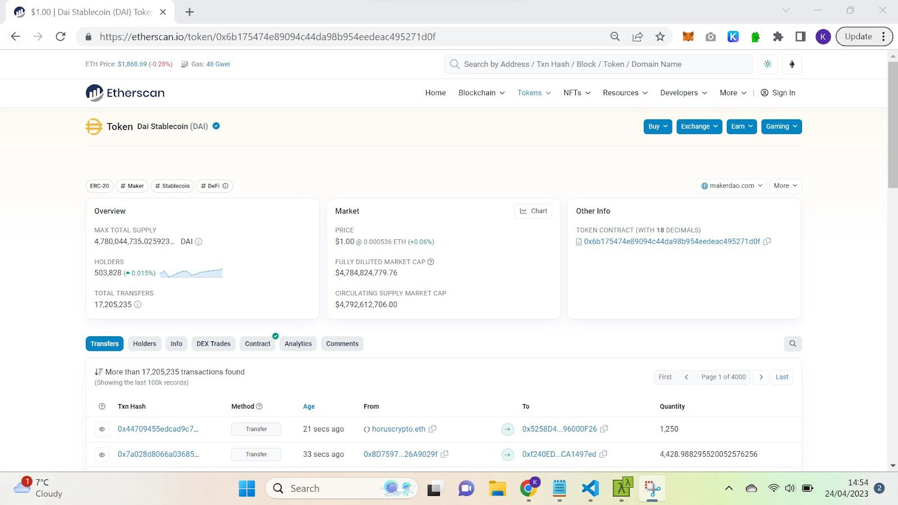

ii. **Open a transaction page that matches your goal**

Etherscan conveniently labels transactions based on the function called to execute them. Open the transaction page of one of the transfer transactions, as that matches the event type we want to track.

The transaction overview page provides helpful information, such as the amount of DAI transferred.

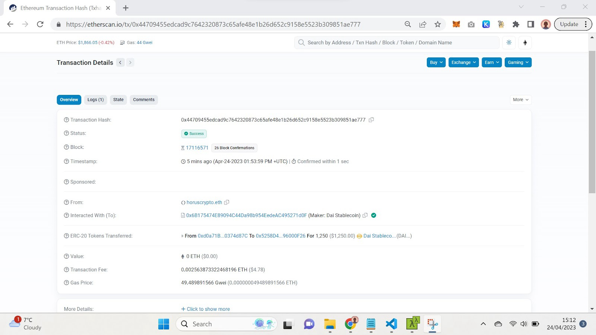

iii. **Interpret the logs of the example transaction**

Click the "Logs" tab on the transaction page to view the raw data of the events emitted during this transaction.

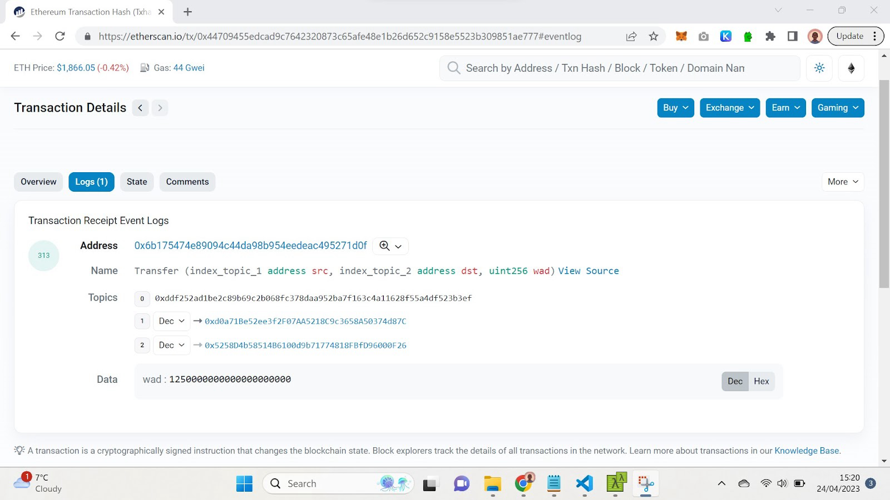

At first glance, the logs may appear intimidating. Lots of byte arrays! Etherscan provides some helpful labels, but when we receive data from Alchemy, we'll only see the raw byte arrays.

Using the Etherscan labels we can tell that the log in the screenshot is the Transfer event emitted by the `transfer()` function.

The byte array in topic0 is the event's signature, which uniquely identifies the event type. Any Transfer log with three parameters of the same datatype as our highlighted log will have the same signature regardless of what contract emitted it.

Indexed parameters go in the topic fields, while non-indexed parameters are stored in the data field.

To better understand these parameters, refer to the protocol's documentation. The DAI documentation states that the contract follows the ERC20 standard and links to a detailed breakdown of the standard’s functions and events.

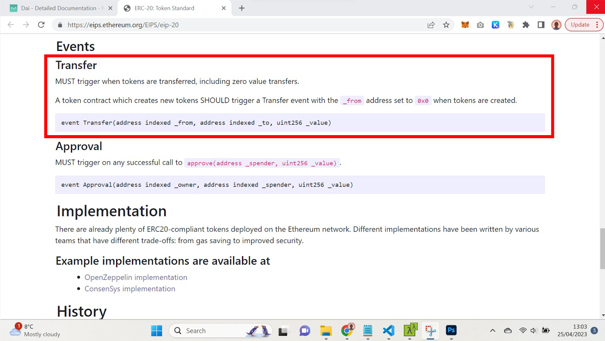

As you can see, the Transfer event’s parameters are the sender address, receiver address, and transferred amount. The first two parameters are indexed, so they appear in the topics, while the transfer amount is in the data field (Etherscan shows it as a decimal number but we will receive it from Alchemy in its original hexadecimal format).

If a project lacks comprehensive documentation that explains contract events, you may need to consult the development team or read the contract.

With this knowledge, we can now filter a stream of blockchain data for DAI token Transfer events and interpret those events.

**Filtering** - To obtain DAI token transfer event data, filter for logs where the contract address is the DAI contract and the signature (topic0) is 0xddf252ad1be2c89b69c2b068fc378daa952ba7f163c4a11628f55a4df523b3ef.

**Interpreting** - Once you have the filtered logs, you can interpret them. You know that topic1 is the sender's address, topic2 is the receiver's address, and the data field contains the transfer amount in hexadecimal format.

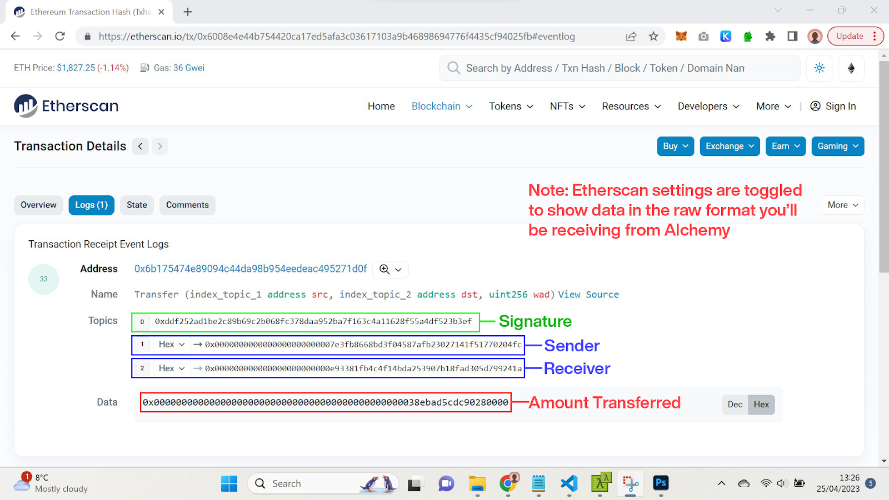

**Note on translating signatures without Etherscan labels**

Some events don't have helpful labels on Etherscan. If you're examining a transaction and the event logs are unlabeled, you can decode them using [Openchain.xyz](https://openchain.xyz/).

On Openchain, open the signature database and copy the topic0 of the event you're investigating to see its human-readable version.

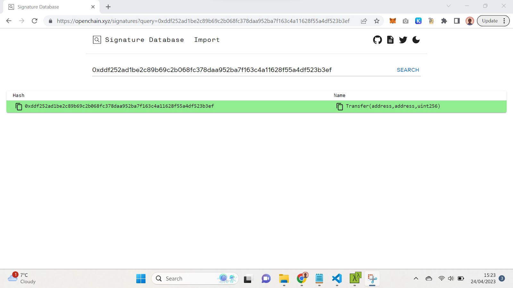

Now that we have a basic understanding of how to interpret raw event logs, let's automate the process of listening for specific types of logs using Alchemy.

# Step 3: Configure Alchemy's Notifications Webhook

1. In your Alchemy Dashboard, navigate to the "Notifications" tab.

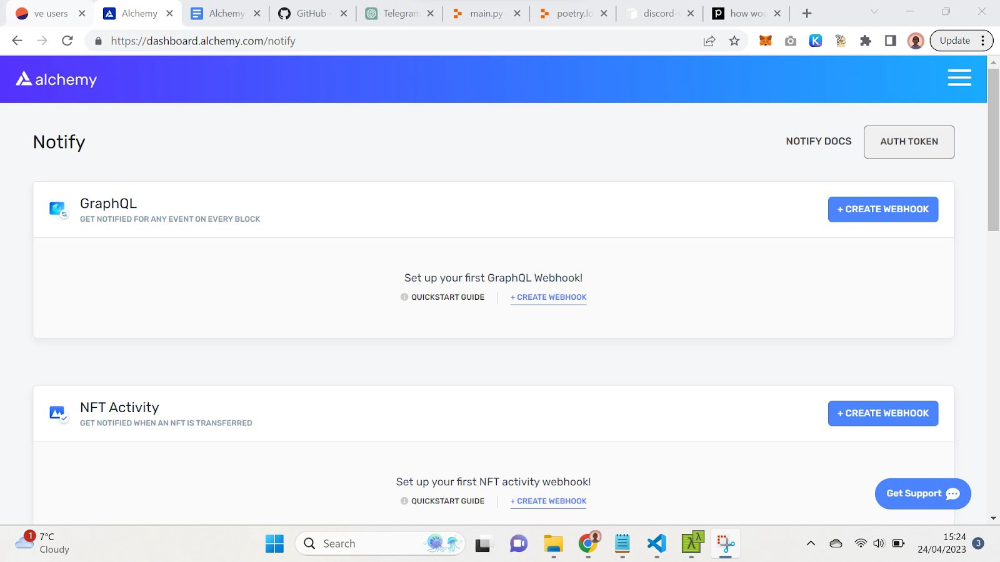

2. Go to the “GraphQL” options and click "Create Webhook".

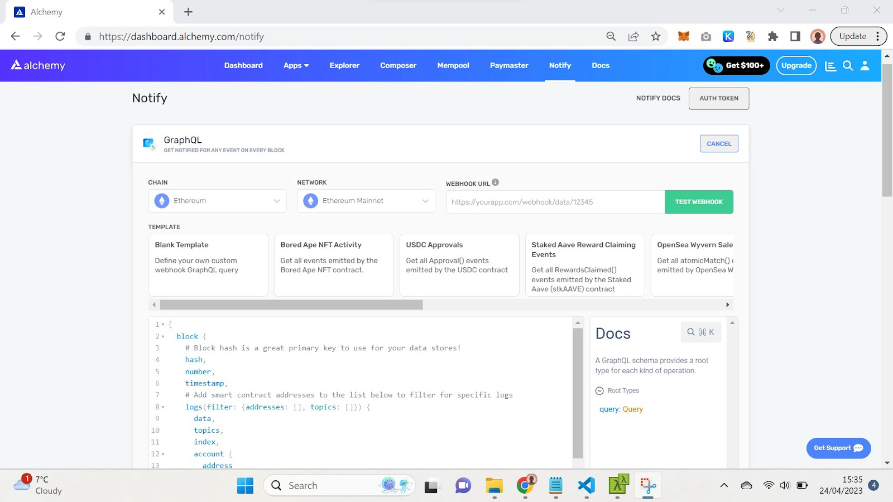

3. Provide the required filters, including the contract address, the signature of the log you're interested in, and any parameters you want to watch for.

Here is an example of how you could filter for Transfer logs created by the DAI token contract.

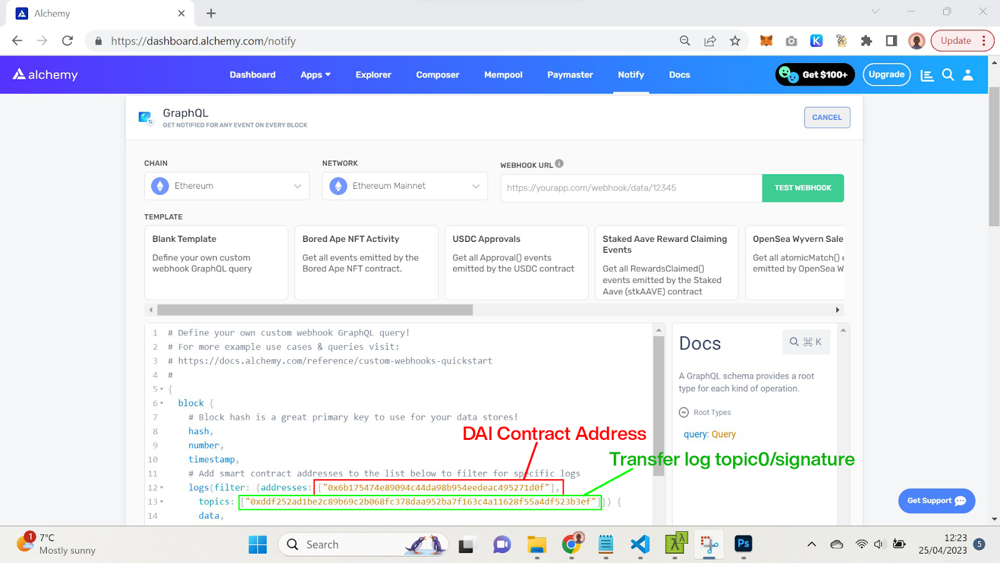

This example could be expanded by adding more topics to the topics array. For example, if you wanted to filter for transfers where address A was the sender you could achieve this by adding address A to the topics array. Because in the Transfer log, topic1 (the second topic) is the sender address.

You can apply the method we used to make this DAI Transfer log filter to any use case. For example, if you wanted to track deposits to a Curve veToken contract you could:

1. Find the contract address in the documentation.
2. Open the contract’s page on Etherscan and inspect one of the deposit transactions.
3. Open the Logs tab of the transaction to find the Deposit event log.
4. Copy the signature (topic0) of the Deposit log to use in the filter.
5. Use the contract address and the signature to filter for Curve veToken deposit logs on Alchemy.

You could also use one of the template filters provided.

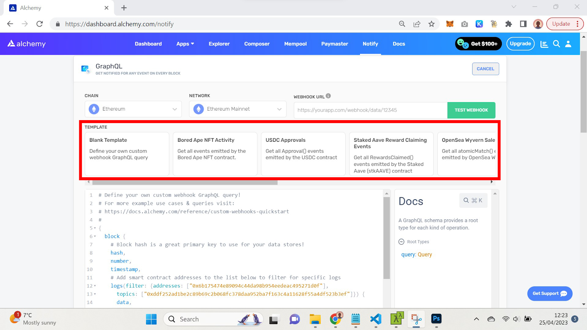

Test the webhook with webhook.site.

Visit [webhook.site](https://webhook.site) and copy the URL it gives you.

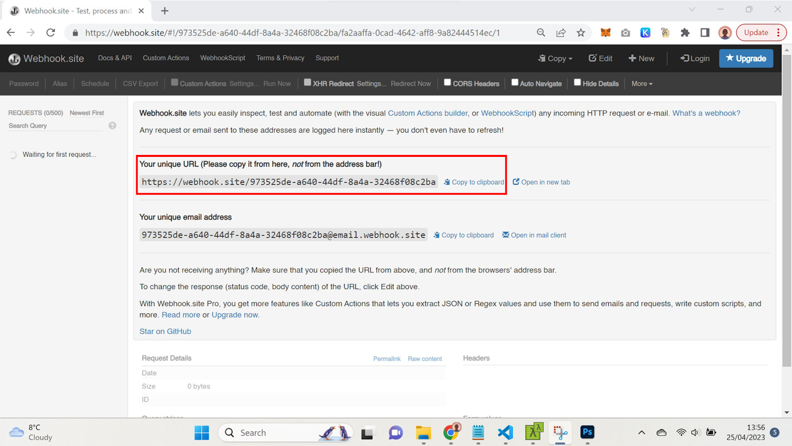

Paste that into the URL field of your webhook creator. Click the “Test Webhook” button to get a test result sent to webhook.site

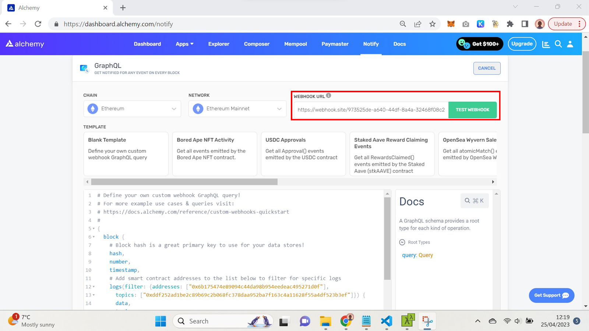

If your target event was emitted in the most recent block on the blockchain (.eg. your tracking DAI transfers and some DAI transfers that happened in that block) then you will receive data on those logs

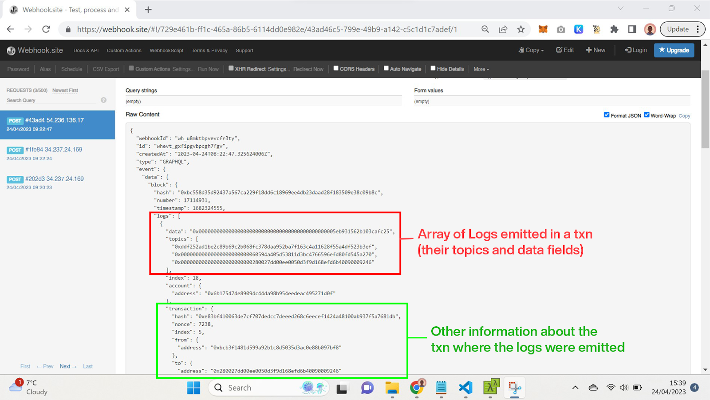

If the most recent block did not contain any of your logs then you will receive an empty response like this

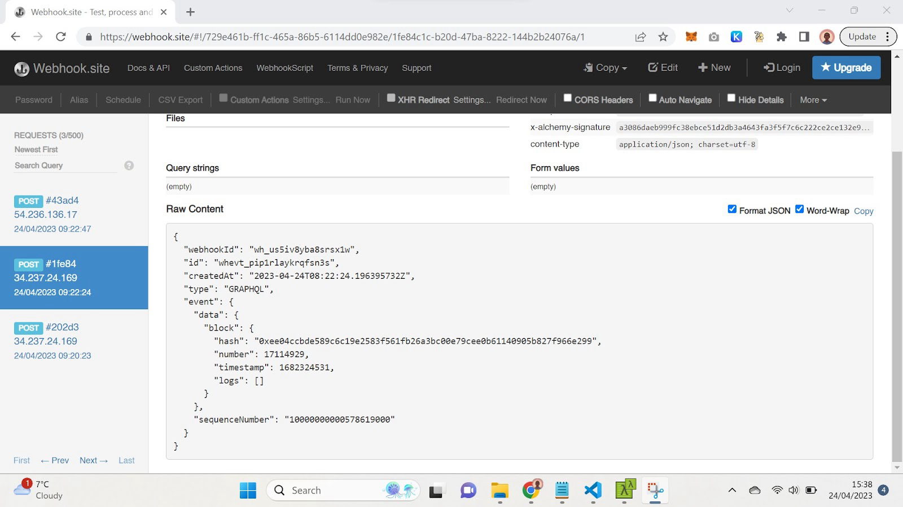

Now that you know how to configure a notifications webhook we are going to build the server that will receive the webhook responses and transform them into a telegram message

# Step 4: Build the Telegram Bot with Python

We've reached the exciting part - building our Telegram app using Python and Flask, a popular framework for building web applications and APIs. Flask provides all the functionality needed to receive HTTP requests from Alchemy and respond accordingly. We'll write and host this new app on Replit.

### Setting up the Python App on Replit

1. Log into Replit and click the "Create Repl" button in your menu.
2. Search and select the Flask template. Name the project whatever you like.

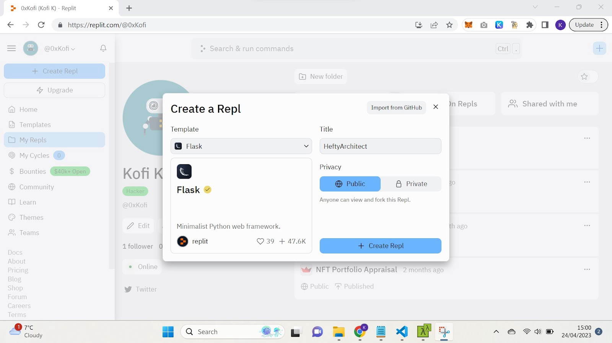

3. Run `poetry add [email protected]` in the shell. This installs a package that will help you communicate with the Telegram API.

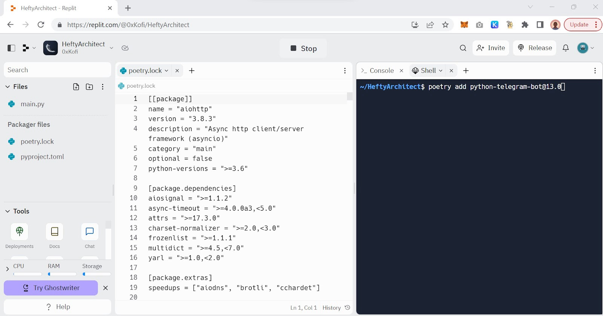

4. Write the following code in your `main.py` file. This script is tailored to the DAI transfer notification example we've been discussing.

<CodeGroup>
  ```python main.py
  import os
  from flask import Flask, request, Response
  from telegram import Update, Bot
  from telegram.ext import Updater, CommandHandler, CallbackContext

  app = Flask(__name__)

  # Set up Telegram bot API
  TELEGRAM_API_TOKEN = os.environ['BOT_TOKEN']
  bot = Bot(TELEGRAM_API_TOKEN)

  # Initialize global variable for chat ID
  user_chat_id = None

  @app.route('/notify', methods=['POST'])
  def notify():
    # Extract logs from request
    logs = request.json['event']['data']['block']['logs']

    # Check if logs array is empty
    if (len(logs) == 0):
      print("Empty logs array received, skipping")
    else:
      # Loop through each log in the logs array
      for i in range(0, len(logs)):
        # Extract topic1, topic2, and amount from the log
        topic1 = "0x" + logs[i]['topics'][1][26:]
        topic2 = "0x" + logs[i]['topics'][2][26:]
        amount = "{:.3f}".format(int(logs[i]['data'], 16) / float(1e18))

        # Create message to send to Telegram
        message = topic1 + ' sent ' + amount + ' DAI to ' + topic2

        # Send the message to the user
        if user_chat_id is not None:
          bot.send_message(chat_id=user_chat_id, text=message)
        else:
          print("User chat ID not set, skipping message")

    # Return a success response to the request
    return Response(status=200)

  def start(update: Update, context: CallbackContext):
    global user_chat_id
    user_chat_id = update.effective_chat.id
    update.message.reply_text("You will now receive notifications.")

  updater = Updater(TELEGRAM_API_TOKEN)
  updater.dispatcher.add_handler(CommandHandler("start", start))

  # Start the bot
  updater.start_polling()

  # Start Flask app
  if __name__ == '__main__':
    app.run(host='0.0.0.0', port=81)
    
  ```
</CodeGroup>

### Understanding the Code

The first statements import the Flask and Telegram API packages that we'll need:

<CodeGroup>
  ```python python
  import os
  from flask import Flask, request, Response
  from telegram import Update, Bot
  from telegram.ext import Updater, CommandHandler, CallbackContext
  ```
</CodeGroup>

Then we create a new Flask app:

<CodeGroup>
  ```python python
  app = Flask(__name__)
  ```
</CodeGroup>

These next lines set up the interface for communicating with our Telegram bot. We need to give it the unique key that grants it control of the Telegram bot:

<CodeGroup>
  ```python python
  TELEGRAM_API_TOKEN = os.environ['BOT_TOKEN']
  bot = Bot(TELEGRAM_API_TOKEN)
  ```
</CodeGroup>

Soon, we'll show you how to create a new bot on the Telegram side and get the key for it.

For safety reasons, we don't copy the key out in the open here where everyone can see it; we store it secretly in an environment variable called **BOT\_TOKEN**. Anyone who has the key for our bot will be able to control it.

After that, we create a variable that will hold the ID of the specific chat thread where we talk to our bot:

<CodeGroup>
  ```python python
  user_chat_id = None
  ```
</CodeGroup>

Next, we write the handler that actually receives and processes the raw data we get from Alchemy. This handler has logic specifically written for the DAI "Transfer" use case, but you can edit it to fit any other event use case:

<CodeGroup>
  ```python python
  @app.route('/notify', methods=['POST'])
  def notify():
  ```
</CodeGroup>

Here's what happens.

The Alchemy webhook sends a request to the `/notify` endpoint. The handler logic extracts log data from the request.

<CodeGroup>
  ```python python
  logs = request.json['event']['data']['block']['logs']
  ```
</CodeGroup>

If there aren't any Transfer logs in that block, Alchemy will send an empty logs dataset. We'll note that and move on:

<CodeGroup>
  ```python python
  if (len(logs) == 0):
    print("Empty logs array received, skipping")
  ```
</CodeGroup>

If there are Transfer logs, we loop through all of them. For each log, we save the sender address (topic1), the receiver address (topic2), and the amount (in the data field). We remove unnecessary leading zeros in the addresses, convert the amount from hexadecimal to decimal and divide the amount by 1e18 (standard multiplier for token quantities).

<CodeGroup>
  ```python python
  for i in range(0, len(logs)):
    topic1 = "0x" + logs[i]['topics'][1][26:]
    topic2 = "0x" + logs[i]['topics'][2][26:]
    amount = "{:.3f}".format(int(logs[i]['data'], 16) / float(1e18))
  ```
</CodeGroup>

Then we craft a message with those three data points: "Wallet A sent X amount of DAI to Wallet B."

<CodeGroup>
  ```python python
  message = topic1 + ' sent ' + amount + ' DAI to ' + topic2
  ```
</CodeGroup>

If the chat with the user has been started, the message is sent to the user:

<CodeGroup>
  ```python python
  if user_chat_id is not None:
    bot.send_message(chat_id=user_chat_id, text=message)
  ```
</CodeGroup>

If the chat has not been started, the information is noted, and we move on:

<CodeGroup>
  ```python python
  else:
    print("User chat ID not set, skipping message")
  ```
</CodeGroup>

Finally, we respond to Alchemy with a `200` status code message to let Alchemy know that we received their message. If Alchemy doesn't get the `200` message, it will keep retrying to send the message:

<CodeGroup>
  ```python python
  return Response(status=200)
  ```
</CodeGroup>

This statement waits for the user to start the bot. Once that happens, it knows what chat thread should be used for communication, and it saves the ID of that chat. It also sends a message to confirm that the chat has been recognized:

<CodeGroup>
  ```python python
  def start(update: Update, context: CallbackContext):
    global user_chat_id
    user_chat_id = update.effective_chat.id
    update.message.reply_text("You will now receive notifications.")
  ```
</CodeGroup>

These statements set up the app to listen for new messages at the port:

<CodeGroup>
  ```python python
  updater = Updater(TELEGRAM_API_TOKEN)
  updater.dispatcher.add_handler(CommandHandler("start", start))
  ```
</CodeGroup>

The following statement starts the bot:

<CodeGroup>
  ```python python
  updater.start_polling()
  ```
</CodeGroup>

This statement runs our main Flask app when the script is called:

<CodeGroup>
  ```python python
  if __name__ == '__main__':
    app.run(host='0.0.0.0', port=81)
  ```
</CodeGroup>

That's how this app works! Next, we're going to create a new bot on the Telegram side and link it to this server by providing the server with its key.

# Step 5: Create a New Bot on Telegram and Link It to the Server

1. Open the Telegram app and search for the **BotFather** bot.
2. Start a chat with **BotFather** and send the command `/newbot`.
3. Follow the instructions provided by **BotFather** to create a new bot and obtain the unique API token.

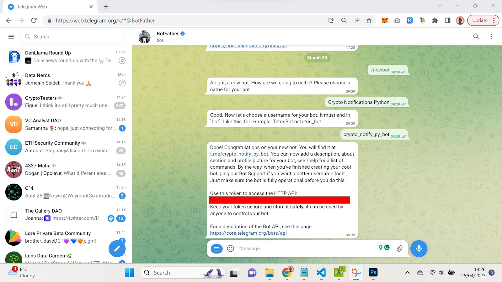

Open the Secrets tool in Replit. Store the API token in an environment variable **BOT\_TOKEN**. This ensures the token remains secure and accessible to your Python script.

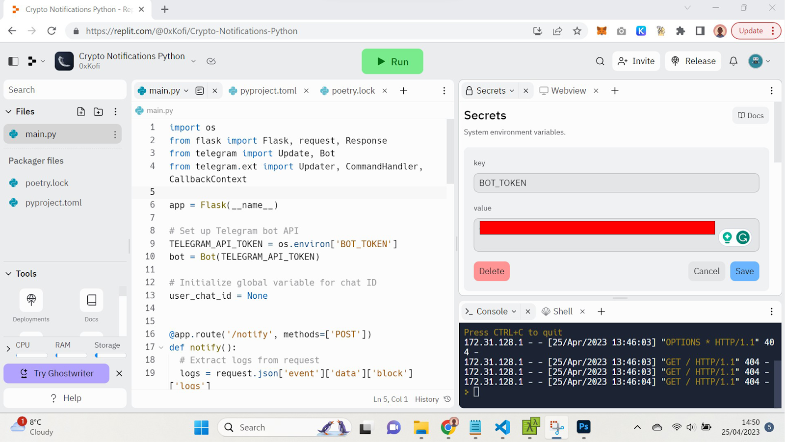

5. Run the Python app on Replit, and start a chat with your newly created bot on Telegram. You should receive a confirmation message.
6. To complete the app, we'll need Alchemy to begin sending notifications to our Flask server. Set up a new Alchemy webhook for the event you're interested in tracking and provide the URL of your server.

The server’s URL will follow the pattern `<project_name>.<user_name>.repl.co/notify` (where ***notify*** is the endpoint specified in our code for receiving alchemy data). Once you've entered the URL, click "Create Webhook" to activate it, and your bot will start receiving data from Alchemy whenever the specified event takes place.

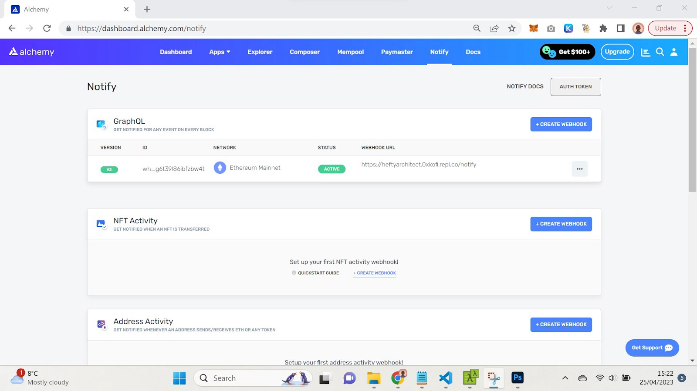

Your Telegram bot is now set up and ready to send notifications for DAI transfers or any other event you've tailored the handler to process.

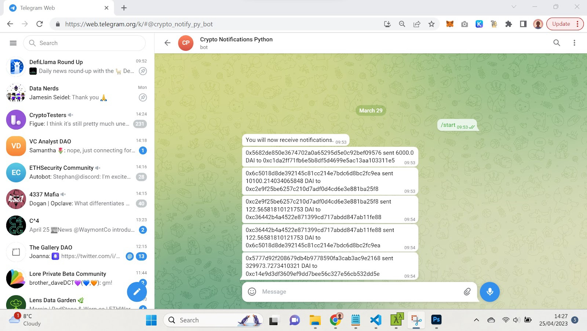

Turn off your Alchemy webhook when you're not using it in order to preserve your credits.

# Development

Your development server will stop running when you close the Replit window. To keep it live all the time, you can use Replit Deployments.

If you use a Deployment, make sure to use the Deployment URL in your Alchemy webhook instead of the development URL.

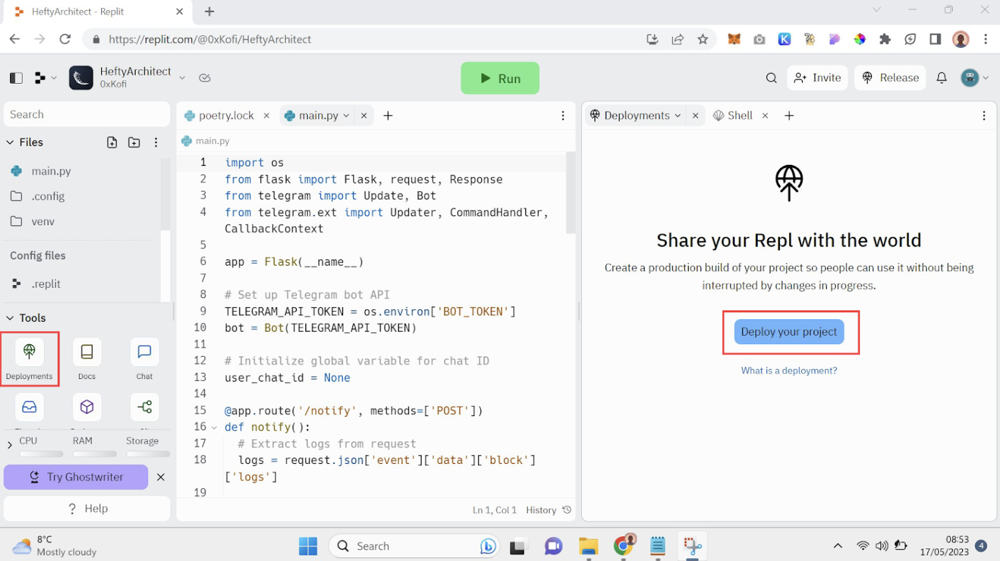


# You made it 🥳

Congratulations! You've successfully created a Telegram notification bot using Alchemy's Notifications Webhook product. You can now customize your bot further, modify the events it listens for and expand its functionality based on your requirements.

You can also use Alchemy Notifications to create bots for other platforms such as Slack and email. Here is an example of how to make a [Discord bot for on-chain events](/reference/building-a-discord-notification-bot-with-alchemys-notifications-webhook).

This guide focused on Ethereum but Alchemy Notifications also supports Polygon, Optimism, and Arbitrum

Let me know on Twitter ([@0xKofi](https://twitter.com/0xKofi)) if you have any feedback about this tutorial. Can't wait to see all the cool stuff you guys make!

Happy coding!
