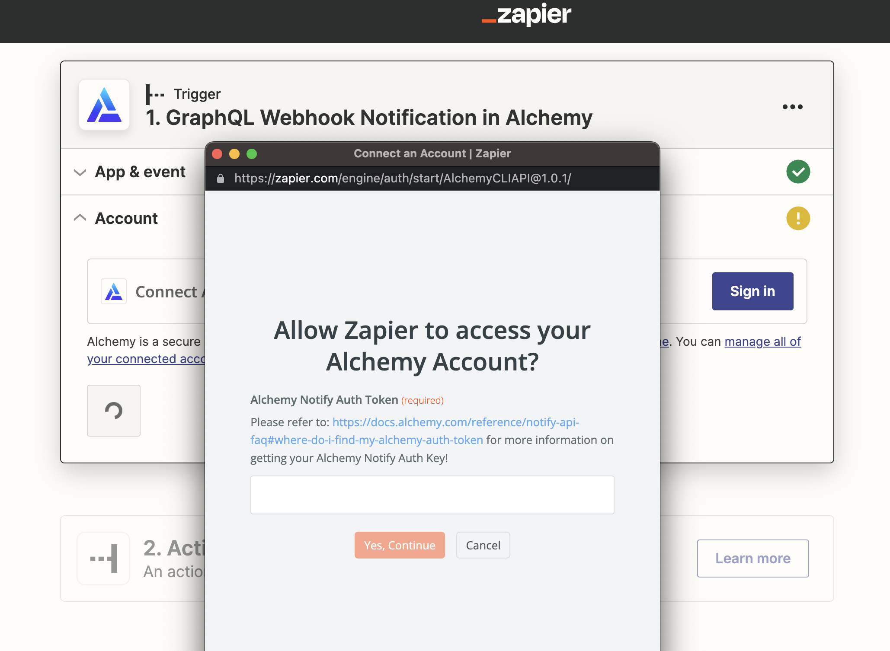

## Overview

1. [What are Alchemy Notify Custom Webhooks?](#what-are-alchemy-notify-custom-webhooks)
2. [What are the two different applications webhooks connect?](#what-are-the-two-different-applications-webhooks-connect)
3. [Which Alchemy webhook does this tutorial use?](#which-alchemy-webhook-does-this-tutorial-use)
4. [Required Tools](#required-tools)
5. [4 Steps to Integrate Custom Webhooks into Zapier](#4-steps-to-integrate-custom-webhooks-into-zapier)

## What are Alchemy Notify Custom Webhooks?

**Alchemy Webhooks enable Web3 developers to receive notifications when events are triggered on Alchemy-supported blockchains.** While previous Alchemy Notify solutions covered only pre-defined, transfers-based events, with Custom Webhooks, developers can now understand any contract-based event, from token and marketplace activity, to comprehensive data ingestion. Custom Webhooks utilize a GraphQL interface so that web3 devs can also have rich filters and only receive the precise blockchain data they need.

Custom Webhooks opens the floodgates for the types of blockchain data developers now have access to, allowing for an unbounded set of data ingestion and notification use cases. Whether you're looking to monitor smart contract activity or stream full blocks of data in real-time, Custom Webhooks can support it!

## What are the two different applications that webhooks connect?

**The two applications that webhooks connect are sender and receiver applications.**

The “sender” application subscribes to events and sends data to the webhook URL of the “receiver” application. The receiver application then takes actions based on the received data.

The data, or the webhook response, is a JSON object that contains information inside it. Without using Zapier, the response will just be a response, and users won't actually see anything or be notified. With Zapier, Alchemy webhook responses can integrate with applications (e.g. Gmail) to perform an action (e.g. sending email).

Connecting webhook responses to a service like Zapier can help complete the communication loop and create a more useful product for developers and users.

## Which Alchemy webhook does this tutorial use?

In this tutorial, we will be setting up Alchemy’s **Custom Webhook** (one of the fives types of [Alchemy Webhooks](https://docs.alchemy.com/alchemy/enhanced-apis/notify-api/using-notify)) and will be passing full block receipts (alongside associated transactions & log/events) to Zapier. This allows our Zapier integration to have full access to the blockchain data stream and to allow devs to filter down data from within Zapier's platform.

In this tutorial, we will only use a single value, the latest block number, from the Custom Webhook notifications. We will then integrate it into **Zapier** for us to receive real-time DMs whenever a new block is produced. This example can be easily adapted for more complex use cases as well! Keep your 👀 peeled for more complex templates soon!

## Required Tools

There aren’t many developer tools required for this tutorial. You just have to have the accounts for the different platforms we will be using:

1. [An Alchemy account](https://dashboard.alchemyapi.io/signup/?a=c3e69d5930) to leverage Alchemy's Custom Webhooks
2. A Zapier account
3. A Slack account (or any other destination that Zapier supports!)

## 4 Steps to Integrate Custom Webhooks into Zapier

To integrate Alchemy with Zapier so that users can receive email notifications for sending and receiving ETH, use these seven steps:

1. [Create a Zap with the Alchemy Trigger](#create-a-zap-with-the-alchemy-trigger)
2. \[Sign Into Alchemy From Zapier] (#sign-into-alchemy-from-zapier)
3. \[Test Your Alchemy Trigger] (#test-your-alchemy-trigger)
4. \[Define and Create your Zapier Action] (#define-and-create-your-zapier-action)

Let’s get started!

### Create a Zap with the Alchemy Trigger

First, [create your Zapier account](https://zapier.com/https://zapier.com/sign-up) or log into your account if you already have a Zapier account.

Next, in the dashboard, click “Create Zap” in the top left corner. When prompted to select a **Trigger**, simply search for "Alchemy" in the search bar and select it.

Zapier user interface for searching up integration partners.

After navigating within the Alchemy trigger, select "GraphQL Webhook Notification" and continue. You will then be prompted to connect your Zapier integration with your actual Alchemy account. Before clicking "Sign in", make sure you have your [Notify Auth Token handy](/reference/notify-api-faq#where-do-i-find-my-alchemy-auth-token)! If you have that already, skip steps 2 and 3.

#### Sign Into Alchemy From Zapier

If you don’t have one, [create a free Alchemy account](https://dashboard.alchemyapi.io/signup/?a=c3e69d5930).

Once you're fully signed up, head over to the [Alchemy Notify dashboard](https://dashboard.alchemy.com/notify) to grab your Notify Auth Token. This authentication token allows Alchemy's Custom Webhook service to talk with Zapier.

Alchemy dashboard showing where to copy the Auth Token for the Notify API.

Click on the "Auth Token" button and click "copy" to grab your token.

Go back to Zapier now and click the "Sign in" button. You'll be prompted to paste in your Alchemy Notify auth token and click "Yes, Continue" to verify your account.

Zapier auth token verification step.

To get a full block's worth of data (block receipt, transactions & events/logs), fill out the next form as follows! Don't worry about the target address! We won't be using this field in this particular tutorial.

Pre-filled form for Zapier \<> Alchemy trigger.

#### Test Your Alchemy Trigger

Click on the "Test Trigger" button and, if everything is successful, you'll be able to see a sample graphql notification.

Zapier "test trigger" integration step.

### Define and Create your Zapier Action

In this example, we'll be connecting Alchemy to Slack. But you can obviously connect any one of Zapier's hundreds of destinations!

Search and select Slack within the subsequent action card. Pick your preferred Slack notification event and then sign in to Slack from Zapier! This allows Zapier and Slack to communicate with each other.

Once everything is authenticated on the destination side, we can leverage incoming Custom Webhook notifications from Alchemy and then parse/pass on specific fields to display in our Slack DM.

Pre-filled form for Zapier \<> Alchemy action step to receive new block numbers in a Slack DM.

If you're still following along on our specific example, you can simply select a target user and then craft a message that utilizes each new, incoming block number!

Make sure to test your end destination before publishing.

Test Slack destination notification.

Once you're confident that your notification contains the fields you care about, click "Publish Zap"!

If you followed our guide, you'll see a bunch of new block number notifications as follows:

Successful Zapier integration example destination.

<Warning>
  If you followed the simple tutorial we shared here, each incoming webhook results in a task! Make sure to deactivate this example so you don't run out of monthly tasks! Or if you're comfortable using Zapier's filter and code blocks, you can reduce the number of triggered tasks!

  Keep your eyes peeled for more advancedguides/templates to come.
</Warning>

## Final Remarks

Congrats! You have just successfully integrated Alchemy’s Custom Webhook into Zapier, exciting stuff!

We can’t wait to see the amazing projects that this new offering allows you to build. With Zapier, you can do custom parsing and filtering while also selecting from hundreds of end destinations.

Play around with the fields that are parsed into Zapier to create things like whale trackers, smart contract activity aggregators, etc.

And if you do something cool, don’t forget to share it with us on Twitter or reach out on Discord for any questions (or just to say hi)!

Happy hacking! 🎉
