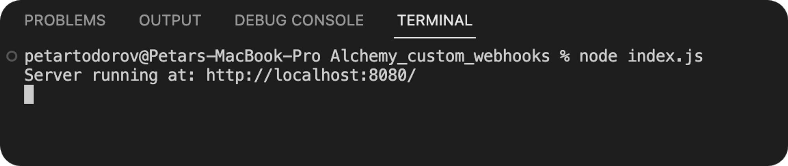
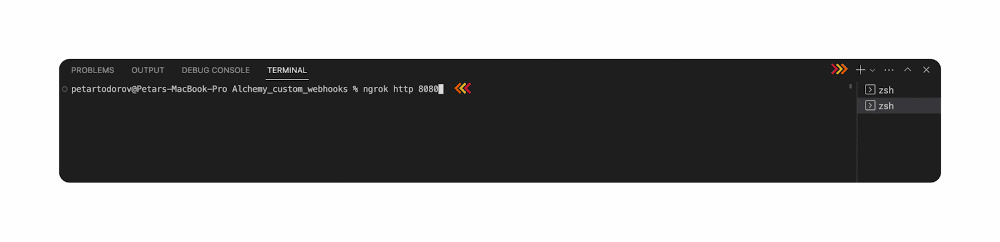
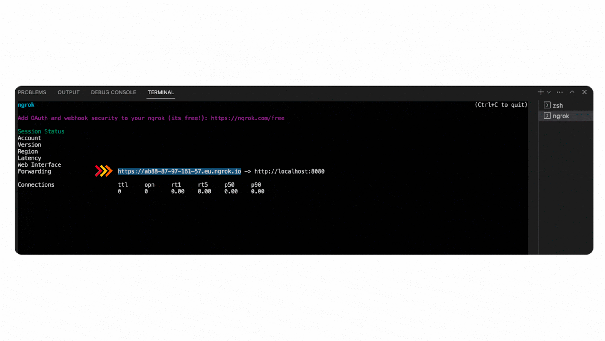
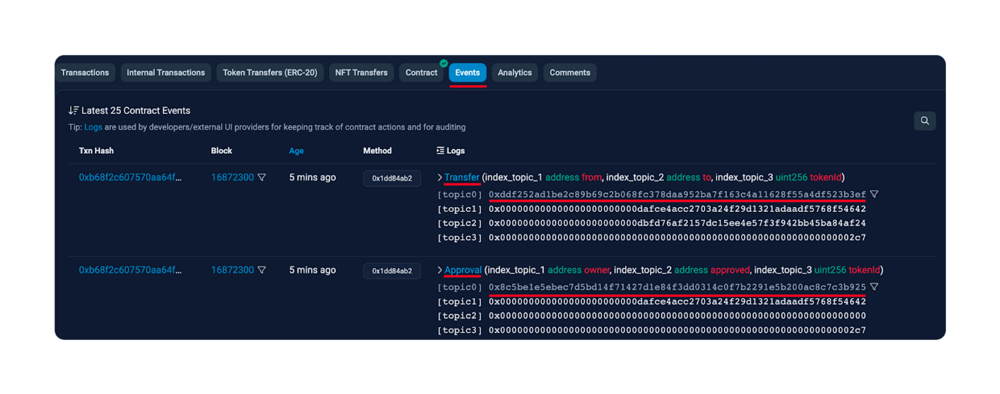
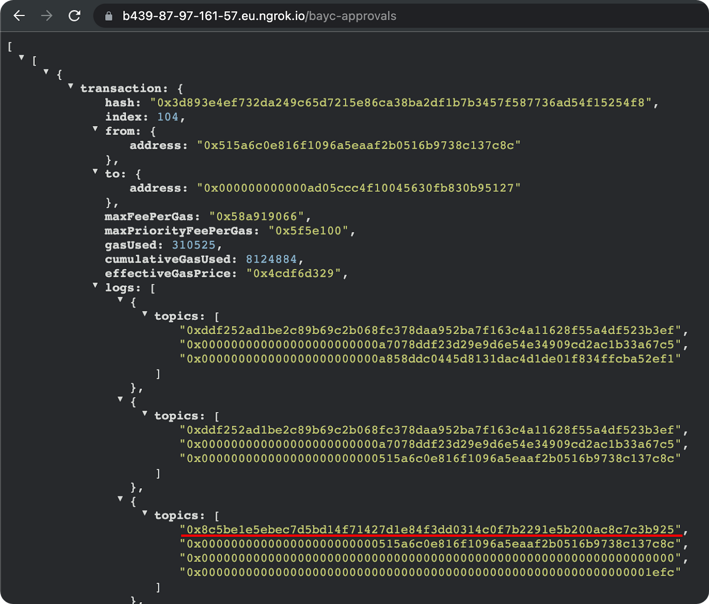
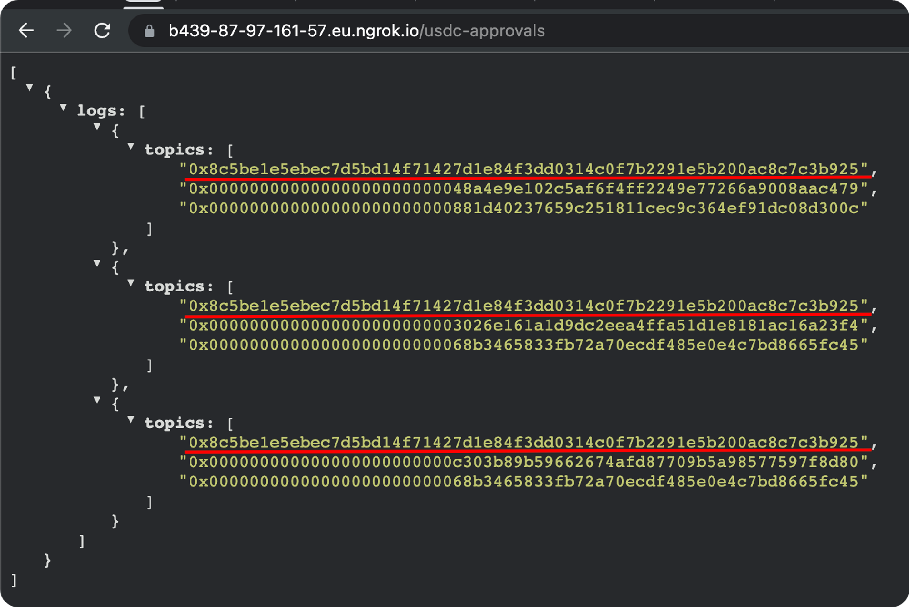
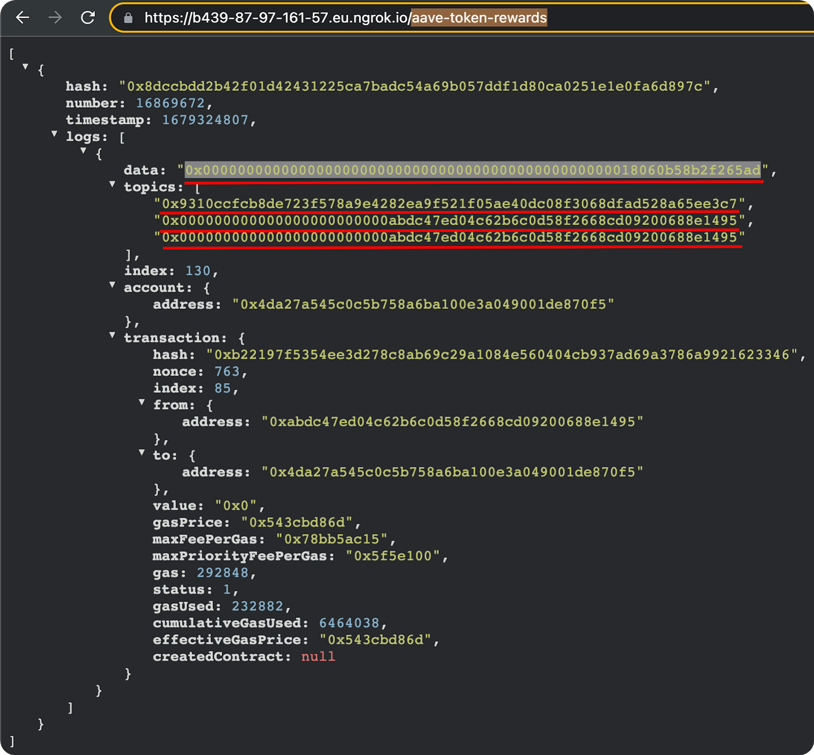

Cryptocurrency token alerts are important because they help investors stay informed about market trends, react quickly to price movements, and customize their investment strategies.

Real-time notifications are instrumental for the success of every decentralized application (dapp) that aims at mass adoption.

With [Alchemy’s Custom Webhooks](https://www.alchemy.com/notify/custom-webhooks), it is easier than ever for developers to customize [webhooks](https://www.alchemy.com/overviews/what-is-a-webhook), which help users stay up-to-date with the latest blockchain activity, especially cryptocurrency movements.

**This article will explain [how to setup a local Express server](#how-to-setup-a-local-express-server-to-receive-custom-webhooks) and share 3 crypto token alert examples:**

1. [How to Implement a Custom Webhook for NFT Token Approval (BAYC)](#how-to-implement-a-custom-webhook-for-nft-token-approval)
2. [How to Implement a Custom Webhook for an ERC-20 Token Approval (USDC)](#how-to-implement-a-custom-webhook-for-an-erc-20-token-approval)
3. [How to Implement a Custom Webhook for a Core Ethereum Protocol (Aave)](#how-to-implement-a-custom-webhook-for-a-core-ethereum-protocol)

## Why do you need crypto token alerts?

Crypto token alerts are crucial in the volatile cryptocurrency market, providing investors with real-time information about price movements and other relevant events.

With alerts, investors can make informed decisions about their investments, react quickly to market changes, and minimize losses. This is [why we built Custom Webhooks](https://alchemy.com/blog/introducing-alchemy-notify-custom-webhooks).

Powered by **GraphQL** and Alchemy’s proprietary Supernode, Custom Webhooks provide instant real-time information about any smart contract deployed on:

* Ethereum
* Polygon
* Optimism
* Arbitrum

## How to Setup a Local Express Server to Receive Custom Webhooks

This tutorial will cover how to create Custom Webhooks for Crypto Token Alerts.

### Prerequisites

The following tools will be required for the demonstration:

* An [Integrated Development Environment](https://www.alchemy.com/best/web3-ides)
* Package Manager (NPM)
* Node.js
* Express.js for server creation
* Ngrok for exposing the localhost server
* An [Alchemy Account](https://www.alchemy.com/)
* An Alchemy Custom Webhook

***

### 1. Configure the Development Environment

Begin by creating a new folder for the project.

Open the folder using VSCode and open a new terminal within it.

To initiate an npm project, enter the following command into the terminal:

`npm init -y`

***

Using the **-y** flag will automatically populate the necessary fields with default values, streamlining the configuration process.

Once the npm project is initialized, install Express by running the following command:

`npm i express`

***

**Ngrok** will also be needed to expose the local Express server and make it accessible by the webhooks.

1. Sign-up for a free Ngrok account.
2. Install Ngrok using [the Ngrok guide](https://dashboard.ngrok.com/get-started/setup). On macOS, run brew install ngrok
3. Connect your Ngrok account by running ngrok authtoken `YOUR_AUTH_TOKEN`

***

### 2. Configure the Express Server

Create an **index.js** file in your project's root directory and add the following code to create an Express server.

The server has separate endpoints for each custom webhook and stores the received information in three arrays in memory:

<CodeGroup>
  ```jsx jsx
  // import express (after npm install express)

  const express = require("express");

  // create new express app and save it as "app"

  const app = express();

  // server configuration

  const PORT = 8080;

  /** Decode JSON data */

  app.use(express.json({ limit: "25mb" }));

  let baycApprovals = [];

  let usdcApprovals = [];

  let aaveRewards = [];

  // create a route for the app

  app.get("/", (req, res) => {

  res.send(

  "Welchome to Alchemy Blockchain Information Fetcher. Access the designated endpoints to retrieve the desired information."

  );

  });

  // create a POST block-info route for the app. Used as a webhook URL

  app.post("/bayc-approvals", (req, res) => {

  const logs = req.body.event.data.block.logs;

  if (logs.length != 0) {

  baycApprovals.push(logs);

  }

  //responding with status 200

  res.send("Success.");

  });

  // create a GET  block-info route for the app

  app.get("/bayc-approvals", (req, res) => {

  res.send(baycApprovals);

  });

  // create a created-contracts. Used as a webhook URL

  app.post("/usdc-approvals", (req, res) => {

  const usdcEvents = req.body.event.data.block;

  usdcApprovals.push(usdcEvents);

  //responding with status 200

  res.send("Success.");

  });

  // create a GET created-contracts route for the app.

  app.get("/usdc-approvals", (req, res) => {

  res.send(usdcApprovals);

  });

  // create a transactions. Used as a webhook URL

  app.post("/aave-token-rewards", (req, res) => {

  const aaveEvents = req.body.event.data.block;

  aaveRewards.push(aaveEvents);

  //responding with status 200

  res.send("Success.");

  });

  // create a GET created-contracts route for the app.

  app.get("/aave-token-rewards", (req, res) => {

  res.send(aaveRewards);

  });

  // make the server listen to requests

  app.listen(PORT, () => {

  console.log(`Server running at: http://localhost:${PORT}/`);

  });
  ```
</CodeGroup>

***

### 3. Start the Webhooks Server

Next, in the terminal, type:

`node index.js`

***

The server should be started at a particular port.



Lastly, open another terminal and start **ngrok** with the following command:

`ngrok http PORT_NUMBER_RETURNED_BY_EXPRESS`

***



Once you have configured and launched your server and environment, the next step is to create an Alchemy Custom Webhook and connect it to the server.

***

## How to Implement a Custom Webhook for NFT Token Approval

### 1. Sign Up for Alchemy

Firstly, head over to [Alchemy](https://www.alchemy.com/), create a free account, and sign in.

***

### 2. Create Webhook Using GraphQL

Next, navigate to the [Notify](https://dashboard.alchemy.com/notify) dashboard.

At the GraphQL section, click **+ Create Webhook.**

The page will redirect to the GraphQL query playground, where the webhook can be fine-tuned to fetch specific data from the blockchain.

<Info>
  For the simplification of the tutorial, webhook verification is not implemented.
</Info>

Always [verify the webhooks](/reference/notify-api-quickstart#find-your-signing-key) that interact with your dapp.

Approval events are emitted when an owner of a Non-Fungible Token (NFT) or ERC-20 token delegates control to another smart contract or wallet to control the designated NFT token ID or ERC-20 token amount.

The addresses of the smart contracts that will be queried can be found via Opensea or Coinmarketcap.

<Info>
  There is also an **NFT Activity** section in the Notify menu.
</Info>

The NFT Activity function will not work for the tutorial because it is pre-programmed to track only transfers of NFT tokens.

By using only **Transfer** events, data is incomplete.

The power of Custom Webhooks resides in its flexible customization options, allowing one to track any event from any smart contract.

Since the block is the main source of Ethereum Virtual Machine (EVM) data, all queries begin with it.

The webhook will return all the transactions in which an **Approval** event is emitted after an `approve()` function call.

After that, it will send the information via a POST request to the Express server.

Both NFT and ERC smart contracts emit an **Approval** event when the `approve()` function is called.

In the GraphQL playground, delete the placeholder code and paste the following:

<CodeGroup>
  ```jsx jsx
  {
    block (hash:"0x3673628d8e04b43299e8e704f873a0ce6c1405cde1e3137ad515d442c9a2143f") {
      logs(filter: {addresses: ["0xBC4CA0EdA7647A8aB7C2061c2E118A18a936f13D"], topics: ["0x8c5be1e5ebec7d5bd14f71427d1e84f3dd0314c0f7b2291e5b200ac8c7c3b925"]}) {
        transaction {
          hash
          index
          from {
            address
          }
          to {
            address
          }
          maxFeePerGas
          maxPriorityFeePerGas
          gasUsed
          cumulativeGasUsed
          effectiveGasPrice
          logs {
            topics
          }
          type
          status
  			}
      }
    }
  }
  ```
</CodeGroup>

***

For more information, read our guide that [explains Ethereum logs](/docs/deep-dive-into-eth_getlogs). Here is the [Etherscan link](https://etherscan.io/address/0xBC4CA0EdA7647A8aB7C2061c2E118A18a936f13D) for the address.

***

### 3. Configure the Webhook URL

Next, configure the webhook URL.

This is the address through which the webhook will submit the queried information to the server.

In the VSCode terminal, used to initialize **ngrok**, find and copy the forwarding link.



In the Alchemy dashboard, paste the forwarding link in the **Webhook URL** input field.

Then append `/bayc-approvals` \*\*\*\*at the end. Now, the URL will point to the specific endpoint in the server, created for this webhook.

Then, click on **Create Webhook** in the lower left corner to finalize the creation process.

The example GraphQL query uses a block hash to fetch the queried transactions from that block.

To listen for the Approval events emitted in each upcoming block, simply remove the **hash** argument from the query.

The logs filter is what customizes the query.

The addresses \*\*\*\*array contains the address of the BAYC collection smart contract, and the topics array contains the event signature hash.

The event signature is a Keccak hash of the event name and input argument types. Argument names are ignored.

The event signature will require hashing and a lookup in the contract’s Application Binary Interface ([ABI](https://www.alchemy.com/overviews/what-is-an-abi-of-a-smart-contract-examples-and-usage)).

A simpler way to find the event signature hashes would be to use [Etherscan’s contract events](https://etherscan.io/address/0xbc4ca0eda7647a8ab7c2061c2e118a18a936f13d#events) subsection.

Its Graphical User Interface (GUI) shows the event name and signature in an easy-to-grasp manner:



Accessing the server at the GET endpoint returns transactions that have emitted an Approval event.

There is one transaction in the queried block that has emitted several events, among which is also an Approval event:



***

## How to Implement a Custom Webhook for an ERC-20 Token Approval

In the context of ERC-20 tokens, approvals are needed for every exchange that happens via decentralized automated market makers like Uniswap.

Before a swap, a user must “approve” (allow) Uniswap to take the tokens and swap them for another token.

### 1. Sign Up with Alchemy

Firstly, head over to Alchemy, create a free account, and sign in.

### 2. Create Webhook using GraphQL

Next, navigate to the [Notify](https://dashboard.alchemy.com/notify) dashboard.

At the GraphQL section, click **+ Create Webhook.**

The page will redirect to the GraphQL query playground, where the webhook can be fine-tuned to fetch specific data from the blockchain.

<Info>
  For the simplification of the tutorial, webhook verification is not implemented.
</Info>

Always [verify the webhooks](/reference/notify-api-quickstart#find-your-signing-key) that interact with your dapp.

Back in the Alchemy Notify dashboard, create a new GraphQL webhook.

Replace the placeholder code with the following:

<CodeGroup>
  ```jsx jsx
  {
    block(hash: "0xaaf4228db65eab92357c124ff8f8f1c5da72a04da660e147157cd4dfd8eb44d6") {
      logs(filter: {addresses: ["0xa0b86991c6218b36c1d19d4a2e9eb0ce3606eb48"], topics: ["0x8c5be1e5ebec7d5bd14f71427d1e84f3dd0314c0f7b2291e5b200ac8c7c3b925"]}) {
        topics
      }
    }
  }
  ```
</CodeGroup>

Here is the [Etherscan link](https://etherscan.io/address/0xa0b86991c6218b36c1d19d4a2e9eb0ce3606eb48) for the address.

***

This query utilizes the same approach as in the first example.

Since the generic Approval events, emitted from ERC-20 and ERC-721 have identical name and arguments, the same event signature hash is passed as a topic in the topics array.

### 3. Configure the Webhook URL

Next, configure the webhook URL.

This is the address through which the webhook will submit the queried information to the server.

In the VSCode terminal, used to initialize **ngrok**, find and copy the forwarding link.

Add `/usdc-approvals` \*\*\*\*at the end.

Click on **Create Webhook** to finalize the process.

To test if the webhook is working, jump over to the local express server:



The webhook has fetched all the approval events emitted by the USDC smart contract in the queried block.

***

## How to Implement a Custom Webhook for a Core Ethereum Protocol

Protocols like [Uniswap](https://www.alchemy.com/dapps/uniswap) and [Aave](https://www.alchemy.com/dapps/aave) are the backbone of DeFi.

Web3 adopters use them on a regular basis to stake and withdraw their accumulated awards.

Implementing a Custom Webhook for this specific niche may add value to the business logic of your dapp.

This tutorial will serve as a guide on how to implement Custom Webhooks to get data on token rewards from Aave.

### 1. Define Event Signature Hash and Contract Addresses

First, Aave’s Staked Aave smart contract address must be sourced.

Based on [Aave official documentation](https://docs.aave.com/developers/v/2.0/protocol-governance/staking-aave), the Aave Staked Aave smart contract address is:

**0x4da27a545c0c5b758a6ba100e3a049001de870f5**

The contract has a `ClaimRewards` function that emits a `RewardsClaimed` \*\*\*\*event each time it is called.

The event has the following structure:

`event RewardsClaimed(address indexed user, address indexed to, uint256 amount);`

***

To produce the event signature hash, the event signature must be defined first:

`RewardsClaimed(address,address,uint256)`

***

A useful online tool that hashes any input via the Keccak256 hashing algorithm is the [Keccak256 Online tool](https://emn178.github.io/online-tools/keccak_256.html).

Open it and paste the event signature in the upper box.

The result should be:

9310ccfcb8de723f578a9e4282ea9f521f05ae40dc08f3068dfad528a65ee3c7

***

Now that the event signature hash and contract addresses are defined, the last step of the process is to create the final webhook via the Alchemy dashboard.

### 2. Sign Up with Alchemy

Firstly, head over to Alchemy, create a free account, and sign in.

### 3. Create Webhook using GraphQL

Next, navigate to the [Notify](https://dashboard.alchemy.com/notify) dashboard.

At the GraphQL section, click + Create Webhook**.**

The page will redirect to the GraphQL query playground, where the webhook can be fine-tuned to fetch specific data from the blockchain.

<Info>
  For the simplification of the tutorial, webhook verification is not implemented.
</Info>

Always verify the webhooks that interact with your dapp.

Replace the placeholder code with the following:

<CodeGroup>
  ```jsx jsx
  {
    block (hash: "0x8dccbdd2b42f01d42431225ca7badc54a69b057ddf1d80ca0251e1e0fa6d897c") {
      hash,
      number,
      timestamp,
      logs(filter: {addresses: ["0x4da27a545c0c5b758a6ba100e3a049001de870f5"], topics: ["0x9310ccfcb8de723f578a9e4282ea9f521f05ae40dc08f3068dfad528a65ee3c7"]}) { 
        data,
        topics,
        index,
        account {
          address
        },
  			transaction {
          hash,
          nonce,
          index,
          from {
            address
          },
          to {
            address
          },
          value,
          gasPrice,
          maxFeePerGas,
          maxPriorityFeePerGas,
          gas,
          status,
          gasUsed,
          cumulativeGasUsed,
          effectiveGasPrice,
          createdContract {
            address
          }
        }
      }
    }
  }
  ```
</CodeGroup>

Here is the [Etherscan link](https://etherscan.io/address/0x4da27a545c0c5b758a6ba100e3a049001de870f5) for the address.

***

### 4. Configure the Webhook URL

Next, configure the webhook URL.

This is the address through which the webhook will submit the queried information to the server.

In the VSCode terminal, used to initialize **ngrok**, find and copy the forwarding link.

Add `/aave-token-rewards` at the end.

Click on **Create Webhook** to finalize the process.

Checking the Express server will return the following information:



The three underlined topics correspond to the event signature hash and the zero-padded addresses `user` and `to`.

Since the **amount** variable in the event is not indexed, it does not have its own topic but can be derived from the transaction’s `data` \*\*\*\*field.

It is zero-padded as well, but if the zeroes are removed, the right-most value remains: **18060b58b2f265ad**

After being converted from hex to a decimal number and the decimal is correctly placed (the Aave token has 18 decimals), the final result is **1.731083582357792173.**

**This means that the user has claimed 1.73 Aave tokens as a reward.**

***

## Get Started Developing with Custom Webhooks

Niche examples like the last one demonstrate the need for Custom Webhooks.

Ordinary webhooks, whose functionality is limited to a set of hardcoded triggers, could never provide the amount of data needed for well-informed research or decision.

With Alchemy’s Custom Webhooks, it is easier than ever to get only the data that a user needs when he needs it.

Developers can start with the many [examples of Custom Webhooks implementations](/reference/custom-webhooks-example)

and [answers to FAQs](/reference/custom-webhooks-faq)
