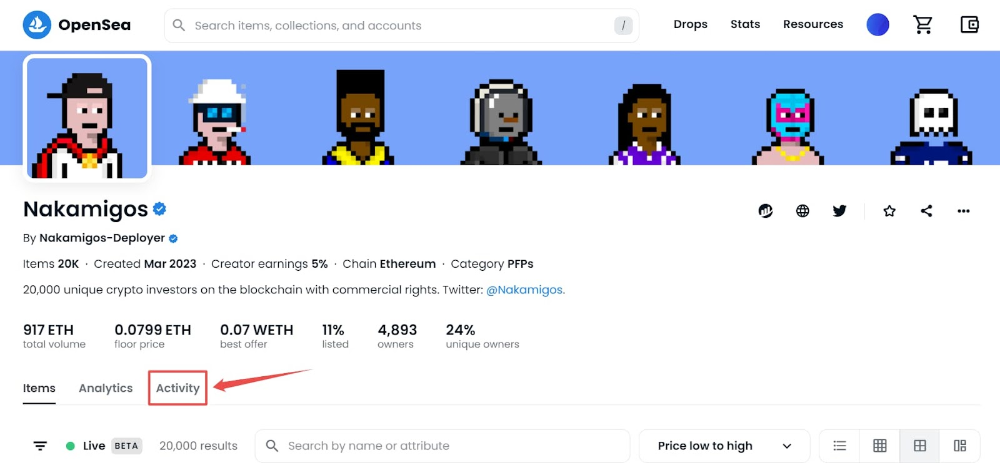

[Custom Webhooks](https://www.alchemy.com/notify/custom-webhooks) are a way to receive real-time notifications from an NFT marketplace whenever specific events happen, such as when a new NFT is listed for sale, when an NFT is sold, or when an NFT auction ends.

Custom Webhooks help NFT users to stay on top of the fast-moving NFT market and to take advantage of new opportunities quickly.

In this article, we will discuss how to use Custom Webhooks for NFT marketplace alerts. We will cover:  the basic steps involved in setting up Custom Webhooks, including how to set up a webhook, configure the webhook integration, and test the webhook integration to ensure it works correctly. Additionally, we will explore the benefits of using Custom Webhooks for NFT marketplace alerts.

If you already understand the basics of NFT marketplace alerts, skip ahead to the guided tutorials:

1. [How to Track NFTs on OpenSea’s Frontend (Manual)](#how-to-manually-track-nfts-on-openseas-nft-marketplace)
2. [How to Automate NFT Marketplace Alerts on OpenSea’s with Custom Webhooks](#how-to-use-alchemys-custom-webhooks-for-nft-marketplace-alerts)

## What are NFT marketplace alerts?

NFT marketplace alerts are notifications that are sent to users when there is activity related to non-fungible tokens (NFTs) on a particular NFT marketplace. These alerts can be in the form of email notifications, mobile app notifications, or browser notifications.

NFTs are unique digital assets that have become incredibly popular. People can buy, sell, and trade NFTs on various [NFT marketplaces](https://www.alchemy.com/best/nft-marketplaces). However, with so much activity happening on these platforms, staying up-to-date with all the new listings, bids, and sales can be hard.

To stay updated with all new listings, you can set up alerts on these marketplaces. These alerts will notify you in real time of the important marketplace events that you’ve indicated you care about.

### Common Types of NFT Marketplace Alerts

Various types of alerts can be set up for NFT marketplaces, including:

### 1. NFT Price Changes

Price change alerts can be beneficial for monitoring the value of your NFT collection or finding opportunities to buy low and sell high. Price change alerts notify you whenever the price of NFT changes.

### 2. NFT Sales

Sale alerts let you know when an NFT has been sold. This can be helpful if you want to keep track of NFT prices or if you want to buy or sell NFTs based on recent sales.

### 3. NFT Bids and Offers

Bid and offer alerts keep you updated whenever someone places a bid or offer on an NFT you're interested in. Bid and offer alerts are handy when you're trying to buy or sell an NFT and want to stay informed about the latest activity.

### 4. New NFT Listings

New listing alerts inform you whenever a new NFT is added to the marketplace. New listing alerts are helpful if you're looking to collect a specific type of NFT or if you want to keep up-to-date with new releases from your favorite creators.

### What are the benefits of using Custom Webhooks for NFT marketplace alerts?

[Custom Webhooks](/reference/custom-webhooks-example) are a useful tool for getting real-time alerts from NFT marketplaces. Some benefits of using Custom Webhooks for real-time NFT marketplace alerts are:

### 1. Faster Alerts

Custom Webhooks can send alerts to dapps or other services in real-time, allowing users to get alerts right away when something changes in the NFT marketplace, like a new NFT being listed or a change in the price of an NFT.

### 2. Automate Tasks

Custom Webhooks can automate tasks for users. For instance, users can set up an automation that places a buy order for an NFT when its price falls below a specific amount. Automating tasks can save users time and effort while ensuring that they don't miss any buying or selling opportunities.

### 3. Integration with Services

Custom Webhooks can integrate with different apps and services, allowing users to receive alerts through various communication channels such as email, Slack, Discord, Telegram, SMS, etc.

Moreover, users can also use Custom Webhooks to integrate with other apps, like accounting or tax software, to simplify their workflow.

## How are Custom Webhooks used for tracking NFT Marketplace Alerts?

While it is possible to utilize built-in NFT marketplace alerts to track changes, this approach can be limiting in terms of the data that users can obtain. As a result, many users may find it necessary to explore alternative methods for obtaining the information they require.

Custom Webhooks for NFT marketplace alerts are a powerful tool that allows users to receive real-time notifications when NFTs on a marketplace are updated or changed.

Webhooks are automated messages sent from a marketplace to a user’s preferred platform or application when certain criteria are met, such as when a new NFT is added to a collection or an NFT is sold.

Users can stay informed about the latest trends and prices in the NFT space by configuring Custom Webhooks, allowing them to make informed decisions about buying, selling, and trading NFTs.

### What is the general method for setting up NFT marketplace alerts?

Follow the steps below to set up NFT marketplace alerts to stay on top of the latest listings, sales, and other important events.

### Step 1: Choose a Marketplace

To start monitoring NFTs, select the marketplace that you prefer. There are many marketplaces to choose from, such as [OpenSea](https://www.alchemy.com/dapps/opensea), Rarible, SuperRare, and others. Each marketplace offers different features and tools, so select one that fits your requirements.

When selecting an NFT marketplace to track, buy, or sell NFTs, it is important to consider key factors such as credibility and reputation. It is advisable to choose a marketplace that is trustworthy and reliable. Additionally, it is important to consider the types of NFTs available, fees, transaction costs, and other pertinent factors.

OpenSea is considered one of the largest NFT marketplaces, offering a wide range of NFTs in various categories such as sports, gaming, art, and more.

### Step 2: Create an Account

After selecting a marketplace, create an account on the marketplace to access features like wishlists, saved searches, and notifications. These marketplaces can help you keep track of the NFTs you're interested in and alert you of updates or changes.

### Step 3: Customize Alerts

Select and customize the alerts you wish to receive, such as new listings, price changes, bids and offers, and sales. You can customize alerts based on your preferences, such as specific NFT types or collections you're interested in. This way, you'll only receive alerts that are relevant to you.

After setting up your alerts, make sure to check them regularly. This way, you'll stay informed about new listings, price changes, bids and offers, and sales.

## How to Manually Track NFTs on OpenSea’s NFT Marketplace

Having gained a foundational understanding of how to generally configure NFT marketplace alerts, we’ll now delve into the process of setting up alerts specifically within the OpenSea NFT marketplace.

To track NFTs on OpenSea, you can follow these steps:

### Step 1. Go to the OpenSea website and log in

Go to the [OpenSea website](https://opensea.io/) and sign in to your account. If you don't have an account, create one.

### Step 2. Click on the Activity tab

Once you're signed in, choose the NFT collection you want to track by clicking on the **Activity** tab.

Click on the Activity tab

### Step 3. Under the Activity tab, click on the item

Scroll down and you will see details about the item such as price, quantity, etc.

List of items

Click on any item. You can track Price History, Listings, and Offers.

An item having the price history, listings, offers, etc.

To track the price of the above NFT, click on the price history to see the current price.

Average price and number of sales changes as the date changes

To track the listings of the above NFT, click on the listings.

The listings of the item show the price, quantity, etc.

To track the offers of the above NFT, click on the offers.

The current offers on the item consist of floor difference, price, etc.

You can filter your NFTs by collection.

Filter the item based on sales, listings, offers, and transfers

If you are interested in tracking a specific NFT, you can search for it using the search bar.

Once you find the NFT you are interested in, you can click on it to see its details.

This includes its contract address, token ID, chai, creator earnings, etc.

Search for the particular item and select it

Click on the item, scroll down, and then click on the details.

Details of the item’s contract address, token ID, etc.

## How to Use Alchemy’s Custom Webhooks for NFT Marketplace Alerts

Alchemy's Custom Webhook allows developers to stream on-chain data and get immediately notified about the most recent blockchain data changes. Custom Webhooks utilize a GraphQL interface so that web3 developers can have rich filters and only receive the precise blockchain data they need.

### Step 1: Sign up for Alchemy

To start with Alchemy’s Custom Webhooks, visit the Alchemy website and [create an account](https://dashboard.alchemy.com/signup/?a=custom-webhooks-for-nft-alerts). This will give you access to the Alchemy Dashboard, which is your starting point.

### Step 2: Choose the NFT Marketplace

Once you have access to the Alchemy Dashboard, the next step is to select the NFT marketplace you want to monitor. Various NFT marketplaces are available, such as OpenSea, Rarible, SuperRare, and others.

### Step 3: Set Up the NFT Monitoring Webhook

Once you have chosen the NFT marketplace of your choice, the next step is to set up the webhook. To do this, you can navigate to the *\[Notify* tab on the Alchemy Dashboard]\([https://www.alchemy.com/notify](https://www.alchemy.com/notify)).

This tab allows you to configure a webhook to receive real-time alerts about blockchain events, including events related to NFT marketplaces.

Notify tab of the Alchemy Dashboard

To proceed, locate and select the "Create Webhook" button found under GraphQL. Once selected, you will be prompted to provide various inputs, including the Chain, Network, and Webhook URL, as shown in the following step.

Click on the Create Webhook button

### Step 4: Test the NFT Marketplace Webhook

Choose the appropriate chain, network, and webhook URL to specify where your requests or alerts will be posted. For this example, the Ethereum Mainnet is being used.

Test the webhook after passing some inputs like addresses

Next, focus your attention on the address field.

Within this field, you will need to input the contract address of the collection you wish to track.

To obtain the contract address, begin by selecting your preferred marketplace. In this example, we will be using OpenSea.

Once selected, navigate to the OpenSea marketplace and choose any of the available collections, as depicted in the accompanying image below.

Select the item on the OpenSea platform

Next, select the Etherscan icon as depicted below.

Doing so will open a new page containing various details related to the collection, such as the contract address, ETH balance, transaction hash, and other pertinent information.

Open this item on the Etherscan

Copy the collection contract address.

Item opened on the Etherscan

Having copied the collection address, proceed to paste it into the designated address field, as illustrated below.

Pass the Webhook URL, addresses

To specify the webhook URL, we will be utilizing the *[webhook.site](https://webhook.site/)*.

Begin by signing up for an account on the website to obtain a unique URL that can be utilized as the webhook URL. This will enable you to receive all necessary updates related to any transactions or alerts.

Copy the unique URL from the webhook site

Retrieve the unique URL provided by the *webhook.site* and proceed to paste it into the designated webhook URL field.

Once all necessary steps have been completed, select the "Test Webhook" button to ensure proper functionality. Afterward, navigate to the *webhook.site* to view the corresponding post requests.

Below is an example of a post request, which includes relevant details such as webhookId, id, transaction hash, and more.

!\[

Post request coming from the Alchemy dashboard]\(f80c994-image.png)

Post request coming from the Alchemy dashboard

### Step 5: Deploy the Webhook

If testing works fine, proceed to click the "Create Webhook" button to activate the webhook. Upon doing so, navigate to the *webhook.site* and observe any relevant requests that are generated when NFT transactions occur.

As illustrated below, the status should indicate that the webhook is currently active, thereby enabling you to receive up-to-date information related to any NFT transactions.

The status of the webhook is Active

You can see that there are multiple post requests for the transaction.

Transaction post requests

If the tracking of a particular collection is no longer desired, there are several options available. One option is to pause the tracking, while another option is to delete the tracking entirely.

