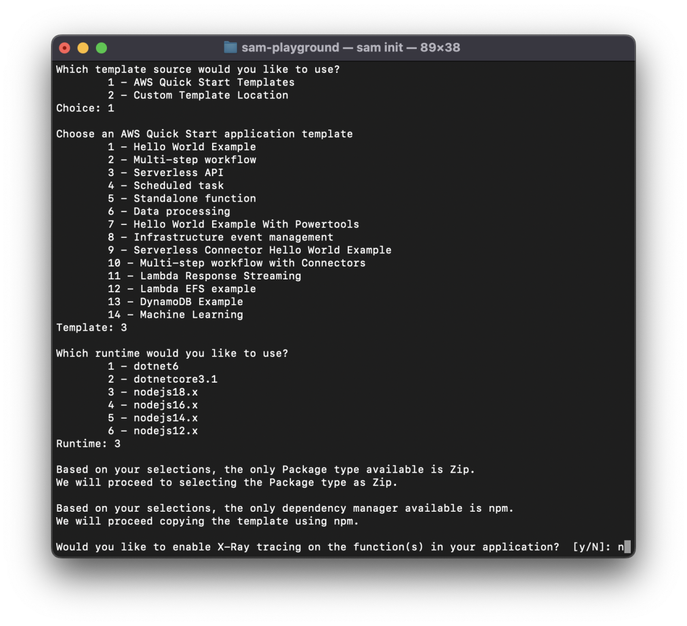
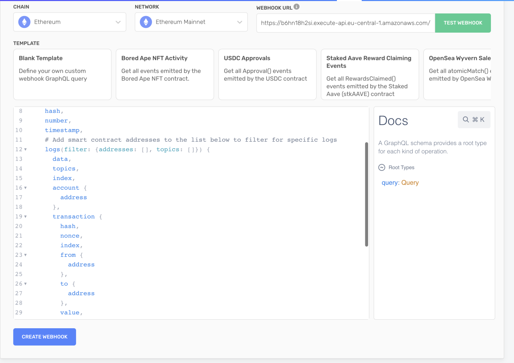

## Introduction

Accessing blockchain data can be computationally heavy, time-consuming, and costly. This can make it difficult for developers and applications to access real-time block information without complex infrastructures or expensive bills.

Fortunately, [Alchemy Custom Webhooks](https://www.alchemy.com/notify/custom-webhooks) can help. They allow you to track any smart contract or marketplace activity, and monitor any contract creation, or any other on-chain interaction in real-time using handy GraphQL queries. This gives developers infinite real-time and historical blockchain data access with precise filter controls.

Custom webhooks enable developers to access blockchain data in real-time using the power of GraphQL filters, Supernode, and single endpoint APIs. These webhooks process the data coming from the blocks and send it to a given API endpoint, supporting POST requests.

Developers can then store blockchain data on any database to power their applications.

In this tutorial, you’re going to learn how to build a serverless API to ingest, store and retrieve real-time blockchain data to power your blockchain dashboards, decentralized exchange, NFT marketplace, or literally any application that might need to fetch blocks data in real-time.


<Info>
  **Serverless**: A cloud computing model where you can focus on writing code for your applications without worrying about server management.

  Companies like AWS, Azure, and Google Cloud offer serverless services, such as AWS Lambda, Azure Functions, and Google Cloud Functions.

  These services automatically manage the server infrastructure, scaling it as needed, so that developers can focus on building and deploying applications quickly and easily. You can read more about serverless infrastructures on the red hat website.
</Info>

You will learn how to use the Alchemy custom webhooks to get real-time blockchain data, AWS lambda functions to power your backend, how to store the data in a Dynamo database, and implement AWS API gateway to create the endpoint we’ll use to store and query the blocks data.

To develop our API, we’ll be using:

* **Alchemy Custom Webhooks** to retrieve real-time blockchain data
  * If you don’t already have an Alchemy account, you can [create one completely for free](https://dashboard.alchemy.com/signup/?a=aws-custom-webhooks).
* **AWS Lambda** to process blockchain data
  * You can learn how to create a new AWS account using their [creating an AWS account guide](https://docs.aws.amazon.com/accounts/latest/reference/manage-acct-creating.html).
* **AWS API Gateway** to manage our API
* **Dynamo DB** to store the received data
* **AWS Cloud formation and SAM** to create our serverless infrastructure in less than 5 minutes.
  * Refer to Amazon's guide to [install or update the latest version of the AWS CLI](https://docs.aws.amazon.com/cli/latest/userguide/getting-started-install.html).

Don’t worry if you don’t recognize any of these names (except Alchemy, shame on you if you don’t know about Alchemy). You’ll learn how every and each of those works in the following sections.

Before, let’s briefly take a look at the prerequisites.

## Prerequisities

To create a serverless blockchain data ingesting architecture in 5 minutes, you’ll need:

* A free Alchemy account
* An AWS Account
* AWS CLI installed and logged in

To verify that AWS has been installed correctly on your device, or if it has already been installed, run the following command in your terminal: `which was`

<CodeGroup>
  ```yaml bash
  which aws
  ```
</CodeGroup>

Once you have finished creating your accounts and installing the AWS CLI, you will be all set to start creating your first serverless blockchain data-ingesting and querying API in just 5 minutes.

To do this, we will use SAM, an application model by AWS that allows you to spin up serverless infrastructure quickly.

Let's see how. 👀\\

## Step 1: Install SAM (AWS Serverless Applications Model)

SAM provides a faster way to spin up serverless applications on AWS by using a Lambda-like execution environment that enables you to locally build, test, and debug your applications. Additionally, it offers templates to quickly create serverless applications.

Using SAM, you can define the application infrastructure you want and model it using YAML with just a few lines per resource. During deployment, SAM automatically transforms and expands the SAM syntax into AWS CloudFormation syntax, allowing you to build serverless applications quickly.

You can learn more about [AWS Cloud Formation on the AWS docs.](https://aws.amazon.com/cloudformation/)

First of all, navigate to [t](https://docs.aws.amazon.com/serverless-application-model/latest/developerguide/install-sam-cli.html)he [SAM installation page](https://docs.aws.amazon.com/serverless-application-model/latest/developerguide/install-sam-cli.html) and select the GUI Package relative to your OS.

In this tutorial, we’ll use Mac OS but everything applies to Windows and Linux as well:

To get started building SAM-based applications, you'll need to install the SAM CLI on your device.

**Follow these steps:**

* Navigate to the [SAM installation page](https://docs.aws.amazon.com/serverless-application-model/latest/developerguide/install-sam-cli.html) and select the GUI package that corresponds to your operating system.
* In this tutorial, we'll use Mac OS, but the process applies to Windows and Linux as well


Once you’ll have installed the package, verify the installation by running the following command in your terminal:

<CodeGroup>
  ```jsx bash
  $ which sam
  /usr/local/bin/sam
  $ sam --version
  SAM CLI, version 1.66.0
  ```
</CodeGroup>

With the SAM CLI installed, it is now time to start creating the different components that will power your serverless blockchain data ingesting and querying API.

Let’s start with setting up a new project.

## Step 2: Create a new serverless application using SAM

Thanks to SAM we can now create a new serverless application!

1. Start the process by running the following command in your terminal: `sam init`

2. SAM will now prompt you with a number of options to select (ie, templates, serverless cloud resources needed, execution environment). Select the following options:

   1. AWS Quick Start Templates, select `1`
   2. Serverless API, select `3`
   3. nodejs18.x, select `3`
   4. Enable [X-Ray tracing](https://aws.amazon.com/xray/), select `n` as we don’t want to incur in any additional fees while following this guide
   5. Enable [Cloud Watch insights](https://aws.amazon.com/cloudwatch/), select `n`
   6. Name your application (name it `alchemy-custom-webhooks-test` to follow along easier)

   **👀 Here’s a view of what your terminal should look like as you go through the steps:**



By selecting the above options, we’re telling SAM to create a new serverless application starting from a template.

More specifically, we are using the “Serverless API” template that contains the specifications to spin up:

1. An API Gateway to access and trigger our Lambda functions
2. Lambda functions that we’ll use to process our data and store it in a DB
3. A dynamo NoSQL DB used to store the data

**Disclaimer:** In this guide, we’ll use DynamoDB, a `NoSQL DB`

After completing the process, SAM will proceed to download the necessary files in a handy project directory.

**👇 Your terminal should now show the following:**


4. Once your terminal looks like the above screenshot, navigate to the newly-created folder by running: `cd alchemy-custom-webhooks-test` and then open the project up in an IDE of your choice, we are using VSCode for which the command is `code .`

**🏗️ This is what you should see in your code editor:**


**Let’s quickly take a look at the files contained in our project folder created by SAM:**

* **`_tests_`**: contains all the tests related to the Lambda functions contained in the `src\` folder
* **`events`**: stores the events used to test the Lambda functions locally
* **`src`**: contains our Lambda functions (3 by default)
* **`buildspec.yml`**: contains the instructions used by CloudFormation to create our resources
* **`env.json`**: contains the environment variables accessible from our lambda functions
* **`package.json`:** contains our Lambda dependencies
* **`samconfig.toml`**: project-level configuration file that stores default parameters for SAM commands
* **`template.yaml`:** SAM template that represents the architecture of your serverless application

<Info>
  Optional: In this tutorial we won’t test our Lambda functions locally, so you can delete the `events` folder.
</Info>

**By default, the project we’ve just created using SAM and the Serverless API template, declares:**

1. Three Lambda functions to `GET` and `POST`items
2. One API gateway with three endpoints triggering the three lambda functions from above
3. One Dynamo DB instance

For our template to work as a blockchain data-ingesting serverless API, we’ll need to modify **two** main things, the `template.yaml` file as well as the Lambda functions.

Let’s do this in the next step!

## Step 3: Modify the `template.yaml` file

The `template.yaml` file is the core of our Cloud Formation instructions that specifies which resources we want to create, how we will create them, and how they will communicate with each other.


<Info>
  For a deep dive into how the template.yaml file works as well as the properties available, [you can take a look at the official documentation](https://docs.aws.amazon.com/serverless-application-model/latest/developerguide/sam-specification-resources-and-properties.html).
</Info>

**To create our serverless blockchain data ingesting and querying API, we will need:**

* One Lambda function that can be used by **Alchemy’s Custom Webhooks** to `POST` the real-time blockchain data and store it on our Dynamo DB
* One Lambda function to `GET` all the blockchain data stored in our DB
* One Lambda function to `GET` the data contained in a specific block queried by hash

SAM has already created almost everything for us.

We’ll keep the same Dynamo DB (will only change the primary key) as well as the API Gateway (will only change the endpoint naming) and the Lambda functions, where we’ll only change some of the code to receive, store, and query the data.

To reflect these changes, we’ll need to modify a couple of things in the `template.yaml` file, let’s see how!

### Modify the Lambda declarations

Let’s modify the Lambda declarations to reflect the changes mentioned above:

1. In the `template.yaml` file, look for the `getAllItemsFunction` and change its name to `getAllBlocksFunction`
2. Then, modify the function’s: `Handler` ,`Description`, and `API` code as showed in the following block:

<CodeGroup>
  ```yaml yaml
  getAllBlocksFunction:
      Type: AWS::Serverless::Function
      Properties:
        Handler: src/handlers/get-all-blocks.getAllBlocksHandler
        Runtime: nodejs18.x
        Architectures:
          - x86_64
        MemorySize: 128
        Timeout: 100
        Description: Http GET request to get all blocks' data stored inside the DynamoDB instance
        Policies:
          # Give Create/Read/Update/Delete Permissions to the SampleTable
          - DynamoDBCrudPolicy:
              TableName: !Ref SampleTable
        Environment:
          Variables:
            # Make table name accessible as environment variable from function code during execution
            SAMPLE_TABLE: !Ref SampleTable
        Events:
          Api:
            Type: Api
            Properties:
              Path: /get-all-blocks
              Method: GET
  ```
</CodeGroup>

With the above changes, we are instructing CloudFormation to assign a new name to our Lambda function, use a different Lambda handler (which we will match with our Lambda filename when modifying the Lambda function in the `src` directory), and change the API endpoint name for improved semantics. 🛠️

3. Next, look for the `getByIdFunction` and change its name to `getBlockByHashFunction`
4. As we did before, update the `Handler`, `Description`, and `API Path` following the code below:

<CodeGroup>
  ```yaml yaml
  getBlockByHashFunction:
      Type: AWS::Serverless::Function
      Properties:
        Handler: src/handlers/get-block-by-hash.getBlockByHashHandler
        Runtime: nodejs18.x
        Architectures:
          - x86_64
        MemorySize: 128
        Timeout: 100
        Description: HTTP get method to retrieve block by hash from the Dynamo DB
        Policies:
          # Give Create/Read/Update/Delete Permissions to the SampleTable
          - DynamoDBCrudPolicy:
              TableName: !Ref SampleTable
        Environment:
          Variables:
            # Make table name accessible as environment variable from function code during execution
            SAMPLE_TABLE: !Ref SampleTable
        Events:
          Api:
            Type: Api
            Properties:
              Path: /get-blocks-by-hash/{hash}
              Method: GET
  ```
</CodeGroup>

5. Now, look to modify the `putItemFunction` and change its name to `storeBlockDataFunction`
6. Then modify the `Handler`, `Description`, and `API Path` following the code below.

<CodeGroup>
  ```yaml yaml
  storeBlockDataFunction:
      Type: AWS::Serverless::Function
      Properties:
        Handler: src/handlers/store-block-data.storeBlockDataHandler
        Runtime: nodejs18.x
        Architectures:
          - x86_64
        MemorySize: 128
        Timeout: 100
        Description: HTTP post method to be called from the Alchemy custom webhooks and store a block to a DynamoDB table.
        Policies:
          # Give Create/Read/Update/Delete Permissions to the SampleTable
          - DynamoDBCrudPolicy:
              TableName: !Ref SampleTable
        Environment:
          Variables:
            # Make table name accessible as environment variable from function code during execution
            SAMPLE_TABLE: !Ref SampleTable
        Events:
          Api:
            Type: Api
            Properties:
              Path: /store-block-data
              Method: POST
  ```
</CodeGroup>

7. Finally, let's modify our DynamoDB instance by changing the `PrimaryKey` name from `id` to `hash`, and the `ReadCapacityUnits` and `WriteCapacityUnits` from `2` to `5` (remember to save your changes):

<CodeGroup>
  ```yaml yaml
  SampleTable:
      Type: AWS::Serverless::SimpleTable
      Properties:
        PrimaryKey:
          Name: hash
          Type: String
        ProvisionedThroughput:
          ReadCapacityUnits: 5
          WriteCapacityUnits: 5
  ```
</CodeGroup>

<Info>
  You can learn more about [ReadCapacityUnits and WriteCapacityUnits on the official AWS docs.](https://docs.aws.amazon.com/amazondynamodb/latest/developerguide/HowItWorks.ReadWriteCapacityMode.html)
</Info>

Compare your [`template.yaml`](https://github.com/alchemyplatform/AWS-serverless-blockchain-data-ingesting-infrastructure/blob/main/template.yaml) file, with the one used in this tutorial, [visiting our Github repo](https://github.com/alchemyplatform/AWS-serverless-blockchain-data-ingesting-infrastructure/blob/main/template.yaml).

With our `template.yaml` file ready, we can modify the Lambda functions to handle blockchain data received from Alchemy’s Custom Webhooks, store it on the DynamoDB instance, and reflect the changes made in the `template.yaml` file.

## Step 4: Modify the Lambda Functions to Store & Retrieve Block Data

The Lambda functions contained in the serverless API template created by SAM already have most of the logic needed to create our blockchain data ingesting infrastructure - sweet!

We will proceed to copy-and-paste the required functions and go through the changes together (feel free to familiarize yourself with the code).


1. Navigate to the `src` folder where the Lambda functions’ code is contained, and rename the files as follows to match the changes in the `Handler` properties inside the `template.yaml` file:

   1. Re-name `get-all-items.mjs` to `get-all-blocks.mjs`
   2. Re-name `get-by-id.mjs` to `get-block-by-hash.mjs`
   3. Re-name `put-item.mjs` to `store-block-data.mjs`

2. Next, open the `get-all-blocks.mjs` file and copy-paste the following code:

<CodeGroup>
  ```jsx javascript
  // Create clients and set shared const values outside of the handler.
  // Create a DocumentClient that represents the query to add an item

  import { DynamoDBClient } from '@aws-sdk/client-dynamodb';
  import { DynamoDBDocumentClient, ScanCommand } from '@aws-sdk/lib-dynamodb';

  const client = new DynamoDBClient({});
  const ddbDocClient = DynamoDBDocumentClient.from(client);

  // Get the DynamoDB table name from environment variables
  const tableName = process.env.SAMPLE_TABLE;

  /**
   * A simple example includes a HTTP get method to get all items from a DynamoDB table.
   */
  export const getAllBlocksHandler = async (event) => {
      if (event.httpMethod !== 'GET') {
          throw new Error(`get all blocks only accept GET method, you tried: ${event.httpMethod}`);
      }
      // All log statements are written to CloudWatch
      console.info('received:', event);

      // get all items from the table (only first 1MB data, you can use `LastEvaluatedKey` to get the rest of data)
      // https://docs.aws.amazon.com/AWSJavaScriptSDK/latest/AWS/DynamoDB/DocumentClient.html#scan-property
      // https://docs.aws.amazon.com/amazondynamodb/latest/APIReference/API_Scan.html
      var params = {
          TableName : tableName
      };

      try {
          const data = await ddbDocClient.send(new ScanCommand(params));
          var items = data.Items;
      } catch (err) {
          console.log("Error", err);
      }

      const response = {
          statusCode: 200,
          body: JSON.stringify(items)
      };

      // All log statements are written to CloudWatch
      console.info(`response from: ${event.path} statusCode: ${response.statusCode} body: ${response.body}`);
      return response;
  }
  ```
</CodeGroup>

The `getAllBlocksHandler` function retrieves all the blocks saved in our DynamoDB SimpleTable.

It begins by creating a `DynamoDBClient` object, which represents the connection to the database.

Next, it creates a `DynamoDBDocumentClient` from the `DynamoDBClient`.

This provides a higher-level abstraction for working with DynamoDB, making it easier to work with the data.

Before retrieving data, the code gets the name of the DynamoDB table from an environment variable called `SAMPLE_TABLE`. This variable is exposed under each lambda declaration in the `template.yaml` file.

<CodeGroup>
  ```yaml YAML
     Environment:
          Variables:
            # Make table name accessible as environment variable from function code during execution
            SAMPLE_TABLE: !Ref SampleTable
  ```
</CodeGroup>

The main function of this code is **`getAllBlocksHandler`**.

This function is executed when the code receives an HTTP GET request.

If the HTTP method is not GET, an error is thrown.

Otherwise, the code retrieves all items from the DynamoDB table using the **`ScanCommand`** object from the **`DynamoDBDocumentClient`**.

The retrieved items are stored in an array called **`items`** and returned as JSON by the function.

Pay attention that the more blocks' data we will store in our DynamoDB, the heavier will be to fetch all of their data all at once. This endpoint and lambda handler shouldn't be used, as is, in a production environment.

**Now let’s move on to the second function, the "get-block-by-hash" handler.**

Copy and paste the following code:

### get-block-by-hash.mjs

<CodeGroup>
  ```jsx javascript
  // Create clients and set shared const values outside of the handler.

  // Create a DocumentClient that represents the query to add an item
  import { DynamoDBClient } from "@aws-sdk/client-dynamodb";
  import { DynamoDBDocumentClient, GetCommand } from "@aws-sdk/lib-dynamodb";
  const client = new DynamoDBClient({});
  const ddbDocClient = DynamoDBDocumentClient.from(client);

  // Get the DynamoDB table name from environment variables
  const tableName = process.env.SAMPLE_TABLE;

  /**
   * A simple example includes a HTTP get method to get one item by id from a DynamoDB table.
   */
  export const getBlockByHashHandler = async (event) => {
    if (event.httpMethod !== "GET") {
      throw new Error(
        `getMethod only accept GET method, you tried: ${event.httpMethod}`
      );
    }
    // All log statements are written to CloudWatch
    console.info("received:", event);

    // Get id from pathParameters from APIGateway because of `/{id}` at template.yaml
    const hash = event.pathParameters.hash;

    // Get the item from the table
    // https://docs.aws.amazon.com/AWSJavaScriptSDK/latest/AWS/DynamoDB/DocumentClient.html#get-property
    var params = {
      TableName: tableName,
      Key: { hash: hash },
    };

    try {
      const data = await ddbDocClient.send(new GetCommand(params));
      var item = data.Item;
    } catch (err) {
      console.log("Error", err);
    }

    const response = {
      statusCode: 200,
      body: JSON.stringify(item),
    };

    // All log statements are written to CloudWatch
    console.info(
      `response from: ${event.path} statusCode: ${response.statusCode} body: ${response.body}`
    );
    return response;
  };
  ```
</CodeGroup>

The `getBlockByHashHandler` function retrieves one item based on its hash value, unlike the `getAllBlocksHandler` function which retrieves all items.

This function creates a new `DynamoClient` and gets the name of the DynamoDB table from an environment variable, as we've seen before.

It is executed when the code receives an HTTP GET request.

If the HTTP method is not GET, it throws an error.

Otherwise, the code retrieves the hash value of the item to retrieve from the `event.pathParameters` object.

The code then uses the `GetCommand` object from the `DynamoDBDocumentClient` to retrieve the item from the DynamoDB table. The retrieved item is stored in a variable called `item`, and a response is returned with a JSON-encoded body containing the item. Finally, the code logs the response and returns it to the caller.

**Now, let's get to the core.**

As we mentioned earlier, the Alchemy custom webhooks require an API endpoint that supports POST requests to send blockchain data as soon as a block is verified.

That's where our `store-block-data` function comes in.

First, copy and paste the code inside the `store-block-data.mjs` file.

Then, we'll take a closer look at what's happening inside the function.

### store-block-data.mjs

<CodeGroup>
  ```jsx javascript
  // Create clients and set shared const values outside of the handler.

  // Create a DocumentClient that represents the query to add an item
  import { DynamoDBClient } from "@aws-sdk/client-dynamodb";
  import { DynamoDBDocumentClient, PutCommand } from "@aws-sdk/lib-dynamodb";
  const client = new DynamoDBClient({});
  const ddbDocClient = DynamoDBDocumentClient.from(client);

  // Get the DynamoDB table name from environment variables
  const tableName = process.env.SAMPLE_TABLE;

  /**
   * A simple example includes a HTTP post method to add one item to a DynamoDB table.
   */
  export const storeBlockDataHandler = async (event) => {
    if (event.httpMethod !== "POST") {
      throw new Error(
        `postMethod only accepts POST method, you tried: ${event.httpMethod} method.`
      );
    }
    // All log statements are written to CloudWatch
    console.info("received:", event);

    // Get hash and data from the body of the request
    const body = JSON.parse(event.body);
    const data = body.event.data.block.logs;
    const hash = body.event.data.block.hash;
    // Creates a new item, or replaces an old item with a new item
    // https://docs.aws.amazon.com/AWSJavaScriptSDK/latest/AWS/DynamoDB/DocumentClient.html#put-property
    var params = {
      TableName: tableName,
      Item: { hash: hash, data: data },
    };

    try {
      const data = await ddbDocClient.send(new PutCommand(params));
      console.log("Success - block added or updated", data);
    } catch (err) {
      console.log("Error", err.stack);
    }

    const response = {
      statusCode: 200,
      message: "success"
    };

    // All log statements are written to CloudWatch
    console.info(
      `response from: ${event.path} statusCode: ${response.statusCode} body: ${response.body}`
    );
    return response;
  };
  ```
</CodeGroup>

Unlike the previous examples, this code is using an HTTP POST request to insert an item in the DynamoDB table.

A POST request enables the API endpoint to receive requests containing data.

In the previous examples, we were GETting data from our database, in this case we want to allow the Alchemy webhook to POST, send, data instead.

To start using DynamoDB, we create once again a **`DynamoDBDocumentClient`**instance and get the name of the table from the environment variable exposed inside the template.yaml file.

The main function of this code is **`storeBlockDataHandler`**.

If the HTTP method is not POST, an error is thrown.

Otherwise, we retrieve the hash of the block and its data from the body object contained in the event payload.

To get access to the “body” object, we need first to parse the event payload from string to JSON.

Once we have access to the body object, we’re able to access the block data and hash and store them in the `data` and `hash` variables.

The code then stores the item in the DynamoDB table using the **`PutCommand`** from the **`DynamoDBDocumentClient`**. The item to be stored is specified in the **`Item`** property of the **`params`** object, which contains the hash value and the data of the item.

After storing the item, the code returns a response with a JSON-encoded body containing the original request body.

Finally, the code logs the response with the data and returns a status of 200, and returns a success message to the caller, the Alchemy custom webhook, to tell the request was succesfull.

This will be the function that will be called through our API endpoint by the Alchemy custom webhook we’ll set up next. The Alchemy webhook will send a POST request to our **/store-block-data** endpoint, with the block’s data in the body. Our function will take care of destructuring the data received and storing it in our DynamoDB table.

Now that we have completed modifying our Lambda functions, it’s time to deploy our Serverless infrastructure on AWS and finally create our Custom webhook using the Alchemy dashboard.

**Let’s see how.**

## Step 5: Deploy the Cloud formation on AWS using SAM

Deploying on AWS using SAM is quite simple. It only requires you to be logged into your AWS CLI. If you haven’t already, you can learn how to set up the AWS CLI [following the official docs](https://docs.aws.amazon.com/cli/latest/userguide/getting-started-install.html).

Once logged in, run the following command in the terminal within your project folder:

<CodeGroup>
  ```jsx jsx
  sam deploy --guided
  ```
</CodeGroup>

This will start the guided SAM deployment process and will prompt you to select between a number of options.

**For the sake of this tutorial, select the following options**:

* Add your stack name “alchemy-custom-webhooks-stack”
* Select the deployment region - us-x-y
* Y - Confirm the changes
* y - Allow SAM CLI IAM role creation
* n - Enable rollback
* y - Approve deploying all the lambda functions even without authorization defined
* y - Save arguments to the configuration file
* Leave the configuration file name to the default
* Leave sam configuration environment to default

Now, wait for the process to finish.

If everything went as expected, you should now be able to see the resources created in your AWS console!

Navigate to your AWS console and login if you haven't already. Then, get the POST API Endpoint to which the Alchemy Custom webhook will send the Blockchain data. Here's how.

## Step 6: Grab the webhook API endpoint

As mentioned, during deployment, SAM handles the spin-up of all the services specified in the **template.yaml** file and ensures their mutual communication.


Navigate to the AWS console and search for the “**API Gateway**” service.


Click on the newly created **API Gateway**:


And navigate to **stages** > **Stage** using the left-hand side menu:


At the top of the page, inside the blue box, you’ll see your API Root URL. This is the root of your API endpoints.

As with any other REST API, the different endpoints we’ve specified using SAM, will be accessible by appending the path to the root API Endpoint, for example:

* https\://.execute-api..amazonaws.com/Stage/**get-all-blocks**
* https\://.execute-api..amazonaws.com/Stage/**get-block-by-hash/\{hash}**
* https\://.execute-api..amazonaws.com/Stage/**store-block-data**

For our custom webhook, we will need to grab the **store-block-data** endpoint (last one), as it’s the POST endpoint we’ve coded to store the received data inside the Dynamo DB instance.

<Info>
  Make sure to not copy-paste the example root+endpoint above. You’ll need to get your endpoint found on the API gateway stages page and append the store-block-data path to it.
</Info>

With our POST endpoint copied, we’re now ready to create our Alchemy custom webhook.

## Step 7: Create a new custom webhook on the Alchemy platform

Creating a custom webhook to feed your database or application with real-time blockchain data, is surprisingly easy.

First, if you haven’t already created an Alchemy account, [make one completely for free](https://dashboard.alchemy.com/signup/?a=aws-custom-webhooks).

Then go to the notify tab and look for the “**GraphQL**” section:


Click on the “**Create webhook**” button to create a new webhook, and select the “**Blank template**”


In the webhook URL input, insert the **/store-block-data** API endpoint with built in the previous section

<CodeGroup>
  ```yaml yaml
  https://YOUR-AMAZONAWS-ENDPOINT/Stage/store-block-data
  ```
</CodeGroup>

This configuration tells Alchemy where to send data every time a new block is validated.

To verify everything is working and that the data is being saved to the DynamoDB, click "**test webhook**".

This will send a test payload to your store-block-data endpoint and trigger the associated lambda function.

Navigate back to the AWS console, search for “**DynamoDB**,” and look for the “**tables**” section in the left-hand menu:


Then click on the **DynamoDB** instance we’ve created before using SAM:


Look for the “**Items summary**” section, and click on “**Get live item count**”:


Then click on the “**Start scan**” button.

If everything worked as expected you should now see the item count number incremented by 1:


<Info>
  The item count property under the “**items summary section**” updates every 6 hours.

  Refer to the item count inside the “Get live item count” popup instead.
</Info>

Amazing!

Now let’s go back on Alchemy.com and click on “**Create webhook**” to start our webhook:



Now every time a new block will be verified, a new POST request will be sent to your **store-block-data** endpoint and saved on your DynamoDB!

Amazing 🎉 

We’re almost done, one last thing before completing the tutorial!

Let’s test our API to make sure everything is working as expected.

## Step 8: Test your blockchain ingestion serverless infrastructure

Now that we have created our custom webhook and plugged it into our serverless API, let’s test the API endpoints to make sure is up and running.

As we did before, navigate to your API gateway on AWS and select our API


On the left hand side resources menu, click on the GET route under the “get-all-blocks” path.

Then click on the test button:


To test your API endpoint, on the route page, click on the blue test button.

This will trigger a call to the API, GET in this case, and populate the “response body” section on the right-hand side, with the blocks data saved on your DynamoDB instance and retrieved through the lambda function we created.


Before leaving the page, grab the hash of one of the blocks in the response body (the value associated with the hash key in the json object), in this case:


```
0xd6155871b482aa1c5a6b53675cb0010e9bd5614bf83fd96629276a5e756c3ef5
```

We’ll use is to test our **get-blocks-by-hash/\{hash}** route.

Navigate to the GET route under **get-blocks-by-hash/\{hash}** and click on the “**Test button**” again.


Paste the hash value copied before in the Path → \{hash} input box, and click on the blue **Test button**:


You’ll see the block data related to the hash id you’ve inserted appearing on the right end side, inside the “Response body” section.

<Info>
  You can also test your GET routes by directly navigating to their endpoints as we saw in section 6.
</Info>

Congratulations!

The Alchemy custom webhook we set up will now send real-time blockchain data to your /store-block-data API endpoint that will then take care of processing and storing your data in the Dynamo instance we’ve created. The GET /get-all-blocks and /get-all-blocks-by-hash endpoints we've created will make your data accessible querying it from the database.

In this tutorial, we have created a serverless architecture for ingesting blockchain data using AWS and Alchemy.

We have walked through creating a DynamoDB table, creating Lambda functions to retrieve and store data in the table, and creating a webhook on the Alchemy platform to send data to our Lambda functions.

We have also explored how to use SAM to deploy our serverless infrastructure on AWS and how to test our API endpoints to ensure everything is functioning as expected.

Now that you’ve learned a ton, hopefully, of new technologies, and have a fully-fledged real-time blockchain data ingesting and querying API, what can you build with them?

Let us give you some inspiration 💡

## What’s next?

With access to so much data, the possibility to build on top of what you’ve learned in this tutorial is endless.

First, try to experiment with the Custom Webhooks GraphQL queries, and learn how to keep track of events and transactions from specific contracts, collections or wallets.

Then, definitely try to build a dashboard to keep track of a wallet movement, or NFT Collection market analytics!

Or why not, a platform that keeps track of crypto prices across multiple pools?

**Again, the possibilities are endless!**

But what if this is your first web3-ish tutorial and you want to kickstart your career?

Well, if you’re new to web3 development and want to go deeper into:

* Solidity
* Smart contracts
* How the blockchain works
* Join a community of more than 50.000 web3 developers

And kickstart your web3 career - take a look at the [7-weeks Ethereum bootcamp on Alchemy University.](https://www.notion.so/d1f5cb5933cb482587047c0d1c7fd73f)

If you’re here to build your web3 portfolio - we built a 10 weeks program for you to follow where you will [build 10 web3 projects from scratch, along with guides and video tutorials](https://docs.alchemy.com/alchemy/road-to-web3/weekly-learning-challenges)

Last, join us on [Alchemy Learn](https://twitter.com/AlchemyLearn) and [Alchemy Platform](https://twitter.com/AlchemyPlatform), to stay updated on the latest from Alchemy!

And once again, congratulations on completing this tutorial, you did amazing 🎉
