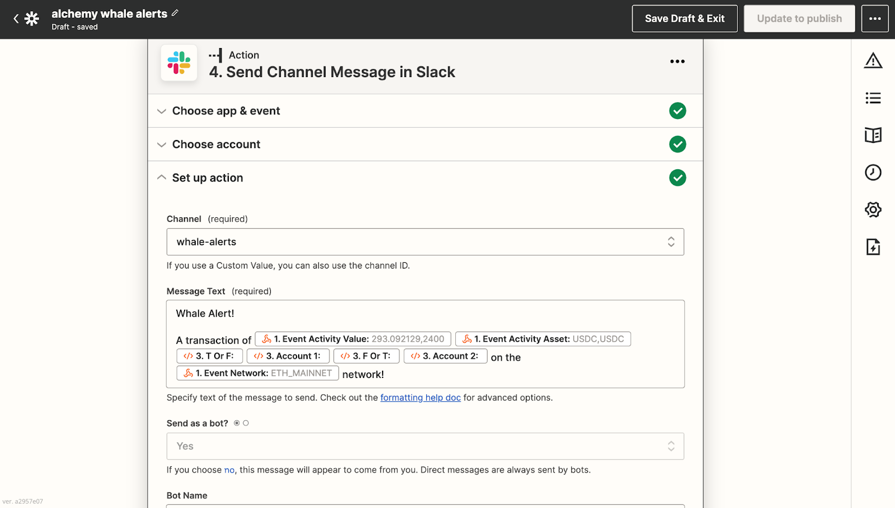

Whales are individuals, DAOs, or companies that hold a large amount of cryptocurrency in their digital asset wallets, which gives them outsized influence on the market, especially when they hold large amounts of unlocked tokens in small market cap projects.

Tracking their on-chain (and not only off-chain, publicly available data) activity across different networks-Ethereum, but Arbitrum, Optimism, or Polygon-can also create unique insights you can share in your Slack workspace.

### What is a Slack whale alert?

Slack whale alerts are custom notifications (alerts) published to Slack channels that display information about the on-chain transaction involving the whale's cryptocurrency wallet, such as sending and receiving tokens.

### What are the use cases for a Slack whale alert?

Because Slack is a team communications tool primarily used in corporate settings, the primary use case for developing a Slack bot for whale alerts is to help companies acquire more information about their customers, prospective customers, or parties that influence their business.

**For example, Slack whale alerts might help web3 startups:**

* Monitor the inflows and outflows of crypto funds.
* Track the wallet activity of clients to see the projects they are investing in and using.
* Identify alpha stemming from on-chain relationships between known entities.

There are multiple reasons why blockchain startups and web3 companies using Slack might want to build a bot that tracks wallet activity across Ethereum, Arbitrum, Optimism, and Polygon.

## How to Develop a Slack Whale Alert Bot

This tutorial will detail how to build a whale alert bot for Slack that tracks Ethereum addresses.

These are the three tools you'll need:

1. [Alchemy Notify API](https://alchemy.com/notify?a=1b6f6f9e40) - webhook URLs for Ethereum, Arbitrum, Optimism, or Polygon.
2. [Zapier Integrations](https://docs.alchemy.com/alchemy/enhanced-apis/notify-api/integrate-alchemy-zapier) - a means to connect Alchemy webhooks and 3rd party applications (e.g., Slack).
3. Slack - a workspace to receive on-chain event data and share it with users in a Slack channel.

[Using Alchemy’s webhooks](https://docs.alchemy.com/alchemy/enhanced-apis/notify-api/using-notify#address-activity) and Zapier to publish Slack messages for custom events that occur on blockchain networks (such as Ethereum, Optimism, Arbitrum, and Polygon) takes eight steps.

### 1. Create a new account for Alchemy and Zapier

First, we'll set up our integrations and webhooks in Zapier and Alchemy.

To start, create your new accounts:

* A [free Alchemy Account](https://alchemy.com/?a=1b6f6f9e40).
* A [free Zapier account](https://zapier.com/sign-up).

If you already have login credentials, sign in and skip to the next step.

### 2. Create a Zap and a webhook URL

From the Zapier dashboard, create a new webhook automation:

1. Click **Create Zap** in the top left corner.
2. Go to **Trigger**.
3. Search for then select **Webhooks by Zapier**.
4. Select **Catch Hook** as the **Trigger Event**.
5. Click **Continue** in the **Set up trigger** section.
6. Copy and save the **Custom Webhook URL**.

<Info>
  Zapier's **Catch Hook** trigger event will be used to receive data from tracked events using Alchemy webhooks.
</Info>

.png")

### 3. Create an Ethereum webhook with Alchemy

Create the address activity webhook to track the event data sent to Zapier. If you don't have one, [sign up for a free Alchemy developer account](https://alchemy.com/?a=1b6f6f9e40).

There are two ways to configure an Alchemy webhook:

* Manually with Alchemy’s [**Notify** tab within the Alchemy dashboard](https://dashboard.alchemyapi.io/notify)
* Programmatically with Alchemy’s Notify API (recommended for tracking 10+ addresses).

#### Manually create a webhook from the dashboard

1. From the **Ethereum + L2** ecosystem, click the **Notify** tab.

2. Click the **+ Create Webhook** button in the **Address Activity** section.

3. Fill in these fields to create the webhook:

   * Select **Chain** to be **Ethereum**
   * Select **Network** to be **Mainnet**
   * Paste the Zapier webhook URL you created and saved earlier in this tutorial.

4. Paste the wallet address you want to monitor. If you have less than 10 addresses, select the **Add Addresses** button to add them.
   * For this tutorial, we're whalestats.com and chose "BlueWhale0144", an address with over 2.1 million ETH tokens in their wallet. The address is `0xda9dfa130df4de4673b89022ee50ff26f6ea73cf`.

<Info>
  To test whether the Alchemy webhook successfully sends requests to Zapier's webhook URL before confirming the creation, click **Test Webhook** next to the webhook URL. Or, if you have already created the webhook and want to test again, click on the three-dot menu next to your webhook and select **Send Test Notification**. Return to Zapier and continue to the “Test trigger” section by clicking “Test trigger.
</Info>

To finish your configuration, Return to Zapier and continue to the **Test trigger** section by clicking **Test trigger**. The configuration is complete if you see a **We found a request** notification!

#### Programmatically create a webhook using the Notify API

If your webhook is tracking more than 10 addresses, create a webhook using the Notify API.

First, copy your Alchemy authentication token (`X-Alchemy-Token`) from the Notify dashboard by the **AUTH TOKEN** button.

.png")

Alchemy Notify dashboard for creating new webhooks on the Ethereum + L2 ecosystem.

Second, go to your command line and make the following curl request:

<CodeGroup>
  ```shell shell
  curl https://dashboard.alchemyapi.io/api/create-webhook \
   -X POST \
   -H "X-Alchemy-Token":"<your-X-Alchemy-Token>" \
   -d '{"network":"ETH_GOERLI","webhook_type":"ADDRESS_ACTIVITY","webhook_url":"<your-Zapier-Webhook-URL>", "addresses":["<your-Ethereum-Address>"]}'
  ```
</CodeGroup>

Replace the script's placeholders with your Ethereum webhook's information:

* `<your-X-Alchemy-Token>` with your Alchemy auth token.
* `<your-Zapier-Webhook-URL>` with your Zapier webhook URL.
* `<your-Ethereum-Address>` with the wallet address(es) you want to monitor (e.g., the BlueWhale0144 wallet address).

<Info>
  You can add as many Ethereum addresses as you’d like to track their transfer events
</Info>

Refresh your Alchemy web app and you should see the new address activity webhook in the **Notify** dashboard.

For more API calls to do things like adding, removing, or updating webhook addresses, please see the [Notify API documentation](https://docs.alchemy.com/alchemy/enhanced-apis/notify-api#network).

### 4. Parse the Ethereum webhook response in Zapier

Now, parse the webhook response from Alchemy to create a Zapier action that sends a Slack alert with a human-readable message whenever the tracked wallet address sends a transaction.

1. On the Zappier application, under the **Action** section, select **Filter.**
2. In **Filter setup & testing**, only continue if the **Event Activity From Address** text exactly matches our whale's Ethereum address: `0xda9dfa130df4de4673b89022ee50ff26f6ea73cf`.
3. If you don't want to use a webhook value, you can search for `fromAddress`.

<Info>
  If you click **Continue** and find that **Your Zap** **would not have continued**, don't worry! The test notification was not sent from the whale wallet, so this message is expected.
</Info>

.png")

Zapier automation interface for continuing an event if the event matches the whale wallet address.

### 5. Create a Slack account or log in

Log in to (or Create) the [Slack](https://slack.com/) account and workspace where you want the whale alert bot to publish messages if you already have an account. Then, create a new workspace.

We named our "Whale Alerts," but feel free to use a more creative name.

### 6. Handle whale alerts for sending tokens

First, we want to send a message if our whale is the sender of a transfer event.

1. Click **+** at the bottom.
2. Search for and select **Slack** in the new **Action** section.
3. For the **Action Event**, choose **Send Channel Message**.
4. Click **Continue**, then sign in to your Slack account.
5. Make sure you are connected to the correct workspace in the top right corner.
6. Select the channel you want the whale alerts to be sent to (e.g., "whale-alerts" in our case).

Next, fill out the fields to send your message in the **Set up action** section.

In the message text, you can get creative and choose what fields and values you want to send. We chose these fields:

* Event Activity Value
* Event Activity Asset
* Event Activity to Address
* Event Activity Network

.png")

Message text for the Twitter whale alert bot that pulls parsed information from Alchemy's Ethereum webhook.

You can leave everything else on the default option. A sample Slack message might read:

> Whale Alert! A transaction of 1000 ETH was sent to `0xda9dfa130df4de4673b89022ee50ff26f6ea73cf` on the Ethereum network

To finalize your Slack configuration:

1. Click **Continue.**
2. Click **Test and continue**. If no errors pop up, your Slack whale alert bot works! A message should be published in your #whale-alert channel.
3. Publish the Zap.

Now, whenever the whale sends a transaction, your Slack bot will share the transaction details in your indicated Slack channel.

### 7. Handle whale alerts for receiving tokens

To publish Slack messages when the whale wallet receives tokens in a transaction:

1. Edit the **Continue only if** action
2. Click on **Filter Setup & Testing** and press the **+ or** button.
3. Fill in **Event Activity To Address** (or search for `fromAddress`.
4. Ensure the text matches our whale Ethereum address.

Now our Zap will fire when the whale's wallet receives tokens.

### 8. Create a “Code by Zapier” action with Javascript

As a final step, create a **Code by Zapier** action between the **Only continue if…** and **Send Channel Message in Slack** actions.

You can choose either "Run Python" or "Run Javascript." We chose **Run Javascript**, but the logic works similarly for Python. After clicking **Continue**, set up your input data under **Set up action** as follows:

.png")

Set up action with the fromAddress and toAddress labeling in Zapier.

We sift through the webhook response a second time for receiving tokens because the existing Slack message only gets published when the Whale wallet sends tokens.

In the code block, paste the following code:

<CodeGroup>
  ```javascript javascript
  // Since JavaScript is case-sensitive, we will be comparing addresses in upper case const address = "Whale-Wallet-Address".toUpperCase(); 
  // Define Account 1 (the whale wallet) 
  let account_1 = ""; 
  // Define Account 2 (the user whale wallet is sending to / receiving from)
  let account_2 = ""; 
  // Define to use "to" or "from" in message 
  let t_or_f = ""; 
  let f_or_t = ""; 
  if (inputData.fromAddress.toUpperCase() == address) { 
       // If Whale is sending, then it is the fromAddress 
       account_1 = inputData.fromAddress; 
       account_2 = inputData.toAddress; 
       t_or_f = "from";
       f_or_t = "to"; 
  } else if (inputData.toAddress.toUpperCase() == address) { 
       // If Whale is receiving, then it is the toAddress 
       account_1 = inputData.toAddress; 
       account_2 = inputData.fromAddress; 
       t_or_f = "to"; 
       f_or_t = "from"; 
  } 
  // Output the fields to be used in Slack 
  output = [{account_1: account_1, account_2: account_2, t_or_f: t_or_f, f_or_t: f_or_t}];
  ```
</CodeGroup>

<Info>
  Remember to replace Whale-Wallet-Address with the whale wallet address. When testing the action, don't worry if it doesn't assign anything to the output variables.
</Info>

Lastly, go to the **Send Channel Message in Slack action** and click on the **Set up action** section.

Replace the generic fields from the webhook response in the message text with the dynamic outputs from the JavaScript code, which are customized depending on whether the tracked wallet sent or received tokens:



An example Slack message that uses the webhook response to customize the text of a whale wallet receiving tokens.

Click **Continue** and test your action. Then publish!

Congrats! You just successfully created a Slack whale alert bot!
