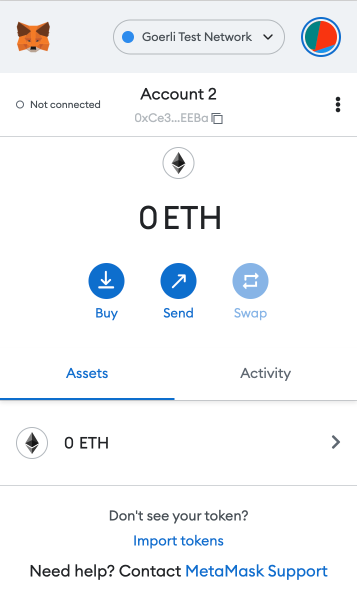
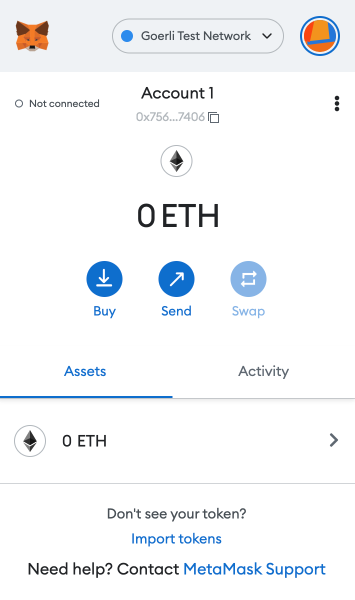
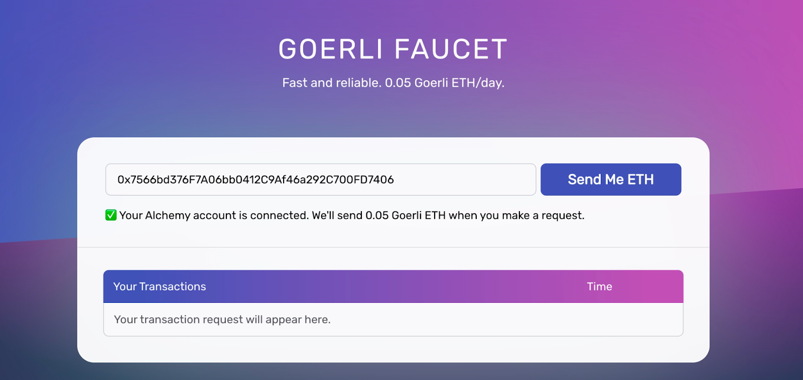
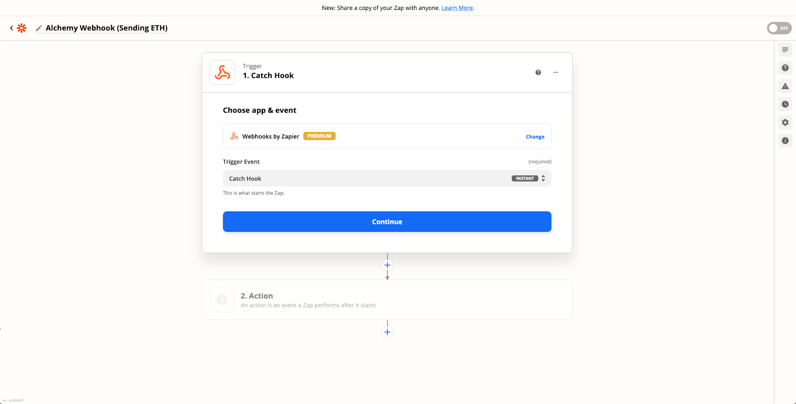
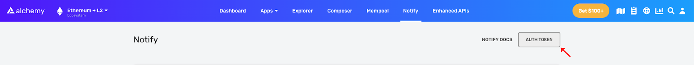
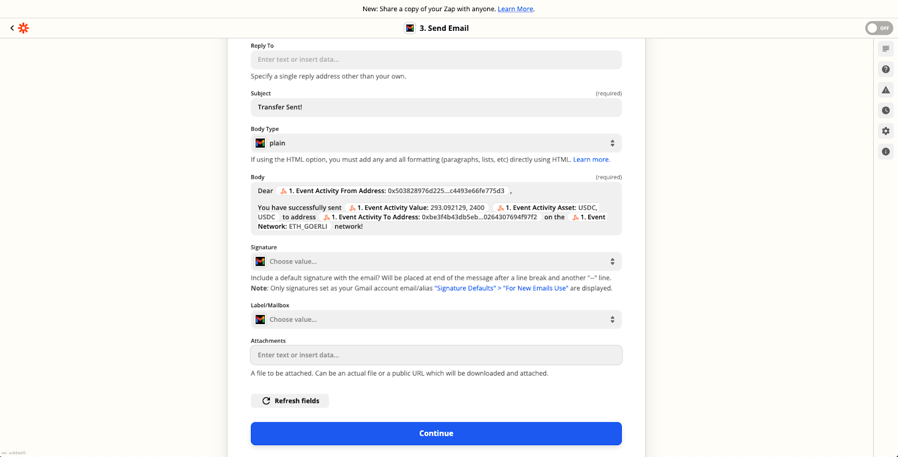
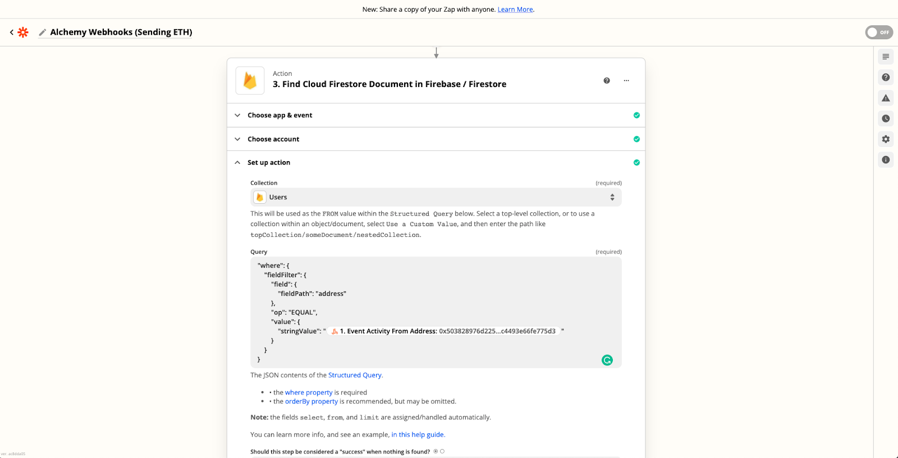
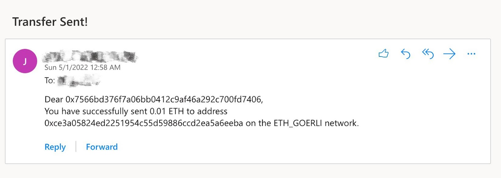
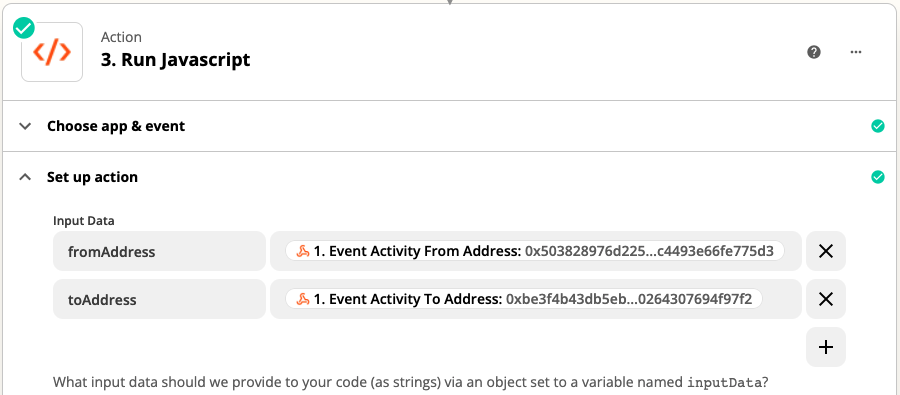
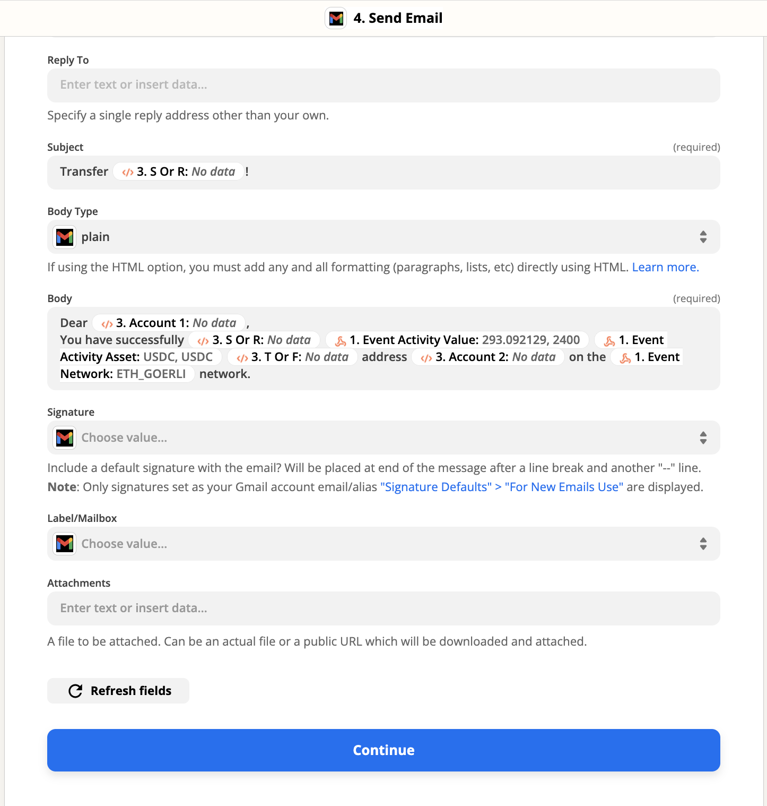

## Overview

1. [What are Alchemy webhooks?](#what-are-alchemy-webhooks)
2. [What are the two different applications webhooks connect?](#what-are-the-two-different-applications-webhooks-connect)
3. [Which Alchemy webhook does this tutorial use?](#which-alchemy-webhook-does-this-tutorial-use)
4. [Required Tools](#required-tools)
5. [9 steps to integrate Alchemy webhooks into Zapier](#7-steps-to-integrate-alchemy-webhooks-into-zapier)

## What are Alchemy Webhooks?

**Alchemy Webhooks enable Web3 developers to receive notifications when predetermined events are triggered on Alchemy-supported blockchains.**

Webhooks are efficient and friendly tools for Web3 developers in comparison to continuously polling nodes to check if a particular state has changed

Alchemy webhooks have a lot of potential to improve the user experience and drive the engagement of Web3 applications and services, such as tracking NFT sales in a discord channel or sending wallet activity to a slack channel

## What are the two different applications that webhooks connect?

**The two applications that webhooks connect are sender and receiver applications.**

The “sender” application subscribes to events and sends data to the webhook URL of the “receiver” application. The receiver application then takes actions based on the received data.

The data, or the webhook response, is a JSON object that contains information inside it. Without using Zapier, the response will just be a response, and users won't actually see anything or be notified. With Zapier, Alchemy webhook responses can integrate with applications (e.g. Gmail) to perform an action (e.g. sending email).

Connecting webhook responses to a service like Zapier can help complete the communication loop and create a more useful product for developers and users.

## Which Alchemy webhook does this tutorial use?

In this tutorial, we will be setting up Alchemy’s **address activity webhook** (one of the four types of [Alchemy Webhooks](https://docs.alchemy.com/alchemy/enhanced-apis/notify-api/using-notify)), which tracks all ETH and token transfer events for an Ethereum address.

We will then integrate it into **Zapier** for us to receive real-time email updates whenever our Ethereum address successfully sends or receives tokens.

We will use the virtual crypto wallet **Metamask** to initiate the transfer events between two accounts, and we will operate on the Goerli testnet to avoid spending real ETH.

You can also [choose another testnet](https://docs.alchemy.com/alchemy/guides/choosing-a-network) for this tutorial, but we recommend using Goerli as all other testnets on Ethereum are expected to be deprecated after [the Merge](https://www.alchemy.com/overviews/the-ethereum-merge).

## Required Tools

There aren’t many developer tools required for this tutorial. You just have to have the accounts for the different platforms we will be using:

1. [An Alchemy account](https://dashboard.alchemyapi.io/signup/?a=c3e69d5930) (and [Notify API ](https://docs.alchemy.com/alchemy/enhanced-apis/notify-api#network)from Alchemy’s Enhanced API Product, but not required)
2. Two Ethereum addresses (Metamask recommended)
3. A Zapier account

## 9 steps to integrate Alchemy webhooks into Zapier

To integrate Alchemy with Zapier so that users can receive email notifications for sending and receiving ETH, use these seven steps:

1. [Set up Metamask](#set-up-metamask-and-add-eth-from-alchemys-goerli-faucet)
2. [Add ETH from Alchemy’s Goerli faucet](#set-up-metamask-and-add-eth-from-alchemys-goerli-faucet)
3. [Create a Zap and a webhook URL](#create-a-zap-and-a-webhook-url)
4. [Create an Alchemy webhook](#create-an-alchemy-webhook-notify)
5. [Parse webhook response in Zapier](#parse-webhook-response-and-create-an-action)
6. [Send an email with Zapier's Gmail action](#6.-send-email-with-zapiers-gmail-action)
7. [Test sending ETH with Metamask](#test-sending-eth-with-metamask)
8. [Write some code to handle receiving ETH as well!](#write-some-code-to-handle-receiving-eth-as-well)
9. [Test receiving ETH with Metamask](#test-receiving-eth-with-metamask)

Let’s get started!

### 1. Set up Metamask

[Download and install Metamask](https://metamask.io/download/) as an extension in your browser for free.

Then, in your wallet, create two accounts to simulate sending and receiving transactions.

For the sake of clarity, “our” Ethereum address will be Account 1, meaning that we will only track the transfer events for Account 1.

Account 1 will be linked to our email, and we will receive email updates whenever Account 1 sends ETH to or receives ETH from Account 2.

Make sure to switch over to the “Goerli Test Network” in the “Networks” dropdown on top so we are dealing with fake ETH.

 

<Info>
  If the dropdown doesn’t initially display test networks, click on your profile picture on the upper right corner and go to “Settings > Advanced” and scroll down to turn on “Show test networks.”
</Info>

### 2. Add ETH from Alchemy’s Goerli faucet

Next, we will need some fake ETH to make transactions. To get your ETH, go to [Alchemy’s Goerli faucet](https://goerlifaucet.com/), which provides you with free tokens on the Goerli testnet for development purposes.

Make sure to [create a free Alchemy account](https://dashboard.alchemyapi.io/signup/?a=c3e69d5930) so that you can get 5X as much Goerli ETH!

Enter the public address of Account 1 and click “Send Me ETH.”

You should see 0.05 ETH (or 0.01 ETH if you are not logged in) added to the account soon after.



Alchemy's Goerli Faucet user interface where developers can get Goerli ETH to test smart contracts on the Goerli testnet.

### 3. Create a Zap and a webhook URL

First, [create your Zapier account](https://zapier.com/https://zapier.com/sign-up) or log into your account if you already have a Zapier account.

Next, in the dashboard, click “Create Zap” in the top left corner.

We will first handle sending emails to users whenever they successfully send some ETH to another account, but notifying users when they received ETH will be similar (and covered below).

We will now create the webhook URL for sending the webhook response from Alchemy to Zapier.

Under “Trigger,” search and select “Webhooks by Zapier” as the app event/trigger.

For the “Trigger Event,” select “Catch Hook” since Zapier is waiting for Alchemy’s address activity webhook to send the event data to the URL whenever a transfer occurs.

Click “Continue” to the “Set up trigger” section and copy the “Custom Webhook URL.”



Zapier user interface for creating a "Catch Hook" trigger to use with Alchemy's Notify API.

### 4. Create an Alchemy Webhook

Now, we need to create the address activity webhook to track transfer events and send that data off to the Zapier webhook URL. If you don’t have one, [create a free Alchemy account](https://dashboard.alchemyapi.io/signup/?a=c3e69d5930).

We will show two ways that you can set up the webhook, first from Alchemy’s [Notify tab](https://dashboard.alchemyapi.io/notify) within the dashboard, and second programmatically by using [Notify API Endpoints](/reference/notify-api-endpoints) (recommended for dealing with address activity webhooks for 10+ addresses).

#### Create a Webhook from the Dashboard

Make sure you are in the “Ethereum + L2” ecosystem on the upper left of the Alchemy dashboard.

Navigate to the Notify tab and click “+ Create Webhook” button in the “Address Activity” section.

Next, fill in these fields to create the webhook:

* Select “Chain” to be “Ethereum,”
* Select “Network” to be “Goerli,”

Then, paste in the webhook URL you copied from Zapier in the last step as well as your Account 1 address in Metamask.

.png")

Alchemy's dashboard for creating a new webhook for tracking address activity on the Goerli testnet.

<Info>
  If you want to test if the Alchemy webhook successfully sends requests to Zapier’s webhook URL before confirming the creation, click on “Test Webhook” next to the webhook URL. Or if you have already created the webhook but want to test again, click on the three dots by your webhook and select “Send Test Notification.”
</Info>

Go back to Zapier and continue to the “Test trigger” section, and click “Test trigger.”

If you see a “We found a request” message, congratulations - the setup is complete.

#### Create a webhook using Notify API

Creating a webhook using the [Notify API Endpoints](/reference/notify-api-endpoints)is recommended if your webhook is tracking the transfer events for 10 or more Ethereum addresses.

To get started, copy your Alchemy authentication token (`X-Alchemy-Token`) from the upper right corner of your Notify dashboard under the “AUTH TOKEN” button.



Alchemy dashboard showing where to copy the Auth Token for the Notify API.

Then, navigate to your command line and type:

<CodeGroup>
  ```curl curl
  curl https://dashboard.alchemyapi.io/api/create-webhook \
  -X POST \
  -H "X-Alchemy-Token":"your-X-Alchemy-Token" \
  -d '{"network":"ETH_GOERLI","webhook_type":"ADDRESS_ACTIVITY","webhook_url":"your-Zapier-Webhook-URL", "addresses":["your-Ethereum-Address"]}'
  ```
</CodeGroup>

Remember to use your own `your-X-Alchemy-Token`, `your-Zapier-Webhook-URL` and `your-Ethereum-Address` (aka, Account 1), and you can add as many Ethereum addresses as you’d like to track their transfer events.

After refreshing, you should see the newly created address activity webhook appear in your Notify dashboard with all your specified parameters.

For more API calls to do things like adding, removing, or updating webhook addresses, please see the [Notify API Endpoints](/reference/notify-api-endpoints).

### 5. Parse webhook response in Zapier

Given the webhook response from Alchemy, we need to parse it in Zapier to create an action that sends us an email whenever our address successfully sends a transaction.

First, let’s take a look at an example response:

<CodeGroup>
  ```json json
  {
    "webhookId": "wh_octjglnywaupz6th",
    "id": "whevt_ogrc5v64myey69ux",
    "createdAt": "2022-02-28T17:48:53.306Z",
    "type": "ADDRESS_ACTIVITY",
    "event": {
      "network": "MATIC_MAINNET",
      "activity": [
        {
          "category": "token",
          "fromAddress": "0x59479de9d374bdbcba6c791e5d036591976fe422",
          "toAddress": "0x59479de9d374bdbcba6c791e5d036591976fe425",
          "erc721TokenId": "0x1",
          "rawContract": {
            "rawValue": "0x",
            "address": "0x93C46aA4DdfD0413d95D0eF3c478982997cE9861"
          },
          "log": {
            "removed": false,
            "address": "0x93C46aA4DdfD0413d95D0eF3c478982997cE9861",
            "data": "0x",
            "topics": [
              "0xddf252ad1be2c89b69c2b068fc378daa952ba7f163c4a11628f55a4df523b3ef",
              "0x00000000000000000000000059479de9d374bdbcba6c791e5d036591976fe422",
              "0x00000000000000000000000059479de9d374bdbcba6c791e5d036591976fe425",
              "0x0000000000000000000000000000000000000000000000000000000000000001"
            ]
          }
        }
      ]
    }
  }
  ```
</CodeGroup>

Without getting into the weeds, this will be a useful reference when we use the value of each field to construct our email. We will only use a few for this tutorial, but feel free to check out [Notify API Quickstart](/reference/notify-api-quickstart) for address activity on what each field represents in more detail!

Because we are handling sending ETH first, we need to check if the `fromAddress` (the account initiating the transfer) in each response matches the address of Account 1.

To do so\*\*:\*\*

1. Under the “Action” section, select the “Filter” option on the right-hand side
2. In “Filter setup & testing,” we want to continue if the “Event Activity From Address” (or you can simply search for “`fromAddress`”) “(Text) Exactly matches” our Account 1 Ethereum address (paste it into the last text field).

If you click “Continue” and find that “Your Zap would not have continued,” don’t worry! The test notification was not sent from our Account 1 in Metamask so this message is expected.

.png")

Zapier interface for continuing the automated action if the text matches the fromAddress.

### 6. Send Email with Zapier's Gmail Action

Next, we want to send the email to the recipient if the sender of the transfer event is Account 1.

1. Click “+” at the bottom, then search for and select “Gmail” in the new “Action” section.
2. For the “Action Event,” choose “Send Email.”
3. After clicking “Continue,” this will prompt you to sign in to your Gmail account.

Lastly, we will need to fill out the fields to send our email in the “Set up action” section.

For the “To” field, you can enter your own email address.

For the “Subject” (required), you can put something like “Transfer Sent!”

Where we are really going to take advantage of the webhook response is in the “Body,” where we can parse the fields to display the details of the transfer in the email.

By searching for the fields in “Insert Data…” dropdown, I used these values of these fields to construct my email, but feel free to customize it to your liking:



Send Email action interface on Zapier where developers can add the address activity to the email body copy.

After clicking “Continue” and testing the action, you should soon after receive an email containing your specified message!

<Info>
  The webhook response alone does not provide you with the email address of the owner of the `fromAddress`. So, if you are managing many users with different emails and want to automate this process, you may want to ask your users for both their Ethereum address and email address when they sign up for this service.
</Info>

You can then store them in a database like Google Firestore (or an IPFS-based distributed database for decentralization, but Zapier doesn’t currently seem to support this).

Then, using the “Firebase / Firestore” app in Zapier, you can run a query to find the email address associated with the `fromAddress` in the webhook response and use that as your “To” field in the Gmail app action.



Zapier action for finding a document in Firebase or Firestore.

### 7. Test sending ETH with Metamask

Now, let’s turn on our Zap and see this project in action.

1. First, go to Account 1 in Metamask and click the “Send” button in the middle.
2. For “Send to,” choose “Transfer between my accounts” and select Account 2 as the recipient.
3. After specifying an amount and confirming the gas fee, click on “Confirm”!

Again, make sure you are on the “Goerli Test Network” while doing this (since our Alchemy webhook tracks transfers on the Goerli testnet).

After a while, you should see an email in your inbox that looks something like this:



Automated email sent using Zapier and Alchemy webhooks that notify receivers of new Ethereum address activity.

You can also view the run details of your Zap on the “Zap History” page in the Zapier dashboard.

Double-check your two accounts in Metamask to see if the transfer has successfully been sent and received, and see if the accounts in the email body match the sender (Account 1) and receiver (Account 2).

### 8. Write code to handle receiving ETH

We are not quite done yet with this project, as we still need to send emails whenever Account 1 receives some ETH from another account.

To do so, we will add on to our current Zap but specifically for the `toAddress` field.

This actually requires some coding since based on whether Account 1 sends or receives ETH, the subject and body of the email will have to change accordingly.

So, let’s create a “Code by Zapier” action between our “Only continue if…” and “Send Email in Gmail” actions.

You can choose either “Run Python” or “Run Javascript,” we will choose the latter but the logic works the same for Python.

After clicking “Continue,” we will set up our input data under “Set up action” as follows:



Zapier interface for running javascript.

We are parsing through the webhook response again because our current email subject and body are only written for when Account 1 sends ETH. Therefore, we need to customize them for when Account 1 receives ETH.

In the code block, paste in the following code (read the comments to see what each line means):

<CodeGroup>
  ```javascript javascript
  // Since JavaScript is case-sensitive, we will be comparing addresses in upper case
  const address = "your-Account-1-Address".toUpperCase();
  // Define Account 1 (the user we are sending email to)
  let account_1 = "";
  // Define Account 2 (the user Account 1 is sending to/receiving from)
  let account_2 = "";
  // Define if to use "sent" or "received" in email subject/body
  let s_or_r = "";
  // Define if to use "to" or "from" in email body
  let t_or_f = "";
  if (inputData.fromAddress.toUpperCase() === address) {
    // If Account 1 is sending, then it is the fromAddress
    account_1 = inputData.fromAddress;
    account_2 = inputData.toAddress;
    s_or_r = "sent";
    t_or_f = "to";
  } else if (inputData.toAddress.toUpperCase() === address) {
    // If Account 1 is receiving, then it is the toAddress
    account_1 = inputData.toAddress;
    account_2 = inputData.fromAddress;
    s_or_r = "received";
    t_or_f = "from";
  }
  // Output the fields to be used in email
  output = [{account_1: account_1, account_2: account_2, s_or_r: s_or_r, t_or_f: t_or_f}];
  ```
</CodeGroup>

Again, remember to replace `your-Account-1-Address` with the public address of your Account 1 in Metamask. And when testing the action, don’t worry if it doesn’t assign anything to the output variables - this is because we are not using our real Metamask account yet.

Lastly, go to the “Send Email in Gmail” action and click on the “Set up action” section.

We will now replace the generic fields from the webhook response in the email subject and body with the more dynamic outputs from our Javascript code, which are customized depending on whether Account 1 sent or received ETH:



Zapier interfaces with email fields that have been replaced by a webhook response.

Click “Continue” and test your action.

One thing to look out for is that since editing a Zap will automatically turn it off, make sure you turn it back on before our final testing step.

<Info>
  In Metamask, you can technically send some ETH from an account to itself, which we did not account for in our JavaScript code since it is redundant for the sake of this project. But you can definitely try to add it into the code’s logic yourself!
</Info>

### 9. Test receiving ETH with Metamask

We will now test if we get an email when Account 1 receives ETH from another account.

Since we have sent a little bit of ETH from Account 1 to Account 2 in our “Test sending ETH with Metamask” step, you should have some amount of ETH in Account 2.

If not, simply send some from Account 1 or use the Goerli faucet for Account 2.

Next, similar to how we sent ETH before, send some ETH from Account 2 to Account 1 and wait for the transaction to go through.

You should receive an email soon after that looks something like this:

.jpg")

An automated email message sent after a tracked wallet address received ETH.

Again, check if the grammar is correct in the email subject and body and if the accounts match the sender and receiver.

Once you have done so, you now have a fully functioning connection between the Alchemy webhook and Zapier that sends email notifications to you whenever a transfer on Goerli is detected for your Metamask account!

## Final Remarks

Congrats! You have just successfully integrated Alchemy’s webhook into Zapier, exciting stuff!

We can’t wait to see the amazing projects you are going to build with Alchemy webhooks!

And if you do, don’t forget to share it with us on Twitter or reach out on Discord for any questions (or just to say hi)!

Happy hacking! 🎉

{
