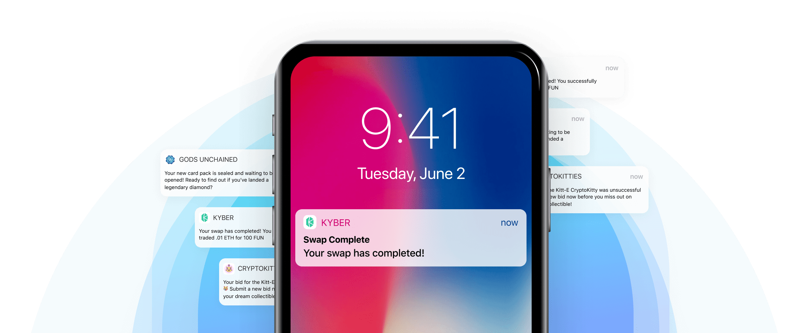
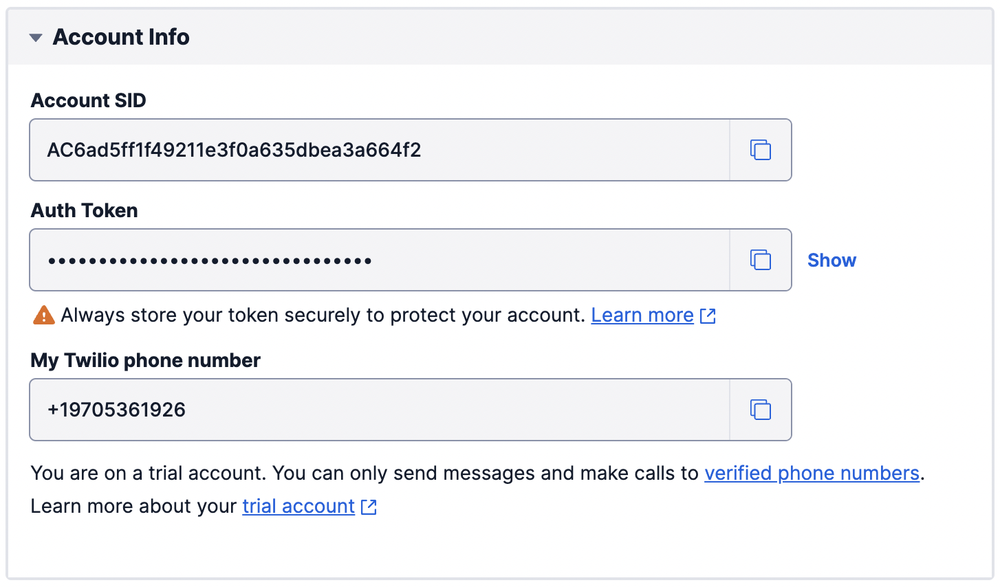
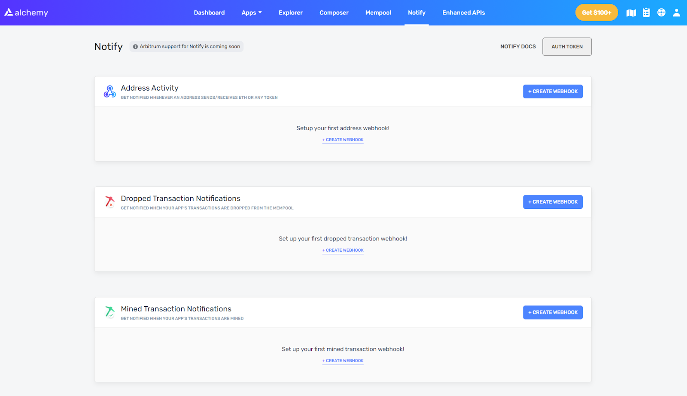
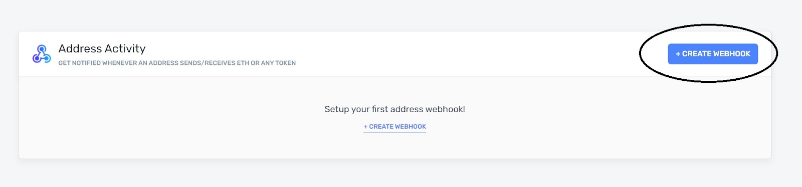
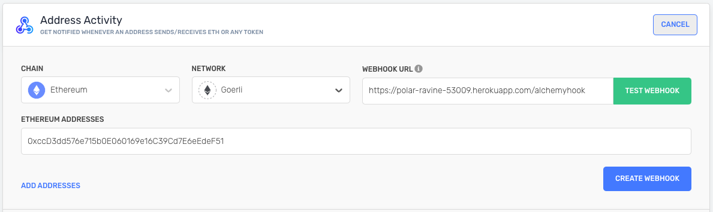

Ethereum blockchain does not natively support Notifications. For a user, that means every time your transaction gets submitted or completed, there's no way for you to stay updated on its progress other than constantly refreshing your app or [etherscan](https://etherscan.io/). For a dApp, that means a bad User Experience (UX).



dapp notifications example

Using [Alchemy Notify](https://www.alchemy.com/notify) and Alchemy's [pending transaction WebSocket](../../enhanced-apis/subscription-api-websockets/#alchemy_pendingtransactions), dApps can monitor activity and send real-time push notifications to their users. This leads to a much better UX and in today's market, can even be your competitive advantage.

In this tutorial, we will show you how to send SMS notifications for any activity throughout the lifecycle of a transaction.

## Overview

1. [High-level walkthrough of the example project](#our-example)

2. [Build the project using Heroku](#option-1-build-heroku-serviced-project)

   1. [Clone Github Repo, Set-Up Heroku, Set-Up Twilio](#a-clone-the-existing-github-repository)
   2. [Alchemy Notify API & Register Webhook Notifications](#2-alchemy-notify-api--register-webhook-notifications)
      * Create a [free Alchemy account](https://alchemy.com/?r=affiliate:ba2189be-b27d-4ce9-9d52-78ce131fdc2d)
   3. [Subscribe to pending transactions](#3-using-alchemy_pendingtransactions-to-track-pending-transactions)
   4. [Configure SMS notifications](#4-configure-sms-notifications)
   5. [Deploy Heroku App!](#5-deploy-heroku-app)

3. [Build the project from scratch](#option-2-build-project-from-scratch)

   1. [Set-Up Heroku, Set-Up Twilio](#1-2-complete-steps-1-2-from-the-heroku-project)
   2. [Alchemy Notify API & Register Webhook Notifications](/reference/notify-api-quickstart)
      * Create a [free Alchemy account](https://alchemy.com/?r=affiliate:ba2189be-b27d-4ce9-9d52-78ce131fdc2d)
   3. [Create WebSocket connection](#3-create-websocket-connection)
   4. [Create Webhook connection](#4-create-webhook-connection)
   5. [Deploy your app!](#5-deploy-app)

4. [Test your Integration](#test-your-integration-)

5. [Conclusion](#conclusion)

## Our Example

For this example, we’ll be creating a notification system that

* automatically detects a user's address activity
* sends an SMS on the phone whenever a pending transaction has been made from their address
* sends an SMS on the phone once that transaction has been mined

The code mainly consists of the below scripts

* a script that uses [Alchemy WebSockets](/reference/subscription-api) to detect pending transactions
* a script that uses [Alchemy Notify API](https://docs.alchemy.com/alchemy/enhanced-apis/notify-api) to detect mined transactions

<Info>
  For Dev and Testing purposes, you can use an Ethereum Testnet, like Goerli, which saves you from spending any real ETH ⛽!

  For access to free Goerli ETH, use the [Alchemy Goerli faucet](https://goerlifaucet.com/).
</Info>

#### Pending transactions notification workflow

<Info>
  This code for this is in the file `sniffer.py`
</Info>

1. User initiates a transaction on MetaMask
2. Pending transaction is picked up by Alchemy
3. WebSocket script receives pending transaction
4. Script sends SMS notification

#### Mined transactions notification workflow

<Info>
  The code for this is in the file `app.py`
</Info>

1. A pending transaction initiated by the user has been made and is confirmed by a miner
2. Alchemy Notify API picks up the mined transaction
3. WebHook (Alchemy notify) endpoint is notified of the transaction
4. Script sends SMS notification

We’ll go through two versions of the tutorial: the first by cloning the Github Repo using Heroku and the second by doing it all from scratch.

## Option 1: Build Heroku-Serviced Project

### 1. Set Up GitHub Repo & Heroku

#### a) Clone the existing [Github Repository](https://github.com/alchemyplatform/Transaction-Lifecycle-via-SMS)

Navigate to your command line and type:

<CodeGroup>
  ```shell shell
  git clone https://github.com/alchemyplatform/Transaction-Lifecycle-via-SMS.git
  cd Transaction-Lifecycle-via-SMS
  ```
</CodeGroup>

#### b) Install Heroku-CLI and verify/install dependencies

In this tutorial, we use Heroku for hosting a server and website. If you want to use another provider, see [Option 2: Build Project From Scratch](#option-2-build-project-from-scratch)

1. Download the right [Heroku-CLI](https://devcenter.heroku.com/articles/heroku-cli#download-and-install) based on your OS and configuration

.png")

[https://devcenter.heroku.com/articles/heroku-cli#download-and-install](https://devcenter.heroku.com/articles/heroku-cli#download-and-install)

2\. In the folder that you just git cloned, run the below command

<CodeGroup>
  ```shell shell
  heroku login
  ```
</CodeGroup>

Follow the commands to login into your Heroku account. If you don't have a Heroku account, you can [sign up for one](https://www.heroku.com) for free!

3\. Let's confirm that you have downloaded the correct version of Node. In your command line run:

<CodeGroup>
  ```shell shell
  node --version
  ```
</CodeGroup>

Note that Heroku requires a Node version of greater than 10. If you don’t have it or have an older version, [install a more recent version of Node](https://nodejs.org/en/download/).

4\. Lastly, let's confirm that we also have npm installed properly. Again in your command line, run the following command:

<CodeGroup>
  ```shell shell
  npm --version
  ```
</CodeGroup>

npm is installed with Node, so check that it’s there. If you don’t have it, [install a more recent version of Node](https://nodejs.org/en/download/)**.**

#### c) Initiate Heroku

Now, create our Heroku app by running the following command:

<CodeGroup>
  ```shell shell
  heroku create
  ```
</CodeGroup>

Make sure you take note of the URL that pops up `http://xxxxxxxxx.herokuapp.com/`. We'll be using it later in the tutorial!

<Info>
  For more detailed instructions on setting up your environment for Heroku, check out the[ official Heroku docs.](https://devcenter.heroku.com/articles/getting-started-with-nodejs?singlepage=true)
</Info>

#### **d**) Create a Twilio account

Twilio is an online SMS provider that allows users to send text messages via the Internet.

If you are new to Twilio, sign up for a[ trial account](https://www.twilio.com/try-twilio). With your trial account, you'll have enough credits to power your SMS notifications! Once you've signed up, head over to your [Console](https://www.twilio.com/console) and grab the below details from the account info section

* Account SID
* Auth Token
* Phone Number

You'll need to plug these values into the code when using the Twilio API.



Note that sending messages through Twilio requires a Twilio phone number with SMS capabilities.

If you don’t currently own a Twilio phone number with SMS capabilities (i.e. if the Phone Number doesn't show up in the above section), you’ll need to buy one with your provided credits. Please proceed to buy one from the [Buy a Number page](https://www.twilio.com/console/phone-numbers/search) on Twilio.

### 2. Alchemy Notify API & Register Webhook Notifications

First, let’s look at how notifications with Alchemy work. There are two ways to create and modify notifications: through the [Alchemy Notify dashboard](https://dashboard.alchemyapi.com/notify), and through the [Alchemy Notify API](https://docs.alchemy.com/alchemy/documentation/apis/enhanced-apis/notify-api). For our example, we’ll only be using the dashboard.

<Info>
  If you don’t already have one, you’ll first need to [create an account on Alchemy](https://alchemy.com/?r=affiliate:ba2189be-b27d-4ce9-9d52-78ce131fdc2d). The free version will work fine for getting started.
</Info>

Once you have an account, go to the dashboard and select “Notify” from the header section. Here you’ll see the different kinds of notifications you can set up:

* Address Activity
* Dropped Transactions
* Mined Transaction
* Gas Price



For our example, we’ll use the [Address Activity](https://docs.alchemy.com/alchemy/guides/using-notify#address-activity) notification, but you should be able to easily swap out any of the others for your own use case.

<Info>
  We use "Address Activity" and not "Mined Transaction Notifications" in this example since the "Mined Transaction" webhook only picks up on mined transactions made through the Alchemy API. "Address Activity" allows us to read all transactions via a user-defined address as long as it is posted onto the Ethereum blockchain.
</Info>



In the dashboard

* Click on 'Create Webhook' under Address activity

* Add Webhook URL to receive notification on

  * If using Heroku, pick up the `http://xxxxxxxxx.herokuapp.com/` URL from Step 1
  * If not using Heroku, use the custom URL from your provider

* Add the addresses you want to monitor. For this tutorial, please use your own address.

* Select "Ethereum" under Chain dropdown and "Goerli" under Network.

* Click on Create Webhook and we're done!



### 3. Using alchemy\_pendingTransactions to track pending transactions

Assuming you've created the account, we will now use [`alchemy_pendingTransactions`](../enhanced-apis/subscription-api-websockets/#alchemy_pendingtransactions) method which allows you to receive notifications on pending asset transfers for an address.

For this tutorial, we make use of Alchemy's WebSockets to avoid making requests continuously when you want specific information. WebSockets maintain a network connection for you and listen for changes.

To get an Alchemy API key for WebSockets, please [create an App](https://www.youtube.com/watch?v=tfggWxfG9o0) in the Alchemy dashboard.

<Info>
  When you copy your key from the dashboard you should get a full URL like this:

  `​https://eth-mainnet.g.alchemy.com/v2/kXtBl52Cr0hNbOn0rI2up7lhUiGk_2eS​`

  Your key is just the last portion in the URL:

  ​`kXtBl52Cr0hNbOn0rI2up7lhUiGk_2eS​`
</Info>

Make the following changes to the file `sniffer.py`

* On line 10, replace `<TWILIO SID>` with the Twilio SID you grabbed in step 1(d)
* On line 11, replace `<TWILIO AUTH TOKEN>` with the Auth token you grabbed in step 1(d)
* On line 13, replace `<ALCHEMY KEY>` with the Alchemy key from your dashboard
* On line 25, replace the address in the parameters with the Ethereum Address you want to monitor
* On line 50, replace the from number to the Twilio Number you copied in step 1(d)
* On line 51, replace with your own phone number (with country code) that you want to receive the SMS on

<CodeGroup>
  ```python sniffer.py
  from websocket import create_connection

  ALCHEMY_KEY = "<Alchemy Key>"

  for i in range(3):
  	try:
  		ws = create_connection("wss://eth-goerli.g.alchemy.com/v2/"+ALCHEMY_KEY)
  		print("Connection made")
  	except Exception as error:
  		print('Connection Error: ' + repr(error))
  		time.sleep(3)
  	else:
  		break

  ws.send(json.dumps({"jsonrpc":"2.0","method":"eth_subscribe","params":["alchemy_filteredNewFullPendingTransactions", {"toAddress": "0xcF3A24407aae7c87bd800c47928C5F20Cd4764D2"}],"id":1}))
  print("JSON eth_subscribe sent")
  ```
</CodeGroup>

In this code snippet, we embed our **wss connection** in a `for loop` that runs three times to help ensure that our WebSocket is properly connected upon script initiation. This ensures a more stable WebSocket connection. Configure the below retry logic to suit your needs!

<CodeGroup>
  ```python sniffer.py
  for i in range(3):
  	try:
  		ws = create_connection("wss://eth-goerli.g.alchemy.com/v2/"+ALCHEMY_KEY)
  		print("Connection made")
  	except Exception as error:
  		print('Connection Error: ' + repr(error))
  		time.sleep(3)
  	else:
  		break
  ```
</CodeGroup>

### 4. Configure SMS notifications

Make the following changes to the `app.py` file

* On line 16, replace `<TWILIO SID>` with the Twilio SID you grabbed in step 1(d)
* On line 17, replace `<TWILIO AUTH TOKEN>` with the Auth token you grabbed in step 1(d)
* On line 52, replace the from number to the Twilio Number you copied in step 1(d)
* On line 52, replace with your actual phone number (with country code) that you want to receive the SMS on

Make the SID and Auth Token changes in the below section of your code

<CodeGroup>
  ```python app.py
  # Find your Account SID and Auth Token at twilio.com/console
  # and set the environment variables. See http://twil.io/secure

  account_sid = '<TWILIO SID>'
  auth_token = '<TWILIO AUTH TOKEN>'
  client = Client(account_sid, auth_token)
  ```
</CodeGroup>

<Info>
  If you are hosting a webapp on cloud computing services and plan to use environment variables, different computing environments have different ways of storing these variables.
</Info>

Make the phone number changes in the below section of your code

<CodeGroup>
  ```python app.py
  message = client.messages \
  		.create(
  		body="\n \n PENDING TX! \n\n From: " + from_address + " \n\n To: " + to_address + "\n\n  @tx:" + hash,
  	        from_='+14435267244',
  	        to='+14158230041'
  	)
  ```
</CodeGroup>

### 5. Deploy Heroku App!

Now, we're in the final steps! In the root folder of your Heroku project, run the following commands to save your changes on Git and deploy the app.

<CodeGroup>
  ```shell shell
  git add .                                      // to add changes
  git commit -m "added Alchemy / Twilio keys"    // to add a comment 
  git push heroku master                         // to push and deploy your heroku app
  ```
</CodeGroup>

With that, we have pushed all changes to Heroku and our app is live!

<Info>
  This app has no frontend and is configured for use on a server.
</Info>

You can view the logs of your Heroku app by logging in to Heroku and navigating to the logs for your deployed app.

.png")

The log should look like the following! Both a `worker` and `web` file should be running.

.png")

And now, with everything in place, you can test out your dApp!

<Info>
  An alternate way to check your Heroku logs is to go to your terminal, type the command Heroku logs -t, and hit enter

  You can also use this command or the above dashboard to debug any errors with your Heroku deployment
</Info>

*🎉 Congratulations on your dApp deployment! Feel free to edit your webapp, point the target address at other interesting contracts / public figures, or make improvements to this transaction life cycle tracker!*

## Option 2: Build project from scratch

### 1-2. Complete [Steps 1-2 ](/docs/how-to-track-mined-and-pending-ethereum-transactions#1-set-up-github-repo--heroku)from the Heroku Project.

### 3. Create WebSocket Connection

For this tutorial, we also make use of Alchemy's WebSockets, that maintains a continuous network connection for you and listens for changes, alerting you in real-time.

<Info>
  For more details on WebSockets vs HTTP requests, [use this](/reference/subscription-api#what-are-websockets-and-how-do-they-differ-from-http) for reference.
</Info>

#### a) Install dependencies

To create a WebSocket connection, we use a Python client to help simplify our build. Also, make sure that you have the following dependencies in your environment to follow along.

* Create a file named `requirements.txt` and copy-paste the below in it.

<CodeGroup>
  ```python requirements.txt
  aiohttp==3.7.4.post0
  async-timeout==3.0.1
  attrs==21.2.0
  backports.entry-points-selectable==1.1.0
  base58==2.1.0
  bitarray==1.2.2
  certifi==2021.5.30
  chardet==4.0.0
  charset-normalizer==2.0.3
  cytoolz==0.11.0
  distlib==0.3.2
  eth-abi==2.1.1
  eth-account==0.5.5
  eth-hash==0.3.1
  eth-keyfile==0.5.1
  eth-keys==0.3.3
  eth-rlp==0.2.1
  eth-typing==2.2.2
  eth-utils==1.10.0
  filelock==3.0.12
  hexbytes==0.2.1
  idna==3.2
  ipfshttpclient==0.7.0
  jsonschema==3.2.0
  lru-dict==1.1.7
  mpmath==1.2.1
  multiaddr==0.0.9
  multidict==5.1.0
  netaddr==0.8.0
  parsimonious==0.8.1
  platformdirs==2.1.0
  protobuf==3.17.3
  pycryptodome==3.10.1
  PyJWT==1.7.1
  pyrsistent==0.18.0
  pytz==2021.1
  pywin32==301
  rd==1.0.0.3
  requests==2.26.0
  rlp==2.0.1
  six==1.16.0
  sympy==1.8
  toolz==0.11.1
  twilio==6.62.1
  typing-extensions==3.10.0.0
  urllib3==1.26.6
  varint==1.0.2
  virtualenv==20.6.0
  web3==5.21.0
  websocket-client==1.1.0
  websockets==9.1
  yarl==1.6.3
  ```
</CodeGroup>

Then, run the following command to install the packages:

<CodeGroup>
  ```shell shell
  pip install requirements.txt
  ```
</CodeGroup>

**b) Create a file called `sniffer.py`**

This is where our WebSocket script will live and allow us to monitor pendingtransaction information. We'll also add a few installations and define a few key variables at the top.

Be sure to change the Twilio and Alchemy Keys to reflect your particular Twilio Account SID / Auth Token and the Alchemy Key on your dashboard.

<CodeGroup>
  ```python sniffer.py
  import json, time
  import requests
  from websocket import create_connection
  import os
  from twilio.rest import Client
  import pickle

  # Find your Account SID and Auth Token at twilio.com/console
  # and set the environment variables. See http://twil.io/secure
  account_sid = '<TWILIO SID>'
  auth_token = '<TWILIO AUTH TOKEN>'
  client = Client(account_sid, auth_token)
  ALCHEMY_KEY = '<YOUR ALCHEMY KEY>'
  ```
</CodeGroup>

**c) Initiate WebSocket connection**

In our tutorial, we use WebSockets to receive pending transaction activity from an address that we pass into our ws send request.

To initiate our WebSocket connection using the Python client, we can add the following lines to `sniffer.py`:

<CodeGroup>
  ```python sniffer.py
  for i in range(3):
  	try:
  		ws = create_connection("wss://eth-goerli.g.alchemy.com/v2/"+ALCHEMY_KEY)
  		print("Connection made")
  	except Exception as error:
  		print('Connection Error: ' + repr(error))
  		time.sleep(3)
  	else:
  		break
  ```
</CodeGroup>

<Info>
  We embed our wss connection in a for loop that runs three times to help ensure that our WebSocket is properly connected upon script initiation.
</Info>

After initiating the connection, to define the type of information we want to receive from the WebSocket, add the below line:

<CodeGroup>
  ```python sniffer.py
  ws.send(json.dumps({"jsonrpc":"2.0","method":"eth_subscribe","params":["alchemy_filteredNewFullPendingTransactions", {"toAddress": "0xcF3A24407aae7c87bd800c47928C5F20Cd4764D2"}],"id":1}))
  ```
</CodeGroup>

Breaking down our JSON message, we send the following:

<CodeGroup>
  ```json json
  {
      "jsonrpc":"2.0",
      "method":"eth_subscribe",
      "params":[
          "alchemy_pendingTransactions", {
              "toAddress": "0x6B3595068778DD592e39A122f4f5a5cF09C90fE2"
          }
      ],
      "id":1
  }
  ```
</CodeGroup>

Notice how we use the [`alchemy_pendingTransactions`](../enhanced-apis/subscription-api-websockets/#alchemy_pendingtransactions) method which allows us to receive notifications on pending asset transfers for a user-defined address.

<Warning>
  Remember to change the address field to reflect the address/wallet that you want to monitor.
</Warning>

**d) Parse WebSocket response & Send SMS text message**

Now that we are able to create a WebSocket and send our request, we must listen for a response, parse it, and then act on the notification.

We use a `while true` loop to force our script to continuously listen for a response and wrap our parsing code within the loop so that we can interpret the notification.

Add the below code snippet to your `sniffer.py` file

<CodeGroup>
  ```python sniffer.py
  while True:
  	try:
  		result = ws.recv()
  		result = json.loads(result)
  		from_address = (result["params"]["result"]["from"])
  		to_address = (result["params"]["result"]["to"])
  		hash = (result["params"]["result"]["hash"])
  		blockHash = (result["params"]["result"]["blockNumber"])

  		print("from:", from_address)
  		print("to:", to_address)
  		print("hash: ", hash)
  		print("blockHash: ", blockHash)

  	except KeyError as error:
  		print("Check JSON params for parsing")

  	except Exception as error:
  		print('JSON Error: ' + repr(error))
  		time.sleep(1)
  ```
</CodeGroup>

To send an SMS via the script - Include the following lines in the`sniffer.py`file within the while loop. Replace the `from` field with your Twilio phone number and the `to` field with your own phone number. The `from` and `to` parameters must strictly use [E.164](https://www.twilio.com/docs/glossary/what-e164) formatting (`+` and a country code, e.g., `+16175551212`). The parameter `body` is the text body of the SMS to be sent.

<CodeGroup>
  ```python sniffer.py
  message = client.messages \
  		.create(
  		    body="\n \n PENDING TX! \n\n From: " + from_address + " \n\n To: " + to_address + "\n\n  @tx:" + hash,
  		    from_='+14435267244',
  	            to='+14158230041'
  		)

  print(message.sid)
  ```
</CodeGroup>

Our script is ready! Here is the entire sample `sniffer.py`:

<CodeGroup>
  ```python sniffer.py
  import json, time
  import requests
  from websocket import create_connection
  import os
  from twilio.rest import Client
  import pickle

  # Find your Account SID and Auth Token at twilio.com/console
  # and set the environment variables. See http://twil.io/secure
  account_sid = '<TWILIO SID>'
  auth_token = '<TWILIO AUTH TOKEN>'
  client = Client(account_sid, auth_token)
  ALCHEMY_KEY = '<ALCHEMY KEY>'

  for i in range(3):
  	try:
  		ws = create_connection("wss://eth-goerli.g.alchemy.com/v2/"+ALCHEMY_KEY)
  		print("Connection made")
  	except Exception as error:
  		print('Connection Error: ' + repr(error))
  		time.sleep(3)
  	else:
  		break
  		
  ws.send(json.dumps({"jsonrpc":"2.0","method":"eth_subscribe","params":["alchemy_filteredNewFullPendingTransactions", {"toAddress": "0xcF3A24407aae7c87bd800c47928C5F20Cd4764D2"}],"id":1}))
  print("JSON eth_subscribe sent")

  while True:
  	try:
  		result = ws.recv()
  		result = json.loads(result)
  		from_address = (result["params"]["result"]["from"])
  		to_address = (result["params"]["result"]["to"])
  		hash = (result["params"]["result"]["hash"])
  		blockHash = (result["params"]["result"]["blockNumber"])

  		print("from:", from_address)
  		print("to:", to_address)
  		print("hash: ", hash)
  		print("blockHash: ", blockHash)

  		print("Send Twilio SMS for pending transaction!")
  		message = client.messages \
  						.create(
  							 body="\n \n PENDING TX! \n\n From: " + from_address + " \n\n To: " + to_address + "\n\n  @tx:" + hash,
  							 from_='+14435267244',
  							 to='+14158130071'
  						 )

  		print(message.sid)

  	except KeyError as error:
  		print("Check JSON params for parsing")

  	except Exception as error:
  		print('JSON Error: ' + repr(error))
  		time.sleep(1)

  ws.close()
  ```
</CodeGroup>

### 4. Create WebHook Connection

With our WebSocket script above, we are able to receive information about pending transactions. Now, we want to receive information on mined transactions! For this, we use[ Alchemy Notify](https://docs.alchemy.com/alchemy/documentation/apis/enhanced-apis/notify-api).

**a) Create a file named `app.py`**

This part of the tutorial is primarily built with Python and [Flask](https://flask.palletsprojects.com/en/2.0.x/). Here, we add a few installations and define a few key variables at the top.

Be sure to change the `Twilio SID`, `Twilio Auth Token` and Alchemy Keys to reflect your particular Twilio Account SID / Auth Token!

<CodeGroup>
  ```python app.py
  import os
  from flask import Flask
  from flask import request
  from webhook import webhook
  from twilio.rest import Client
  import json, time
  import requests
  from websocket import create_connection
  import os
  import pickle

  from twilio.rest import Client

  # Find your Account SID and Auth Token at twilio.com/console
  # and set the environment variables. See http://twil.io/secure
  account_sid = '<TWILIO SID>'
  auth_token = '<TWILIO AUTH TOKEN>'
  client = Client(account_sid, auth_token)
  ```
</CodeGroup>

**b) Configure Flask routing**

To ensure that JSON data that hits our WebHook endpoint triggers an SMS text, we need to route incoming POST requests to trigger the main body of our Python logic.

Add the following to your `app.py` file:

<CodeGroup>
  ```python app.py
  app = Flask(__name__)
  app.debug = True
  queue = []

  @app.route('/', methods=['POST', 'GET'])

  def request_handler():

  	if request.method == 'POST':
  		data = (request.json)
  ```
</CodeGroup>

#### c) Parse incoming JSON response

After detecting a POST request, we want to be able to parse the JSON message. By decoding the JSON, we can pull out key pieces of information like

* `from_address`
* `to_address`
* `blockNumber`
* `hash`

Add the following code snippet to the request handler function:

<CodeGroup>
  ```python app.py
  if request.method == 'POST':
  		data = (request.json)
  		if len(data['event']['activity'])==1:
  			timestamp = data['createdAt']
  			from_address = data['event']['activity'][0]['fromAddress']
  			to_address = data['event']['activity'][0]['toAddress']
  			blockNum =  data['event']['activity'][0]['blockNum']
  			hash =  data['event']['activity'][0]['hash']

  		else:
  			for i in range(len(data['event']['activity'])):
  				timestamp = data['createdAt']
  				from_address = data['event']['activity'][i]['fromAddress']
  				to_address = data['event']['activity'][i]['toAddress']
  				blockNum =  data['event']['activity'][i]['blockNum']
  				hash =  data['event']['activity'][i]['hash']

  		print("DATA: ", data)
  		print("HASH: ", hash)
  ```
</CodeGroup>

#### d) Send SMS with Twilio

Make sure to replace the phone numbers to reflect the Twilio phone number that you acquired previously in the `from` field and your own phone number in the `to` field! Add the following two lines after parsing the POST request.

<CodeGroup>
  ```python app.py
  message = client.messages.create(body=" \n\n TX MINED! \n\n From: " + from_address + " \n\n To: " + to_address + " \n\n @#:" + blockNum + " \n Check tx: https://goerli.etherscan.io/tx/" +hash ,from_='+14435267241', to='+14158330071')
  print(message.sid)
  ```
</CodeGroup>

With the main sections of our `app.py` complete, here's the complete sample script:

<CodeGroup>
  ```python app.py
  # -*- coding: utf-8 -*-
  import os
  from flask import Flask
  from flask import request
  from twilio.rest import Client
  import json, time
  import requests
  from websocket import create_connection
  import os
  import pickle

  from twilio.rest import Client

  # Find your Account SID and Auth Token at twilio.com/console
  # and set the environment variables. See http://twil.io/secure
  account_sid = '<TWILIO SID>'
  auth_token = '<TWILIO AUTH TOKEN>'
  client = Client(account_sid, auth_token)

  app = Flask(__name__)
  app.debug = True
  queue = []

  @app.route('/', methods=['POST', 'GET'])

  def request_handler():
  	print("Sending Twilio SMS for Mined transaction if webhook received!")
  	if request.method == 'POST':
  		data = (request.json)
  		if len(data['event']['activity'])==1:
  			timestamp = data['createdAt']
  			from_address = data['event']['activity'][0]['fromAddress']
  			to_address = data['event']['activity'][0]['toAddress']
  			blockNum =  data['event']['activity'][0]['blockNum']
  			hash =  data['event']['activity'][0]['hash']

  		else:
  			for i in range(len(data['event']['activity'])):
  				timestamp = data['createdAt']
  				from_address = data['event']['activity'][i]['fromAddress']
  				to_address = data['event']['activity'][i]['toAddress']
  				blockNum =  data['event']['activity'][i]['blockNum']
  				hash =  data['event']['activity'][i]['hash']

  		print("DATA: ", data)
  		print("HASH: ", hash)

  		message = client.messages.create(body=" \n\n TX MINED! \n\n From: " + from_address + " \n\n To: " + to_address + " \n\n @#:" + blockNum + " \n Check tx: https://goerli.etherscan.io/tx/" +hash ,from_='+14415267244', to='+14154230071')
  		print(message.sid)

  	return ("Ok")
  	#return webhook(session), 200

  def run():
  	app.run(host='0.0.0.0', port=5000)

  if __name__ == "__main__":
  	port = int(os.environ.get("PORT", 5000))
  	app.run(host='0.0.0.0', port=port)
  ```
</CodeGroup>

### 5. Deploy App

Now, we're in the final steps! With custom hosting solutions, you have the freedom to either run `sniffer.py` and `app.py` in the same environment or in two separate hosting platforms. Deploy both files in your desired environment!

<Info>
  This app has no frontend and is configured for use on a server.
</Info>

If you are able to have command line access to your files, take a look at the CLI readouts and make sure that they resemble the following start-up process for the scripts.

.png")

And now, with everything in place, you can test out your dApp!

*🎉 Congratulations on your dApp deployment! Feel free to edit your webapp, point the target address at other interesting contracts / public figures, or make improvements to this transaction life cycle tracker!*

## Test Your Integration ✅

Load up your MetaMask wallet and make a transfer of testnet ETH from the wallet address that you added into `sniffer.py`.

Upon making the transaction, you should receive a text message stating its pending status.

<Info>
  This text message is sent by the script `sniffer.py` and can also be sent through your local systems by running the command

  `python sniffer.py`
</Info>

.png")

Similarly, upon miner confirmation of that transaction, the Heroku webapp also sends an SMS alert with the change in transaction status!

.png")

## Conclusion

And that's it! You now know how to use Alchemy Notify to add notifications to your dApp! You also know where to go if you want to send SMS notifications for an addresses' activity.

If you enjoyed this tutorial for setting Alchemy Notify on your dApp, give us a tweet [@Alchemy](https://twitter.com/Alchemy)! (Or if you have any questions/feedback give the authors [@crypt0zeke](https://twitter.com/crypt0zeke) and [@ankg404](https://twitter.com/ankg404) a shoutout!)

Don't forget to join our [Discord server](https://www.alchemy.com/discord) to meet other blockchain devs, builders, and entrepreneurs!

**Ready to start using Alchemy Notify?** [**Create a free Alchemy account**](https://alchemy.com/?r=affiliate:ba2189be-b27d-4ce9-9d52-78ce131fdc2d) **and do share your project with us** 🎉\*\*!\*\*
