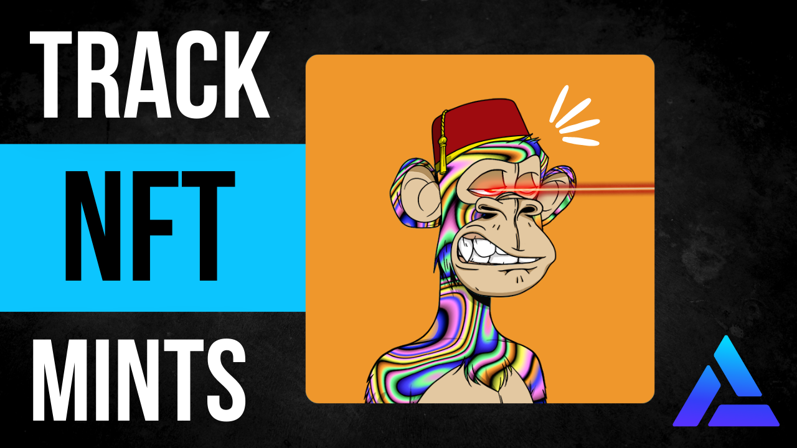
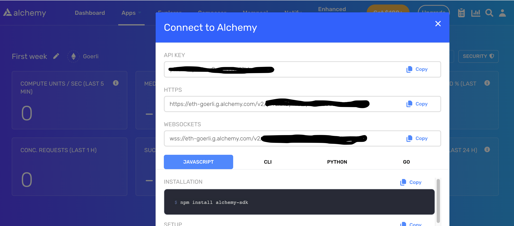
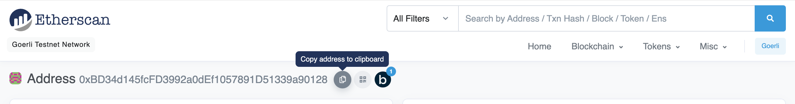
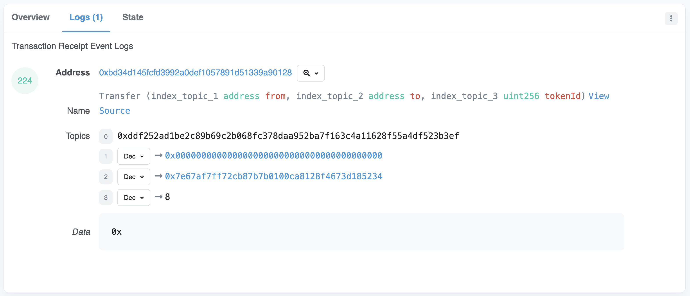

How to use the Alchemy Subscription API to track successful NFT mint events.

***

## How to track NFT mints in 5 easy steps

In this guide, we will write a script to fetch real-time updates whenever anyone mints a new NFT.

These updates can be pushed to your website, server, etc. Collections like [Bored Ape Yacht Club](https://boredapeyachtclub.com/#/home) are sold out, but projects like [Chibi Shinobis](https://www.chibishinobis.com/) or [HackrDAO](https://www.hackrdao.com/) NFTs are brand new.

So how do we watch the mints for newer projects that are still minting?

Let's write a script!

### 1. Grab an Alchemy API key

Go to the [Alchemy website](https://alchemy.com/?a=subscription-api-tweet-thread) and sign up for an account if you don't yet have an account.

In your app dashboard, click on "View Key" to grab your dedicated app RPC connection API key. We will need this API Key in order to access the Alchemy Subscription API.

The most important consideration for this step is to use an app that corresponds to the **correct blockchain** on which your desired NFT contract lives.

For example, this [HackrDAO test NFT contract](https://goerli.etherscan.io/address/0xbd34d145fcfd3992a0def1057891d51339a90128) was deployed on the Goerli test network. So if we want to track mint events for that contract, we need our app to be configured for the Goerli testnet.



#### On which chains can I use the Alchemy Subscription API?

Please reference this page to stay up-to-date on which networks we support:

[Feature Support By Chain](/reference/feature-support-by-chain)

### 2. Find your desired NFT smart contract address

Every smart contract deployed to a smart contract has an address. It is the unique identifier that allows anyone to look up details about that particular contract.

Again, using this [HackrDAO test NFT contract](https://goerli.etherscan.io/address/0xbd34d145fcfd3992a0def1057891d51339a90128) as an example, we can see that its address on the Goerli testnet is `0xBD34d145fcFD3992a0dEf1057891D51339a90128`.



### 3. Install the Alchemy SDK

For this guide, we will be using the `alchemy-sdk` library to subscribe to and listen to Log events. This is a wrapper around the popular Ethers.js SDK but it has some extra super powers for WebSockets and rate-limited requests:

* auto-retry on rate limited requests
* robust WebSocket subscriptions that don't miss events

You can find the full source code, installation instructions, and documentation [here](https://github.com/alchemyplatform/alchemy-web3). But TLDR:

If you're using `yarn`:

<CodeGroup>
  ```shell shell
  yarn add alchemy-sdk
  ```
</CodeGroup>

If you're using `npm`:

<CodeGroup>
  ```shell shell
  npm install alchemy-sdk
  ```
</CodeGroup>

### 4. Define your event log topic filters!

Defining Log topic event filters is the step where we construct a "query" for the information we want from the API.

There are two concepts you should know about in order to navigate the Subscription API successfully:

1. Subscription Types
2. Log Topics

If you already know about these or just want an example code snippet of an event log topic filter to track mints, scroll down to the "Example Event Log Topic Filter" section!

#### What are subscription types?

The Alchemy Subscription API allows you to track different [subscription types](/reference/subscription-api). For tracking Mint events, we will be using the log subscription type to listen to `transfer` events emitted by your smart contract that has the `from` address set to the `zero address`.

#### What are log topics?

Mosttransactions on Ethereum also emit Event Logs. Event Logs are comprised of two parts: (1) Topics, and (2) Data.

Topics describe the Event and are indexed and searchable.

Data also describe the Event but are not indexed nor searchable.

Here is an [example](https://goerli.etherscan.io/tx/0xa4a1fc5d099bf5963ba0af60cd4515b1491c5857bb92eed5d2b5551f68942cff#eventlog) of an NFT mint's Event Log with Topics and Data shown on Etherscan:



Topic 0 (`0xddf...`) is the `keccak256` hash of the Transfer event signature.

Topic 1 (`0x000...`) is the input to the first argument of the Transfer event, the zero address.

Topic 2 (`0x7e67...`) is the input to the second argument of the Transfer event, the recipient of the mint.

Topic 3 (`8`) is the input to the third argument of the Transfer event, the `tokenId`.

#### Example Event Log Topic Filter

Here is an example configuration for Event Log Topic to track NFT mints on the HackrDAO test contract on Goerli:

<CodeGroup>
  ```javascript javascript
  // This is the "transfer event" topic we want to watch.
  const mintTopic = "0xddf252ad1be2c89b69c2b068fc378daa952ba7f163c4a11628f55a4df523b3ef";
  // This is the "from address" we want to watch.
  const zeroTopic = "0x0000000000000000000000000000000000000000000000000000000000000000";
  // This is the NFT contract we want to watch.
  const nftContractAddress = "0xbd34d145fcfd3992a0def1057891d51339a90128";

  // Create the log options object.
  const hackrDaoMintEvents = {
      address: nftContractAddress,
      topics: [mintTopic, zeroTopic]
  }
  ```
</CodeGroup>

### 5. Write the script and run it!

Using the Alchemy's Subscription API, we can plug in all our config state and finish up the [script](https://gist.github.com/thatguyintech/b525ea093cc4d624f61927392db834cf).

<CodeGroup>
  ```javascript watch-for-mints.js
  // npm install @alchemy-sdk
  import { Network, Alchemy } from "alchemy-sdk";

  const settings = {
    apiKey: API_KEY, // Replace with your Alchemy API Key.
    network: Network.ETH_MAINNET, // Replace with your network.
  };

  const alchemy = new Alchemy(settings);

  // This is the "transfer event" topic we want to watch.
  const mintTopic = "0xddf252ad1be2c89b69c2b068fc378daa952ba7f163c4a11628f55a4df523b3ef";
  // This is the "from address" we want to watch.
  const zeroTopic =
    "0x0000000000000000000000000000000000000000000000000000000000000000";
  // This is the NFT contract we want to watch.
  const nftContractAddress = "0xbd34d145fcfd3992a0def1057891d51339a90128";

  // Create the log options object.
  const hackrDaoMintEvents = {
    address: nftContractAddress,
    topics: [mintTopic, zeroTopic],
  };

  // TODO: Add whatever logic you want to run upon mint events.
  const doSomethingWithTxn = (txn) => console.log(txn);

  // Open the websocket and listen for events!
  alchemy.ws.on(hackrDaoMintEvents, doSomethingWithTxn);
  ```
</CodeGroup>

You can test your script by running the following command on your terminal locally:

`node watch-for-mints.js`

(replace `watch-for-mints.js` with the filename of your script)

Feel free to visit the [verified contract code for the HackrDAO NFTs on Goerli](https://goerli.etherscan.io/address/0xbd34d145fcfd3992a0def1057891d51339a90128#writeContract) and executing a `mint` call while running the above script. Once the `mint` transaction is mined, you should see an event logged to your console that looks like this:

<CodeGroup>
  ```shell shell
  {
    address: '0xBD34d145fcFD3992a0dEf1057891D51339a90128',
    topics: [
      '0xddf252ad1be2c89b69c2b068fc378daa952ba7f163c4a11628f55a4df523b3ef',
      '0x0000000000000000000000000000000000000000000000000000000000000000',
      '0x0000000000000000000000007e67af7ff72cb87b7b0100ca8128f4673d185234',
      '0x0000000000000000000000000000000000000000000000000000000000000008'
    ],
    data: '0x',
    blockNumber: 10374900,
    transactionHash: '0xa4a1fc5d099bf5963ba0af60cd4515b1491c5857bb92eed5d2b5551f68942cff',
    transactionIndex: 78,
    blockHash: '0xf0d0c9bdf41cd482ecd1a7ad396a62bc5f1828622cbe6f2d1076716ad1643e76',
    logIndex: 224,
    removed: false,
    id: 'log_ebf2ac1e'
  }
  ```
</CodeGroup>

<Info>
  Note that you can replace the logic defined in the `doSomethingWithTxn` function above in the script with whatever you'd like to do once you receive the Log event. For example: update some state on your web app, or trigger some kind of callback via your backend service.
</Info>

That's it!

### Final thoughts and other APIs

We have a lot of other APIs that help you query for blockchain data easily. Check out these related APIs and services:

[Transfers API](/reference/transfers-api)

[Notify API](/reference/notify-api)

Finally, if you're a big tweeter, check out this guide in tweet form and reply to it if you have requests for any other guides you'd like us to write!

[](https://twitter.com/thatguyintech/status/1506507816412278785)

[twitter.com](https://twitter.com/thatguyintech/status/1506507816412278785)

[albert | thatguyintech.eth on Twitter: "How to TRACK NFT MINT EVENTS in REAL-TIME!Using @Alchemy's Subscription API 👇🏼 pic.twitter.com/zlEXfenWgB / Twitter"](https://twitter.com/thatguyintech/status/1506507816412278785)

What mints are you tracking? 😛 Retweet me and share your alpha 😂.
