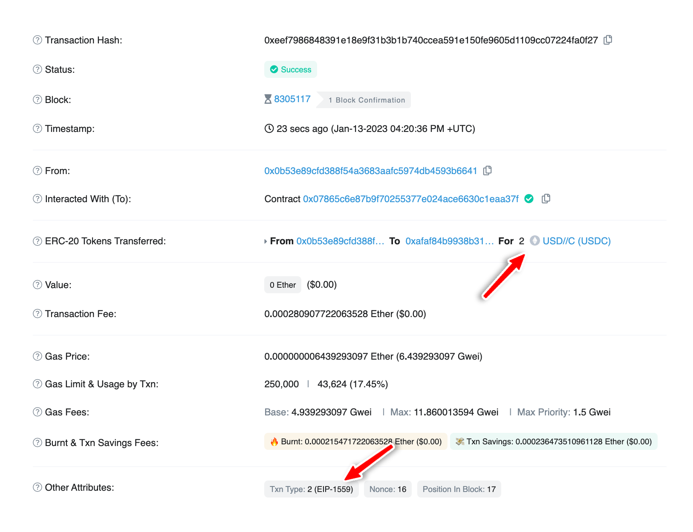

### Don’t have an API key?

Sign up to get access.

[Get started for free](https://dashboard.alchemy.com/signup/?a=send-erc20-eip1559)

<Info>
  This tutorial uses the [getFeeData](/reference/sdk-getfeedata) and [getTransactionCount](/reference/sdk-gettransactioncount) endpoints.
</Info>

***

# Introduction

The London Hardfork introduced a new EIP called EIP-1559 that modifies how gas estimation and costs work for transactions on Ethereum.

In this tutorial, we will show you how to send ERC20 tokens in an EIP-1559 transaction using the Alchemy SDK. We will use the USDC token as an example, but the same principle applies to any ERC20 token. To learn more about EIP-1559, check out [this blog post](https://blog.alchemy.com/blog/eip-1559).

***

# Prerequisites

* You should know about [EIP-1559](https://blog.alchemy.com/blog/eip-1559).
* You should have basic knowledge of Javascript & Node.js.
* Ideally, you should have gone through our tutorial on [sending transactions with EIP-1559](/docs/how-to-send-transactions-with-eip-1559) but it is not required if you already know about EIP-1559.

***

# Developer Environment Setup

## Step 1: Install Node and NPM

In case you haven't already, [install node and npm](https://nodejs.org/en/download/) on your local machine.

Make sure that node is at least **v14 or higher** by typing the following in your terminal:

<CodeGroup>
  ```shell shell
  node -v
  ```
</CodeGroup>

***

## Step 2: Create an Alchemy app

In case you haven't already, [sign up for a free Alchemy account](https://dashboard.alchemy.com/signup/?a=send-erc20-eip1559).


Alchemy's account dashboard where developers can create a new app on the Ethereum blockchain.

Next, navigate to the [Alchemy Dashboard](https://dashboard.alchemy.com/signup/?a=send-erc20-eip1559) and [create a new app](/reference/alchemy-quickstart-guide). Make sure you set the chain to Ethereum and the network to Sepolia. Once the app is created, click on your app's *View Key* button on the dashboard. Take note of the **API KEY**.

You will need this later.

***

## Step 3: Get Sepolia ETH and Sepolia USDC

In order to send USDC on the Sepolia testnet, we need to have some Sepolia USDC (to send) and Sepolia ETH (to pay for gas).

You can get Sepolia ETH from Alchemy's [Sepolia Faucet](https://sepoliafaucet.com/) and Sepolia USDC from [USDC faucet](https://usdcfaucet.com/) (Make sure to select ETH as your network in the USDC faucet).

***

## Step 4: Create a node project

Let's now create an empty repository and install all the node dependencies.

<CodeGroup>
  ```shell shell
  mkdir send-erc20-eip1559 && cd send-erc20-eip1559
  npm init -y
  npm install alchemy-sdk dotenv
  touch main.js .env
  ```
</CodeGroup>

This will create a repository named `send-erc20-eip1559` that holds all your files and dependencies. Next, open this repo in your favorite code editor. We will set our environment variables in `.env` file and write our code in `main.js` file.

***

## Step 5: Set up the environment variables

In your `.env` file, add the API key you got from [#Step 2](#step-2-create-an-alchemy-app) and your wallet's Private key.

<CodeGroup>
  ```text .env
  API_KEY = "YOUR-API-KEY"
  PRIVATE_KEY = "YOUR-PRIVATE-KEY"
  ```
</CodeGroup>

Make sure you add the private key of the wallet with Sepolia ETH and Sepolia USDC.

***

# Writing the Main Script

Add the following code to the `main.js` file. Here's an overview of what the code is doing (also explained in the comments below):

* Importing the necessary modules from the Alchemy SDK and the dotenv package.
* Reading the API key and private key from the .env file to use in the script.
* Configuring the Alchemy SDK using the imported API key and network (Sepolia).
* Creating an instance of the Alchemy SDK. This will be used to call `getFeeData` and `getTransactionCount` methods.
* Creating a wallet instance to send the transaction using the private key.
* Adding the address you want to send the tokens to.
* Defining the USDC contract address on Sepolia testnet.
* Using `getFeeData` method of Alchemy SDK to get the fee data (maxFeePerGas & maxPriorityFeePerGas) that will be used in the transaction object (These fields are used in an EIP-1559 transaction instead of `gasPrice`).
* Defining the ABI for the transfer function of ERC20 token.
* Defining the amount of tokens to send and the decimals of the token. We want to send 2 USDC in this case and the USDC token has 6 decimals. You can find out how many decimal places any currency has by reading the `decimals` value from the contract's page on Etherscan.
* Converting the amount to send to decimals. This step is important because while encoding the transaction data, we are using the `wei` units to specify the number of tokens to send, which means we need to present the amount to send in its smallest units (i.e. decimals).

<Info>
  Solidity does not support decimal point numbers. So, If you want an ERC20 token to have the ability to be subdivided with a precision of 2 decimal places, you need to represent 1 token as 100 (set its decimal places to 2).

  Similarly, if you want an ERC20 token to have the ability to be subdivided with a precision of 18 decimal places, you need to represent 1 token as 1000000000000000000 (set its decimal places to 18).

  So, the formula for the amount to send in decimals becomes:

  `amountToSendInDecimals = amountToSend * (10 ** decimals)`
</Info>

* Encoding the data for the transaction by creating an interface object from the ABI and specifying the function to call, the parameters and the contract to interact with.

* Creating the EIP-1559 transaction object by defining the transaction properties such as:

  * `nonce`: getting it using the `getTransactionCount` method.
  * `maxPriorityFeePerGas`: getting it from the `feeData` object.
  * `maxFeePerGas`: getting it from the `feeData` object.
  * `type`: setting it to `2` depicts an EIP-1559 transaction.
  * `chainId`: 11155111, corresponds to Sepolia's testnet's chain ID.
  * `data`: data that we encoded using ABI interface, this tells the transaction what to do.
  * `gasLimit`: gas limit for the transaction.

* Sending the transaction using the created transaction object and logging it.

<CodeGroup>
  ```javascript main.js
  // Importing the Alchemy SDK
  const { Network, Alchemy, Wallet, Utils } = require("alchemy-sdk");

  // Importing dotenv to read the API key from the .env file
  const dotenv = require("dotenv");
  dotenv.config();

  // Reading the API key and private key from the .env file
  const { API_KEY, PRIVATE_KEY } = process.env;

  // Configuring the Alchemy SDK
  const settings = {
    apiKey: API_KEY, // Replace with your API key.
    network: Network.ETH_SEPOLIA, // Replace with your network.
  };

  // Creating an instance of the Alchemy SDK
  const alchemy = new Alchemy(settings);

  async function main() {
    // Creating a wallet instance to send the transaction
    const wallet = new Wallet(PRIVATE_KEY, alchemy);

    // Replace with the address you want to send the tokens to
    const toAddress = "0xafaF84B9938b31B357DAdDe97e38772B63fcaE92";

    // USDC contract address on Sepolia testnet
    const usdcContractAddress = "0x07865c6E87B9F70255377e024ace6630C1Eaa37F";

    // Using `getFeeData` method of Alchemy SDK to get the fee data (maxFeePerGas & maxPriorityFeePerGas) that will be used in the transaction object
    const feeData = await alchemy.core.getFeeData();

    // ABI for the transfer function of ERC20 token
    // Every ERC20 contract has this function and we are going to use it to transfer the tokens
    const abi = ["function transfer(address to, uint256 value)"];

    // Amount of tokens to send: Here we will send 2 USDC tokens
    const amountToSend = 2;

    // Decimals for USDC token: 6
    const decimals = 6;

    // Convert the amount to send to decimals (6 decimals for USDC)
    const amountToSendInDecimals = amountToSend * 10 ** decimals;

    // Create the data for the transaction -> data that tells the transaction what to do (which function of the contract to call, what parameters to pass etc.)
    // Create an interface object from the ABI to encode the data
    const iface = new Utils.Interface(abi);
    // Encoding the data -> Call transfer function and pass the amount to send and the address to send the tokens to
    const data = iface.encodeFunctionData("transfer", [
      toAddress,
      Utils.parseUnits(amountToSendInDecimals.toString(), "wei"),
    ]);

    // Make the transaction object to send the transaction
    const transaction = {
      to: usdcContractAddress, // The transaction will be sent to the USDC contract address
      nonce: await alchemy.core.getTransactionCount(wallet.getAddress()), // Get the nonce of the wallet
      maxPriorityFeePerGas: feeData.maxPriorityFeePerGas, // This is the fee that the miner will get
      maxFeePerGas: feeData.maxFeePerGas, // This is the maximum fee that you are willing to pay
      type: 2, // EIP-1559 transaction type
      chainId: 11155111, // Corresponds to ETH_SEPOLIA
      data: data, // encoded data for the transaction
      gasLimit: Utils.parseUnits("250000", "wei"), // gas limit for the transaction (250000 gas) -> For sending ERC20 tokens, the gas limit is usually around 200,000-250,000 gas
    };

    // Send the transaction and log it.
    const sentTx = await wallet.sendTransaction(transaction);
    console.log(sentTx);
  }

  main();
  ```
</CodeGroup>

***

# Testing the Script

Run the script using the following command:

<CodeGroup>
  ```shell terminal
  node main.js
  ```
</CodeGroup>

You should see an output containing details about the sent transaction:

<CodeGroup>
  ```json terminal
  {
    type: 2,
    chainId: 11155111,
    nonce: 16,
    maxPriorityFeePerGas: BigNumber { _hex: '0x59682f00', _isBigNumber: true },
    maxFeePerGas: BigNumber { _hex: '0x02c2e9721a', _isBigNumber: true },
    gasPrice: null,
    gasLimit: BigNumber { _hex: '0x03d090', _isBigNumber: true },
    to: '0x07865c6E87B9F70255377e024ace6630C1Eaa37F',
    value: BigNumber { _hex: '0x00', _isBigNumber: true },
    data: '0xa9059cbb000000000000000000000000afaf84b9938b31b357dadde97e38772b63fcae9200000000000000000000000000000000000000000000000000000000001e8480',
    accessList: [],
    hash: '0xeef7986848391e18e9f31b3b1b740ccea591e150fe9605d1109cc07224fa0f27',
    v: 1,
    r: '0xebf95ec342748a068f54eec97b3397c7d603fa5f75e6690d8036233ec1bc8c98',
    s: '0x4880ad502c1428eba70852f2d16a949b3f3d106e0392c03f409b5e7e728f552b',
    from: '0x0B53E89cFD388f54A3683AAfc5974db4593B6641',
    confirmations: 0,
    wait: [Function (anonymous)]
  }
  ```
</CodeGroup>

If you copy the `hash` from these details and search on [Etherscan](https://goerli.etherscan.io/tx/0xeef7986848391e18e9f31b3b1b740ccea591e150fe9605d1109cc07224fa0f27), you should see an EIP-1559 transaction that transferred 2 USDC from your wallet address to the wallet address you specified!



***

# Conclusion

Congratulations! You now know how to send ERC20 tokens in an EIP-1559 transaction using Alchemy SDK 🎉

Happy Coding and feel free to message us with any related questions on [Alchemy's Discord Server](https://www.alchemy.com/discord)!
