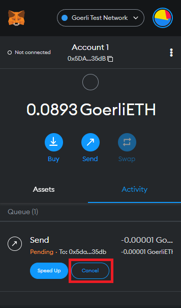
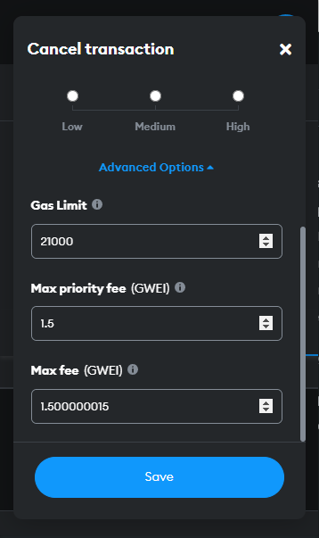
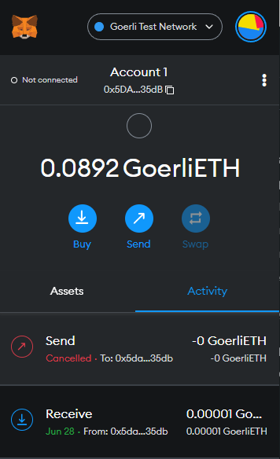
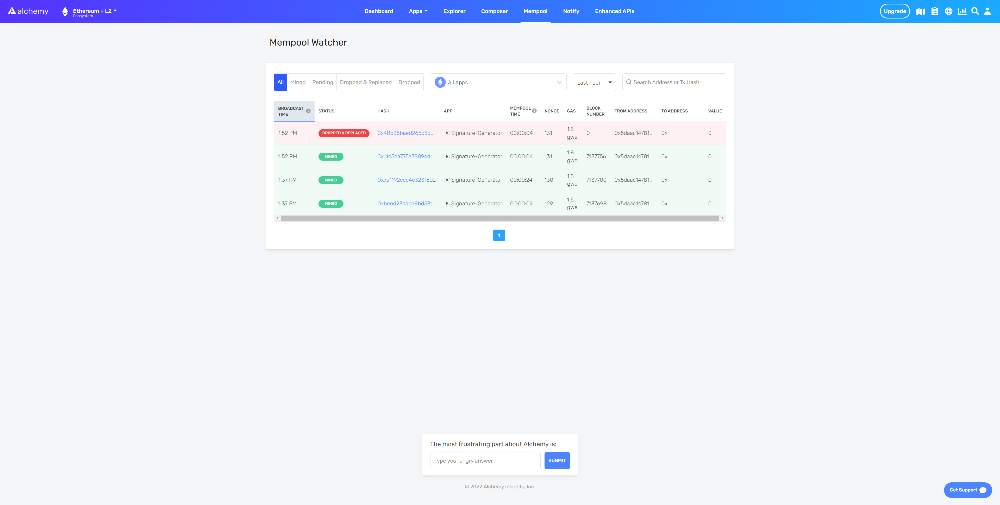

Once your transaction gets confirmed on the Ethereum network, you cannot cancel it. However, you can effectively cancel transactions still in the [Mempool](https://docs.alchemy.com/alchemy/guides/ethereum-transactions-pending-mined-dropped-and-replaced#what-is-a-mempool) by creating a second transaction with the same [nonce](https://docs.alchemy.com/alchemy/guides/ethereum-transactions-pending-mined-dropped-and-replaced#what-is-a-nonce) (number only used once) but a higher gas fee. Since miners are incentivized to include the second transaction (with the higher gas fee) first, the nonce will be "used," and the original transaction will be dropped from the mempool.

Here are some possible reasons you might cancel a transaction:

* You sent a transaction with a meager gas fee that is now stuck in a pending state.
* You already know the transaction is going to fail.
* You want to create a failsafe if something goes wrong with your transaction.

***

## Cancel Transaction: MetaMask

Metamask has a built-in feature that allows you to cancel pending transactions with one click.

  

<Check>
  Set the max priority gas fee higher than your original transaction to ensure cancellation.
</Check>

***

## Cancel Transaction: Alchemy's SDK

In this section, we will create our own cancellation transaction using Alchemy's SDK. (Web3.js code examples are also included.)

### Prerequisites

Before you begin this tutorial, please ensure you have the following:

* An Alchemy account ([Create a free Alchemy account](https://www.alchemy.com/)).
* An Ethereum address or MetaMask wallet ([Create a MetaMask wallet](https://metamask.io/download/)).
* NodeJS and npm installed ([Install NodeJs and NPM](https://docs.alchemy.com/alchemy/guides/alchemy-for-macs#1-install-nodejs-and-npm)).

### Connect to Alchemy

1. From the Alchemy Dashboard, hover over **Apps,** then click **+Create App**.
2. Name your app: **Cancel-Tx**.
3. Select **Ethereum** as your chain and **Sepolia** as your network.
4. Click **Create app**.

### Request ETH from the [Alchemy Sepolia faucet](https://sepoliafaucet.com/)

1. From [Sepolia Faucet](https://sepoliafaucet.com/), sign in with your Alchemy account.
2. Paste your MetaMask address and click **Send me ETH**.

<Warning>
  While you can use the Goerli testnet, we caution against it as the Ethereum Foundation has announced that [Goerli will soon be deprecated](https://www.alchemy.com/blog/goerli-faucet-deprecation).

  We therefore recommend using [Sepolia](https://www.alchemy.com/overviews/sepolia-testnet) as Alchemy has full Sepolia support and a free [Sepolia faucet](https://sepoliafaucet.com/) also.
</Warning>

### Setup Project Environment

Open VS Code (or your preferred IDE) and enter the following in the terminal:

<CodeGroup>
  ```shell shell
  mkdir cancel-tx
  cd cancel-tx
  ```
</CodeGroup>

Once inside our project directory, initialize npm (node package manager) with the following command:

<CodeGroup>
  ```shell shell
  npm init
  ```
</CodeGroup>

Press enter and answer the project prompt as follows:

<CodeGroup>
  ```json package.json
  package name: (cancel-tx)
  version: (1.0.0)
  description: 
  entry point: (index.js)
  test command: 
  git repository: 
  keywords: 
  author: 
  license: (ISC)
  ```
</CodeGroup>

Press enter again to complete the prompt. If successful, a `package.json` file will have been created in your directory.

### Install environment tools

The tools you will need to complete this tutorial are:

* [Alchemy's SDK](https://docs.alchemy.com/alchemy/sdk/sdk-quickstart#alchemy-sdk-for-javascript)
* [dotenv](https://www.npmjs.com/package/dotenv) (so that you can store your private key and API key safely)

To install the above tools, ensure you are still inside your root folder and type the following commands in your terminal:

**Alchemy SDK:**

<CodeGroup>
  ```shell shell
  npm install alchemy-sdk
  ```
</CodeGroup>

**Dotenv:**

<CodeGroup>
  ```shell shell
  npm install dotenv --save
  ```
</CodeGroup>

### Create a Dotenv File

Create a `.env` file in your root folder. The file must be named `.env` or it will not be recognized.

In the `.env` file, we will store all of our sensitive information (i.e., our Alchemy API key and MetaMask private key).

Copy the following into your `.env` file:

<CodeGroup>
  ```json .env
  API_KEY = "{YOUR_ALCHEMY_API_KEY}"
  PRIVATE_KEY = "{YOUR_PRIVATE_KEY}"
  ```
</CodeGroup>

* Replace `{YOUR_ALCHEMY_API_KEY}` with your Alchemy API key found in your app’s dashboard, under **VIEW KEY**:

.PNG")

* Replace `{YOUR_PRIVATE_KEY}`with your MetaMask private key.

***To retrieve your MetaMask private key:***

1. Open the extension, click on the three dots menu, and choose **Account Details**.

.png")

2. Click **Export Private Key** and enter your MetaMask password.

.PNG")

3. Replace the Private Key in your `.env` file with your MetaMask Private Key.

### Create `cancelTx.js` file

Create a file named `cancelTx.js` and add the following code:

<CodeGroup>
  ```javascript Alchemy SDK (Recommended)
  const cancelTx = async () => {
    require("dotenv").config();
    // Imports the secret .env file where our Private Key and API are stored
    // We can now use these aliases instead of using our actual keys.
    const { API_KEY, PRIVATE_KEY } = process.env;

    // Import the Alchemy SDK
    const { Network, Alchemy, Wallet } = require("alchemy-sdk");

    // Initializes Alchemy SDK with our settings config
    const settings = {
      apiKey: API_KEY,
      network: Network.ETH_SEPOLIA,
    };
    const alchemy = new Alchemy(settings);

    // The Wallet holds the private key and signs transactions for you.
    const walletInst = new Wallet(PRIVATE_KEY);

    // Gets the latest nonce for our wallet address
    const nonce = await alchemy.core.getTransactionCount(walletInst.address);
  };

  cancelTx();
  ```

  ```javascript Alchemy Web3.js
  const cancelTx = async () => {
    require("dotenv").config();
    const { API_URL, PRIVATE_KEY } = process.env;
    const { createAlchemyWeb3 } = require("@alch/alchemy-web3");
    const web3 = createAlchemyWeb3(API_URL);
    const myAddress = "0x5DAAC14781a5C4AF2B0673467364Cba46Da935dB"; //TODO: replace this address with your own public address
    const nonce = await web3.eth.getTransactionCount(myAddress, "latest");
    
  };

  cancelTx();
  ```
</CodeGroup>

The code above sets up our Alchemy SDK to connect to the blockchain and send transactions.

Next, let's create two transactions. The first will be the transaction we intend to cancel and the second will be our cancellation transaction. See the code below, noting specifically lines 17-29:

<CodeGroup>
  ```javascript Alchemy SDK (Recommended)
  const cancelTx = async () => {
    require("dotenv").config();
    const { API_KEY, PRIVATE_KEY } = process.env;
    const { Network, Alchemy, Wallet, Utils } = require("alchemy-sdk");

    const settings = {
      apiKey: API_KEY,
      network: Network.ETH_SEPOLIA,
    };
    const alchemy = new Alchemy(settings);

    const walletInst = new Wallet(PRIVATE_KEY);
    const nonce = await alchemy.core.getTransactionCount(walletInst.address);

    const transaction = {
      gasLimit: "53000",
      maxPriorityFeePerGas: Utils.parseUnits("1", "gwei"),
      nonce: nonce,
      type: 2,
      chainId: 5,
    };

    const replacementTx = {
      gasLimit: "53000",
      maxPriorityFeePerGas: Utils.parseUnits("1.55", "gwei"),
      maxFeePerGas: Utils.parseUnits("1.8", "gwei"),
      nonce: nonce,
      type: 2,
      chainId: 5,
    };
  };

  cancelTx();
  ```

  ```javascript Alchemy Web3.js
  const cancelTx = async () => {
    require("dotenv").config();
    const { API_URL, PRIVATE_KEY } = process.env;
    const { createAlchemyWeb3 } = require("@alch/alchemy-web3");
    const web3 = createAlchemyWeb3(API_URL);
    const myAddress = "0x5DAAC14781a5C4AF2B0673467364Cba46Da935dB";
    const nonce = await web3.eth.getTransactionCount(myAddress, "latest");

    const transaction = {
      gas: '53000',
      maxPriorityFeePerGas: '1000000108',
      nonce: nonce,
    };
    const replacementTx = {
      gas: '53000',
      maxPriorityFeePerGas: '1500000108',
      nonce: nonce,
    };
    
  };

  cancelTx();
  ```
</CodeGroup>

<Info>
  Notice that we set the same nonce for both transactions.
</Info>

Here's an overview of the transaction parameters:

* `gasLimit`: The maximum amount of gas used to execute our transaction. 21000 wei is the minimum amount of gas an operation on Ethereum will use, so to ensure our transaction will be executed we put 53000 wei here.
* `maxPriorityFeePerGas`: The miner's tip. (Check out [Alchemy's guide](https://docs.alchemy.com/alchemy/guides/eip-1559/maxpriorityfeepergas-vs-maxfeepergas#what-is-max-priority-fee-per-gas) to learn more)
* `maxFeePerGas`: Transaction base fee + miner's tip
* `nonce`: (number only used once) used to keep track of transactions for a specific address.
* `type`: The [EIP-2718](https://eips.ethereum.org/EIPS/eip-2718) type of the transaction envelope.

Finally, let's send our transactions! For this, add the following try-catch statement, noting specifically lines 31-49:

<CodeGroup>
  ```javascript Alchemy SDK (Recommended)
  const cancelTx = async () => {
    require("dotenv").config();
    const { API_KEY, PRIVATE_KEY } = process.env;
    const { Network, Alchemy, Wallet, Utils } = require("alchemy-sdk");

    const settings = {
      apiKey: API_KEY,
      network: Network.ETH_SEPOLIA,
    };
    const alchemy = new Alchemy(settings);

    const walletInst = new Wallet(PRIVATE_KEY);
    const nonce = await alchemy.core.getTransactionCount(walletInst.address);

    const transaction = {
      gasLimit: "53000",
      maxPriorityFeePerGas: Utils.parseUnits("1", "gwei"),
      nonce: nonce,
      type: 2,
      chainId: 5,
    };

    const replacementTx = {
      gasLimit: "53000",
      maxPriorityFeePerGas: Utils.parseUnits("1.55", "gwei"),
      maxFeePerGas: Utils.parseUnits("1.8", "gwei"),
      nonce: nonce,
      type: 2,
      chainId: 5,
    };

    try {
      const signedTx = await walletInst.signTransaction(transaction);
      const signedReplacementTx = await walletInst.signTransaction(replacementTx);

      const txResult = await alchemy.core.sendTransaction(signedTx);
      const replacementTxResult = await alchemy.core.sendTransaction(
        replacementTx
      );

      console.log(
        "The hash of the transaction we are going to cancel is:",
        txResult.hash
      );
      console.log(
        "The hash of your replacement transaction is:",
        replacementTxResult.hash,
        "\n Check Alchemy's Mempool to view the status of your transactions!"
      );
    } catch (error) {
      console.log(
        "Something went wrong while submitting your transactions:",
        error
      );
    }
  };

  cancelTx();
  ```

  ```javascript Alchemy Web3.js
  const cancelTx = async () => {
    require("dotenv").config();
    const { API_URL, PRIVATE_KEY } = process.env;
    const { createAlchemyWeb3 } = require("@alch/alchemy-web3");
    const web3 = createAlchemyWeb3(API_URL);
    const myAddress = "0x5DAAC14781a5C4AF2B0673467364Cba46Da935dB";
    const nonce = await web3.eth.getTransactionCount(myAddress, "latest");

    const transaction = {
      gas: '53000',
      maxPriorityFeePerGas: '1000000108',
      nonce: nonce,
    };
    const replacementTx = {
      gas: '53000',
      maxPriorityFeePerGas: '1500000108',
      nonce: nonce,
    };

    const signedTx = await web3.eth.accounts.signTransaction(transaction, PRIVATE_KEY);
    const signedReplacementTx = await web3.eth.accounts.signTransaction(replacementTx, PRIVATE_KEY);

    web3.eth.sendSignedTransaction(signedTx.rawTransaction, function (error, hash) {
      if (!error) {
        console.log(
          "The hash of the transaction we are going to cancel is: ",
          hash
        );
      } else {
        console.log(
          "Something went wrong while submitting your transaction:",
          error
        );
      }
    });

    web3.eth.sendSignedTransaction(signedReplacementTx.rawTransaction, function (error, hash) {
      if (!error) {
        console.log(
          "The hash of your replacement transaction is: ",
          hash,
          "\n Check Alchemy's Mempool to view the status of your transactions!"
        );
      } else {
        console.log(
          "Something went wrong while submitting your replacement transaction:",
          error
        );
      }
    }).once("sent", () => {
      let timeout = new Promise(() => {
        let id = setTimeout(() => {
          clearTimeout(id);
          process.exit()
        }, 3000);
      });
      return timeout;
    });
    
  };

  cancelTx();
  ```
</CodeGroup>

Above, we call the `sendTransaction` function and pass in our transaction.

To run our script, type this command in terminal:

<CodeGroup>
  ```shell shell
  node cancelTx.js
  ```
</CodeGroup>

If successful, you should see an output similar to the following:

<CodeGroup>
  ```shell shell
  The hash of the transaction we are going to cancel is: 0x48b35baed265c5c7b31a16cf527a66f622923ad6cbe02c77a4af6438d528c199
  The hash of your replacement transaction is: 0x1145ea775a7889cdbdf1a29d41decd681adb9894b2351a324bf82923dfbd8b09 
   Check Alchemy's Mempool to view the status of your transactions!
  ```
</CodeGroup>

On Alchemy, head to your app's dashboard and navigate to the **Mempool** tab.

After your replacement transaction has been mined, you should see that your first transaction was dropped and replaced:



Nice work! You successfully created then canceled a transaction using Alchemy's SDK!

Feel free to reach out to us in the [Alchemy Discord](https://discord.gg/gWuC7zB) for help or chat with us [@AlchemyPlatform](https://twitter.com/AlchemyPlatform?s=20\&t=H-ctZCz3615N7nGF3QZGVA) on Twitter!
