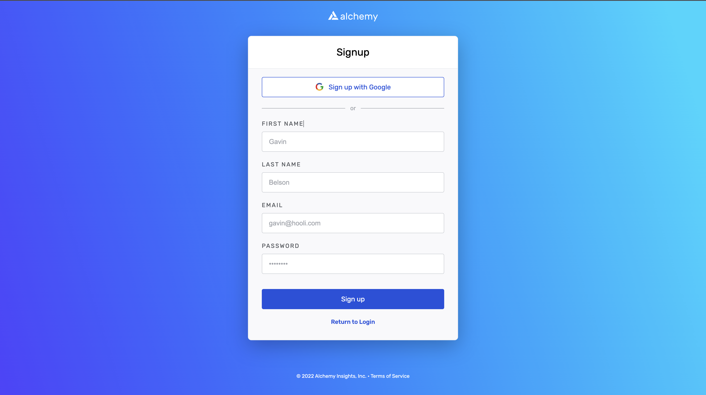
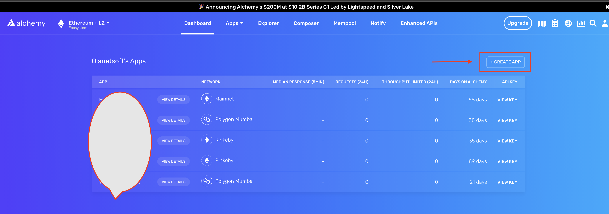
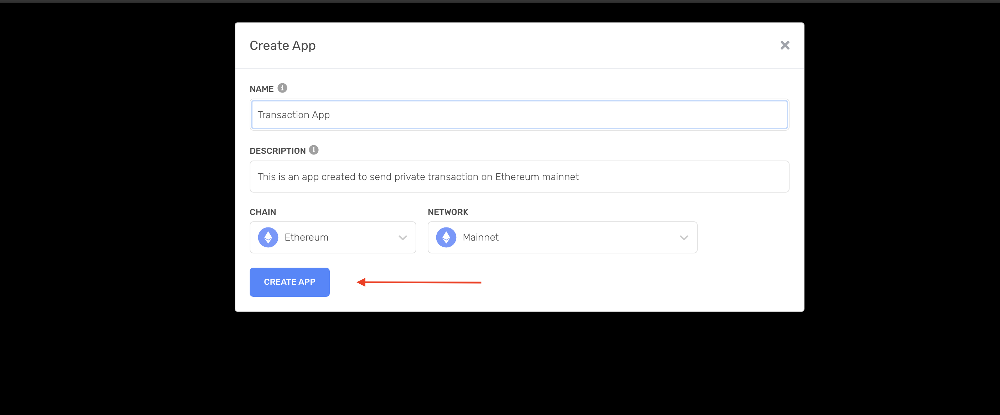
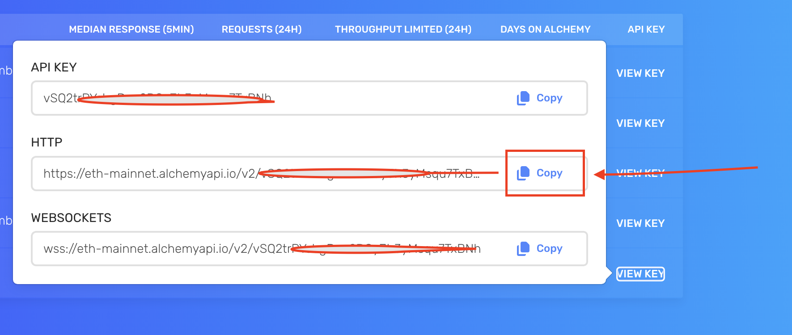

When transactions are sent to the blockchain, they are distributed across the entire network. Transactions that have not been mined yet are classified as "pending" transactions. You can learn more about the various transactions states, [here](/docs/ethereum-transactions-pending-mined-dropped-replaced). Pending transactions live in the and are visible to the entire network, which makes them prone to front-running and other forms of arbitrage.

In order to protect your transactions, you can send them through a private endpoint, [eth\_sendPrivateTransaction](/reference/eth-sendprivatetransaction), which skips the public mempool and is sent directly to miners. This endpoint is powered by Flashbots, a leading web3 organization focusing on protecting developers against these types of arbitrage opportunities (better known as Miner Extractable Value, or MEV).

This tutorial will teach you how to use this endpoint to protect your transactions.

## 3 Steps to Send a Private Transaction

1. [Create free Alchemy account](#create-free-alchemy-account)
2. [Create an Alchemy App](#heading-step-2-create-an-alchemy-app-and-api-key)
3. [Make a sendPrivateTransaction API call via the Alchemy SD](#make-eth_sendprivatetransaction-api-call)

## Create free Alchemy account

We'll use [Alchemy](https://dashboard.alchemyapi.io/signup/?a=02ace7d259) to send our private transaction to Ethereum. You can create an account for free [here](https://dashboard.alchemyapi.io/signup/?a=02ace7d259).



Create free Alchemy Account

## Create an Alchemy App

After creating a new account successfully, we will be redirected to our dashboard, where we can create an App by clicking on the `Create App` button as shown below.



Create an Alchemy Ethereum Mainnet App

Next, we will input the following app information:

* **Name**: Transaction App
* **Description**: Feel free to put anything here.
* **Chain**: Ethereum
* **Network**: Mainnet



Create an Alchemy Ethereum Mainnet App

Click on the `View Key` button as shown below\*\*,\*\* which will open a popup with our app's HTTP and Websocket URLs. In this tutorial, we will be using the Api Key. Save this for later.



View Alchemy App - API key

## Make sendPrivateTransaction call via the Alchemy SDK

Now that we've got everything set up, we'll look at how to send private transactions using [eth\_sendPrivateTransaction](/reference/eth-sendprivatetransaction) over the [Alchemy SDK](/reference/alchemy-sdk-quickstart)

### 1. Create a new project directory and `cd` into it

Create a new project directory from the [command line ](https://www.computerhope.com/jargon/c/commandi.htm)(terminal for macs) and navigate into it:

<CodeGroup>
  ```shell shell
  mkdir sendtx-example
  cd sendtx-example
  ```
</CodeGroup>

### 2. Install the [Alchemy SDK](/reference/alchemy-sdk-quickstart) and dotenv

Run the following command in your project directory:

<CodeGroup>
  ```shell shell
  npm install alchemy-sdk dotenv
  ```
</CodeGroup>

### 3. Create the .env file

We'll use a `.env` file to safely store our API key and private key.

<Info>
  We make a .env file to securely store private environmental variables in our local machine that we may access from other files (some of which we can make public).

  If you want to check out how `dotenv` actually works in the context of a conventional NodeJS server file, check out this helpful [video](https://www.youtube.com/watch?v=5WFyhsnU4Ik)!
</Info>

Create a .env file (make sure the file is literally just named `.env`, nothing more) in your project directory and add the following (replacing `your-api-key` and `your-private-key`, keeping both within the quotation marks):

* To find your Alchemy API Key, use the instructions shared above.
* To find your private key using Metamask, check out this [guide](https://metamask.zendesk.com/hc/en-us/articles/360015289632-How-to-Export-an-Account-Private-Key).

<CodeGroup>
  ```sol .env
  API_KEY = "your-api-key"
  PRIVATE_KEY = "your-private-key"
  ```
</CodeGroup>

### 4. Create `sendPrivateTx.js` file

Great, now that we have our sensitive data protected in a `.env` file, let's start coding. For our send transaction example, we'll be sending Ethereum to a test wallet.

Create a `sendTx.js` file, which is where we will configure and send our example transaction, and add the following lines of code to it:

<CodeGroup>
  ```javascript sendPrivateTx.js
  // Setup: npm install alchemy-sdk
  // Github: https://github.com/alchemyplatform/alchemy-sdk-js
  import { Alchemy, Network, Wallet, Utils } from "alchemy-sdk";
  import dotenv from "dotenv";

  dotenv.config();
  const { API_KEY, PRIVATE_KEY } = process.env;

  const settings = {
    apiKey: API_KEY,
    network: Network.ETH_MAINNET, // Replace with your network.
  };
  const alchemy = new Alchemy(settings);

  let wallet = new Wallet(PRIVATE_KEY);

  const nonce = await alchemy.core.getTransactionCount(wallet.address, "latest");

  let exampleTx = {
    to: "0x4b9007B0BcE78cfB634032ec31Ed56adB464287b",
    value: 10,
    gasLimit: "21000",
    maxFeePerGas: Utils.parseUnits('20', 'gwei'),
    nonce: nonce,
    type: 2,
    chainId: 5,
  };

  let rawTransaction = await wallet.signTransaction(exampleTx);

  const signedTx = await alchemy.transact.sendPrivateTransaction(
    rawTransaction,
    (await alchemy.core.getBlockNumber()) + 1
  );

  console.log(signedTx);
  ```
</CodeGroup>

Now, before we jump into running this code, let's talk about some of the components here.

* `Wallet`: This object stores your private key, and can be accessed to sign a transaction with your private key or to return your public address.

* `nonce` : The nonce specification is used to keep track of the number of transactions sent from your address. We need this for security purposes and to prevent [replay attacks](). To get the number of transactions sent from your address we use [eth\_getTransactionCount](/reference/eth-gettransactioncount)

* `transaction`: The transaction object has a few aspects we need to specify

  * `to`: This is the address we want to send Eth to. In this case, we are sending Eth to a test wallet.
  * `gasLimit`: This is the maximum amount of gas you are willing to consume on a transaction. Standard limit is 21000 units.
  * `value`: This is the amount we wish to send, specified in wei where 10^18 wei = 1 ETH
  * `maxFeePerGas`: This is the total amount you are willing to pay per gas for the transaction to execute. Since EIP 1559, this field or the `maxPriorityFeePerGas` field is required. Specified in wei, where 10^18 wei = 1 ETH
  * `nonce`: see above nonce definition. Nonce starts counting from zero.
  * \[OPTIONAL] `data`: Used for sending additional information with your transfer, or calling a smart contract, not required for balance transfers, check out the note below.

* `rawTransaction`: To sign our transaction object we will use the `signTransaction` method of our wallet, generating a raw "signed" transaction.

* `sendPrivateTransaction`: Once we have a signed transaction, we can send it off via Alchemy's servers to be included in a subsequent block by using `sendPrivateTransaction` request.

<Info>
  There are two main types of transactions that can be sent in Ethereum.
</Info>

### 5. Run the code using `node sendPrivateTx.js`

Navigate back to your terminal or command line and run:

<CodeGroup>
  ```shell shell
  node sendPrivateTx.js
  ```
</CodeGroup>

From there you can view your transaction on Etherscan by clicking on the icon circled in red!

### Yippieeee! You just sent your first private transaction using Alchemy 🎉

Once you complete this tutorial, let us know how your experience was or if you have any feedback by tagging us on Twitter [@Alchemy](https://twitter.com/Alchemy)!

\_For feedback and suggestions about this guide, please message Deric on Alchemy's [*Discord*](https://discord.gg/A39JVCM)! \_

\_Not sure what to do next? As a final test of your skills, get your hands dirty with some solidity programming by implementing our [Hello World Smart Contract](/docs/hello-world-smart-contract) tutorial.
