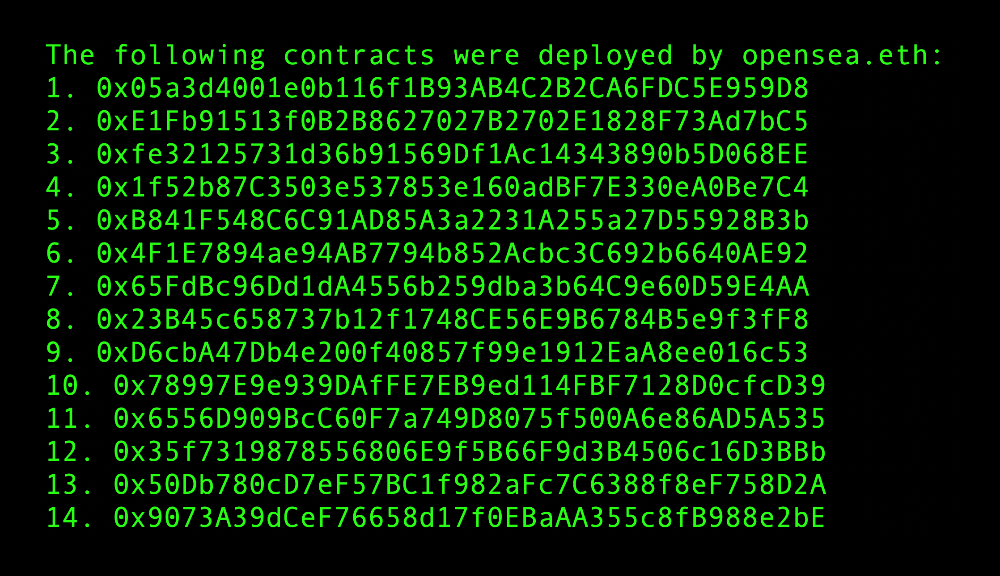
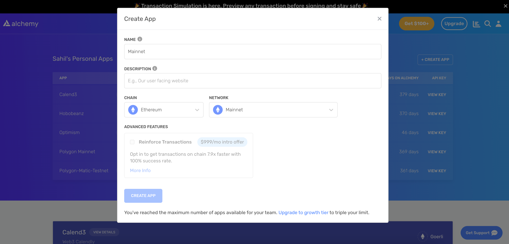

<Tip title="Don’t have an API key?" icon="star">
  Start using Alchemy APIs in your app today. [Get started for free](https://dashboard.alchemy.com/signup/?a=get-contracts-deployed-by-wallet)
</Tip>

# Introduction

In the world of Web3 development, you might want to find all the contracts deployed by a specific wallet address. This information can be useful for tracking / analyzing wallets and development activities. In this tutorial, we will walk you through how to programmatically retrieve all the contracts deployed by a wallet.



Alchemy SDK is the most comprehensive, stable, and powerful Javascript SDK available today to interact with the blockchain. We will be using Alchemy SDK's [getAssetTransfers](/reference/sdk-getassettransfers) method to fetch transaction data for a specific wallet address and, from there, extract the contracts deployed by it using the [getTransactionReceipt](/reference/sdk-gettransactionreceipt) method.

***

# The Gameplan

To achieve our goal, we will follow these steps:

1. First, we will use the [getAssetTransfers](/reference/sdk-getassettransfers) method of Alchemy SDK ([Alchemy's Transfers API](/reference/transfers-api-quickstart)) to fetch all transactions associated with the wallet address of interest. This method allows us to retrieve a list of transactions `to` or `from` the specified wallet address.

2. Next, we will filter the list of transactions to find only those where the `to` field is `null`. This condition indicates that the transaction resulted in the deployment of a new contract. This is true because when a contract is deployed, it does not have an address yet, as it does not exist on the blockchain. Therefore, the `to` field in the transaction is set to `null`.

3. Finally, for each of the filtered transactions, we will call the [getTransactionReceipt](/reference/sdk-gettransactionreceipt) method. This method will return the transaction receipt containing the contract address for the newly deployed contract.

4. We will store the addresses of the deployed contracts in an array and finally log that array to the console.

Now, let's execute our plan!

***

# Setting up the project

## Install Node and npm

In case you haven't already, [install node and npm](https://nodejs.org/en/download/) on your local machine.

Make sure that node is at least **v14 or higher** by typing the following in your terminal:

<CodeGroup>
  ```shell shell
  node -v
  ```
</CodeGroup>

***

## Create an Alchemy App

In case you haven't already, [sign up for a free Alchemy account](https://dashboard.alchemy.com/signup/?a=get-contracts-deployed-by-wallet).



Alchemy's account dashboard where developers can create a new app on the Ethereum blockchain.

Next, navigate to the [Alchemy Dashboard](https://dashboard.alchemy.com/signup/?a=get-contracts-deployed-by-wallet) and create a new app.

Make sure you set the chain to Ethereum and the network to Mainnet. Once the app is created, click on your app's *View Key* button on the dashboard.

Take note of the **HTTP URL**.

The URL will be in this form: `https://eth-mainnet.g.alchemy.com/v2/xxxxxxxxx`

You will need this later.

***

## Create a node project

Let's now create an empty repository and install all node dependencies.

Run the following commands in order to create your node project and install Alchemy SDK.

<CodeGroup>
  ```shell Alchemy SDK
  mkdir get-deployed-contracts && cd get-deployed-contracts
  npm init -y
  npm install --save alchemy-sdk
  touch main.js
  ```
</CodeGroup>

This will create a repository named `get-deployed-contracts` that holds all your files and dependencies.

Next, open this repo in your favorite code editor.

Now our project is set up and we are ready to write code. We will write all our code in the `main.js` file.

***

# Writing and Testing the Script

## Coding the Script

The script below utilizes Alchemy's SDK to find all the contract addresses deployed by a wallet address:

<CodeGroup>
  ```javascript getDeployedContracts.js
  // Import the necessary modules from the Alchemy SDK
  const { Network, Alchemy } = require("alchemy-sdk");

  // Initialize the Alchemy instance with the API key and network
  const alchemy = new Alchemy({
    apiKey: "demo", // Replace with your Alchemy API Key.
    network: Network.ETH_MAINNET,
  });

  // Define the asynchronous function that will retrieve deployed contracts
  async function findContractsDeployed(address) {
    const transfers = [];

    // Paginate through the results using getAssetTransfers method
    let response = await alchemy.core.getAssetTransfers({
      fromBlock: "0x0",
      toBlock: "latest", // Fetch results up to the latest block
      fromAddress: address, // Filter results to only include transfers from the specified address
      excludeZeroValue: false, // Include transfers with a value of 0
      category: ["external"], // Filter results to only include external transfers
    });
    transfers.push(...response.transfers);

    // Continue fetching and aggregating results while there are more pages
    while (response.pageKey) {
      let pageKey = response.pageKey;
      response = await alchemy.core.getAssetTransfers({
        fromBlock: "0x0",
        toBlock: "latest",
        fromAddress: address,
        excludeZeroValue: false,
        category: ["external"],
        pageKey: pageKey,
      });
      transfers.push(...response.transfers);
    }

    // Filter the transfers to only include contract deployments (where 'to' is null)
    const deployments = transfers.filter((transfer) => transfer.to === null);
    const txHashes = deployments.map((deployment) => deployment.hash);

    // Fetch the transaction receipts for each of the deployment transactions
    const promises = txHashes.map((hash) =>
      alchemy.core.getTransactionReceipt(hash)
    );

    // Wait for all the transaction receipts to be fetched
    const receipts = await Promise.all(promises);
    const contractAddresses = receipts.map((receipt) => receipt?.contractAddress);
    return contractAddresses;
  }

  // Define the main function that will execute the script
  async function main() {
    const address = "opensea.eth"; // Replace with the address you want to query the deployed contracts for - can be ENS name or address hash

    // Call the findContractsDeployed function to retrieve the array of deployed contracts
    const contractAddresses = await findContractsDeployed(address);

    // Log the contract addresses in a readable format by looping through the array
    console.log(`The following contracts were deployed by ${address}:`);
    for (let i = 0; i < contractAddresses.length; i++) {
      console.log(`${i + 1}. ${contractAddresses[i]}`);
    }
  }

  // Call the main function to start the script
  main();
  ```
</CodeGroup>

Let's break down the code in bullet points:

* The script first imports the necessary modules from the Alchemy SDK and initializes an Alchemy instance with the provided API key and network.
* Then, it defines an asynchronous function `findContractsDeployed` that accepts a wallet address as its argument.
* Inside the `findContractsDeployed` function, it fetches the transaction history of the wallet address using Alchemy's [`getAssetTransfers`](/reference/sdk-getassettransfers) method.
* The script paginates through the results and aggregates them in the `transfers` array.
* It then filters the transfers to only include contract deployments by checking if the `"to"` property is `null`.
* Then it maps the filtered deployments to their corresponding transaction hashes and fetches the transaction receipts for each of the deployment transactions using Alchemy's [`getTransactionReceipt`](/reference/sdk-gettransactionreceipt) method.
* Finally, the script waits for all the transaction receipts to be fetched and maps them to their respective deployed contract addresses using the `contractAddress` property in the transaction receipt.
* The function then returns the array of these contract addresses.
* The main function initializes the wallet address and calls the `findContractsDeployed` function to get the array of contract addresses deployed by the given wallet address.
* It then loops through the array to display the contract addresses in a readable format.

<Info>
  If you are facing the `"ENS name not configured"` error, try replacing the `"demo"` API key with your own API key that you copied in the ["Create an Alchemy App"](#create-an-alchemy-app) section.
</Info>

***

## Testing the Script

Now let's test our script to verify if it's working properly. Run your script using the command below:

<CodeGroup>
  ```shell shell
  node main.js
  ```
</CodeGroup>

You should see an output listing the contract addresses deployed by the given wallet address:

<CodeGroup>
  ```shell output
  The following contracts were deployed by opensea.eth:
  1. 0x05a3d4001e0b116f1B93AB4C2B2CA6FDC5E959D8
  2. 0xE1Fb91513f0B2B8627027B2702E1828F73Ad7bC5
  3. 0xfe32125731d36b91569Df1Ac14343890b5D068EE
  4. 0x1f52b87C3503e537853e160adBF7E330eA0Be7C4
  5. 0xB841F548C6C91AD85A3a2231A255a27D55928B3b
  6. 0x4F1E7894ae94AB7794b852Acbc3C692b6640AE92
  7. 0x65FdBc96Dd1dA4556b259dba3b64C9e60D59E4AA
  8. 0x23B45c658737b12f1748CE56E9B6784B5e9f3fF8
  9. 0xD6cbA47Db4e200f40857f99e1912EaA8ee016c53
  10. 0x78997E9e939DAfFE7EB9ed114FBF7128D0cfcD39
  11. 0x6556D909BcC60F7a749D8075f500A6e86AD5A535
  12. 0x35f7319878556806E9f5B66F9d3B4506c16D3BBb
  13. 0x50Db780cD7eF57BC1f982aFc7C6388f8eF758D2A
  14. 0x9073A39dCeF76658d17f0EBaAA355c8fB988e2bE
  15. 0x5e30B1d6f920364c847512E2528efdAdF72a97A9
  16. 0xc2ae41bbC013a90000Cba1100B0695ECbD86D5f4
  17. 0x495f947276749Ce646f68AC8c248420045cb7b5e
  ```
</CodeGroup>

***

# Conclusion

In this tutorial, we learned how to programmatically retrieve all the contracts deployed by a wallet address.

By following the code and explanations provided, you should now be able to adapt this script to suit your specific needs or integrate it into a larger project.

If you have any questions or need further assistance, feel free to join [Alchemy's Discord](https://discord.com/invite/alchemyplatform) and engage with the community. Also, don't forget to follow Alchemy on Twitter [@Alchemy](https://twitter.com/Alchemy) for the latest updates and news.
