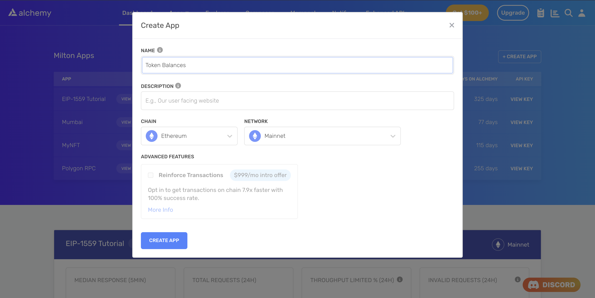
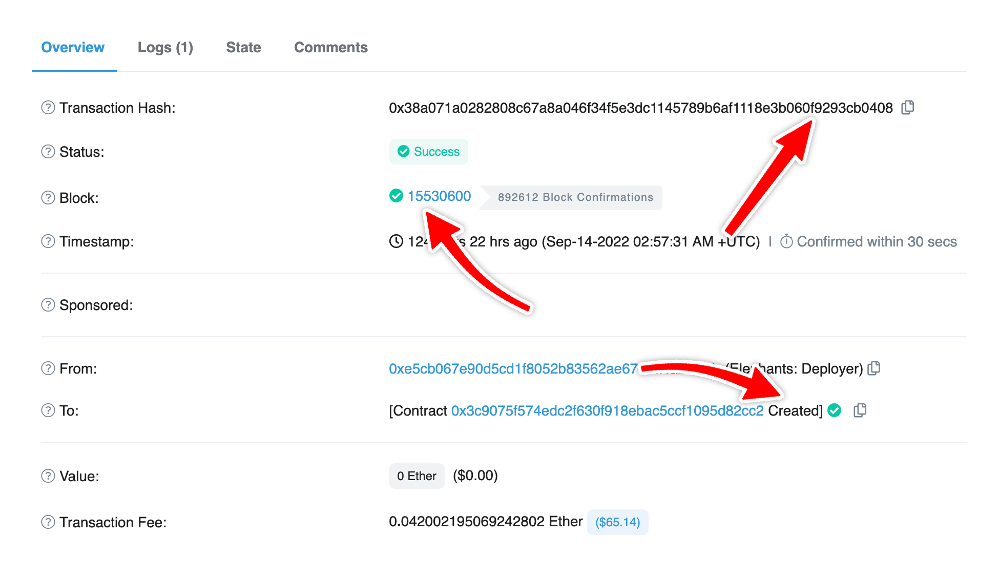

<Tip title="Don’t have an API key?" icon="star">
  Sign up to get access. [Get started for free](https://dashboard.alchemy.com/signup)
</Tip>

<Info>
  This tutorial uses the [getBlockWithTransactions](/reference/sdk-getblockwithtransactions) and [getBlock](/reference/sdk-getblock) endpoints.
</Info>

***

# Introduction

A transaction that represents the creation of a new smart contract is called a ***contract deployment transaction***. These transactions provide valuable information about the creation of new contracts, such as the address of the contract, the code, and the parameterss passed to the contract's constructor. Apps like **Opensea** use contract deployment transactions to monitor the deployment of new NFT contracts on the network.

In this tutorial, we will be using Viem and Ethers.js to retrieve contract deployment transactions in a specific block on the Ethereum blockchain. The same applies to any EVM blockchain. So, let's get started by setting up the developer environment!

# Developer Environment Setup

## Step 1: Install Node and NPM

In case you haven't already, [install node and npm](https://nodejs.org/en/download/) on your local machine.

Make sure that node is at least **v14 or higher** by typing the following in your terminal:

<CodeGroup>
  ```shell shell
  node -v
  ```
</CodeGroup>

***

## Step 2: Create an Alchemy App

In case you haven't already, [sign up for a free Alchemy account](https://dashboard.alchemy.com/signup).



Alchemy's account dashboard where developers can create a new app on the Ethereum blockchain.

Next, navigate to the [Alchemy Dashboard](https://dashboard.alchemy.com/signup) and [create a new app](/reference/alchemy-quickstart-guide). Make sure you set the chain to Ethereum and the network to Mainnet. Once the app is created, click on your app's *View Key* button on the dashboard. Take note of the **API KEY**.

You will need this later.

***

## Step 3: Create a Node Project

Let's now create an empty repository and install all the node dependencies.

<CodeGroup>
  ```shell shell
  mkdir get-contractDeployments && get-contractDeployments
  npm init -y
  npm install viem ethers
  touch main.js
  ```
</CodeGroup>

This will create a repository named `get-contractDeployments` that holds all your files and dependencies. Next, open this repo in your favorite code editor. We will write our code in the `main.js` file.

***

# Getting Contract Deployment Transactions

We will look at two ways in which we can find the contract deployment transactions in a block:

* The first approach uses the fact that there is no `to` address for a contract deployment transaction. This is true because when a contract is deployed, it does not have an address yet, as it does not exist on the blockchain. Therefore, the `to` field in the transaction is set to `null`.
* The second approach identifies a contract deployment transaction by looking at the type of `OPCODE` for the transaction. If the `type` is `CREATE` or `CREATE2` then it is a contract deployment transaction, otherwise not.

<Info>
  CREATE and CREATE2 are OPCODES that are observed during a contract deployment.

  CREATE is the original way of creating a new smart contract. It deploys a smart contract by creating a new contract address. The contract address is determined by the contract creator's address and the nonce of the creator's account.

  CREATE2, on the other hand, is a more recent addition to the Ethereum protocol, introduced in the Constantinople hard fork. It allows for the creation of contracts at a specified address, determined by the combination of a salt value and the contract code's keccak256 hash. This allows for more flexibility when creating smart contracts. For more information read Alchemy's guide on [deriving contract addresses using CREATE2](/docs/create2-an-alternative-to-deriving-contract-addresses).

  Both CREATE and CREATE2 transactions have the `to` field set to null because the contract address is not known at the time of deployment.
</Info>

## Approach 1: The `to` address

### Writing the script

Add the following code to the `main.js` file. Here's an overview of what the code is doing (also explained in the comments):

1. The code imports the necessary modules from Viem and Ethers.js.
2. Configures the API Key and network to interact with the Ethereum blockchain.
3. Creates a new instance of the Alchemy class using the previously defined settings to interact with the SDK.
4. Declares a variable `blockHashOrNumber` and assigns it a block number or hash.
5. Uses the `getBlockWithTransactions` method to retrieve information about the block and its transactions.
6. Retrieves the transactions in the block.
7. Creates an array `contractDeploymentTxHashes` to store the transaction hashes of contract deployment transactions.
8. Loops through the transactions in the block, checking if each transaction is a contract deployment by checking if the `to` address is `null`.
9. If the transaction is a contract deployment, add its tx hash to the array of contract deployment transaction hashes.
10. Logs the array of contract deployment transaction hashes.

<CodeGroup>
  ```javascript Viem
  import { createPublicClient, http } from 'viem'
  import { mainnet } from 'viem/chains'

  // Replace with your Alchemy API Key
  const apiKey = "demo";

  const client = createPublicClient({
    chain: mainnet,
    transport: http(`https://eth-mainnet.g.alchemy.com/v2/${apiKey}`)
  })

  async function main() {
    try {
      // Block number to get contract deployment transactions from
      const blockNumber = BigInt(15530600);

      // Getting the block with transactions
      const block = await client.getBlock({
        blockNumber: blockNumber,
        includeTransactions: true
      });

      // Creating an array to store the tx hashes of contract deployment transactions
      const contractDeploymentTxHashes = [];

      // Looping through the transactions and checking if they are contract deployments
      for (const tx of block.transactions) {
        // Checking if the transaction is a contract deployment (to address is null)
        if (tx.to === null) {
          contractDeploymentTxHashes.push(tx.hash);
        }
      }

      // Logging the array of contract deployment transaction hashes
      console.log('Contract deployment transaction hashes:');
      console.log(contractDeploymentTxHashes);
    } catch (error) {
      console.error('Error:', error);
    }
  }

  main();
  ```

  ```javascript Ethers.js
  import { ethers } from 'ethers'

  // Replace with your Alchemy API Key
  const apiKey = "demo";
  const provider = new ethers.JsonRpcProvider(`https://eth-mainnet.g.alchemy.com/v2/${apiKey}`);

  async function main() {
    try {
      // Block number to get contract deployment transactions from
      const blockNumber = 15530600;

      // Getting the block with transactions
      const block = await provider.getBlock(blockNumber, true);

      if (!block || !block.transactions) {
        console.log('Block not found or no transactions');
        return;
      }

      // Creating an array to store the tx hashes of contract deployment transactions
      const contractDeploymentTxHashes = [];

      // Looping through the transactions and checking if they are contract deployments
      for (const tx of block.transactions) {
        // Checking if the transaction is a contract deployment (to address is null)
        if (tx.to === null) {
          contractDeploymentTxHashes.push(tx.hash);
        }
      }

      // Logging the array of contract deployment transaction hashes
      console.log('Contract deployment transaction hashes:');
      console.log(contractDeploymentTxHashes);
    } catch (error) {
      console.error('Error:', error);
    }
  }

  main();
  ```
</CodeGroup>

***

### Testing the Script

Run the script using the following command:

<CodeGroup>
  ```shell terminal
  node main.js
  ```
</CodeGroup>

You should see an array containing the transaction hashes of contract deployment transactions in the block as the output.

<CodeGroup>
  ```json json
  [
    '0x38a071a0282808c67a8a046f34f5e3dc1145789b6af1118e3b060f9293cb0408'
  ]
  ```
</CodeGroup>

In this case, we only had 1 contract deployment transaction in the given block. You can check out this transaction on [Etherscan](https://etherscan.io/tx/0x38a071a0282808c67a8a046f34f5e3dc1145789b6af1118e3b060f9293cb0408).



***

## Approach 2: OPCODES

### Writing the script

Add the following code to the `main.js` file. Here's an overview of what the code is doing (also explained in the comments):

1. The code imports the necessary modules from Viem and Ethers.js.
2. Configures the API Key and network to interact with the Ethereum blockchain.
3. Creates a new instance of the Alchemy class using the previously defined settings to interact with the SDK.
4. Declares a variable `blockHashOrNumber` and assigns it a block number or hash.
5. Uses the `getBlock` method to retrieve information about the block.
6. Extracts the transaction hashes of all the transactions in the block.
7. Creates an array `contractDeploymentTxHashes` to store the transaction hashes of contract deployment transactions.
8. Loops through the transaction hashes in the block.
9. For each transaction hash it uses the `traceTransaction` method of `debug` namespace to get the traces for that transaction.
10. Checking if the transaction is a contract deployment by checking the type of transaction, if it is "CREATE" or "CREATE2".
11. If the transaction is a contract deployment, add its tx hash to the array of contract deployment transaction hashes.
12. Logs the array of contract deployment transaction hashes.

<CodeGroup>
  ```javascript main.js
  // Note: This approach uses debug_traceTransaction which requires archive node access
  // and is significantly slower than Approach 1

  async function main() {
    // Replace with your Alchemy API Key
    const apiKey = "demo";
    const url = `https://eth-mainnet.g.alchemy.com/v2/${apiKey}`;

    // Block number to get contract deployment transactions from
    const blockNumber = 15530600;

    // First get the block to extract transaction hashes
    const blockResponse = await fetch(url, {
      method: 'POST',
      headers: { 'Content-Type': 'application/json' },
      body: JSON.stringify({
        jsonrpc: '2.0',
        id: 1,
        method: 'eth_getBlockByNumber',
        params: [`0x${blockNumber.toString(16)}`, false]
      })
    });

    const blockData = await blockResponse.json();
    const blockTxHashes = blockData.result.transactions;

    // Creating an array to store the tx hashes of contract deployment transactions
    const contractDeploymentTxHashes = [];

    console.log("getting the contract deployment transactions...");

    // Looping through the transactions of block and for each transaction checking if it is a contract deployment transaction
    for (const txHash of blockTxHashes) {
      try {
        // Using the debug_traceTransaction method to get the trace of the transaction
        const traceResponse = await fetch(url, {
          method: 'POST',
          headers: { 'Content-Type': 'application/json' },
          body: JSON.stringify({
            jsonrpc: '2.0',
            id: 1,
            method: 'debug_traceTransaction',
            params: [txHash, { tracer: 'callTracer' }]
          })
        });

        const traceData = await traceResponse.json();

        if (traceData.result) {
          // Checking if the transaction is a contract deployment (because CREATE and CREATE2 OPCODES are used for contract deployments)
          const isContractDeployment =
            traceData.result.type === "CREATE" || traceData.result.type === "CREATE2";

          // If the transaction is a contract deployment, add its tx hash to the array of contract deployment transaction hashes
          if (isContractDeployment) {
            contractDeploymentTxHashes.push(txHash);
          }
        }
      } catch (error) {
        console.error(`Error tracing transaction ${txHash}:`, error);
      }
    }

    // Logging the array of contract deployment transaction hashes
    console.log('Contract deployment transaction hashes:');
    console.log(contractDeploymentTxHashes);
  }

  // Calling the main function to run the code
  main().catch(console.error);
  ```
</CodeGroup>

***

### Testing the Script

Run the script using the following command:

<CodeGroup>
  ```shell terminal
  node main.js
  ```
</CodeGroup>

You should see an array containing the transaction hashes of contract deployment transactions in the block as the output.

<CodeGroup>
  ```json terminal
  getting the contract deployment transactions...
  [
    '0x38a071a0282808c67a8a046f34f5e3dc1145789b6af1118e3b060f9293cb0408'
  ]
  ```
</CodeGroup>

## Comparing the Two Approaches

1. **Number of API Calls:** In terms of API calls, [Approach 1](#approach-1-the-to-address) (checking if the `to` address is `null`) is better than [Approach 2](#approach-2-opcodes) (checking for `CREATE` and `CREATE2` OPCODES) because in the first method, we are only making one API call to the `getBlockWithTransactions` endpoint but in the second approach, we first get the transaction hashes for all the transactions in the block using the `getBlock` method and then for each transaction hash we call the `traceTransaction` method to get the traces for that transaction. So, if there are `n` transactions in the block, we are making `n + 1` API calls in the second approach but only 1 using the first approach.

2. **Speed:** It takes time to make an API call as the request is sent to the server and the response is returned over the network. Due to more API calls, the second approach becomes slower than the first.

Therefore, generally, you would prefer the first approach but there might be cases when you are already making those API calls for doing some other stuff in your code, in those cases, you can use the second approach as well.

# Conclusion

Congratulations! You now know how to get contract deployment transactions in a block 🎉

If you have any questions or feedback, please contact us at <Markdown src="../../../../snippets/support-email.mdx" /> or open a ticket in the dashboard.
