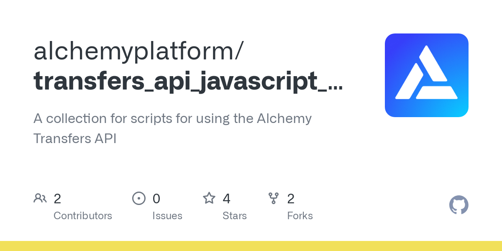
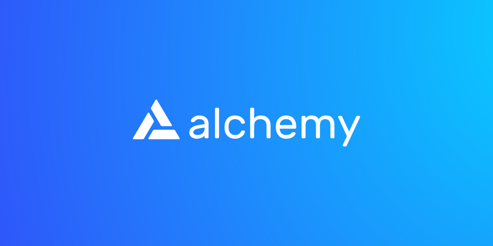

<Info>
  This tutorial uses the **[alchemy\_getAssetTransfers](/reference/alchemy-getassettransfers)** endpoint.
</Info>

If you just need the script for this tutorial refer to the below Recipe or continue reading for more:

🔄

Script to Get Transaction History for an Address on Ethereum

Open Recipe

A few reasons for why you'd want to get address transaction history by an address:

* Displaying your a user’s full transaction history
* Querying an address's transactions filtered by smart contract interactions
* Analyzing a user's historical profit and loss

Regardless of the different types of transaction history, you want to look up, this process can be extremely burdensome for developers to stitch together without the [Alchemy Transfers API](/reference/transfers-api)

**In this tutorial, we’ll be using Alchemy’s [Transfers API](/reference/transfers-api) to fetch all transactions sent *`from`* and sent *`to`* addresses you care about to create a complete picture of a user's transaction history.**

***

## How to query transaction history

When using the [Transfers API](/reference/transfers-api) for querying a user’s full on-chain history, it's important to have a few key parameters on hand.

* `fromAddress`: the address we want to see transaction information originating from
* `toAddress`: the address we want to see for recipient-based transactions
* `fromBlock`: the starting time range we want to fetch transactions over (defaults to `latest`)
* `toBlock` : the ending time range we want to fetch transactions over (defaults to `latest`)
* `category`: the type of transfer events we care about, in our case we want to see all transactions so we can simply let the param use its default argument of \["`external`", "`internal`", "`token`"]

For transaction information that originates from your target sender address, use the `fromAddress` parameter within the [Transfers API](/reference/transfers-api). For recipient-based transactions, use the `toAddress` parameter.

<Info>
  If you want to get transactions that have a specific `from` and `to` address, you can specify the `fromAddress` and `toAddress` in your request.
</Info>

***

### Example: Getting Transactions Originating `From` An Address

<Check>
  **For a no-code view of the API request check out the [composer tool](https://composer.alchemyapi.io/?composer_state=%7B%22chain%22%3A0%2C%22network%22%3A0%2C%22methodName%22%3A%22alchemy_getAssetTransfers%22%2C%22paramValues%22%3A%5B%7B%22excludeZeroValue%22%3Atrue%2C%22toAddress%22%3A%22%22%2C%22toBlock%22%3A%22%22%2C%22fromAddress%22%3A%220x5c43B1eD97e52d009611D89b74fA829FE4ac56b1%22%2C%22fromBlock%22%3A%220x0%22%7D%5D%7D)**
</Check>

#### Alchemy SDK (Recommended)

[Alchemy's SDK](/reference/alchemy-sdk-quickstart) allows us to more efficiently interact with Alchemy's endpoints and make JSON-RPC requests.

[](https://github.com/alchemyplatform/transfers_api_javascript_scripts/blob/main/javascript/alchemyweb3/tx-history/tx-history-from-alchemyweb3.js)

[github.com](https://github.com/alchemyplatform/transfers_api_javascript_scripts/blob/main/javascript/alchemyweb3/tx-history/tx-history-from-alchemyweb3.js)

[transfers\_api\_javascript\_scripts/tx-history-from-alchemyweb3.js at main · alchemyplatform/transfers\_api\_javascript\_scripts](https://github.com/alchemyplatform/transfers_api_javascript_scripts/blob/main/javascript/alchemyweb3/tx-history/tx-history-from-alchemyweb3.js)

Ensure you are inside your project folder and type the following command in the terminal:

<CodeGroup>
  ```shell Shell
  npm install alchemy-sdk
  ```
</CodeGroup>

##### 1. Create a file.

In your current directory, create a new file called `tx-history-from-alchemy-sdk.js`

Use your favorite file browser, code editor, or just directly in the terminal using the `touch` command like this:

<CodeGroup>
  ```shell shell
  touch tx-history-from-alchemy-sdk.js
  ```
</CodeGroup>

##### 2. Write script!

Copy and paste the following code snippet into your new file: `tx-history-from-alchemy-sdk.js`

<CodeGroup>
  ```javascript tx-history-from-alchemy-sdk.js
  // Setup: npm install alchemy-sdk
  import { Alchemy, Network } from "alchemy-sdk";

  const config = {
    apiKey: "<-- ALCHEMY APP API KEY -->",
    network: Network.ETH_MAINNET,
  };
  const alchemy = new Alchemy(config);

  const data = await alchemy.core.getAssetTransfers({
    fromBlock: "0x0",
    fromAddress: "0x5c43B1eD97e52d009611D89b74fA829FE4ac56b1",
    category: ["external", "internal", "erc20", "erc721", "erc1155"],
  });

  console.log(data);
  ```
</CodeGroup>

##### 3. Run script!

Now, on your command line, you can execute the script by calling:

<CodeGroup>
  ```shell shell
  node tx-history-from-alchemy-sdk.js
  ```
</CodeGroup>

#### Node-Fetch

If you're using `node-fetch` a lightweight, common module that brings the Fetch API to Node.js and allows us to make our HTTP requests, here's a code snipper for the request you'd make!

[](https://github.com/alchemyplatform/transfers_api_javascript_scripts/blob/main/javascript/axios/tx-history/tx-history-from-axios.js)

[github.com](https://github.com/alchemyplatform/transfers_api_javascript_scripts/blob/main/javascript/axios/tx-history/tx-history-from-axios.js)

[transfers\_api\_javascript\_scripts/tx-history-from-axios.js at main · alchemyplatform/transfers\_api\_javascript\_scripts](https://github.com/alchemyplatform/transfers_api_javascript_scripts/blob/main/javascript/axios/tx-history/tx-history-from-axios.js)

##### 1. Create a file.

In your current directory, create a new file called `tx-history-from-fetch.js` using your favorite file browser, code editor, or just directly in the terminal using the `touch` command like this:

<CodeGroup>
  ```shell shell
  touch tx-history-from-fetch.js
  ```
</CodeGroup>

##### 2. Write script!

Copy and paste in the following code snippet into your new file: `tx-history-from-fetch.js`

<CodeGroup>
  ```javascript tx-history-from-fetch.js
  import fetch from 'node-fetch';

    let data = JSON.stringify({
    "jsonrpc": "2.0",
    "id": 0,
    "method": "alchemy_getAssetTransfers",
    "params": [
      {
        "fromBlock": "0x0",
        "fromAddress": "0x5c43B1eD97e52d009611D89b74fA829FE4ac56b1",
      }
    ]
  });

    var requestOptions = {
      method: 'POST',
      headers: { 'Content-Type': 'application/json' },
      body: data,
      redirect: 'follow'
    };

    const apiKey = "demo"
    const baseURL = `https://eth-mainnet.g.alchemy.com/v2/${apiKey}`;
    const fetchURL = `${baseURL}`;

    fetch(fetchURL, requestOptions)
      .then(response => response.json())
      .then(response => JSON.stringify(response, null, 2))
      .then(result => console.log(result))
      .catch(error => console.log('error', error));
  ```
</CodeGroup>

##### 3. Run script!

<CodeGroup>
  ```shell shell
  node tx-history-from-fetch.js
  ```
</CodeGroup>

#### Axios

If you're using Javascript `axios`, a promise-based HTTP client for the browser and Node.js which allows us to make a raw request to the Alchemy API, here's a code snipper for the request you'd make!

[](https://github.com/alchemyplatform/transfers_api_javascript_scripts/blob/main/javascript/fetch/tx-history/tx-history-from-fetch.js)

[github.com](https://github.com/alchemyplatform/transfers_api_javascript_scripts/blob/main/javascript/fetch/tx-history/tx-history-from-fetch.js)

[transfers\_api\_javascript\_scripts/tx-history-from-fetch.js at main · alchemyplatform/transfers\_api\_javascript\_scripts](https://github.com/alchemyplatform/transfers_api_javascript_scripts/blob/main/javascript/fetch/tx-history/tx-history-from-fetch.js)

##### 1. Create a file.

In your current directory, create a new file called `tx-history-from-axios.js` using your favorite file browser, code editor, or just directly in the terminal using the `touch` command.

<CodeGroup>
  ```shell shell
  touch tx-history-from-axios.js
  ```
</CodeGroup>

##### 2. Write script!

Copy and paste the following code snippet into your new file: `tx-history-from-axios.js`

<CodeGroup>
  ```javascript tx-history-from-axios.js
  import axios from 'axios';

    let data = JSON.stringify({
    "jsonrpc": "2.0",
    "id": 0,
    "method": "alchemy_getAssetTransfers",
    "params": [
      {
        "fromBlock": "0x0",
        "fromAddress": "0x5c43B1eD97e52d009611D89b74fA829FE4ac56b1",
      }
    ]
  });

    var requestOptions = {
      method: 'post',
      headers: { 'Content-Type': 'application/json' },
      data: data,
    };

    const apiKey = "demo"
    const baseURL = `https://eth-mainnet.g.alchemy.com/v2/${apiKey}`;
    const axiosURL = `${baseURL}`;

    axios(axiosURL, requestOptions)
      .then(response => console.log(JSON.stringify(response.data, null, 2)))
      .catch(error => console.log(error));
  ```
</CodeGroup>

##### 3. Run script!

Now, on your command line, you can execute the script by calling:

<CodeGroup>
  ```shell shell
  node tx-history-from-axios.js
  ```
</CodeGroup>

***

### Example: Getting Recipient-based Transactions

<Check>
  \**For a no-code view of the API request check out the [composer tool](https://composer.alchemyapi.io/?composer_state=%7B%22chain%22%3A0%2C%22network%22%3A0%2C%22methodName%22%3A%22alchemy_getAssetTransfers%22%2C%22paramValues%22%3A%5B%7B%22excludeZeroValue%22%3Atrue%2C%22toAddress%22%3A%220x5c43B1eD97e52d009611D89b74fA829FE4ac56b1%22%2C%22toBlock%22%3A%22%22%2C%22fromAddress%22%3A%22%22%2C%22fromBlock%22%3A%220x0%22%7D%5D%7D)*
</Check>

#### Alchemy SDK (Recommended)

[Alchemy's SDK](/reference/alchemy-sdk-quickstart) allows us to more efficiently interact with Alchemy's endpoints and make JSON-RPC requests.

[](https://github.com/alchemyplatform/transfers_api_javascript_scripts/blob/main/javascript/alchemyweb3/tx-history/tx-history-to-alchemyweb3.js)

[github.com](https://github.com/alchemyplatform/transfers_api_javascript_scripts/blob/main/javascript/alchemyweb3/tx-history/tx-history-to-alchemyweb3.js)

[transfers\_api\_javascript\_scripts/tx-history-to-alchemyweb3.js at main · alchemyplatform/transfers\_api\_javascript\_scripts](https://github.com/alchemyplatform/transfers_api_javascript_scripts/blob/main/javascript/alchemyweb3/tx-history/tx-history-to-alchemyweb3.js)

Ensure you are inside your project folder and type the following command in the terminal:

<CodeGroup>
  ```shell Shell
  npm install alchemy-sdk
  ```
</CodeGroup>

##### 1. Create a file

In your current directory, create a new file called `alchemy-sdk-transfers-to-script.js`

Use your favorite file browser, code editor, or just directly in the terminal using the `touch` command like this:

<CodeGroup>
  ```shell Shell
  touch alchemy-sdk-transfers-to-script.js
  ```
</CodeGroup>

##### 2. Write script!

Copy and paste in the following code snippet into your new file: `alchemy-sdk-transfers-to-script.js`

<CodeGroup>
  ```javascript alchemy-sdk-transfers-to-script.js
  // Setup: npm install alchemy-sdk
  import { Alchemy, Network } from "alchemy-sdk";

  const config = {
    apiKey: "<-- ALCHEMY APP API KEY -->",
    network: Network.ETH_MAINNET,
  };
  const alchemy = new Alchemy(config);

  const data = await alchemy.core.getAssetTransfers({
    fromBlock: "0x0",
    toAddress: "0x5c43B1eD97e52d009611D89b74fA829FE4ac56b1",
    category: ["external", "internal", "erc20", "erc721", "erc1155"],
  });

  console.log(data);
  ```
</CodeGroup>

##### 3. Run script!

Now, on your command line, you can execute the script by calling:

<CodeGroup>
  ```shell shell
  node alchemy-sdk-transfers-to-script.js
  ```
</CodeGroup>

#### Node-Fetch

If you're using `node-fetch` a lightweight, common module that brings the Fetch API to Node.js and allows us to make our HTTP requests, here's a code snipper for the request you'd make!

[](https://github.com/alchemyplatform/transfers_api_javascript_scripts/blob/main/javascript/fetch/tx-history/tx-history-to-fetch.js)

[github.com](https://github.com/alchemyplatform/transfers_api_javascript_scripts/blob/main/javascript/fetch/tx-history/tx-history-to-fetch.js)

[transfers\_api\_javascript\_scripts/tx-history-to-fetch.js at main · alchemyplatform/transfers\_api\_javascript\_scripts](https://github.com/alchemyplatform/transfers_api_javascript_scripts/blob/main/javascript/fetch/tx-history/tx-history-to-fetch.js)

##### 1. Create a file.

In your current directory, create a new file called `fetch-transfers-to-script.js` using your favorite file browser, code editor, or just directly in the terminal using the `touch` command like this:

<CodeGroup>
  ```shell shell
  touch fetch-transfers-to-script.js
  ```
</CodeGroup>

##### 2. Write script!

Copy and paste in the following code snippet into your new file: `fetch-transfers-to-script.js`

<CodeGroup>
  ```javascript fetch-transfers-to-script.js
  import fetch from 'node-fetch';

    let data = JSON.stringify({
    "jsonrpc": "2.0",
    "id": 0,
    "method": "alchemy_getAssetTransfers",
    "params": [
      {
        "fromBlock": "0x0",
        "toAddress": "0x5c43B1eD97e52d009611D89b74fA829FE4ac56b1",
      }
    ]
  });

    var requestOptions = {
      method: 'POST',
      headers: { 'Content-Type': 'application/json' },
      body: data,
      redirect: 'follow'
    };

    const apiKey = "demo"
    const baseURL = `https://eth-mainnet.g.alchemy.com/v2/${apiKey}`;
    const fetchURL = `${baseURL}`;

    fetch(fetchURL, requestOptions)
      .then(response => response.json())
      .then(response => JSON.stringify(response, null, 2))
      .then(result => console.log(result))
      .catch(error => console.log('error', error));
  ```
</CodeGroup>

##### 3. Run script!

Now, on your command line, you can execute the script by calling:

<CodeGroup>
  ```shell shell
  node fetch-transfers-from-script.js
  ```
</CodeGroup>

#### Axios

If you're using Javascript `axios`, a promise-based HTTP client for the browser and Node.js which allows us to make a raw request to the Alchemy API, here's a code snipper for the request you'd make!

[](https://github.com/alchemyplatform/transfers_api_javascript_scripts/blob/main/javascript/axios/tx-history/tx-history-to-axios.js)

[github.com](https://github.com/alchemyplatform/transfers_api_javascript_scripts/blob/main/javascript/axios/tx-history/tx-history-to-axios.js)

[transfers\_api\_javascript\_scripts/tx-history-to-axios.js at main · alchemyplatform/transfers\_api\_javascript\_scripts](https://github.com/alchemyplatform/transfers_api_javascript_scripts/blob/main/javascript/axios/tx-history/tx-history-to-axios.js)

##### 1. Create a file.

In your current directory, create a new file called `axios-transfers-to-script.js` using your favorite file browser, code editor, or just directly in the terminal using the `touch` command.

<CodeGroup>
  ```shell shell
  touch axios-transfers-to-script.js
  ```
</CodeGroup>

##### 2. Write script!

Copy and paste the following code snippet into your new file: `axios-transfers-to-script.js`

<CodeGroup>
  ```javascript axios-transfers-to-script.js
  import axios from 'axios';

    let data = JSON.stringify({
    "jsonrpc": "2.0",
    "id": 0,
    "method": "alchemy_getAssetTransfers",
    "params": [
      {
        "fromBlock": "0x0",
        "toAddress": "0x5c43B1eD97e52d009611D89b74fA829FE4ac56b1",
      }
    ]
  });

    var requestOptions = {
      method: 'post',
      headers: { 'Content-Type': 'application/json' },
      data: data,
    };

    const apiKey = "demo"
    const baseURL = `https://eth-mainnet.g.alchemy.com/v2/${apiKey}`;
    const axiosURL = `${baseURL}`;

    axios(axiosURL, requestOptions)
      .then(response => console.log(JSON.stringify(response.data, null, 2)))
      .catch(error => console.log(error));
  ```
</CodeGroup>

##### 3. Run script!

Now, on your command line, you can execute the script by calling:

<CodeGroup>
  ```shell shell
  node axios-transfers-to-script.js
  ```
</CodeGroup>

***

## How to process the API response

Now that we have made a query and can see the response, let's learn how to handle it. If you feel like jumping ahead and grabbing some pre-built code, choose a repo that matches your preferred library.

### Alchemy SDK (Recommended)

#### Parsing with `Alchemy SDK` Responses

[](https://github.com/alchemyplatform/transfers_api_javascript_scripts/blob/main/javascript/alchemyweb3/tx-history/tx-history-parsed-alchemyweb3.js)

[github.com](https://github.com/alchemyplatform/transfers_api_javascript_scripts/blob/main/javascript/alchemyweb3/tx-history/tx-history-parsed-alchemyweb3.js)

[transfers\_api\_javascript\_scripts/tx-history-parsed-alchemyweb3.js at main · alchemyplatform/transfers\_api\_javascript\_scripts](https://github.com/alchemyplatform/transfers_api_javascript_scripts/blob/main/javascript/alchemyweb3/tx-history/tx-history-parsed-alchemyweb3.js)

### Node-Fetch

#### Parsing with `Node-Fetch` Responses

[](https://github.com/alchemyplatform/transfers_api_javascript_scripts/blob/main/javascript/fetch/tx-history/tx-history-parsed-fetch.js)

[github.com](https://github.com/alchemyplatform/transfers_api_javascript_scripts/blob/main/javascript/fetch/tx-history/tx-history-parsed-fetch.js)

[transfers\_api\_javascript\_scripts/tx-history-parsed-fetch.js at main · alchemyplatform/transfers\_api\_javascript\_scripts](https://github.com/alchemyplatform/transfers_api_javascript_scripts/blob/main/javascript/fetch/tx-history/tx-history-parsed-fetch.js)

### Axios

#### Parsing with `Axios` Responses

[](https://github.com/alchemyplatform/transfers_api_javascript_scripts/blob/main/javascript/axios/tx-history/tx-history-parsed-axios.js)

[github.com](https://github.com/alchemyplatform/transfers_api_javascript_scripts/blob/main/javascript/axios/tx-history/tx-history-parsed-axios.js)

[transfers\_api\_javascript\_scripts/tx-history-parsed-axios.js at main · alchemyplatform/transfers\_api\_javascript\_scripts](https://github.com/alchemyplatform/transfers_api_javascript_scripts/blob/main/javascript/axios/tx-history/tx-history-parsed-axios.js)

### Raw API Response

Without parsing the response, we have a console log that looks as follows.

<CodeGroup>
  ```json json
  {
  "transfers": [
    {
      "blockNum": "0xb7389b",
      "hash": "0xfde2a5157eda40b90514751f74e3c7314f452a41890b19a342ee147f5336dfd6", 
      "from": "0x5c43b1ed97e52d009611d89b74fa829fe4ac56b1",
      "to": "0xe9b29ae1b4da8ba5b1de76bfe775fbc5e25bc69a",
      "value": 0.245,
      "erc721TokenId": null,
      "erc1155Metadata": null,
      "tokenId": null,
      "asset": "ETH",
      "category": "external",
      "rawContract": {}
    },
    {
      "blockNum": "0xcf5dea",
      "hash": "0x701f837467ae3112d787ddedf8051c4996ea82914f7a7735cb3db2d805799286",
      "from": "0x5c43b1ed97e52d009611d89b74fa829fe4ac56b1", 
      "to": "0x92560c178ce069cc014138ed3c2f5221ba71f58a",
      "value": 152.89962568845024,
      "erc721TokenId": null,
      "erc1155Metadata": null,
      "tokenId": null,
      "asset": "ENS",
      "category": "token",
      "rawContract": {}
    },
    {
      "blockNum": "0xd14898",
      "hash": "0x2f5d93a9db65548eb43794aa43698acd653e6b2df35c6028b8599a234f2c6dc0",
      "from": "0x5c43b1ed97e52d009611d89b74fa829fe4ac56b1",
      "to": "0x83abecf7204d5afc1bea5df734f085f2535a9976", 
      "value": 27579.060635486854,
      "erc721TokenId": null,
      "erc1155Metadata": null,
      "tokenId": null,
      "asset": "PEOPLE",
      "category": "token",
      "rawContract": {}
    }
  ]
  }
  ```
</CodeGroup>

#### Understanding API Response

* `blockNum`: the block number where a transaction event occurred, in `hex`

* `hash`: the transaction hash of a transaction

* `from`: where the transaction originated from

* `to`: where ETH or another asset was transferred to

* `value`: the amount of ETH transferred

* `erc721TokenId`: the ERC721 token ID. `null` if not an ERC721 token transfer.

* `erc1155Metadata`: a list of objects containing the ERC1155 `tokenId` and `value`. `null` if not an ERC1155 transfer

* `tokenId`: the token ID for ERC721 tokens or other NFT token standards

* `asset`: `ETH` or the token's symbol. `null` if not defined in the contract and not available from other sources.

* `rawContract`

  * `value`: raw transfer value denominated in the relevant Ethereum token
  * `address`: Ethereum token contract address
  * `decimal`: contract decimal

## Printing out the `asset` and `value`

Two of the many different response objects you may be interested in parsing are: `asset` and `value`.

Let's walk through an example that parses the returned JSON object.

Whether we're querying via `alchemy web3`, `axios`, or `node-fetch`, we'll need to save the queried response object into a constant.

### Alchemy SDK (Recommended)

#### Saving response objects with `Alchemy SDK`

<CodeGroup>
  ```javascript Alchemy SDK (Recommended)
  // Alchemy SDK

    const res = await alchemy.core.getAssetTransfers({
  		  fromBlock: "0x0",
  		  toAddress: "0x5c43B1eD97e52d009611D89b74fA829FE4ac56b1",
        category: ["external", "internal", "erc20", "erc721", "erc1155"],
    })
  ```
</CodeGroup>

### Node-Fetch

#### Saving response objects with `Node-Fetch`

<CodeGroup>
  ```javascript Node-fetch
  // Node-Fetch
    
    fetch(fetchURL, requestOptions)
      .then((res) => {
        return res.json()
      })
      .then((jsonResponse) => {
        //Print token name / asset value
        for (const events of jsonResponse.result.transfers) {
         console.log("Token Transfer: ", events.value, " ", events.asset);
        }
      })
      .catch((err) => {
        // handle error
        console.error(err);
      });
  ```
</CodeGroup>

### Axios

#### Saving response objects with `Axios`

<CodeGroup>
  ```javascript Axios
  // Axios
    
    const res = await axios(axiosURL, requestOptions);
  ```
</CodeGroup>

With our queried response object saved as a constant, we can now index through the transfers. In particular, the steps we take are:

1. Loop through all transfers in the result
2. Print each element's `value` and `asset` field

<CodeGroup>
  ```javascript javascript
  // Print token asset name and its associated value
    for (const events of res.data.result.transfers) {
      console.log("Token Transfer: ", events.value, " ", events.asset);
    }
  ```
</CodeGroup>

If you followed along, your response should look like the following:

<CodeGroup>
  ```shell response
  Token Transfer:  0.5   ETH
  Token Transfer:  0.27   ETH
  Token Transfer:  9.90384   ETH
  Token Transfer:  0.07024968   ETH
  Token Transfer:  0.000447494250654841   ETH
  Token Transfer:  null   null
  Token Transfer:  0.075   ETH
  Token Transfer:  0.003   ETH
  Token Transfer:  null   BURN
  Token Transfer:  54   DAI
  Token Transfer:  12.5   GTC
  Token Transfer:  2   GTC
  Token Transfer:  0.42   ETH
  ........
  Token Transfer:  0.588   WETH
  Token Transfer:  null   null
  Token Transfer:  null   null
  Token Transfer:  2.3313024   ETH
  Token Transfer:  0.0633910153108353   ETH
  Token Transfer:  0.0335   ETH
  Token Transfer:  2   GTC
  ```
</CodeGroup>

And that's it! You've now learned how to fetch transaction history for address on Ethereum. For more, check out the tutorial below:

[](https://docs.alchemy.com/alchemy/tutorials/transfers-tutorial)

[docs.alchemy.com](https://docs.alchemy.com/alchemy/tutorials/transfers-tutorial)

[Integrating Historical Transaction Data into your dApp](https://docs.alchemy.com/alchemy/tutorials/transfers-tutorial)

If you enjoyed this tutorial for getting address transaction history on Ethereum, give us a tweet [@Alchemy](https://twitter.com/Alchemy)! (Or give the author [@crypt0zeke](https://twitter.com/crypt0zeke) a shoutout!)

Don't forget to join our [Discord server](https://www.alchemy.com/discord) to meet other blockchain devs, builders, and entrepreneurs!
