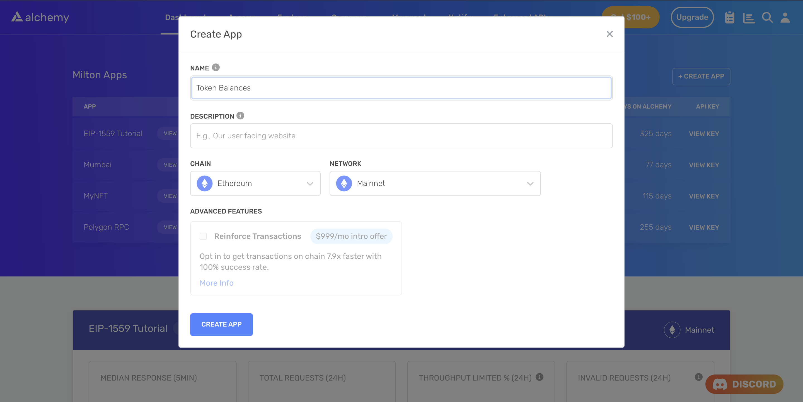

Learn how to get general information about a transaction using the `eth_getTransactionReceipt` method.

# Introduction

When you inspect a transaction on Etherscan, you get general information about the transaction as shown in the image below:


But what if you want to get this information programmatically in your app? You can show these details to the users of your app to give them more information about the transaction.

# About this Tutorial

***

We will write a simple script in `node.js` to get general details about a transaction using the transaction hash. We will use Alchemy's [getTransactionReceipt](/reference/sdk-gettransactionreceipt) API to get the transaction receipt for a transaction. The transaction receipt contains general information about a transaction.

# Writing the Script

***

## Step 1: Install Node and NPM

In case you haven't already, [install node and npm](https://nodejs.org/en/download/) on your local machine.

Make sure that node is at least **v14 or higher** by typing the following in your terminal:

<CodeGroup>
  ```shell shell
  node -v
  ```
</CodeGroup>

## Step 2: Create an Alchemy app

***

In case you haven't already, [sign up for a free Alchemy account](https://dashboard.alchemy.com/signup/?a=query-tx-details).



Alchemy's account dashboard where developers can create a new app on the Ethereum blockchain.

Next, navigate to the [Alchemy Dashboard](https://dashboard.alchemy.com/?a=query-tx-details) and create a new app.

Make sure you set the chain to Ethereum and the network to Mainnet.

Once the app is created, click on your app's *View Key* button on the dashboard.

Take note of the **HTTP URL**.

The URL will be in this form: `https://eth-mainnet.g.alchemy.com/v2/xxxxxxxxx`

You will need this later.

***

## Step 3: Create a node project

Let's now create an empty repository and install all node dependencies.

To make requests, we will use the [Alchemy SDK](/reference/alchemy-sdk-quickstart).

You can also use `ethers` or `cURL` alternatively.

<CodeGroup>
  ```shell Alchemy SDK
  mkdir my-project && cd my-project
  npm init -y
  npm install --save alchemy-sdk
  touch main.js
  ```

  ```shell ethers
  mkdir my-project && cd my-project
  npm init -y
  npm install --save ethers
  touch main.js
  ```
</CodeGroup>

This will create a repository named `my-project` that holds all your files and dependencies.

Next, open this repo in your favorite code editor.

We will be writing all our code in the `main.js` file.

## Step 4: Get the Transaction Receipt

To get the Transaction Receipt, we will use the [getTransactionReceipt](/reference/sdk-gettransactionreceipt) method which takes in the string of the transaction hash as the parameter.

Add the following code to the `main.js` file.

<CodeGroup>
  ```javascript Alchemy SDK
  const { Network, Alchemy } = require("alchemy-sdk");

  // Optional config object, but defaults to demo api-key and eth-mainnet.
  const settings = {
    apiKey: "<-- ALCHEMY API KEY -->", // Replace with your Alchemy API Key.
    network: Network.ETH_MAINNET, // Replace with your network.
  };
  const alchemy = new Alchemy(settings);

  alchemy.core
    .getTransactionReceipt(
      "0x68ea69fd8b5dfa589a7a983c324ab153a33356320207885a9bba84425598dcaa" // Transaction hash of the transaction for which you want to get information.
    )
    .then(console.log);
  ```

  ```javascript ethers
  const ethers = require("ethers");
  (async () => {
    const provider = new ethers.providers.JsonRpcProvider("https://eth-mainnet.g.alchemy.com/v2/your-api-key");
    const txReceipt = await provider.waitForTransaction(
      "0x68ea69fd8b5dfa589a7a983c324ab153a33356320207885a9bba84425598dcaa" // Transaction hash of the transaction for which you want to get the information
    );
    console.log(txReceipt);
  })();
  ```
</CodeGroup>

To make the request, run the script using the following command or make the request using `cURL`:

<CodeGroup>
  ```bash bash
  node main.js
  ```

  ```curl cURL
  curl https://eth-mainnet.g.alchemy.com/v2/your-api-key \
    -X POST \
    -H "Content-Type: application/json" \
    --data '{"method":"eth_getTransactionReceipt","params":["0x68ea69fd8b5dfa589a7a983c324ab153a33356320207885a9bba84425598dcaa"],"id":1,"jsonrpc":"2.0"}'
  ```
</CodeGroup>

If all goes well, you should see an output that looks like this:

<CodeGroup>
  ```json json
  {
    to: '0xdAC17F958D2ee523a2206206994597C13D831ec7',
    from: '0xe5cB067E90D5Cd1F8052B83562Ae670bA4A211a8',
    contractAddress: null,
    transactionIndex: 86,
    gasUsed: BigNumber { _hex: '0xe429', _isBigNumber: true },
    logsBloom: '0x00000000000000000000001000000000000000000000000000000000000000000000000000000000000200000000010000000000000000000000000000000000000000000000000000000008000000000000000000000000000000000000000200000000000000000000000000000000000000000000000000000010000000000000000000000000000000000000000000000000000200000000000000100000000000000000000000000080000000100000000000000000000000000000000000000002000000000000000000000000000000000040000000000000000000000000000000000000000000000000000000000000000000000000000000000000',
    blockHash: '0x2b9055d24eaeda177211e3b0f183c3b21c2f425d32d8fa7b710df0c63a89a558',
    transactionHash: '0x68ea69fd8b5dfa589a7a983c324ab153a33356320207885a9bba84425598dcaa',
    logs: [
      {
        transactionIndex: 86,
        blockNumber: 15802409,
        transactionHash: '0x68ea69fd8b5dfa589a7a983c324ab153a33356320207885a9bba84425598dcaa',
        address: '0xdAC17F958D2ee523a2206206994597C13D831ec7',
        topics: [Array],
        data: '0x000000000000000000000000000000000000000000000000000000001101bd29',
        logIndex: 127,
        blockHash: '0x2b9055d24eaeda177211e3b0f183c3b21c2f425d32d8fa7b710df0c63a89a558'
      }
    ],
    blockNumber: 15802409,
    confirmations: 209486,
    cumulativeGasUsed: BigNumber { _hex: '0x5f17f5', _isBigNumber: true },
    effectiveGasPrice: BigNumber { _hex: '0x0425f51bc5', _isBigNumber: true },
  }
  ```
</CodeGroup>

The output fields are explained below:

* `transactionHash` - Hash of the transaction.

* `transactionIndex` - Integer of the transactions index position in the block encoded as a hexadecimal.

* `from` - Address of the sender.

* `to` - Address of the receiver. null when its a contract creation transaction.

* `blockHash` - Hash of the block where this transaction was in.

* `blockNumber` - Block number where this transaction was added encoded as a hexadecimal.

* `cumulativeGasUsed` - The total gas used when this transaction was executed in the block.

* `effectiveGasPrice` - The price per gas at the time of the transaction

* `gasUsed` - The amount of gas used by this specific transaction alone.

* `contractAddress` - The contract address created for contract creation, otherwise null.

* `logs` - Array of log objects, which this transaction generated.

* `logsBloom` - Bloom filter for light clients to quickly retrieve related logs.

* `value` - Value transferred in Wei encoded as hexadecimal.

Congratulations! You now know how to programmatically get general information about a transaction.
