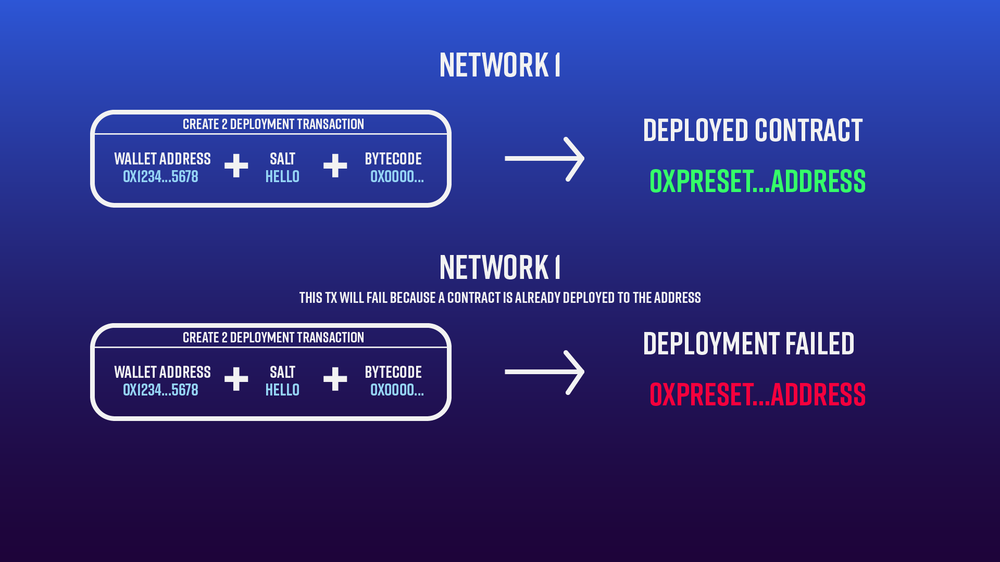

This is **part 2** of **How to deploy a contract to the same address on multiple networks**. Navigate to **part 1** and complete the setup and deployment steps before continuing:

[**How to deploy a contract to the same address on multiple networks**](/docs/how-to-deploy-a-contract-to-the-same-address-on-multiple-networks) **(part 1)**

Now that we have learned how to set equivalent nonces on all networks, let's explore another solution to deterministic deployment. In this section, we will deploy a contract factory with [create2](https://eips.ethereum.org/EIPS/eip-1014).

Create2 is an alternative to deriving contract addresses that do not involve the nonce. Instead, a contract can be deployed using the **deployer address**, **bytecode**, and **salt**, as illustrated below:

* **Deployer address:** The Ethereum wallet address used to deploy a contract.

* **bytecode:** A low level compiled version of a Solidity smart contract that can be read by the EVM.

* **salt:** A required but arbitrary value provided by the user.



Instead of the nonce, create2 uses a random salt hex set by the user. In the image above, the salt used is "HELLO". With the salt hex, a specific contract address can then be derived with the wallet address and bytecode. If this transaction is run again on the same network, it will fail because a contract has already been deployed to that address.

Because create2 is a [solidity](https://docs.soliditylang.org/en/latest/) feature, we can only utilize it on the Ethereum network. Hence, we will code a contract deployment factory with a create2 function and deploy the factory. Then our factory should be able to deploy any contract deterministically using a given salt.

# Create2 contract factory

In the `contracts` folder, create a new solidity file named `DeterministicDeployFactory.sol`, and add the following lines:

<CodeGroup>
  ```sol DeterministicDeployFactory.sol
  // SPDX-License-Identifier: MIT
  pragma solidity ^0.8.9;

  contract DeterministicDeployFactory {
      
  }
  ```
</CodeGroup>

Inside our contract, let's add a `deploy` function and pass in a `bytecode` and `salt` parameter:

<CodeGroup>
  ```sol DeterministicDeployFactory.sol
  function deploy(bytes memory bytecode, uint _salt) external {
   
  }
  ```
</CodeGroup>

Inside, let's add an address named `addr` and an [inline assembly](https://docs.soliditylang.org/en/latest/assembly.html?highlight=assembly) statement to communicate with the EVM at a low level:

<CodeGroup>
  ```sol DeterministicDeployFactory.sol
  address addr;
  assembly {
  }
  ```
</CodeGroup>

Within the assembly statement, we can use [Yul](https://docs.soliditylang.org/en/latest/yul.html#yul) to call **create2** and instruct the EVM to deploy our contract's bytecode:

<CodeGroup>
  ```sol DeterministicDeployFactory.sol
  addr := create2(0, add(bytecode, 0x20), mload(bytecode), _salt)
  if iszero(extcodesize(addr)) {
  revert(0, 0)
  }
  ```
</CodeGroup>

Then, let's create an event that will emit our deployed address when the function is called. Above the function, add the following event:

<CodeGroup>
  ```sol DeterministicDeployFactory.sol
  event Deploy(address addr);
  ```
</CodeGroup>

Finally, at the end of the function body, add an emit statement:

<CodeGroup>
  ```sol DeterministicDeployFactory.sol
  emit Deploy(addr);
  ```
</CodeGroup>

If successful, your contract should look like this:

<CodeGroup>
  ```sol DeterministicDeployFactory.sol
  // SPDX-License-Identifier: MIT
  pragma solidity ^0.8.9;

  contract DeterministicDeployFactory {
      event Deploy(address addr);

      function deploy(bytes memory bytecode, uint _salt) external {
          address addr;
          assembly {
              addr := create2(0, add(bytecode, 0x20), mload(bytecode), _salt)
              if iszero(extcodesize(addr)) {
          revert(0, 0)
        }
      }

      emit Deploy(addr);
      }
  }
  ```
</CodeGroup>

Before we continue, let's compile our contract with the following Hardhat command:

<CodeGroup>
  ```shell shell
  npx hardhat compile
  ```
</CodeGroup>

If successful, you should see:

<CodeGroup>
  ```shell shell
  Compiled 1 Solidity file successfully
  ```
</CodeGroup>

Great work! We are almost there. All that's left is to create a deploy script and deploy our factory!

## Factory deploy script

In your `scripts` folder, create a new file named `deployFactory.js` and paste the following async function and catch statement:

<CodeGroup>
  ```javascript deployFactory.js
  const main = async () => {

    }
    
    main().catch((error) => {
      console.error(error);
      process.exitCode = 1;
    });
  ```
</CodeGroup>

Inside our function body, add the following lines:

<CodeGroup>
  ```javascript deployFactory.js
  const Factory = await ethers.getContractFactory("DeterministicDeployFactory");
  // Here, we tell Hardhat which contract we want to deploy. 
  // Hardhat then knows how to handle the signer and contract ABI used for deployment. 
  const factory = await Factory.deploy();
  // deploying our contract
  await factory.deployed();
  console.log("Factory deployed to:", factory.address);
  ```
</CodeGroup>

<Check>
  If you've never written a deploy script, see the above comments for context.
</Check>

Your entire deploy script should look like this:

<CodeGroup>
  ```javascript deployFactory.js
  const main = async () => {
      const Factory = await ethers.getContractFactory("DeterministicDeployFactory");
      const factory = await Factory.deploy();
      await factory.deployed();
      console.log("Factory deployed to:", factory.address);
    }
    
    main().catch((error) => {
      console.error(error);
      process.exitCode = 1;
    });
  ```
</CodeGroup>

Now, let's deploy! Because our nonces are set equally on each network, this factory will deploy to the same address everywhere. Let's deploy to each network by running the following Hardhat commands:

<CodeGroup>
  ```shell shell
  npx hardhat run scripts/deployFactory.js --network goerli
  npx hardhat run scripts/deployFactory.js --network mumbai
  npx hardhat run scripts/deployFactory.js --network arbitrum
  npx hardhat run scripts/deployFactory.js --network optimism
  ```
</CodeGroup>

If successful, each deployment should return the same address on every network:

<CodeGroup>
  ```shell shell
  Factory deployed to: 0x3bdcbd275741bd33D4A3e3469793065b528F1A93
  Factory deployed to: 0x3bdcbd275741bd33D4A3e3469793065b528F1A93
  Factory deployed to: 0x3bdcbd275741bd33D4A3e3469793065b528F1A93
  Factory deployed to: 0x3bdcbd275741bd33D4A3e3469793065b528F1A93
  ```
</CodeGroup>

<Check>
  Be sure to save your factory address so we can use it to later deploy other contracts.
</Check>

✨Congratulations✨ You just created your own deployment factory and deployed it deterministically on four test networks!

# Deploy a contract with the factory

Now that we've deployed our factory, let's test its functionality by sending our vault contract to our factory for deployment with create2.

First, let's make an important change to `Vault.sol`. Because we are now deploying from a factory, we can no longer set the owner of our contract as **msg.sender**. This will set the factory address as the owner because it is technically the deployer. Since we don't have the factory's private key, the funds would then be locked indefinitely.

Instead, set your own Metamask address as the owner:

<CodeGroup>
  ```sol Vault.sol
  owner = payable(0x5DAAC14781a5C4AF2B0673467364Cba46Da935dB); //CHANGE TO YOUR ADDRESS
  ```
</CodeGroup>

<Warning>
  Be sure to change the owner address to your own MetaMask wallet.
</Warning>

Now, recompile the contract by typing the following in the terminal:

<CodeGroup>
  ```shell shell
  npx hardhat compile
  ```
</CodeGroup>

If successful, Hardhat will return:

<CodeGroup>
  ```shell shell
  Compiled 1 Solidity file successfully
  ```
</CodeGroup>

## Utility functions

Before we deploy, we need to create two helper functions. The first will encode and hash our constructor parameter (unlock time), so it is readable to the EVM. This is necessary because our deployment factory requires both the bytecode and constructor arguments to deploy. The second function will compute the Vault contract's deployed address, which we need in both the `depositVault` and `withdrawVault` scripts.

In your project folder, create a new folder called `utils`:

<CodeGroup>
  ```shell utils.js
  mkdir utils
  ```
</CodeGroup>

Inside `utils` create, a file named `utils.js` and add the following lines:

<CodeGroup>
  ```javascript utils.js
  const { ethers } = require("ethers");

  const encoder = (types, values) => {

  };

  const create2Address = (factoryAddress, saltHex, initCode) => {

  }

  exports.encoder = encoder;
  exports.create2Address = create2Address;
  ```
</CodeGroup>

Let's start with the `encoder` function. We are passing the types and values of our constructor arguments. For example, in our Vault contract, the constructor is passed an unlock time. So to encode the time, we provide its type "uint" and Unix timestamp value ("1657434348") to the encoder.

Inside the `encoder` function, add the following lines:

<CodeGroup>
  ```javascript utils.js
  const encoder = (types, values) => {
    const abiCoder = ethers.utils.defaultAbiCoder;
    const encodedParams = abiCoder.encode(types, values);
    return encodedParams.slice(2);
  };
  ```
</CodeGroup>

Here, we use the AbiCoder from ethers.js and encode our constructor arguments into a hexadecimal value the EVM can read.

Next, let's add to the `create2address` function. Our function receives the deployer address(factory address) + salt(saltHex) + bytecode(initCode). These are all the necessary components to compute a create2 address.

Inside the function body, add the following:

<CodeGroup>
  ```javascript utils.js
  const create2Address = (factoryAddress, saltHex, initCode) => {
    const create2Addr = ethers.utils.getCreate2Address(factoryAddress, saltHex, ethers.utils.keccak256(initCode));
    return create2Addr;
  }
  ```
</CodeGroup>

We are using another ethers.js function which computes the create2 address and returns our deployed address.

Your `utils.js` file should look like this:

<CodeGroup>
  ```javascript utils.js
  const { ethers } = require("ethers");

  const encoder = (types, values) => {
      const abiCoder = ethers.utils.defaultAbiCoder;
      const encodedParams = abiCoder.encode(types, values);
      return encodedParams.slice(2);
  };

  const create2Address = (factoryAddress, saltHex, initCode) => {
      const create2Addr = ethers.utils.getCreate2Address(factoryAddress, saltHex, ethers.utils.keccak256(initCode));
      return create2Addr;

  }

  exports.encoder = encoder;
  exports.create2Address = create2Address;
  ```
</CodeGroup>

Awesome! Now we can move on to the deploy script!

## Edit Vault deploy script

Replace the contents of your `vaultDeploy.js` file with the following:

<CodeGroup>
  ```javascript vaultDeploy.js
  const { bytecode } = require("../artifacts/contracts/Vault.sol/Vault.json");
  const { encoder, create2Address } = require("../utils/utils.js")

  const main = async () => {

  };

  main()
    .then(() => process.exit(0))
    .catch((error) => {
      console.error(error);
      process.exit(1);
    });
  ```
</CodeGroup>

Above, we have imported our Vault contract bytecode. Hardhat generates contract bytecode in the `artifacts` folder after you compile a contract. Additionally, we have imported our `encoder` and `create2Address` functions from `utils`.

We know our updated deploy script will need to do the following:

* Generate the create2 address.

* Connect to our deployed factory.

* Call the deploy function, pass the Vault bytecode, and pass a salt.

* Wait for the deployment event and print the deployed address.

To generate our create2 address, we need to create a timestamp, salt hex, and configure our deployment bytecode.

First, let's generate another Unix timestamp and set the unlock time with our Hardhat task:

<CodeGroup>
  ```shell shell
  npx hardhat unlocktimer --set 30
  ```
</CodeGroup>

Navigate back to `vaultDeploy.js` and create a variable inside the main function to store your new Unix timestamp:

<CodeGroup>
  ```javascript vaultDeploy.js
  const unlockTime = "1657835239"
  ```
</CodeGroup>

Also, create a variable to store your deployed factory address, as we will need this to connect to the factory:

<CodeGroup>
  ```javascript vaultDeploy.js
  const factoryAddr = "0x7B514ecfA2d02e085706d3EE6D63DE4a33CFc4e0" //YOUR FACTORY ADDRESS
  ```
</CodeGroup>

Now, let's create a variable to store our salt hex. We can take an arbitrary value and get its hex value with the following ethers function:

<CodeGroup>
  ```javascript vaultDeploy.js
  const saltHex = ethers.utils.id("1234");
  ```
</CodeGroup>

The last parameter we will need to compute the create2 address is the contract deployment code. We can configure the deployment code by adding the encoded constructor arguments to the end of the bytecode like so:

<CodeGroup>
  ```javascript vaultDeploy.js
  const initCode = bytecode + encoder(["uint"], [unlockTime]);
  ```
</CodeGroup>

Next, we call our imported `create2Address` function, pass in our parameters and store it in a variable:

<CodeGroup>
  ```javascript vaultDeploy.js
  const create2Addr = create2Address(factoryAddr, saltHex, initCode);
  console.log("precomputed address:", create2Addr);
  ```
</CodeGroup>

Your `vaultDeploy.js` file should appear as follows:

<CodeGroup>
  ```javascript vaultDeploy.js
  const { bytecode } = require("../artifacts/contracts/Vault.sol/Vault.json");
  const { encoder, create2Address } = require("../utils/utils.js")

  const main = async () => {
      const factoryAddr = "0x3bdcbd275741bd33D4A3e3469793065b528F1A93";
      const unlockTime = "1657835239"
      const saltHex = ethers.utils.id("1234");
      const initCode = bytecode + encoder(["uint"], [unlockTime]);

      const create2Addr = create2Address(factoryAddr, saltHex, initCode);
      console.log("precomputed address:", create2Addr);
  };

  main()
    .then(() => process.exit(0))
    .catch((error) => {
      console.error(error);
      process.exit(1);
    });
  ```
</CodeGroup>

In console, run the following Hardhat command:

<CodeGroup>
  ```shell shell
  npx hardhat run scripts/vaultDeploy.js
  ```
</CodeGroup>

If successful, you will get your precomputed Vault contract address:

<CodeGroup>
  ```shell shell
  precomputed address: 0xd216001476CC8F8a277F45d9bFE3996c3f38da5a
  ```
</CodeGroup>

<Warning>
  Before we finalize our deploy script, ensure you replace 0xREPLACE\_ADDRESS in vaultDeploy.js and vaultWithdraw.js with your precomputed address.
</Warning>

Now, create a connection to your factory using ethers by adding the following:

<CodeGroup>
  ```javascript vaultDeploy.js
  const Factory = await ethers.getContractFactory("DeterministicDeployFactory");
  const factory = await Factory.attach(factoryAddr);
  ```
</CodeGroup>

Lastly, call the factory deploy function and pass in our init code and salt hex. Then wait for the transaction receipt and print the deployed address:

<CodeGroup>
  ```javascript vaultDeploy.js
  const lockDeploy = await factory.deploy(initCode, saltHex);
  const txReceipt = await lockDeploy.wait();
  console.log("Deployed to:", txReceipt.events[0].args[0]);
  ```
</CodeGroup>

Your `vaultDeploy.js` file should look as follows:

<CodeGroup>
  ```javascript vaultDeploy.js
  const { bytecode } = require("../artifacts/contracts/Vault.sol/Vault.json");
  const { encoder, create2Address } = require("../utils/utils.js")

  const main = async () => {
      const factoryAddr = "0x3bdcbd275741bd33D4A3e3469793065b528F1A93";
      const unlockTime = "1657852422"
      const saltHex = ethers.utils.id("1234");
      const initCode = bytecode + encoder(["uint"], [unlockTime]);

      const create2Addr = create2Address(factoryAddr, saltHex, initCode);
      console.log("precomputed address:", create2Addr);
      
      const Factory = await ethers.getContractFactory("DeterministicDeployFactory");
      const factory = await Factory.attach(factoryAddr);

      const lockDeploy = await factory.deploy(initCode, saltHex);
      const txReceipt = await lockDeploy.wait();
      console.log("Deployed to:", txReceipt.events[0].args[0]);
  };

  main()
    .then(() => process.exit(0))
    .catch((error) => {
      console.error(error);
      process.exit(1);
    });
  ```
</CodeGroup>

Ensure your timestamp is still set ahead of the current time and run the deploy script for each network with this Hardhat command:

<CodeGroup>
  ```shell shell
  npx hardhat run scripts/vaultDeploy.js --network goerli
  npx hardhat run scripts/vaultDeploy.js --network mumbai
  npx hardhat run scripts/vaultDeploy.js --network arbitrum
  npx hardhat run scripts/vaultDeploy.js --network optimism
  ```
</CodeGroup>

If successful, your vault contract will deploy to your precomputed create2 address on each testnet:

<CodeGroup>
  ```shell shell
  Deployed to: 0xd216001476CC8F8a277F45d9bFE3996c3f38da5a
  Deployed to: 0xd216001476CC8F8a277F45d9bFE3996c3f38da5a
  Deployed to: 0xd216001476CC8F8a277F45d9bFE3996c3f38da5a
  Deployed to: 0xd216001476CC8F8a277F45d9bFE3996c3f38da5a
  ```
</CodeGroup>

Woohoo, nice job!! 🥳🥳 You can now use your factory to deploy deterministically without maintaining your account nonces! If you have come this far, you're ready to build some awesome projects! 🌠🌠🌠

# Learning recap

In this tutorial, you learned:

* How contract addresses are derived with nonces and salts.

* The difference between standard and create2 deployment.

* How to build, test, and deploy smart contracts in Hardhat.

* How to deploy a contract to the same address on multiple networks by setting the nonce.

* How to deploy a contract to the same precomputed address on multiple networks with create2.

Feel free to reach out to us in the [Alchemy Discord](https://discord.gg/gWuC7zB) for help or chat with us [@AlchemyPlatform](https://twitter.com/AlchemyPlatform?s=20\&t=H-ctZCz3615N7nGF3QZGVA) on Twitter!
