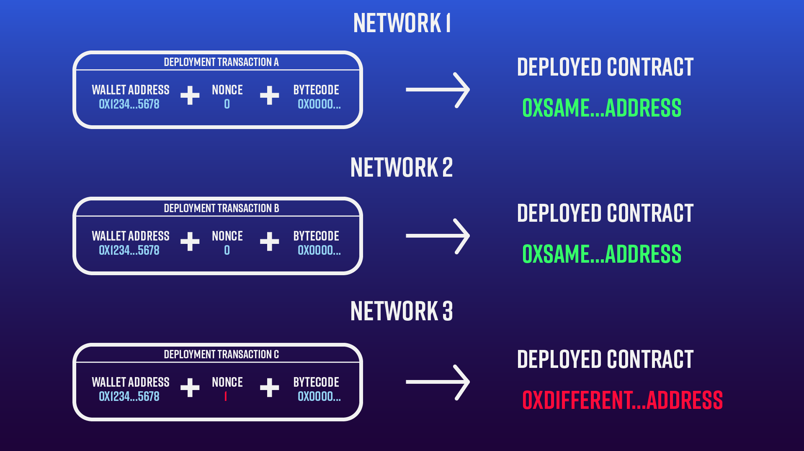
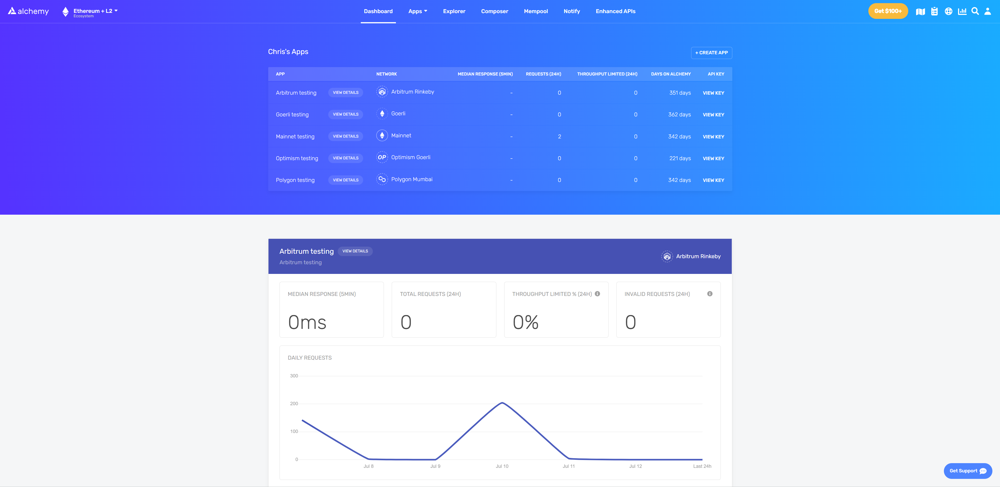
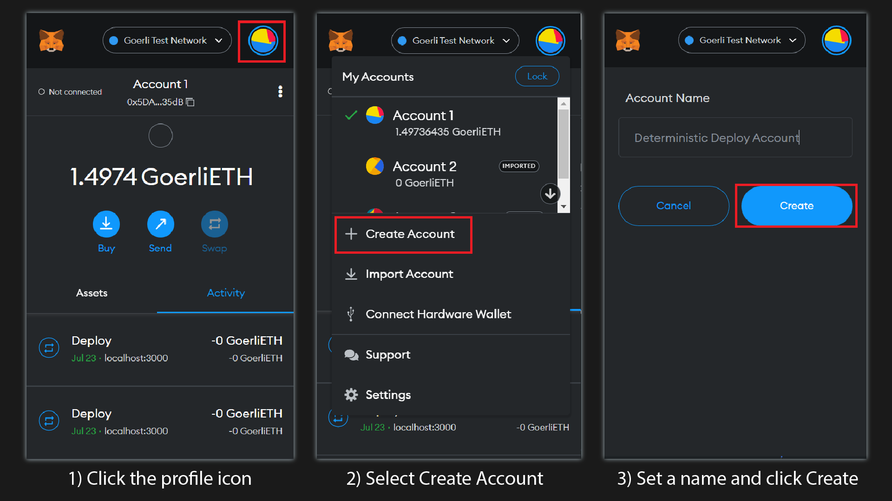
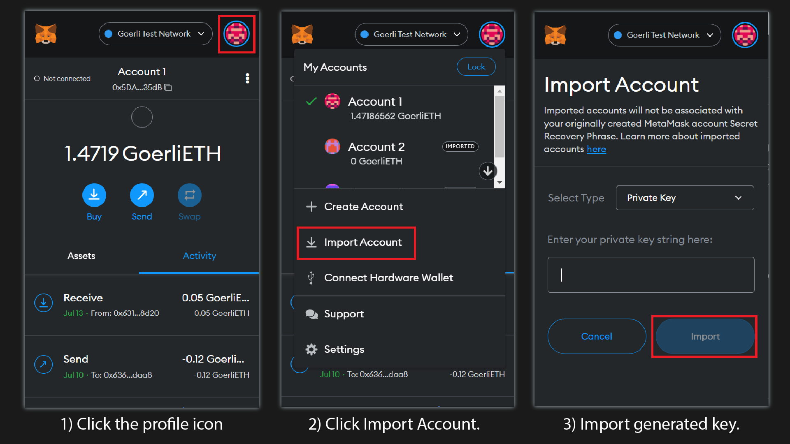
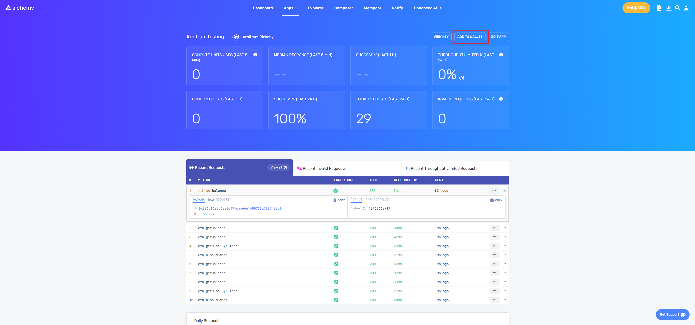
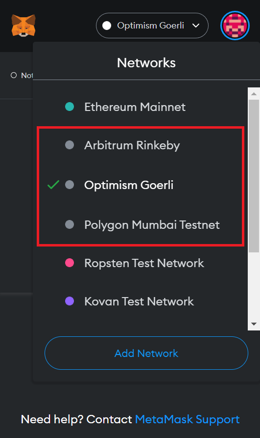
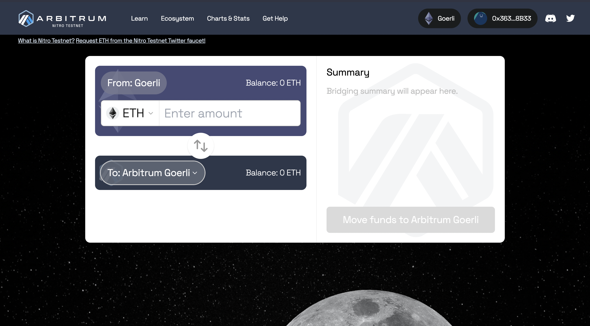
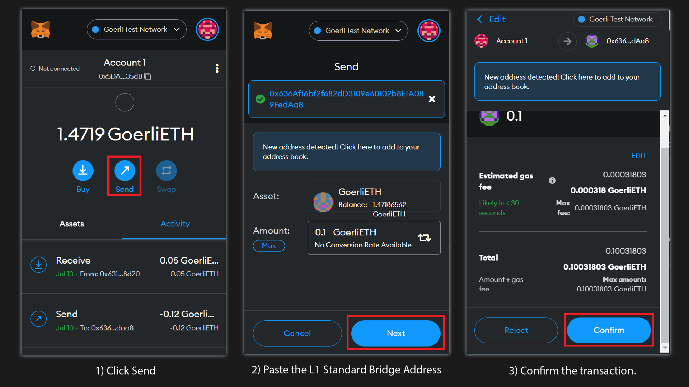
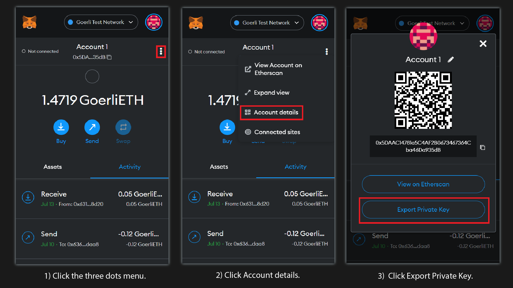
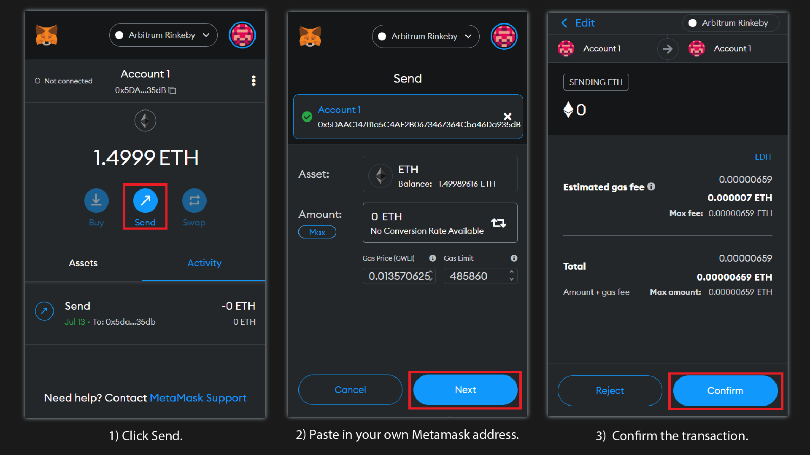

[**How to deploy a contract to the same address on multiple networks**](/docs/how-to-deploy-a-contract-to-the-same-address-on-multiple-networks) **(Part 1)** [**Create2: An alternative to deriving contract addresses**](/docs/create2-an-alternative-to-deriving-contract-addresses) **(Part 2)**

When you deploy a smart contract to the Ethereum network, the address is derived from your wallet address, the wallet's transaction count (i.e., the nonce), and your contract's bytecode. This ensures that each contract deployed to Ethereum has a unique address.

However, perhaps you want to deploy your contract across multiple networks with the same address. For example, you might want to deploy on Ethereum, Polygon, and Optimism with the same address. This can be useful for testing purposes and helpful to users interacting with your addresses across various networks. To do this, you must ensure your wallet's nonce is equivalent on each network, as illustrated below:



In the image above, transactions A and B are identical and so will deploy the contract to the same address on both networks. In transaction C, however, the nonce is different and thus changes the deployed contract address. Now that we know what conditions need to be satisfied to deploy deterministically, let's deploy some contracts!

# Overview

* [**Prerequisites**](##prerequisites)

* [**Connect to Alchemy**](#connect-to-alchemy)

* [**Configure your MetaMask wallet**](#configure-your-metamask-wallet)

  * [Option 1: Create an account](#option-1-create-an-account)

  * [Option 2: Import an account](#option-2-import-an-account)

  * [Add testnets](#add-testnets)

* [**Request testnet ETH from faucets**](#request-testnet-eth-from-faucets)

  * [Bridges](#bridges)

* [**Setup project environment**](#setup-project-environment)

  * [Install Hardhat](#install-hardhat)

  * [Install environment tools](#install-environment-tools)

  * [Create a Dotenv file](#create-a-dotenv-file)

  * [Edit hardhat.config.js](#edit-hardhatconfigjs)

* [**Deterministic deployment setup**](#deterministic-deployment-setup)

  * [Create a Hardhat task to query the nonces](#create-a-hardhat-task-to-query-the-nonce)

* [**Create vault contract**](#create-vault-contract)

  * [Vault deploy script](#create-vault-contract)

* [**Appendix (Optional)**](#appendix-optional-interaction-scripts)

  * [Vault deposit script](#vault-deposit-script)

  * [Vault withdraw script](#vault-withdraw-script)

**Part 2: (**[**Create2: An Alternative to deriving contract addresses ->**](/docs/create2-an-alternative-to-deriving-contract-addresses))

# Prerequisites

Before you begin this tutorial, please ensure you have the following:

* An Alchemy account ([Create a free Alchemy account](https://alchemy.com/?a=8c5ea890fb)).

* An Ethereum address or MetaMask wallet ([Create a MetaMask wallet](https://metamask.io/download/)).

* Node.JS (>14) and npm installed ([Install NodeJs and NPM](https://docs.alchemy.com/alchemy/guides/alchemy-for-macs#1-install-nodejs-and-npm))

# Connect to Alchemy

In this tutorial, we will deploy deterministically to the following test networks:

* Ethereum Goerli

* Ethereum Sepolia

* Polygon Mumbai

* Arbitrum Goerli

* Optimism Goerli

<Check>
  Whenever possible, use the Sepolia testnet as all other current POW testnets will be depreciated post-merge.
</Check>

<Warning>
  While you can use the Goerli testnet, we caution against it as the Ethereum Foundation has announced that [Goerli will soon be deprecated](https://www.alchemy.com/blog/goerli-faucet-deprecation).

  We therefore recommend using [Sepolia](https://www.alchemy.com/overviews/sepolia-testnet) as Alchemy has full Sepolia support and a free [Sepolia faucet](https://sepoliafaucet.com/) also.
</Warning>

For each network, we will [create a unique Alchemy API key](https://alchemy.com/?a=8c5ea890fb) to connect to the five chains above:

Repeat the following steps for each network:

1. From the Alchemy Dashboard, hover over **Apps,** then click **+Create App**.

2. Name your app: \<**Network Name> testing**.

3. Select the correct chain and network of your choice.

4. Click **Create app**.

If successful, your Alchemy Dashboard should look like this:



Example of an Alchemy dashboard with testnet apps

# Configure your MetaMask wallet

Because we need our wallet's nonce to be the same across all networks, we advise configuring a new Metamask wallet to ensure no transactions have occurred. There are two ways to go about this:

* **Option 1: Create an Account**

* **Option 2: Import an Account**

When you **create an account** in MetaMask there is no way to delete it from your wallet. Therefore, if you want to later remove the account use the **import account**

## Option 1: Create an Account

To create a new wallet address, open MetaMask, click your **profile icon > Create Account**, set a name and create a new account:



<Warning>Warning: Once you add an account there is no way to remove it </Warning>

If you want to remove the account later, you can use the method in **Option 2** and **Import Account** instead.

## Option 2: Import an Account

You can generate a random private key to import into MetaMask using Node.js. In your terminal, start Node.js with the following command:

<CodeGroup>
  ```javascript javascript
  node
  ```
</CodeGroup>

Then paste the following into your terminal to generate the key:

<CodeGroup>
  ```javascript javascript
  crypto.randomBytes(32, (_, bytes) => console.log(bytes.toString("hex")))
  ```
</CodeGroup>

In your terminal, you should see an output of a randomly generated private key, similar to the following:

<CodeGroup>
  ```javascript javascript
  a07b2417424c253d5e33fa746a5e98049986e13cdd3e8fd178e6adae2f58616e
  ```
</CodeGroup>

<Warning>
  The random secret key above is for demonstration purposes only and will never be used. Remember to never share your private key, especially if you intend to use it!
</Warning>

To import a new wallet address, open MetaMask, click your **profile icon > Import Account**, and enter your key:



## Add testnets

For each testnet, we need to add the correct network settings to MetaMask so we can verify that the faucets will deliver the Ether we will request in the next step.

Head to your **Alchemy Dashboard**. For each app using an L2 network (Polygon,Optimism, and Arbitrum) click **Add to Wallet**:



If you enable **Show test networks** in **MetaMask > Settings > Advanced**, you should already have the Goerli testnet added by default. If the above was successful, you should have the following networks enabled:

* Goerli Test Network

* Polygon Mumbai

* Optimism Goerli

* Arbitrum Goerli

See the image below of the manually added testnets.



# Request testnet ETH from faucets

To deploy your contract on each testnet, you will need fake test Ether to pay the required network gas fees. Below, you can find some preferred faucets for each network:

<Info>
  Depending on the network traffic, you may have to sign in with your Alchemy account to receive ETH.
</Info>

First, request Ether from one of the three faucets below. Per the upcoming Goerli deprecation mentioned above, we recommend you use the Sepolia testnet:

* [Alchemy Goerli Faucet](https://goerlifaucet.com/)

* [Alchemy Sepolia Faucet](https://sepoliafaucet.com/)

* [Alchemy Mumbai Faucet](https://mumbaifaucet.com/)

After making a request to each faucet, check your MetaMask and ensure you have available balance.

## Bridges

Because Arbitrum and Optimism do not have dedicated testnet faucets, you will need to send test Ether to your address on those networks via their respective bridges.

Head to the [Arbitrum bridge](https://bridge.arbitrum.io/) and set your MetaMask network to **Arbitrum Goerli**. Then, send some Goerli Ether across to Arbitrum like so:



<Info>
  The deposit may take 10 minutes to appear on Arbitrum
</Info>

Next, send Goerli Ether to Optimism. Because the Optimism Goerli testnet is new, the Goerli bridge UI has not yet been built. However, you can still send Ether across the bridge via the L1 Standard Bridge smart contract.

In MetaMask, change your **Network** to Goerli Test Network and click **Send**. Then paste the L1 Standard Bridge contract address: [0x636Af16bf2f682dD3109e60102b8E1A089FedAa8](https://goerli.etherscan.io/address/0x636Af16bf2f682dD3109e60102b8E1A089FedAa8) and send some Ether.



<Warning>
  The deposit may take up to 10 minutes to appear in your Optimism Goerli balance.
</Warning>

Because you are sending Ether across the Optimism bridge, this will add to the nonce of your wallet on the Goerli network. Later in the guide, you will send an additional transaction on the other networks to account for this offset.

If all deposits were successful, you should see some Ether in your MetaMask wallet on each of the testnets!

# Setup project environment

<Check>
  We will use a [Hardhat](https://hardhat.org/) project to deploy our contracts. For reference, here is the [completed version](https://github.com/alchemyplatform/alchemy-docs/tree/master/tutorials/Deterministic-Deployment-Factory) of what we will build in the remainder of this guide.
</Check>

Open VS Code (or your preferred IDE) and enter the following in terminal:

<CodeGroup>
  ```shell shell
  mkdir Deterministic-deploy-factory
  cd Deterministic-deploy-factory
  ```
</CodeGroup>

Once inside our project directory, create the following two directories:

<CodeGroup>
  ```shell shell
  mkdir contracts
  mkdir scripts
  ```
</CodeGroup>

The `contracts` folder will store our project smart contracts and the `scripts` folder will contain our deployment and interaction scripts.

Next, initialize npm (node package manager) with the following command:

<CodeGroup>
  ```shell shell
  npm init
  ```
</CodeGroup>

Press enter and answer the project prompt as follows:

<CodeGroup>
  ```json json
  package name: (Deterministic-deploy-factory)
  version: (1.0.0)
  description: 
  entry point: (index.js)
  test command: 
  git repository: 
  keywords: 
  author: 
  license: (ISC)
  ```
</CodeGroup>

Press enter again to complete the prompt. If successful, a `package.json` file will have been created in your directory.

## Install Hardhat

Hardhat is a development environment that allows us to interact, test, and deploy our contracts within one environment.

To install Hardhat, type the following in terminal:

<CodeGroup>
  ```shell shell
  npm install --save-dev hardhat
  ```
</CodeGroup>

Once Hardhat is installed create a new project by typing the following command:

<CodeGroup>
  ```shell shell
  npx hardhat
  ```
</CodeGroup>

<CodeGroup>
  ```shell shell
  888    888                      888 888               888
  888    888                      888 888               888
  888    888                      888 888               888
  8888888888  8888b.  888d888 .d88888 88888b.   8888b.  888888
  888    888     "88b 888P"  d88" 888 888 "88b     "88b 888
  888    888 .d888888 888    888  888 888  888 .d888888 888
  888    888 888  888 888    Y88b 888 888  888 888  888 Y88b.
  888    888 "Y888888 888     "Y88888 888  888 "Y888888  "Y888

  Welcome to Hardhat v2.10.1

  ? What do you want to do? ...      
    Create a JavaScript project      
    Create a TypeScript project      
  > Create an empty hardhat.config.js
    Quit
  ```
</CodeGroup>

Select `Create an empty hardhat.config.js`. Nice work! With Hardhat installed, we are nearly ready to start coding!

## Install environment tools

The tools you will need to complete this tutorial are:

* [hardhat-ethers](https://hardhat.org/hardhat-runner/plugins/nomiclabs-hardhat-ethers) (A Hardhat plugin that allows us to use the Ethers.js library)

* [Alchemy's Web3.js](https://docs.alchemy.com/alchemy/documentation/alchemy-web3)

* [dotenv](https://www.npmjs.com/package/dotenv) (so that you can store your private key and API key safely)

To install the above tools, ensure you are still inside your root folder and type the following commands in terminal:

### Hardhat Ethers:

<CodeGroup>
  ```shell shell
  npm install npm install --save-dev @nomiclabs/hardhat-ethers 'ethers@^5.0.0'
  ```
</CodeGroup>

### Alchemy's Web3:

<CodeGroup>
  ```shell shell
  npm install @alch/alchemy-web3
  ```
</CodeGroup>

### Dotenv:

<CodeGroup>
  ```shell shell
  npm install dotenv --save
  ```
</CodeGroup>

Above, we have imported the libraries that we installed and all of the necessary variables to interact with `.env`

## Create a Dotenv File

Create an `.env` file in your root folder. The file must be named `.env` or it will not be recognized.

In the `.env` file, we will store all of our sensitive information (i.e., our Alchemy API key and MetaMask private key).

Copy the following into your `.env`

<CodeGroup>
  ```javascript .env
  API_URL_GOERLI = "{YOUR_ALCHEMY_GOERLI_API_KEY}"
  API_URL_MUMBAI = "{YOUR_ALCHEMY_MUMBAI_API_KEY}"
  API_URL_ARBITRUM = "{YOUR_ALCHEMY_ARB-GOERLI-API_KEY}"
  API_URL_OPTIMISM = "{YOUR_ALCHEMY_OPT-GOERLI_API_KEY}"
  PRIVATE_KEY = "{YOUR_PRIVATE_KEY}"
  ```
</CodeGroup>

* Replace `{YOUR_ALCHEMY_<NETWORK>_API_KEY}` with the respective Alchemy API keys found on Alchemy's dashboard, under **VIEW KEY**:

* Replace `{YOUR_PRIVATE_KEY}`with your MetaMask private key.

***To retrieve your MetaMask private key:***

Open the extension, click on the three dots menu, and choose **Account Details**. Then click **Export Private Key**:



## Edit `hardhat.config.js`

Add the following statements to the top of your `hardhat.config.js` file to process your `.env` file:

<CodeGroup>
  ```javascript hardhat.config.js
  require("@nomiclabs/hardhat-ethers");
  require("dotenv").config();
  const { createAlchemyWeb3 } = require("@alch/alchemy-web3");
  const { task } = require("hardhat/config");
  const {
    API_URL_GOERLI,
    API_URL_MUMBAI,
    API_URL_ARBITRUM,
    API_URL_OPTIMISM,
    PRIVATE_KEY,
  } = process.env;
  ```
</CodeGroup>

Lastly, let's update the `hardhat.config.js` file so that we can interact with our API keys and private keys. Add the following networks inside the `modules.exports` object:

<CodeGroup>
  ```javascript hardhat.config.js
  module.exports = {
    solidity: "0.8.9",
    networks: {
      hardhat: {},
      goerli: {
        url: API_URL_GOERLI,
        accounts: [`0x${PRIVATE_KEY}`],
      },
      mumbai: {
        url: API_URL_MUMBAI,
        accounts: [`0x${PRIVATE_KEY}`],
      },
      arbitrum: {
        url: API_URL_ARBITRUM,
        accounts: [`0x${PRIVATE_KEY}`],
      },
      optimism: {
        url: API_URL_OPTIMISM,
        accounts: [`0x${PRIVATE_KEY}`],
      },
    },
  };
  ```
</CodeGroup>

Now that we are finished setting up our Hardhat environment, we can create and deploy some contracts deterministically!

# Deterministic deployment setup

In this section of the guide, we will first set up a Hardhat task to query our wallet's nonce so we can be certain our contract will deploy to the same address on each network. Next, we will create a smart contract and deploy it using a deploy script.

## Create a Hardhat task to query the nonce

Hardhat tasks allow us to automate certain processes within the project environment. Because we need to be sure the nonce is identical across all networks, we will create a task that will return the nonce of each network. Additionally, let's include our wallet balance to ensure we have enough funds to deploy.

Inside your `hardhat.config.js` file, add the following task above `module.exports`:

<CodeGroup>
  ```javascript hardhat.config.js
  const web3Goerli = createAlchemyWeb3(API_URL_GOERLI);
  const web3Mumbai = createAlchemyWeb3(API_URL_MUMBAI);
  const web3Arb = createAlchemyWeb3(API_URL_ARBITRUM);
  const web3Opt = createAlchemyWeb3(API_URL_OPTIMISM);
  ```
</CodeGroup>

Also within the async function, add a network ID array, provider array, and empty result array:

<CodeGroup>
  ```javascript hardhat.config.js
  const networkIDArr = ["Ethereum Goerli:", "Polygon  Mumbai:", "Arbitrum Rinkby:", "Optimism Goerli:"]
  const providerArr = [web3Goerli, web3Mumbai, web3Arb, web3Opt];
  const resultArr = [];
  ```
</CodeGroup>

Lastly, create a for loop to push our requested nonce and balance into the empty result array and print the results to console:

<CodeGroup>
  ```javascript hardhat.config.js
  for (let i = 0; i < providerArr.length; i++) {
    const nonce = await providerArr[i].eth.getTransactionCount(address.address, "latest");
    const balance = await providerArr[i].eth.getBalance(address.address)
    resultArr.push([networkIDArr[i], nonce, parseFloat(providerArr[i].utils.fromWei(balance, "ether")).toFixed(2) + "ETH"]);
  }
  resultArr.unshift(["  |NETWORK|   |NONCE|   |BALANCE|  "])
  console.log(resultArr);
  ```
</CodeGroup>

Your completed task should look like this:

<CodeGroup>
  ```javascript hardhat.config.js
  task("account", "returns nonce and balance for specified address on multiple networks")
    .addParam("address")
    .setAction(async address => {
      const web3Goerli = createAlchemyWeb3(API_URL_GOERLI);
      const web3Mumbai = createAlchemyWeb3(API_URL_MUMBAI);
      const web3Arb = createAlchemyWeb3(API_URL_ARBITRUM);
      const web3Opt = createAlchemyWeb3(API_URL_OPTIMISM);

      const networkIDArr = ["Ethereum Goerli:", "Polygon  Mumbai:", "Arbitrum Rinkby:", "Optimism Goerli:"]
      const providerArr = [web3Goerli, web3Mumbai, web3Arb, web3Opt];
      const resultArr = [];
      
      for (let i = 0; i < providerArr.length; i++) {
        const nonce = await providerArr[i].eth.getTransactionCount(address.address, "latest");
        const balance = await providerArr[i].eth.getBalance(address.address)
        resultArr.push([networkIDArr[i], nonce, parseFloat(providerArr[i].utils.fromWei(balance, "ether")).toFixed(2) + "ETH"]);
      }
      resultArr.unshift(["  |NETWORK|   |NONCE|   |BALANCE|  "])
      console.log(resultArr);
    });
  ```
</CodeGroup>

Now let's run our task with the following:

<CodeGroup>
  ```shell shell
  npx hardhat account --address {YOUR_WALLET_ADDRESS}
  ```
</CodeGroup>

If successful, you should see this result:

<CodeGroup>
  ```shell shell
  [
    [ '  |NETWORK|   |NONCE|   |BALANCE|  ' ],
    [ 'Ethereum Goerli:', 1, '1.47ETH' ],
    [ 'Polygon  Mumbai:', 0, '9.99ETH' ],
    [ 'Arbitrum Rinkby:', 0, '1.49ETH' ],
    [ 'Optimism Goerli:', 0, '2.26ETH' ]
  ]
  ```
</CodeGroup>

Besides Goerli, all of our nonces are 0. This is because of the transaction we sent to the Optimism bridge.

To make all of our nonces equal, let's send transactions on the other networks and make each nonce equivalent to one. We can send a transaction to our own MetaMask wallet address like so:



Repeat the same for the other two networks until your nonces are equivalent:

<CodeGroup>
  ```shell shell
  [
    [ '  |NETWORK|   |NONCE|   |BALANCE|  ' ],
    [ 'Ethereum Goerli:', 1, '1.47ETH' ],
    [ 'Polygon  Mumbai:', 1, '9.99ETH' ],
    [ 'Arbitrum Rinkby:', 1, '1.49ETH' ],
    [ 'Optimism Goerli:', 1, '2.26ETH' ]
  ]
  ```
</CodeGroup>

With the necessary setup complete, let's create and deploy a contract.

# Create vault contract

For this tutorial, we will create a vault where funds can be deposited and withdrawn by the owner only after a specified period of time. However, feel free to deploy any contract you would like!

In your `contracts` folder, create a new solidity file named `Vault.sol` and add the following lines of code:

<CodeGroup>
  ```sol Vault.sol
  // SPDX-License-Identifier: MIT
  pragma solidity ^0.8.9;

  contract Vault {
      uint public unlockTime;
      address payable public owner;

      constructor(uint _unlockTime) {

      }

      function deposit() payable public {

      }

      function withdraw() public {

      }
  }
  ```
</CodeGroup>

Above, we have created a contract with three functions:

* The `constructor`, which runs when our contract is deployed and takes an unlock time.

* The `deposit` function, which we will call to deposit funds to our contract.

* The `withdraw` function, which will allow us to withdraw funds after the unlock time has expired.

First, let's add some logic to our `constructor` function:

<CodeGroup>
  ```sol Vault.sol
  require(
      block.timestamp < _unlockTime,
      "Unlock time should be in the future"
  );
  unlockTime = _unlockTime;
  owner = payable(msg.sender);
  ```
</CodeGroup>

Next, let's create an event we can emit every time the `deposit` function is called. Add an event above the `constructor`, and emit it from within the `deposit` function. The entire contract should look like this:

<CodeGroup>
  ```sol Vault.sol
  // SPDX-License-Identifier: MIT
  pragma solidity ^0.8.9;

  contract Vault {
      uint public unlockTime;
      address payable public owner;
      
      event Deposit(uint amount, uint when);

      constructor(uint _unlockTime) {
          require(
              block.timestamp < _unlockTime,
              "Unlock time should be in the future"
          );
          unlockTime = _unlockTime;
          owner = payable(msg.sender);

      }

      function deposit() payable public {
          emit Deposit(msg.value, block.timestamp);
      }

      function withdraw() public {

      }
  }
  ```
</CodeGroup>

Lastly, let's add some logic to the `withdraw` function. We need to check if the unlock time has passed, then require that the account withdrawing is the owner. Then, we emit an event with the withdrawn balance.

Add a Withdraw event below the Deposit event:

<CodeGroup>
  ```sol Vault.sol
  event Withdrawal(uint amount, uint when);
  ```
</CodeGroup>

Within the `withdraw` function body, add the following logic:

<CodeGroup>
  ```sol Vault.sol
  require(block.timestamp >= unlockTime, "You can't withdraw yet");
  require(msg.sender == owner, "you aren't the owner");

  emit Withdrawal(address(this).balance, block.timestamp);

  owner.transfer(address(this).balance);
  ```
</CodeGroup>

Your `Vault.sol` file should look like this:

<CodeGroup>
  ```sol Vault.sol
  // SPDX-License-Identifier: MIT
  pragma solidity ^0.8.9;

  contract Vault {
      uint public unlockTime;
      address payable public owner;

      event Deposit(uint amount, uint when);
      event Withdrawal(uint amount, uint when);

      constructor(uint _unlockTime) {
          require(
              block.timestamp < _unlockTime,
              "Unlock time should be in the future"
          );
          unlockTime = _unlockTime;
          owner = payable(msg.sender);
      }

      function deposit() payable public {
          emit Deposit(msg.value, block.timestamp);

      }

      function withdraw() public {
          require(block.timestamp >= unlockTime, "You can't withdraw yet");
          require(msg.sender == owner, "you aren't the owner");

          emit Withdrawal(address(this).balance, block.timestamp);

          owner.transfer(address(this).balance);
      }
  }
  ```
</CodeGroup>

Awesome! Our Vault contract is complete. Before we move on to writing the deployment script, let's compile the contract by typing the following in the terminal:

<CodeGroup>
  ```shell shell
  npx hardhat compile
  ```
</CodeGroup>

If successful, Hardhat will return:

<CodeGroup>
  ```shell shell
  Compiled 1 Solidity file successfully
  ```
</CodeGroup>

## Vault deploy script

In your `scripts` folder, create a file named `vaultDeploy.js`:

<CodeGroup>
  ```javascript vaultDeploy.js
  const main = async () => {
    const unlockTime = "2605659962"; // unlock time must be > deployment time.

    const Vault = await ethers.getContractFactory("Vault");
    const vault = await Vault.deploy(unlockTime);

    await vault.deployed()
    console.log("Vault deployed to:", vault.address);

  };

  main()
    .then(() => process.exit(0))
    .catch((error) => {
      console.error(error);
      process.exit(1);
    });
  ```
</CodeGroup>

<Info>
  Above, the unlock time is set using a [Unix timestamp](https://unixtime.org/).
</Info>

Before we continue, let's compile our contract with the following Hardhat command:

<CodeGroup>
  ```shell shell
  npx hardhat compile
  ```
</CodeGroup>

If successful, you should see:

<CodeGroup>
  ```shell shell
  Compiled 1 Solidity file successfully
  ```
</CodeGroup>

Before deploying, ensure you replace **unlockTime** with your Unix timestamp and run the deploy script for each network with this Hardhat command:

<CodeGroup>
  ```shell shell
  npx hardhat run scripts/vaultDeploy.js --network goerli
  npx hardhat run scripts/vaultDeploy.js --network mumbai
  npx hardhat run scripts/vaultDeploy.js --network arbitrum
  npx hardhat run scripts/vaultDeploy.js --network optimism
  ```
</CodeGroup>

If successful, your vault contract will deploy on each testnet to the same address:

<CodeGroup>
  ```shell shell
  Deployed to: 0xd216001476CC8F8a277F45d9bFE3996c3f38da5a
  Deployed to: 0xd216001476CC8F8a277F45d9bFE3996c3f38da5a
  Deployed to: 0xd216001476CC8F8a277F45d9bFE3996c3f38da5a
  Deployed to: 0xd216001476CC8F8a277F45d9bFE3996c3f38da5a
  ```
</CodeGroup>

<Check>
  To check the status of your deployment, search the following blockchain explorers for your contract address:
</Check>

At this point in the tutorial, we've deployed a contract on each test network to the same address. Having set the nonces, we can guarantee this result. However, there are some downsides to this method:

* Maintaining the nonces can be a hassle. For instance, if you need to use the address to sign a transaction on one network, you must ensure you update the nonces on all other networks if you want to deploy another contract deterministically.

* Although the contract deploys to the same address, there is no way to predetermine what that address will be in the counterfactual.

<Info>
  If you plan to deploy only one contract and know that no future transactions will need to be signed, setting the nonces may be a simple option for deterministic deployment.
</Info>

In **Part 2** of this tutorial, we will address the above downsides by adding a more robust alternative to deployment that does not rely on setting the nonces.

[**Continue to Part 2 ->**](/docs/create2-an-alternative-to-deriving-contract-addresses)

# Appendix (Optional interaction scripts)

Below are optional interaction scripts to **deposit** and **withdraw** for your Vault contract. These are not necessary to complete the tutorial but provide a way to interact with the contract.

## Vault deposit script

Before we deploy, we need to write a script to interact with our deposit function. In your `scripts` folder, create a file named `vaultDeposit.js`. Add the following async function and catch statement:

<CodeGroup>
  ```javascript vaultDeposit.js
  const deposit = async () => {

    };
    
    deposit()
      .then(() => process.exit(0))
      .catch((error) => {
        console.error(error);
        process.exit(1);
      });
  ```
</CodeGroup>

Inside the `deposit` function, add the following statements:

<CodeGroup>
  ```javascript vaultDeposit.js
  const depositAmount = ethers.utils.parseEther("0.001");
    console.log("Depositing", depositAmount / 10 ** 18 + "ETH...");
    
    const Vault = await ethers.getContractFactory("Vault");
    const vaultAddress = "0xd216001476CC8F8a277F45d9bFE3996c3f38da5a" //Replace this with your deployed address
    const vaultContract = await Vault.attach(vaultAddress);
  ```
</CodeGroup>

<Warning>
  Replace the vault address variable with your deployed address.
</Warning>

Here, we have set the deposit amount to `0.001` Ether and added the necessary variables to connect to the contract once it is deployed.

Now that we are "connected" to the contract, let's call the deposit function and send our deposit amount. Then, let's wait for the transaction receipt and print the deposit event to console:

<CodeGroup>
  ```javascript vaultDeposit.js
  const sendEther = await vaultContract.deposit({ value: depositAmount });
  const depositTxReciept = await sendEther.wait();
  console.log(depositTxReciept.events[0].args[0]._hex.toString() / 10 ** 18 + "ETH deposited!");
  ```
</CodeGroup>

Your `vaultDeposit.js` file should look like this:

<CodeGroup>
  ```javascript vaultDeposit.js
  const deposit = async () => {
      const depositAmount = ethers.utils.parseEther("0.001");
      console.log("Depositing", depositAmount / 10 ** 18 + "ETH...");
      
      const Vault = await ethers.getContractFactory("Vault");
      const vaultAddress = "0xd216001476CC8F8a277F45d9bFE3996c3f38da5a" //Replace this with your deployed address
      const vaultContract = await Vault.attach(vaultAddress);
      
      const sendEther = await vaultContract.deposit({ value: depositAmount });
      const depositTxReciept = await sendEther.wait();
      console.log(depositTxReciept.events[0].args[0]._hex.toString() / 10 ** 18 + "ETH deposited!");

    };
    
    deposit()
      .then(() => process.exit(0))
      .catch((error) => {
        console.error(error);
        process.exit(1);
      });
  ```
</CodeGroup>

## Vault withdraw script

Since we want to withdraw our test Ether after the timer is up, let's create a withdraw script.

In your `scripts` folder, create a file named `vaultWithdraw.js` and add the following async function and catch statement:

<CodeGroup>
  ```javascript vaultWithdraw.js
  const withdraw = async () => {
      
    };
    
    withdraw()
      .then(() => process.exit(0))
      .catch((error) => {
        console.error(error);
        process.exit(1);
      });
  ```
</CodeGroup>

Inside the function body, repeat the ethers connection statements from the deploy script:

<CodeGroup>
  ```javascript vaultWithdraw.js
  const Vault = await ethers.getContractFactory("Vault");
  const vaultAddress = "0xd216001476CC8F8a277F45d9bFE3996c3f38da5a" //Replace this with your deployed address
  const vault = await Vault.attach(vaultAddress);
  ```
</CodeGroup>

Next, let's call the withdraw function on the Vault contract, wait for the transaction receipt, and print the withdraw event to console:

<CodeGroup>
  ```javascript vaultWithdraw.js
  const withdraw = await vault.withdraw();
  const withdrawRes = await withdraw.wait();
  console.log(withdrawRes.events[0].args[0]._hex.toString() / 10 ** 18 + "ETH Withdrawn!");
  ```
</CodeGroup>

Your `vaultWithdraw.js` file should look like this:

<CodeGroup>
  ```javascript vaultWithdraw.js
  const withdraw = async () => {
      const Vault = await ethers.getContractFactory("Vault");
      const vaultAddress = "0xREPLACE_ADDRESS"; //Replace this with your deployed Vault address
      const vault = await Vault.attach(vaultAddress);
    
      const withdraw = await vault.withdraw();
      const withdrawRes = await withdraw.wait();
      console.log(withdrawRes.events[0].args[0]._hex.toString() / 10 ** 18 + "ETH Withdrawn!");
    };
    
    withdraw()
      .then(() => process.exit(0))
      .catch((error) => {
        console.error(error);
        process.exit(1);
      });
  ```
</CodeGroup>

Now, let's use our deposit script to send some Ether to the Vault. Run the following commands:

<CodeGroup>
  ```shell shell
  npx hardhat run scripts/vaultDeposit.js --network goerli
  npx hardhat run scripts/vaultDeposit.js --network mumbai
  npx hardhat run scripts/vaultDeposit.js --network arbitrum
  npx hardhat run scripts/vaultDeposit.js --network optimism
  ```
</CodeGroup>

If successful, the script will return the deposited amount of Ether:

<CodeGroup>
  ```shell shell
  Depositing 0.001ETH...
  0.001ETH deposited!
  ```
</CodeGroup>

Finally, let's withdraw the Ether we just sent to our vault. Keep in mind, If your unlock timer has not expired, the transaction will fail. If you know the time has expired, run the `vaultWithdraw.js` script with the following Hardhat command:

<CodeGroup>
  ```shell shell
  npx hardhat run scripts/vaultWithdraw.js --network goerli
  npx hardhat run scripts/vaultWithdraw.js --network mumbai
  npx hardhat run scripts/vaultWithdraw.js --network arbitrum
  npx hardhat run scripts/vaultWithdraw.js --network optimism
  ```
</CodeGroup>

If successful, you will see the withdraw event in console:

<CodeGroup>
  ```shell shell
  0.001ETH Withdrawn!
  ```
</CodeGroup>

***

What’s Next

* [Create2: An alternative to deriving contract addresses](/docs/create2-an-alternative-to-deriving-contract-addresses)
