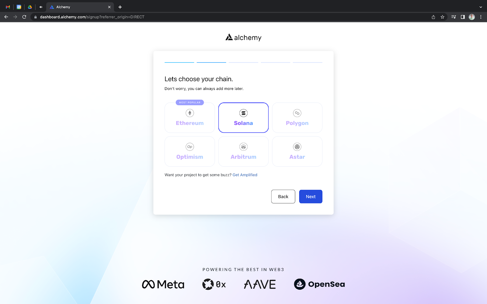
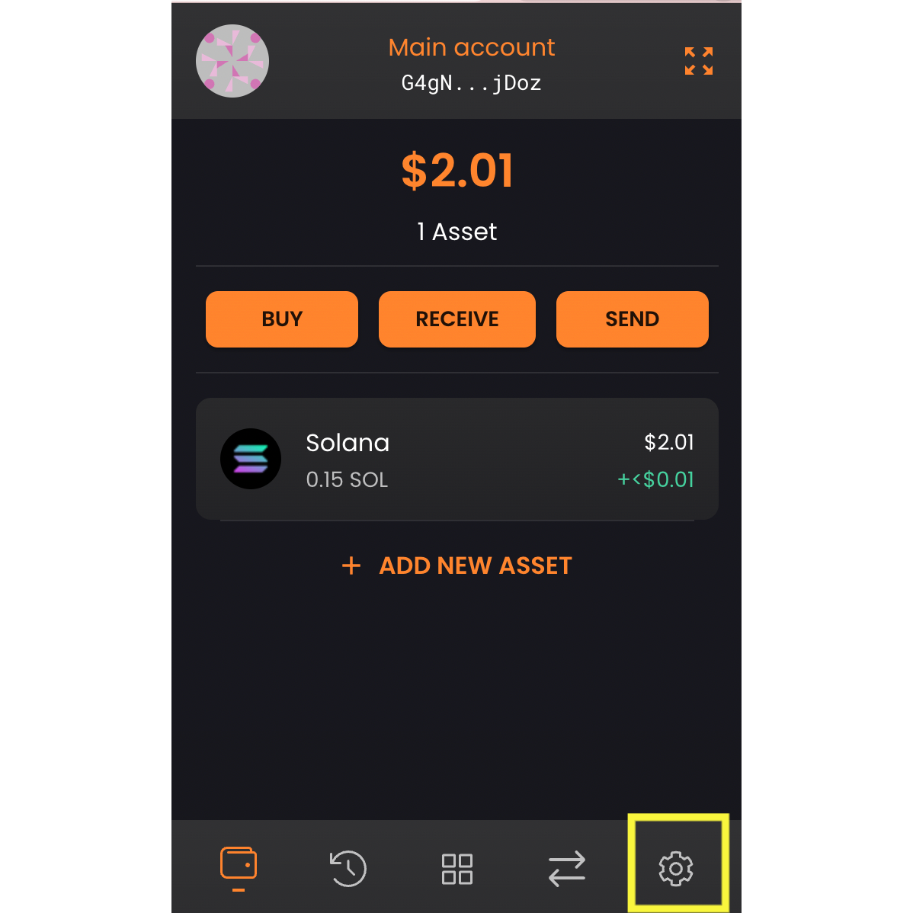
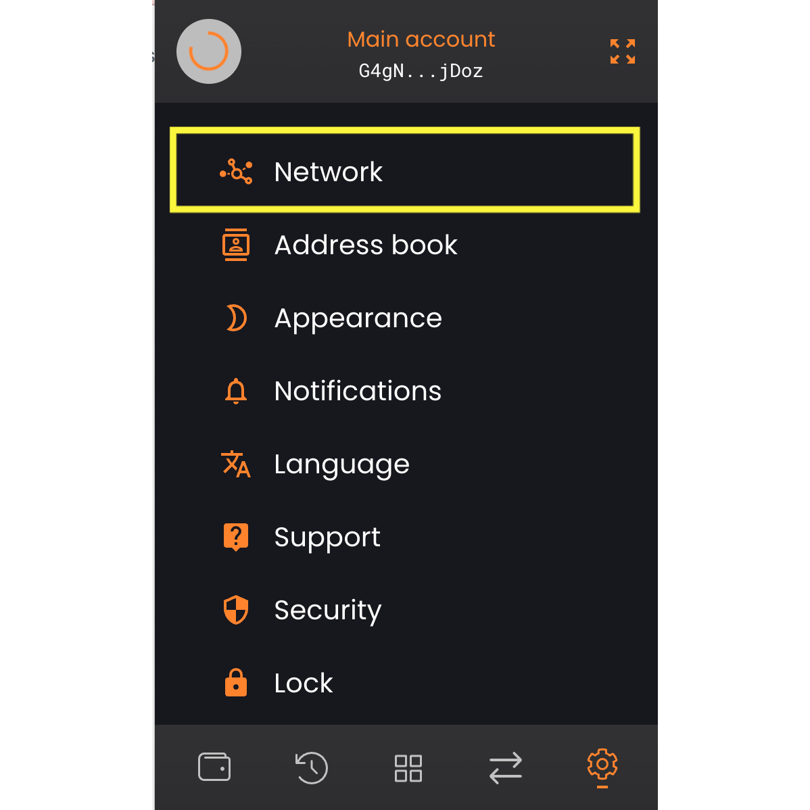
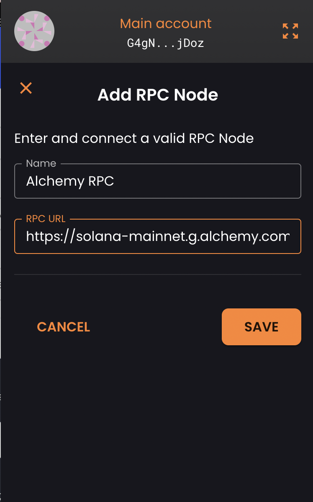

[Solflare](https://www.alchemy.com/dapps/solflare) is one of the most [popular wallets on Solana for developers](https://www.alchemy.com/list-of/wallets-on-solana). As the first non-custodial wallet for the Solana blockchain, it gives users access to their private keys and complete control over their funds.

Transactions on a public RPC endpoint may experience latency and rate limits (i.e. throughput) as more people join the network to participate and build, which might necessitate the need for a [private Solana endpoint](https://www.alchemy.com/overviews/solana-rpc) to scale.

Whether you’re just [setting up your Solana developer tools for the first time](/docs/how-to-setup-your-solana-development-environment), or need improved Solana node performance, this article will explain how to add a custom Solana RPC endpoint to your wallet with Alchemy.

## 0. Prerequisites

Here is what you’ll need to complete this tutorial:

* A [free Alchemy account](https://dashboard.alchemy.com/signup/?a=2c36b9f0c8)
* [Solfare extension](https://solflare.com/) installed on your PC

## Step 1. Set up your Private Solana Node on Alchemy

First head over to the Alchemy dashboard and create a new account. During the signup process, choose **Solana** as the type of app you want to create.

If you are an existing user, sign in and create a new Solana app.

#### Here is the information you need to create a Solana app:

1. **Name** - Project’s Name
2. **Chain** - Solana
3. **Network** - Mainnet

From the dashboard, you can view and copy your HTTP Key. This is what we’ll use in the next section to add a custom RPC endpoint in your Solflare wallet.

<Info>
  For more information on setting up an Alchemy account, read the [Alchemy Quickstart tutorial](/docs/alchemy-quickstart-guide).
</Info>

## Step 2: Change your Solflare Network Settings

Open your Solfare wallet and locate the setting on the bottom of the pop-up and select network.

 

## Step 3: Click “Add Custom Node”

You should notice the ***ADD CUSTOM NODE***, click on it, and fill with the name of your node and your ***Alchemy Solana Node RPC URL*** in the two fields.

## Step 4: Save Your Solflare Node Settings

Click Save and then click and then your Alchemy RPC is set up in Solfare. Now, all of your RPC requests from your Solflare wallet will go through your private Alchemy RPC endpoint!

## Conclusion

This article explained how to easily add a custom RPC in your Solfare developer wallet. Alchemy offers developers the most scalable, reliable, and accurate [Solana nodes](https://www.alchemy.com/overviews/solana-nodes).
