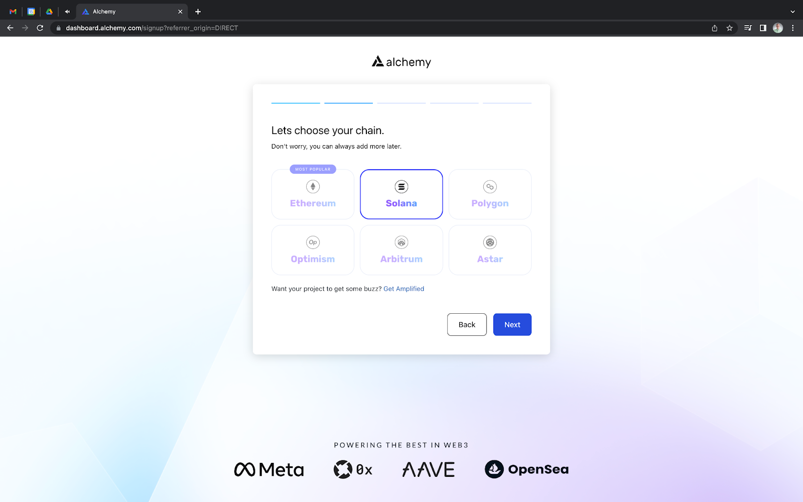
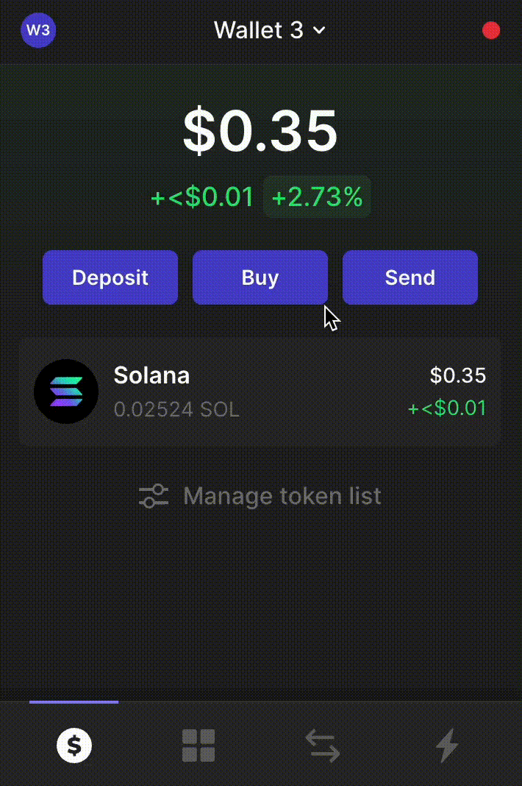
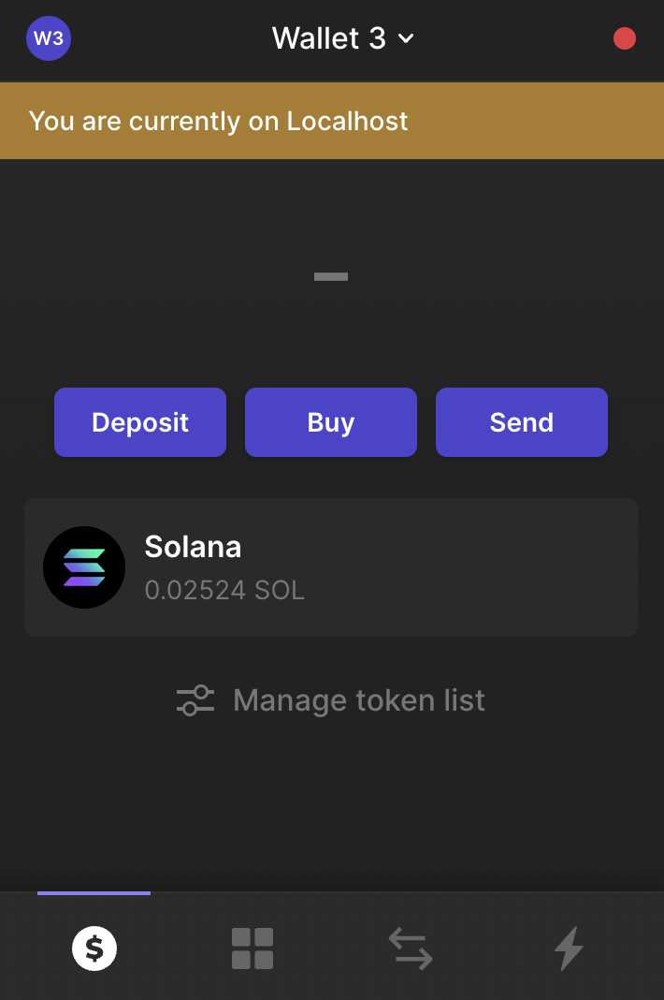

[Phantom](https://www.alchemy.com/dapps/phantom) is the [most widely used wallet on Solana](https://www.alchemy.com/list-of/wallets-on-solana) because it has a simple user interface and gives developers options for easily connecting to Solana’s Devnet.

Because transactions on a public RPC endpoint may experience latency and hit throughput limitations, this article explains how Solana developers can update their Phantom wallet settings to add a custom Solana endpoint.

Whether you’re [configuring your Solana developer tools for the first time](/docs/how-to-setup-your-solana-development-environment), or need better Solana node performance, this article will explain how developers can add a custom Solana RPC endpoint to their Phantom wallet using Alchemy and an HTTP Proxy server.

Because Phantom does not let users change their network, an HTTP Proxy server can be used to connect to a custom node when changing Phantom’s network to ‘localhost’.

<Info>
  The below solution is most applicable for web3 developers who know JavaScript, since it requires you to write a small running code snippet. Because Phantom doesn't allow you to change network RPC URLs on the wallet itself, non-technical web3 wallet users still need to use the default RPC URL Phantom provides.

  If you'd like Phantom to allow for their users to switch to an Alchemy RPC URL for faster, more reliable transactions, please fill out this [form](https://forms.gle/PM2YTp8e2eFRhMQ26).
</Info>

## Step 0: Prerequisites

Here is what you will need to complete this tutorial:

* [NodeJs](https://nodejs.org/en/download/) is installed on your machine (version 16 or higher)
* [NPM](https://nodejs.org/en/download/) package installed (version 8)
* [Phantom Wallet](https://phantom.app/)
* Code editor e.g VSCode

## Step 1: Create a Solana Node on Alchemy

Alchemy provides a variety of web3 development tools for Solana developers including best-in-class [Solana RPC infrastructure](https://www.alchemy.com/overviews/solana-rpc).

1. Go to the Alchemy dashboard
2. [Create a free account](https://dashboard.alchemy.com/signup/?a=3fa1fe4577)\*
3. Choose “Solana” as the app’s chain



<Info>
  If you are an existing user, sign in and create a new Solana app.
</Info>

#### Here is the information you need to create a Solana app:

1. Name - Project’s Name
2. Chain - Solana
3. Network - Mainnet

For more information on setting up an Alchemy account, read the [Alchemy Quickstart tutorial](/docs/alchemy-quickstart-guide).

In the next section, we will go through how you can add a custom RPC to Phantom.

## Step 2: Change your Network to Localhost

On your Phantom wallet locate the wallet icon on the top left of the pop-up. Then scroll down to ‘Developer Settings’ and click on 'Change Network'.

Select the Localhost option and it should automatically take you to the home screen. You get the message “Failed to get assets” because you do not have a custom RPC set up yet.



## Step 3: Install the HTTP Proxy Package

[The HTTP Proxy](https://www.npmjs.com/package/http-proxy) package acts as an HTTP Client and an HTTP Server. You can install it by running the following command in your terminal:

<CodeGroup>
  ```powershell powershell
  npm install http-proxy --save
  ```
</CodeGroup>

Because there is no way to add a custom RPC to Phantom directly, we need to use a Node.js proxy server to act as an intermediary between the wallet and our Alchemy HTTP endpoint.

Now, each time your Phantom wallet sends a request, it will send the transaction to the proxy, which then gets routed through the Alchemy HTTP endpoint.

## Step 4: Create an HTTP Proxy Server

This step of the process will create a new directory and create a proxy server to listen to localhost port 8000 and console logs a response when it is listening.

First, create a new directory and navigate into it.

<CodeGroup>
  ```powershell powershell
  mkdir node_server
  cd node_server
  ```
</CodeGroup>

Next, create a main.js file in the directory and copy the following code snippet into it:

<CodeGroup>
  ```powershell powershell
  var http = require('http'),
  httpProxy = require('http-proxy');

  httpProxy.createProxyServer({target:'ALCHEMY_HTTPS_URL', changeOrigin:true}).listen(8899);
  console.log("listening on: 8899");
  ```
</CodeGroup>

Then, let’s update your proxy server’s URL.

1. Click “View Key” from your Solana App’s dashboard
2. Paste this key into the main.js code snippet
3. Save the file

Finally, run the file in your terminal:

<CodeGroup>
  ```text text
  node main.js
  ```
</CodeGroup>

## Step 5: Confirm Phantom is Working

Open your Phantom wallet, and you should notice that the original “Failed to get assets” error message disappeared, and all of your assets load successfully. This is because Phantom is able to send and receive RPC requests through your local HTTP Proxy server with Alchemy.



## Conclusion

This article explains how Solana developers can add a custom RPC node to their Phantom wallet by creating a localhost HTTP Proxy server. For more information about Solana nodes, read our [guide to Solana nodes](https://www.alchemy.com/overviews/solana-nodes) and our [Solana API documentation](/reference/solana-api-quickstart).
