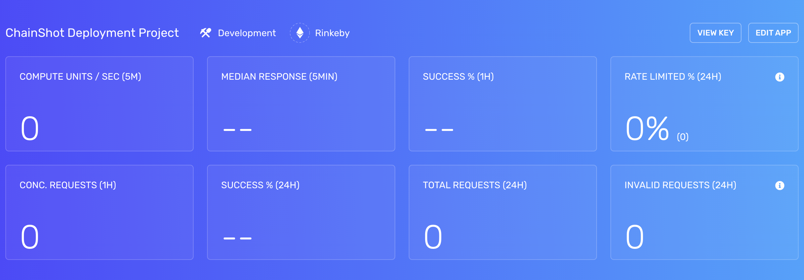

## Step 1: Create an Alchemy Account

1. Go to [Alchemy](https://alchemy.com/?a=febd498104) and create an account
2. In the Dashboard, select **Create App**
3. Enter a name and description, whatever you want to call it
4. Select **Development** for Environment and **Sepolia** for Network
5. Select **Create App** and select your newly-created project from the list in your Dashboard



6. Select **View Key**
7. We will need the 'HTTP' key for Step #4, so keep this tab open!

### Step 2: Add HTTP URL to Local Project

7. Select 'Create a basic sample project'

If you are using Hardhat, you can choose to copy-paste your HTTP endpoint directly into the `networks.url` key. Hardcoding the endpoint is not the best practice, since this file may end up being pushed to Github and your endpoint is exposed.

We recommend using [dotenv](https://www.npmjs.com/package/dotenv).

1. Run `npm install dotenv`
2. Create a `.env` file at the root of your project
3. Declare a variable, you can call it whatever you want
4. Copy-paste your HTTP URL from Step #1 to initialize the variable (remember to use Sepolia testnet!)

<CodeGroup>
  ```env .env
  MY_ALCHEMY_RPC_ENDPOINT=https://eth-sepolia.g.alchemy.com/v2/[YOUR-API-KEY]
  MY_PRIVATE_KEY=0x123
  ```
</CodeGroup>

> This is the perfect place to use sensitive data like private keys! Always make sure to only use test keys and include `.env` file in `.gitignore`.

5. In your `hardhat.config.js`, copy-paste this line at the top of the file:

<CodeGroup>
  ```javascript javascript
  require('dotenv').config();
  ```
</CodeGroup>

> This basically loads in all the environment-wide variables declared in your `.env` and bring them into your config file. In other words, pasting this line makes your config file go "Ok, this person is telling me to load the variables in the root's `.env` file to this file."

6. You can then access the variables in your `.env` file via `process.env`

<CodeGroup>
  ```javascript javascript
  require('@nomiclabs/hardhat-waffle');

  module.exports = {
    solidity: "0.8.0",
    networks: {
      sepolia: {
        url: `${process.env.MY_ALCHEMY_RPC_ENDPOINT}`,
        accounts: [`0xabc`],
      } 
    }
  };
  ```
</CodeGroup>

> Did you catch how we are sourcing the `url` and `accounts` variables in this file? We are loading them up from `process.env` using the `dotenv` library we installed at the beginning of this step. This functionality allows us to have project-wide environment variables without having to explicitly define them in every file needed.

Any file that has the

<CodeGroup>
  ```javascript javascript
  require('dotenv').config();
  ```
</CodeGroup>

statement at the top will automatically load any variables in the root's `.env` file.

## Step 3: Build!

Now that you've loaded up an Alchemy RPC endpoint to your local development project, any programs run with `npx hardhat` will use the Alchemy endpoint in your dashboard. 👏💥
