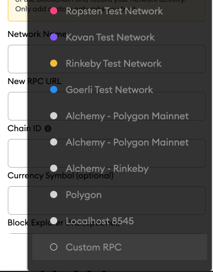
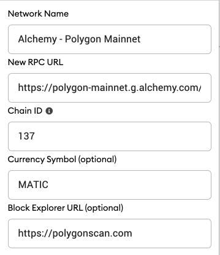
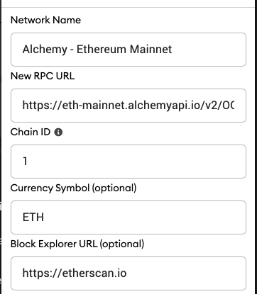

## Steps to update your Metamask

1. [Create a free account on Alchemy](https://docs.alchemy.com/alchemy/guides/connecting-metamask-to-alchemy#1.-create-a-free-account-on-alchemy)
2. [Create an API key for the desired Network on Metamask](https://docs.alchemy.com/alchemy/guides/connecting-metamask-to-alchemy#2.-create-an-api-key-for-the-desired-network-on-metamask)
3. [Choose "Custom RPC" in Metamask](https://docs.alchemy.com/alchemy/guides/connecting-metamask-to-alchemy#3.-choose-custom-rpc-in-metamask)
4. [Fill in the network details](https://docs.alchemy.com/alchemy/guides/connecting-metamask-to-alchemy#4.-fill-in-the-required-information)

***

## Why is Metamask not working?

MetaMask uses a default node provider to display and send transactions for your account. Because the node provider does not allocate dedicated resources to each user, it may be slow sometimes, i.e. for transactionbroadcasting.

Alchemy provides a much better experience when it is used as your MetaMask RPC provider. If you'd like to switch this over to Alchemy to be able to see your transactions in your Alchemy dashboard and use Alchemy-specific features and tools, this doc will show you how to integrate your MetaMask account in *two easy steps*.

**NOTE**: This does not mean that Alchemy will have access to your private keys or wallet!

For a video version of this guide, check this out:

<iframe width="560" height="315" src="https://www.youtube.com/embed/VUkhkSgMtdk?si=TNaR7-1Bh2Fex2NE" title="YouTube video player" frameborder="0" allow="accelerometer; autoplay; clipboard-write; encrypted-media; gyroscope; picture-in-picture; web-share" referrerpolicy="strict-origin-when-cross-origin" allowfullscreen></iframe>

***

## Step 1: Create a free account on [Alchemy](https://alchemy.com/?a=991c4e82df)

We'll need to use an Alchemy API key to replace our Metamask endpoint. You can create a free account [here](https://alchemy.com/?a=991c4e82df).

***

## Step 2: Create an API key for the desired Network on Metamask

If we want to replace our Ethereum Mainnet endpoint (most popular) in Metamask we'll need to create an Ethereum Mainnet API key on Alchemy. For instructions on how to do so, check out [step 1 of this guide](/docs/how-to-add-alchemy-rpc-endpoints-to-metamask#step-1-create-a-free-account-on-alchemy). Or watch the video below.

***

## Step 3: Choose "Custom RPC" in Metamask

Navigate to your MetaMask wallet and click the network dropdown at the top, selecting **"Custom RPC"** at the bottom

Click on "Custom RPC" at the very bottom of the network dropdown.

***

## Step 4: Fill in the network details

This is where you'll grab your Alchemy API Key for the desired network.

<Warning>
  While you can use the Goerli testnet, we caution against it as the Ethereum Foundation has announced that [Goerli will soon be deprecated](https://www.alchemy.com/blog/goerli-faucet-deprecation). We therefore recommend using [Sepolia](https://www.alchemy.com/overviews/sepolia-testnet) as Alchemy has full Sepolia support and a free [Sepolia faucet](https://sepoliafaucet.com/) also.
</Warning>

Here is the information on specific Networks

| Network                 | RPC Base URL                                                                                         | Chain ID | Block Explorer URL                                                              | Symbol (Optional) |
| ----------------------- | ---------------------------------------------------------------------------------------------------- | -------- | ------------------------------------------------------------------------------- | ----------------- |
| Ethereum Mainnet        | [https://eth-mainnet.g.alchemy.com/v2/](https://eth-mainnet.g.alchemy.com/v2/)                       | 1        | [https://etherscan.io/](https://etherscan.io/)                                  | ETH               |
| Ropsten Test Network    | [https://eth-ropsten.g.alchemy.com/v2/](https://eth-ropsten.g.alchemy.com/v2/)                       | 3        | [https://ropsten.etherscan.io/](https://ropsten.etherscan.io/)                  | ETH               |
| Rinkeby Test Network    | [https://eth-rinkeby.g.alchemy.comv2/](https://eth-rinkeby.g.alchemy.comv2/)                         | 4        | [https://rinkeby.etherscan.io/](https://rinkeby.etherscan.io/)                  | ETH               |
| Sepolia Test Network    | [https://eth-sepolia.g.alchemy.com/v2/](https://eth-sepolia.g.alchemy.com/v2/)                       | 11155111 | [https://sepolia.etherscan.io/](https://sepolia.etherscan.io/)                  |                   |
| Goerli Test Network     | [https://eth-goerli.g.alchemy.com/v2/](https://eth-goerli.g.alchemy.com/v2/)                         | 5        | [https://goerli.etherscan.io/](https://goerli.etherscan.io/)                    | ETH               |
| Kovan Test Network      | [https://eth-kovan.g.alchemy.com/v2/](https://eth-kovan.g.alchemy.com/v2/)                           | 42       | [https://kovan.etherscan.io/](https://kovan.etherscan.io/)                      | ETH               |
| Polygon (Matic) Mainnet | [https://polygon-mainnet.g.alchemy.com/v2/](https://polygon-mainnet.g.alchemy.com/v2/)               | 137      | [https://polygonscan.com/](https://polygonscan.com/)                            | MATIC             |
| Polygon (Matic) Mumbai  | [https://polygon-mumbai.g.alchemy.com/v2/](https://polygon-mumbai.g.alchemy.com/v2/)                 | 80001    | [https://mumbai.polygonscan.com](https://mumbai.polygonscan.com)                | MATIC             |
| Arbitrum Mainnet        | [https://arb-mainnet.g.alchemy.com/v2/](https://arb-mainnet.g.alchemy.com/v2/)                       | 42161    | [https://arbiscan.io/](https://arbiscan.io/)                                    | AETH              |
| Arbitrum Testnet        | [https://arb-goerli.g.alchemy.com/v2/your-api-key](https://arb-goerli.g.alchemy.com/v2/your-api-key) | 421613   | [https://testnet.arbiscan.io/](https://testnet.arbiscan.io/)                    | AGOR              |
| Optimism Mainnet        | [https://opt-mainnet.g.alchemy.com/v2/](https://opt-mainnet.g.alchemy.com/v2/)                       | 10       | [https://optimistic.etherscan.io](https://optimistic.etherscan.io)              | ETH               |
| Optimism Testnet        | [https://opt-goerli.g.alchemy.com/v2/](https://opt-goerli.g.alchemy.com/v2/)                         | 420      | [https://goerli-optimism.etherscan.io//](https://goerli-optimism.etherscan.io/) | ETH               |

Example Polygon Configuration

Example Ethereum Mainnet Configuration

And that's it! Your MetaMask is now hooked up to Alchemy 🎉
