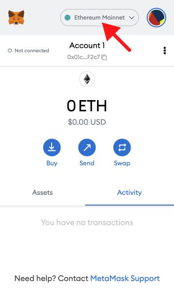
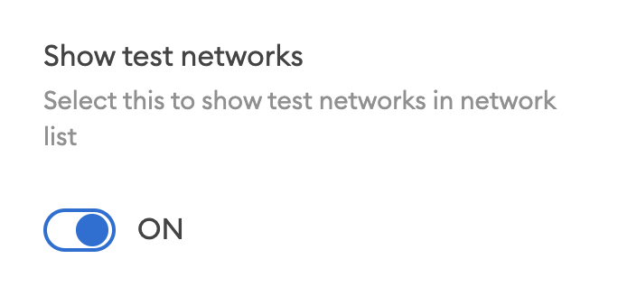

## Overview

1. [Mainnet vs. Testnet (Arbitrum)](https://docs.alchemy.com/alchemy/guides/connecting-metamask-to-alchemy/how-to-add-arbitrum-to-metamask#mainnet-vs.-arbitrum-testnet)
2. [Create a free Alchemy account](https://alchemy.com/?a=991c4e82df)
3. [Create an Arbitrum App](https://docs.alchemy.com/alchemy/guides/connecting-metamask-to-alchemy/how-to-add-arbitrum-to-metamask#create-an-arbitrum-app)
4. [Add to Wallet](https://docs.alchemy.com/alchemy/guides/connecting-metamask-to-alchemy/how-to-add-arbitrum-to-metamask#add-to-wallet)

[Updating your Metamask RPC manually](https://docs.alchemy.com/alchemy/guides/connecting-metamask-to-alchemy/how-to-add-arbitrum-to-metamask#updating-your-metamask-rpc-manually)

1. [Copy your HTTP API Key](https://docs.alchemy.com/alchemy/guides/connecting-metamask-to-alchemy/how-to-add-arbitrum-to-metamask#copy-your-http-api-key)
2. [Update Arbitrum Mainnet](https://docs.alchemy.com/alchemy/guides/connecting-metamask-to-alchemy/how-to-add-arbitrum-to-metamask#updating-arbitrum-mainnet)
3. [Update Arbitrum Testnet (Arbitrum)](https://docs.alchemy.com/alchemy/guides/connecting-metamask-to-alchemy/how-to-add-arbitrum-to-metamask#update-arbitrum-testnet-arbitrum)

***

## Mainnet vs. Goerli Testnet

There are two networks on Arbitrum: Mainnet and Goerli Testnet, however, we recommend using Sepolia as your Arbitrum testnet.

<Warning>
  While you can use the Goerli testnet, we caution against it as the Ethereum Foundation has announced that [Goerli will soon be deprecated](https://www.alchemy.com/blog/goerli-faucet-deprecation), instead, we recommend using [Sepolia](https://www.alchemy.com/overviews/sepolia-testnet).

  Alchemy has full Sepolia support and a free [Sepolia faucet](https://sepoliafaucet.com/) also.
</Warning>

The endpoints are as follows:

* Mainnet: [https://arb-mainnet.g.alchemy.com/v2/your-api-key](https://arb-mainnet.g.alchemy.com/v2/your-api-key)
* Goerli: [https://arb-goerli.g.alchemy.com/v2/your-api-key](https://arb-goerli.g.alchemy.com/v2/your-api-key)
* Sepolia: [https://eth-sepolia.g.alchemy.com/v2/your-api-key](https://eth-sepolia.g.alchemy.com/v2/your-api-key)

***

## Set up a free Alchemy account

This is an essential step. Just do it [here](https://alchemy.com/?a=991c4e82df). Since Arbitrum is a Layer 2 solution, be sure to select the **Ethereum + L2 Ecosystem** during sign-up.

***

## Create an Arbitrum App

Check out [these instructions](https://docs.alchemy.com/alchemy/introduction/getting-started#1.create-an-alchemy-key) for creating a new app. Make sure to specify **Arbitrum** as the chain and choose Mainnet or Goerli.

***

## Add to Wallet

Alchemy provides an **Add To Wallet** button for Arbitrum apps.

This is a more convenient way to add the Arbitrum network to your Metamask wallet rather than manually configuring it.

Add to Wallet button

**That's it! You should see your Metamask work a lot better now** 😉

***

## Updating your Metamask RPC Manually

The below instructions are for updating your Metamask RPC manually instead of using the "Add to Wallet" button.

## Copy your HTTP API Key

After creating your app, you should be able to see your Alchemy app’s chain matches the chain you want to connect to.

Here, you can find your HTTP which you will use for your RPC URL in Metamask.

Alchemy API Key

## Updating Arbitrum Mainnet

1. **Open Metamask and click the network name located at the top-right of the window**

2. **Click the Add Network button at the bottom of the pop-up window**

3. **Enter the following network details and click Save**

* **Network Name**: Arbitrum
  * You can name your Network Name anything to remind you which chain you’re connecting to.
* **New RPC URL**: [https://arb-mainnet.g.alchemy.com/v2/your-api-key](https://arb-mainnet.g.alchemy.com/v2/your-api-key)
  * For the New RPC URL field, [grab the HTTP from your Alchemy Dashboard](https://docs.alchemy.com/alchemy/guides/connecting-metamask-to-alchemy/how-to-add-arbitrum-to-metamask#copy-your-http-api-key). If you don't have a dashboard account, go back up to the "[Set up a free Alchemy account](https://alchemy.com/?a=991c4e82df)" step and set up your account.
* **Chain ID**: 42161
* **Currency Symbol**: AETH
  * Optional
* **Block Explorer URL**: [https://arbiscan.io/](https://arbiscan.io/)
  * Optional

After clicking **Save**, you will be directly switched to Arbitrum’s Network within the dropdown list.

That's it! You've now added the Arbitrum network with Alchemy connected.

<Info>
  ⛓️ To explore other [free and public Arbitrum RPC endpoints](https://www.alchemy.com/chain-connect/chain/arbitrum-one), visit Alchemy Chain Connect.
</Info>

## Update Arbitrum Testnet (Goerli)

Arbitrum currently has [one testnet](https://developer.offchainlabs.com/docs/public_testnet) connected to Ethereum's Goerli testnet. This uses the Nitro rollup tech stack operates precisely the same as Arbitrum mainnet but is built as a smart contract on Goerli instead of on Ethereum mainnet.

Adding the testnet is the same process as adding the mainnet shown above but with a different RPC endpoint.

1. **First, make sure you’ve enabled the Show test networks toggle**.

This will list all the default test networks within your network list. You can find this in Settings>Advanced>Show test Networks

2. **Enter the following network details and click Save**

* **Network Name**: Arbitrum Testnet
* **New RPC URL**: [https://arb-goerli.g.alchemy.com/v2/your-api-key](https://arb-goerli.g.alchemy.com/v2/your-api-key)
* **Chain ID**: 421613
* **Currency Symbol**: AGOR
* **Block Explorer URL**: [https://goerli.arbiscan.io](https://goerli.arbiscan.io)

