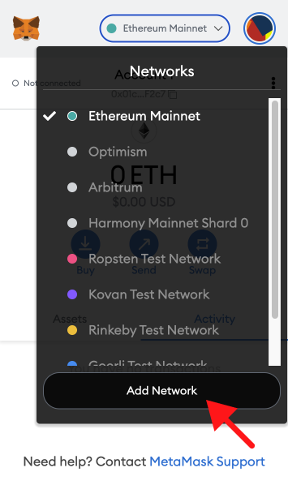
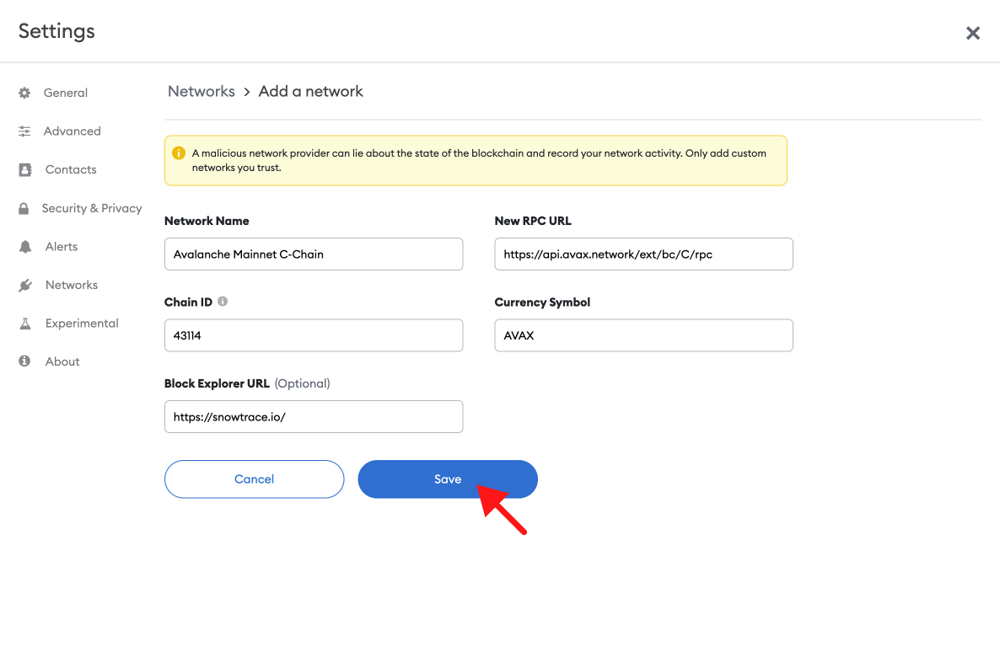
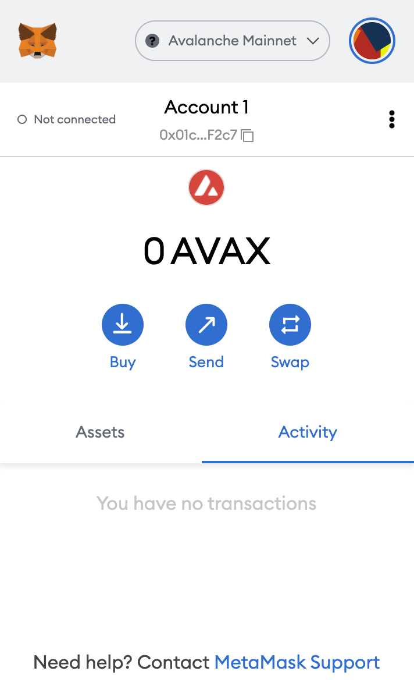
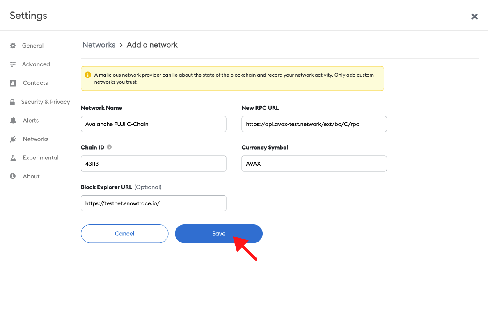

## Overview

1. ​[What is Avalanche?](#what-is-near)​​
2. ​[Mainnet vs. Testnet](#mainnet-vs.-testnet-fuji) (Fuji)​
3. ​[Update Avalanche Mainnet​](#update-aurora-mainnet)
4. ​[Update Avalanche Fuji Testnet ](#update-aurora-testnet)​

***

## What is Avalanche?

Avalanche is a blockchain that uses its own unique Avalanche Consensus Protocol. The blockchain promises to combine scaling capabilities and quick confirmation times alongside its features.

***

## Mainnet vs. Testnet

Avalanche has three chains, which include the Exchange, Platform, and Contract chains.

This process will describe how to use the Contract mainnet and testnet since it directly relates to executing EVM contracts and smart contracts.

* **Mainnet**: [https://api.avax.network/ext/bc/C/rpc](https://api.avax.network/ext/bc/C/rpc)
* **Testnet:** [https://api.avax-test.network/ext/bc/C/rpc](https://api.avax-test.network/ext/bc/C/rpc)

***

## Update Avalanche Mainnet

#### 1. Open Metamask and click the network name located at the top-right of the window

.png")

#### 2. Click the Add Network button at the bottom of the pop-up window

#### 3. **Enter the following network details and click Save**

* **Network Name:** Avalanche Mainnet C-Chain
* **New RPC URL:** [https://api.avax.network/ext/bc/C/rpc](https://api.avax.network/ext/bc/C/rpc)
* **Chain ID:** 43114
* **Currency Symbol:** AVAX
* **Block Explorer URL:** [https://snowtrace.io/](https://snowtrace.io/)

#### 4. After clicking Save, you will be directly switched to Avalanche Network within the dropdown list.

And that’s it! You now have added the Avalanche network.

<Info>
  ⛓️ To explore other [free and public Avalanche RPC endpoints](https://www.alchemy.com/chain-connect/chain/avalanche-c-chain), visit Alchemy Chain Connect.
</Info>

***

## Update Avalanche Fuji Testnet

Avalanche Fuji Testnet replicates the Avalanche Mainnet, except its primary use is for testing.

Adding the testnet is the same process as adding the mainnet shown above, with a few differences.

#### 1. First, make sure you’ve enabled the Show test networks toggle. This will list all the default test networks within your network list.

(You can find this in Settings>Advanced>Show test Networks)

.png")

#### 2. Enter the following network details and click Save

* **Network Name:** Avalanche FUJI C-Chain
* **New RPC URL:** [https://api.avax-test.network/ext/bc/C/rpc](https://api.avax-test.network/ext/bc/C/rpc)**​**
* **Chain ID:** 43113
* **Currency Symbol:** AVAX
* **Block Explorer URL:** [https://testnet.snowtrace.io/](https://testnet.snowtrace.io/)

