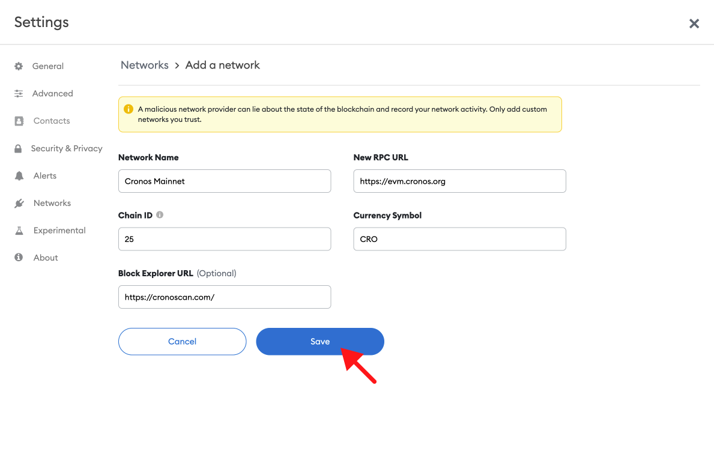
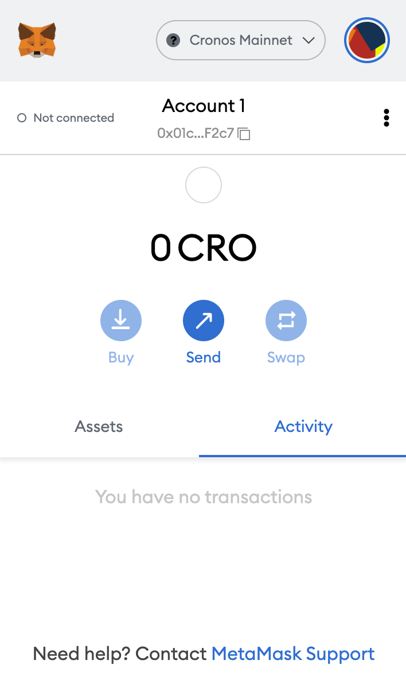

## Overview

1. ​[What is Cronos?](#what-is-near)​​
2. ​[Mainnet vs. Testnet​](#mainnet-vs.-testnet-fuji)
3. [​Update Cronos Mainnet](#update-aurora-mainnet)
4. [​Update Cronos Testnet (Rinkeby)​](#update-aurora-testnet)

***

## What is Cronos?

Cronos is the first blockchain network that interoperates with both the Ethereum and Cosmos ecosystems. Cronos is a chain running in parallel to the Crypto.org Chain and the Mainnet is shipped with the Ethereum Virtual Machine (EVM) that executes user-submitted smart contract codes.

***

## Mainnet vs. Testnet

Crypto.org offers two networks for its chain: Mainnet and Croeseid (testnet). Both offer the same API methods using Tendermint or gRPC.

* **Mainnet**: [https://evm.cronos.org](https://evm.cronos.org)
* **Testnet (Rinkeby):** [https://evm-t3.cronos.org](https://evm-t3.cronos.org)

***

## Update Cronos Mainnet

#### 1. Open Metamask and click the network name located at the top-right of the window

.png")

#### 2. Click the Add Network button at the bottom of the pop-up window

.png")

#### 3. Enter the following network details and click Save

* **Network Name:** Cronos Mainnet
* **New RPC URL:** [https://evm.cronos.org](https://evm.cronos.org)
* **Chain ID:** 25
* **Currency Symbol:** CRO
* **Block Explorer URL:** [https://cronoscan.com/](https://cronoscan.com/)

#### 4. After clicking Save, you will be directly switched to Cronos Network within the dropdown list.

And that’s it! You now have added the Cronos network.

***

## Update Cronos Testnet (Rinkeby)

Cronos Testnet replicates the Cronos Mainnet, except its primary use is for testing.

Adding the testnet is the same process as adding the mainnet shown above, with a few differences.

#### 1. First, make sure you’ve enabled the Show test networks toggle. This will list all the default test networks within your network list.

(You can find this in Settings>Advanced>Show test Networks)

.png")

#### 2. Enter the following network details and click Save

* **Network Name:** Cronos Testnet
* **New RPC URL:** [https://evm-t3.cronos.org](https://evm-t3.cronos.org)
* **Chain ID:** 338
* **Currency Symbol:** tCRO
* **Block Explorer URL:** [https://cronos.org/explorer/testnet3](https://cronos.org/explorer/testnet3)

.png")
