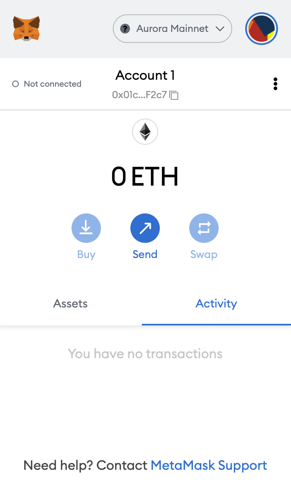

## Overview

1. [What is Near?](#what-is-near)
2. [What is Aurora?](#what-is-aurora)
3. [Mainnet vs. Testnet](#mainnet-vs.-testnet-fuji)
4. [Update Aurora Mainnet](#update-aurora-mainnet)
5. [Update Aurora Testnet](#update-aurora-testnet)

***

## What is Near?

Near protocol is a blockchain that uses its proof of stake ‘Nightshade’, a sharding solution that aims to scale the blockchain more efficiently.

***

## What is Aurora

Aurora is a layer two scaling solution that is built on Near protocol to implement Ethereum decentralized apps. Aurora uses the Ethereum Virtual Machine (EVM) to link Ethereum smart contracts and assets.

***

## Mainnet vs. Testnet

There are two networks on Aurora : Mainnet and Testnet. The endpoints are as follows:

* **Mainnet**: [https://mainnet.aurora.dev](https://mainnet.aurora.dev)
* **Testnet: [https://testnet.aurora.dev](https://testnet.aurora.dev)**

***

## Update Aurora Mainnet

#### 1. Open Metamask and click the network name located at the top-right of the window

.png")

#### 2. Click the Add Network button at the bottom of the pop-up window

.png")

#### 3. Enter the following network details and click Save

* **Network Name:** Aurora Mainnet
* **New RPC URL:** [https://mainnet.aurora.dev](https://mainnet.aurora.dev)
* **Chain ID:** 1313161554
* **Currency Symbol:** ETH
* **Block Explorer URL:** [https://explorer.mainnet.aurora.dev/](https://explorer.mainnet.aurora.dev/)

#### 4. After clicking Save, you will be directly switched to Aurora’s Network within the dropdown list.

And that’s it! You now have added the Aurora network.

***

## Update Aurora Testnet

Aurora Testnet replicates the Aurora Mainnet, except its primary use is for testing.

Adding the testnet is the same process as adding the mainnet shown above, with a few differences.

#### 1. First, make sure you’ve enabled the Show test networks toggle. This will list all the default test networks within your network list.

(You can find this in Settings>Advanced>Show test Networks)

.png")

#### 2. Enter the following network details and click Save

* **Network Name:** Aurora Testnet
* **New RPC URL: [https://testnet.aurora.dev](https://testnet.aurora.dev)**
* **Chain ID:** 1313161555
* **Currency Symbol:** ETH
* **Block Explorer URL: [https://explorer.testnet.aurora.dev/](https://explorer.testnet.aurora.dev/)**

