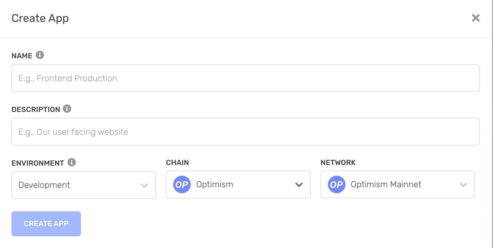
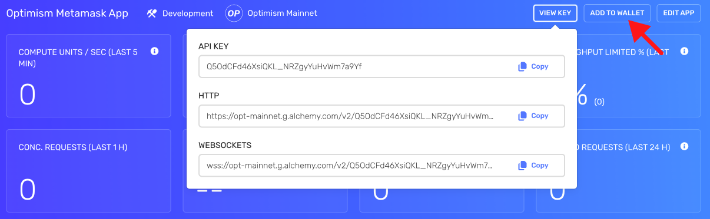
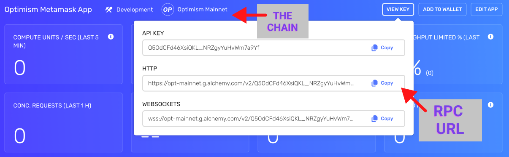
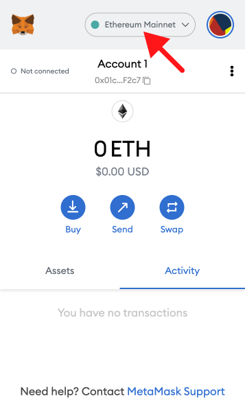
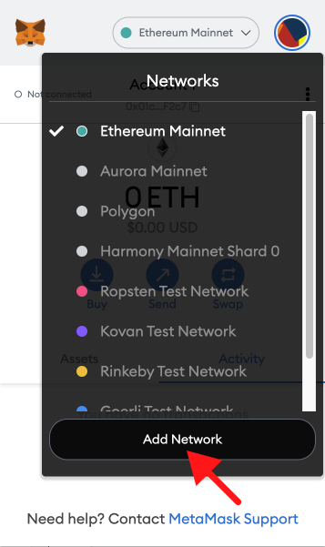
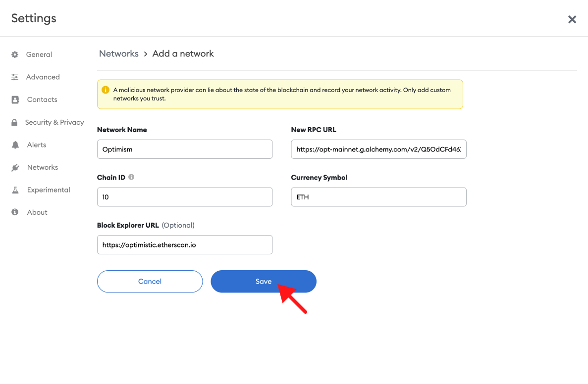
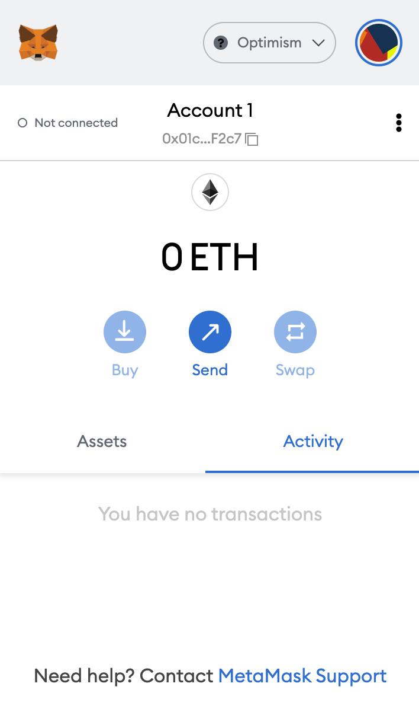
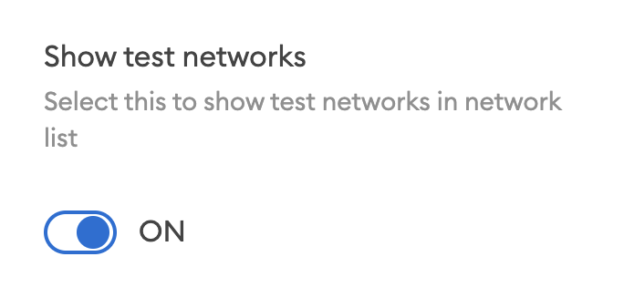
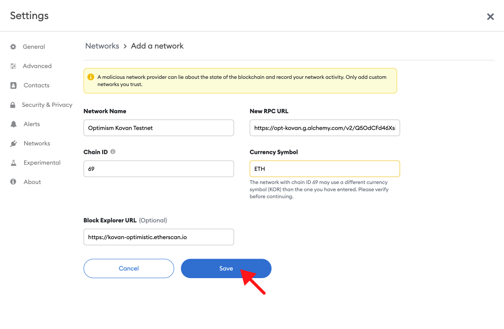

## Overview

1. [What is Optimism?](https://docs.alchemy.com/alchemy/guides/connecting-metamask-to-alchemy/how-to-add-optimism-to-metamask#what-is-optimism)
2. [Mainnet vs. Testnet (Kovan)](https://docs.alchemy.com/alchemy/guides/connecting-metamask-to-alchemy/how-to-add-optimism-to-metamask#mainnet-vs.-mumbai-testnet)
3. [Create a free Alchemy account](https://alchemy.com/?a=991c4e82df)
4. [Create an Optimism App](https://docs.alchemy.com/alchemy/guides/connecting-metamask-to-alchemy/how-to-add-optimism-to-metamask#create-a-polygon-app)
5. [Add to Wallet](https://docs.alchemy.com/alchemy/guides/connecting-metamask-to-alchemy/how-to-add-optimism-to-metamask#add-to-wallet)

**[Updating your Metamask RPC manually](https://docs.alchemy.com/alchemy/guides/connecting-metamask-to-alchemy/how-to-add-optimism-to-metamask#updating-your-metamask-rpc-manually)**

1. [Copy your HTTP API Key](https://docs.alchemy.com/alchemy/guides/connecting-metamask-to-alchemy/how-to-add-optimism-to-metamask#copy-your-http-api-key)
2. [Update Optimism Mainnet](https://docs.alchemy.com/alchemy/guides/connecting-metamask-to-alchemy/how-to-add-optimism-to-metamask#updating-polygon-mainnet)
3. [Update Optimism Testnet Kovan](https://docs.alchemy.com/alchemy/guides/connecting-metamask-to-alchemy/how-to-add-optimism-to-metamask#update-polygon-testnet-mumbai)

***

## What is Optimism?

Optimism is a Layer 2 scaling solution that makes Ethereum transactions cheaper and faster.

This section will include ways to add Optimism Mainnet and Kovan Testnet as your custom MetaMask RPC node provider.

***

## Mainnet vs. Kovan Testnet

There are two networks on Optimism: Mainnet and Kovan testnet. The endpoints are as follows:

1. **Mainnet**: [https://opt-mainnet.g.alchemy.com/v2/your-api-key](https://opt-mainnet.g.alchemy.com/v2/your-api-key)
2. **Mumbai**: [https://opt-kovan.g.alchemy.com/v2/your-api-key](https://opt-kovan.g.alchemy.com/v2/your-api-key)

***

## Set up a free Alchemy account

This is an essential step. **Just do it. [here](https://alchemy.com/?a=991c4e82df).**

Since Optimism is a Layer 2 solution, be sure to select the **Ethereum + L2 Ecosystem** during sign-up.

***

## Create an Optimism App

Check out [these instructions](https://docs.alchemy.com/alchemy/introduction/getting-started#1.create-an-alchemy-key) for creating a new app. Make sure to specify **Optimism** as the chain and choose Mainnet or Kovan as the network.

***

## Add to Wallet

Alchemy provides an **Add To Wallet** button for Optimism apps.

This is a more convenient way to add the Optimism network to your Metamask wallet rather than manually configuring it.

Add to Wallet button

**That's it! You should see your Metamask work a lot better now** 😉

***

## Updating your Metamask RPC Manually

The below instructions are for updating your Metamask RPC manually instead of using the "Add to Wallet" button.

## Copy your HTTP API Key

After creating your app, you should be able to see your Alchemy app’s chain matches the chain you want to connect to.

Here, you can find your HTTP which you will use for your RPC URL in Metamask.

## Updating Optimism Mainnet

1. **Open Metamask and click the network name located at the top-right of the window**

2. **Click the Add Network button at the bottom of the pop-up window**

3. **Enter the following network details and click Save**

* **Network Name**: Optimism
* **New RPC URL**: [https://opt-mainnet.g.alchemy.com/v2/your-api-key](https://opt-mainnet.g.alchemy.com/v2/your-api-key)
* **Chain ID**: 10
* **Currency Symbol**: ETH
* **Block Explorer URL**: [https://optimistic.etherscan.io](https://optimistic.etherscan.io)

After clicking **Save**, you will be directly switched to Optimism within the dropdown list

**That's it! You've now added the Optimism network with Alchemy connected.**

<Info>
  ⛓️ To explore other [free and public Optimism RPC endpoints](https://www.alchemy.com/chain-connect/chain/optimism), visit Alchemy Chain Connect.
</Info>

## Update Optimism Testnet (Kovan)

Optimistic Testnet Kovan is an EVM equivalent Optimistic Rollup chain. Kovan is purely designed for testing purposes.

Adding the testnet is the same process as adding the mainnet shown above, with a few slight differences.

1. **First, make sure you’ve enabled the Show test networks toggle**.

This will list all the default test networks within your network list. You can find this in Settings>Advanced>Show test Networks

2. **Enter the following network details and click Save**

* **Network Name: Optimism Kovan Testnet**
* **New RPC URL**: **[https://opt-kovan.g.alchemy.com/v2/your-api-key](https://opt-kovan.g.alchemy.com/v2/your-api-key)**
* **Chain ID**: 69
* **Currency Symbol**: ETH
* **Block Explorer URL**: \**[https://kovan-optimistic.etherscan.io/](https://kovan-optimistic.etherscan.io/)*

