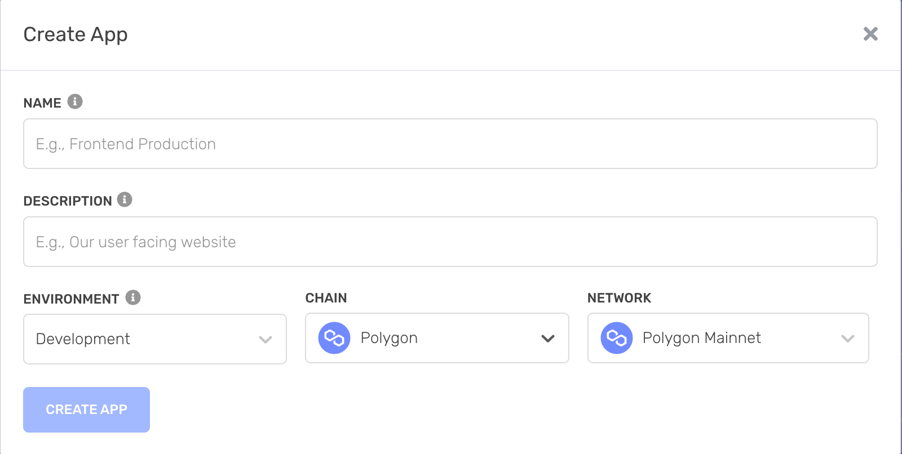
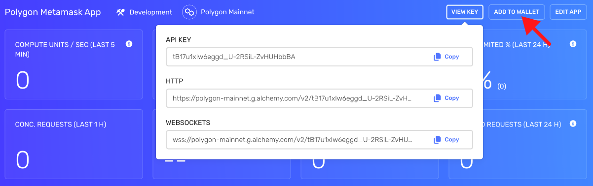
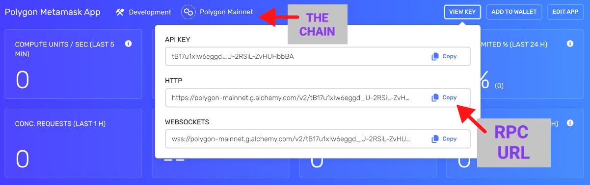
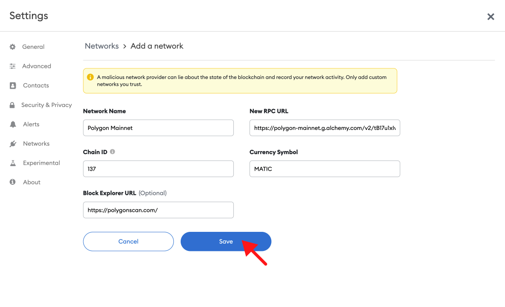
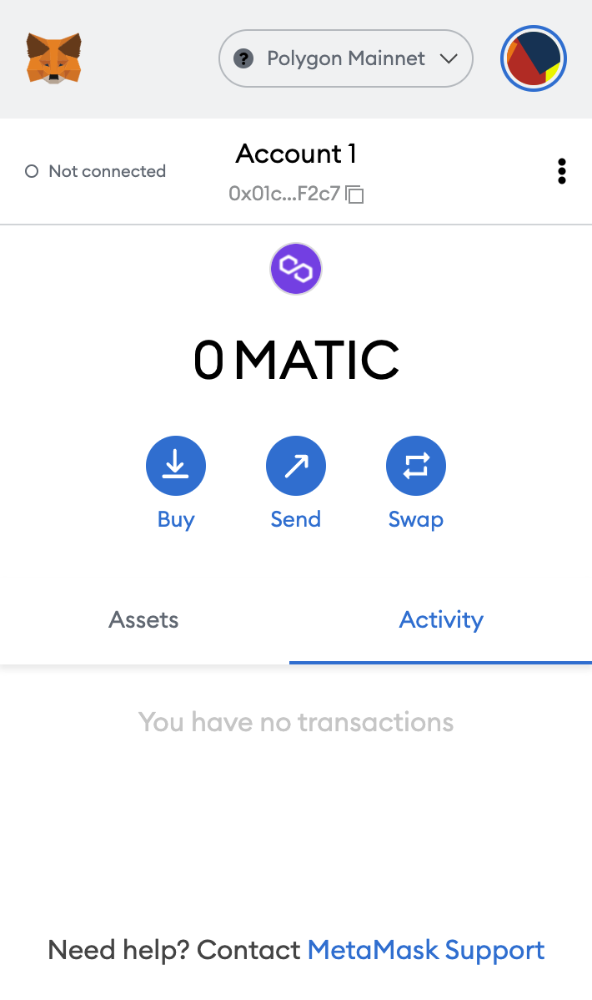
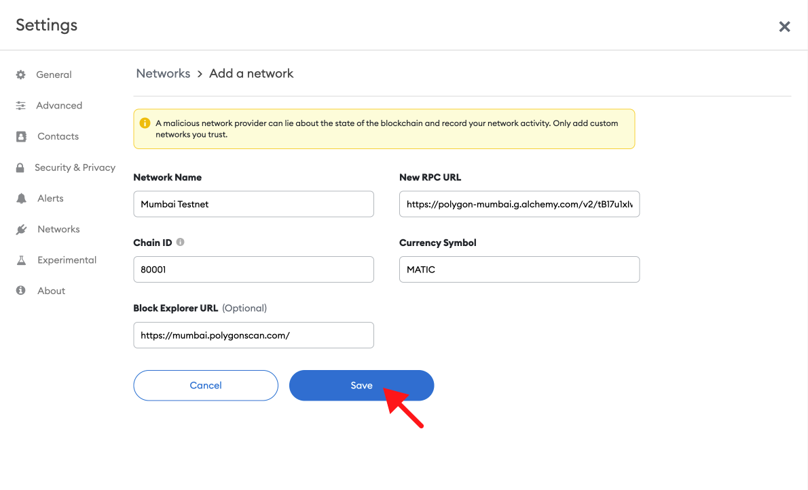

## Overview

1. [What is Polygon?](https://docs.alchemy.com/alchemy/guides/connecting-metamask-to-alchemy/how-to-add-polygon-to-metamask#undefined)
2. [Mainnet vs. Testnet (Mumbai)](https://docs.alchemy.com/alchemy/guides/connecting-metamask-to-alchemy/how-to-add-polygon-to-metamask#mainnet-vs.-mumbai-testnet)
3. [Create a free Alchemy account](https://alchemy.com/?a=991c4e82df)
4. [Create a Polygon App](https://docs.alchemy.com/alchemy/guides/connecting-metamask-to-alchemy/how-to-add-polygon-to-metamask#create-an-arbitrum-app)
5. [Add to Wallet](https://docs.alchemy.com/alchemy/guides/connecting-metamask-to-alchemy/how-to-add-polygon-to-metamask#add-to-wallet)

**[Updating your Metamask RPC manually](https://docs.alchemy.com/alchemy/guides/connecting-metamask-to-alchemy/how-to-add-polygon-to-metamask#updating-your-metamask-rpc-manually)**

1. [Copy your HTTP API Key](https://docs.alchemy.com/alchemy/guides/connecting-metamask-to-alchemy/how-to-add-polygon-to-metamask#copy-your-http-api-key)
2. [Update Polygon Mainnet](https://docs.alchemy.com/alchemy/guides/connecting-metamask-to-alchemy/how-to-add-polygon-to-metamask#updating-arbitrum-mainnet)
3. [Update Polygon Testnet Mumbai](https://docs.alchemy.com/alchemy/guides/connecting-metamask-to-alchemy/how-to-add-polygon-to-metamask#update-arbitrum-testnet-rinkeby)

***

## What is Polygon?

Polygon is an Ethereum scaling platform that is decentralized and enables developers to build scalable user-friendly dApps. This comes with low transaction fees without ever sacrificing security.

This tutorial will include ways to add Polygon Mainnet and Mumbai Testnet as your custom MetaMask RPC node provider. We’ll be able to add Polygon to Metamask with only a few steps.

***

## Mainnet vs. Mumbai Testnet

There are two networks on Polygon: Mainnet and Mumbai testnet. The endpoints are as follows:

1. **Mainnet**: [https://polygon-mainnet.g.alchemy.com/v2/your-api-key](https://polygon-mainnet.g.alchemy.com/v2/your-api-key)
2. **Mumbai**: [https://polygon-mumbai.g.alchemy.com/v2/your-api-key](https://polygon-mumbai.g.alchemy.com/v2/your-api-key)

***

## Set up a free Alchemy account

This is an essential step. **[Just do it. here](https://alchemy.com/?a=991c4e82df).**

Since Polygon is a Layer 2 solution, be sure to select the **Ethereum + L2 Ecosystem** during sign-up.

***

## Create a Polygon App

Check out [these instructions](https://docs.alchemy.com/alchemy/introduction/getting-started#1.create-an-alchemy-key) for creating a new app. Make sure to specify **Polygon** as the chain and choose Mainnet or Mumbai.

***

## Add to Wallet

Alchemy provides an **Add To Wallet** button for Polygon apps.

This is a more convenient way to add the Polygon network to your Metamask wallet rather than manually configuring it.

Add to Wallet button

**That's it! You should see your Metamask work a lot better now** 😉

***

## Updating your Metamask RPC Manually

The below instructions are for updating your Metamask RPC manually instead of using the "Add to Wallet" button.

### Copy your HTTP API Key

After creating your app, you should be able to see your Alchemy app’s chain matches the chain you want to connect to.

Here, you can find your HTTP which you will use for your RPC URL in Metamask.

### Updating Polygon Mainnet

1. **Open Metamask and click the network name located at the top-right of the window**

2. **Click the Add Network button at the bottom of the pop-up window**

3. **Enter the following network details and click Save**

* **Network Name**: Polygon Mainnet
* **New RPC URL**: [https://polygon-mainnet.g.alchemy.com/v2/your-api-key](https://polygon-mainnet.g.alchemy.com/v2/your-api-key)
* **Chain ID**: 137
* **Currency Symbol**: MATIC
* **Block Explorer URL**: [https://polygonscan.com/](https://polygonscan.com/)

After clicking **Save**, you will be directly switched to Polygon’s Network within the dropdown list.

**That's it! You've now added the Polygon network with Alchemy connected**.

<Info>
  ⛓️ To explore other [free and public Polygon RPC endpoints](https://www.alchemy.com/chain-connect/chain/polygon-pos), visit Alchemy Chain Connect.
</Info>

## Update Polygon Testnet (Mumbai)

Mumbai Testnet replicates the Polygon Mainnet, which is to be used for testing.

Adding the testnet is the same process as adding the mainnet shown above but with a different RPC endpoint.

1. **First, make sure you’ve enabled the Show test networks toggle**.

This will list all the default test networks within your network list. You can find this in Settings>Advanced>Show test Networks

2. **Enter the following network details and click Save**

* **Network Name**: Mumbai Testnet
* **New RPC URL**: [https://polygon-mumbai.g.alchemy.com/v2/your-api-key](https://polygon-mumbai.g.alchemy.com/v2/your-api-key)
* **Chain ID**: 80001
* **Currency Symbol**: MATIC
* **Block Explorer URL**: [https://mumbai.polygonscan.com/](https://mumbai.polygonscan.com/)

