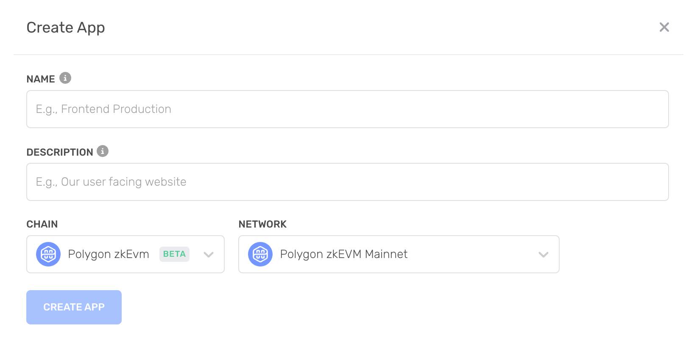
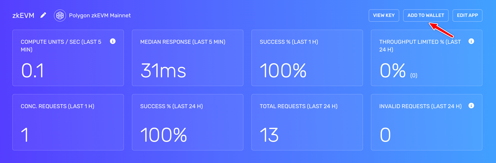
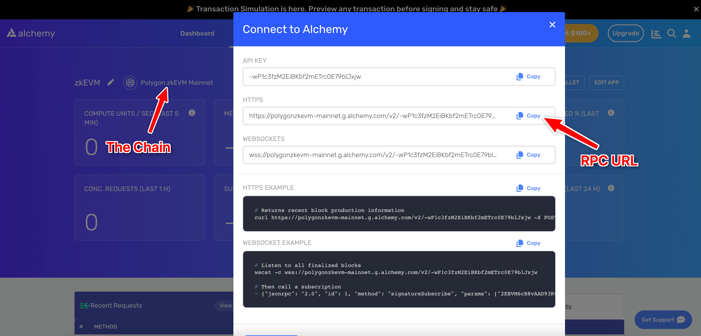
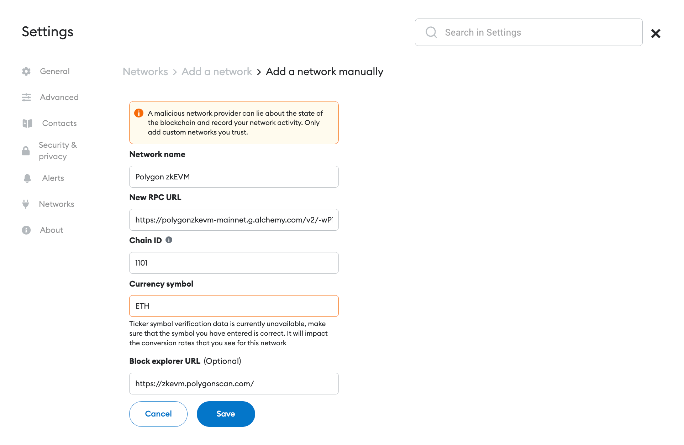
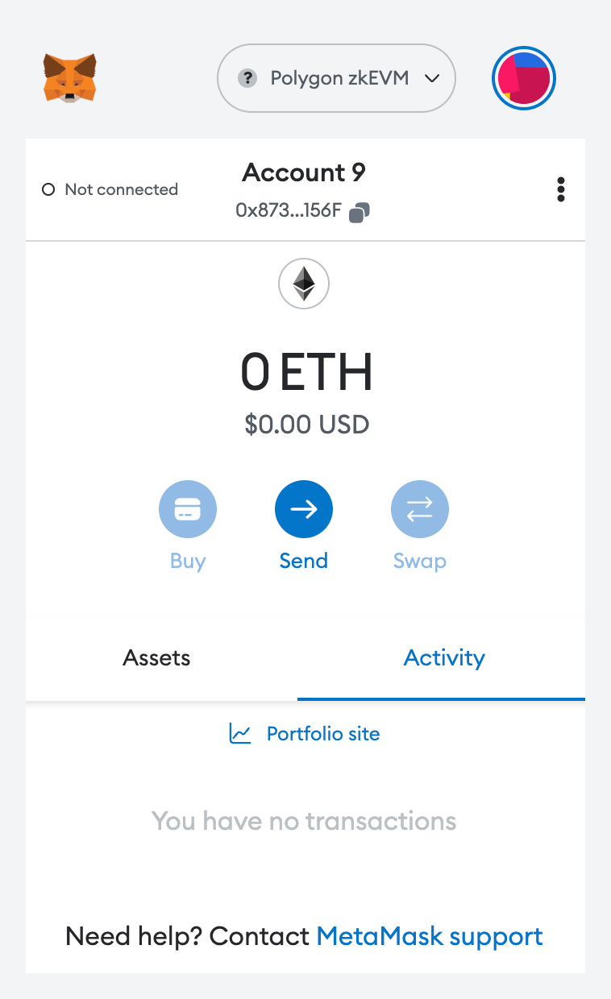
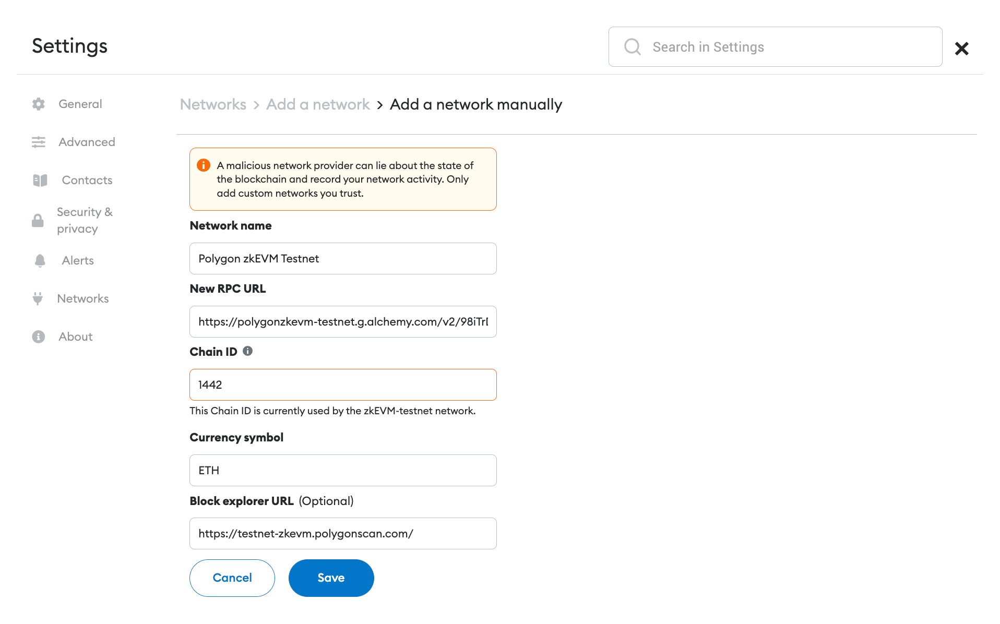

## Overview

1. [What is Polygon zkEVM?](#what-is-polygon-zkevm)
2. [Mainnet vs. Testnet](#mainnet-vs.-testnet)
3. [Create a free Alchemy account](https://dashboard.alchemy.com/)
4. [Create a Polygon zkEVM App](#create-a-polygon-zkevm-app)
5. [Add to Wallet](#add-to-wallet)

**[Updating your Metamask RPC manually](#updating-your-metamask-rpc-manually)**

1. [Copy your HTTP API Key](#copy-your-http-api-key)
2. [Add Polygon zkEVM Mainnet](#add-polygon-zkevm-mainnet)
3. [Add Polygon zkEVM Testnet](#add-polygon-zkevm-testnet)

***

## What is Polygon zkEVM?

Polygon zkEVM is a Layer 2, EVM equivalent chain, using zero-knowledge cryptographic proofs to enable fast throughput and low costs.

This article will guide you on adding Polygon zkEVM Mainnet and Testnet as your custom MetaMask RPC node provider.

***

## Mainnet vs. Testnet

There are two networks of Polygon zkEVM: Mainnet and Testnet. The endpoints are as follows:

1. **Mainnet**: [https://polygonzkevm-mainnet.g.alchemy.com/v2/your-api-key](https://polygonzkevm-mainnet.g.alchemy.com/v2/your-api-key)
2. **Testnet**: [https://polygonzkevm-testnet.g.alchemy.com/v2/your-api-key](https://polygonzkevm-testnet.g.alchemy.com/v2/your-api-key)

***

## Set up a free Alchemy account

This is an essential step. **Just do it. [here](https://dashboard.alchemy.com/).**

Since Polygon zkEVM is a Layer 2 solution, be sure to select the **Ethereum + L2 Ecosystem** during sign-up.

***

## Create a Polygon zkEVM App

Check out [these instructions](https://docs.alchemy.com/alchemy/introduction/getting-started#1.create-an-alchemy-key) for creating a new app. Make sure to specify **Polygon zkEVM** as the chain and choose Mainnet or Testnet as the network.

***

## Add to Wallet

Alchemy provides an **Add To Wallet** button for Polygon zkEVM apps.

This is a more convenient way to add the Polygon zkEVM network to your Metamask wallet rather than manually configuring it.

Add to Wallet Button

**That's it! You should see your Metamask work a lot better now** 😉

***

## Updating your Metamask RPC Manually

The below instructions are for updating your Metamask RPC manually instead of using the "Add to Wallet" button.

## Copy your HTTP API Key

After creating your app, you should be able to see your Alchemy app’s chain matches the chain you want to connect to.

Here, you can find your HTTP which you will use for your RPC URL in Metamask.

***

## Add Polygon zkEVM Mainnet

1. **Open Metamask and click the network name located at the top-right of the window**

2. **Click the Add Network button at the bottom of the pop-up window**

3. **Enter the following network details and click Save**

* **Network Name**: Polygon zkEVM
* **New RPC URL**: [https://polygonzkevm-mainnet.g.alchemy.com/v2/your-api-key](https://polygonzkevm-mainnet.g.alchemy.com/v2/your-api-key)
* **Chain ID**: 1101
* **Currency Symbol**: ETH
* **Block Explorer URL**: [https://zkevm.polygonscan.com/](https://zkevm.polygonscan.com/)

After clicking **Save**, you will be directly switched to Optimism within the dropdown list

**That's it! You've now added the Polygon zkEVM network with Alchemy connected.**

<Info>
  ⛓️ To explore other [free and public Polygon zKEVM RPC endpoints](https://www.alchemy.com/chain-connect/chain/polygon-zkevm), visit Alchemy Chain Connect.
</Info>

***

## Add Polygon zkEVM Testnet

Polygon zkEVM Testnet is the testnet for Polygon zkEVM. It's purely meant for testing purposes!

Adding the testnet is the same process as adding the mainnet shown above, with a few slight differences.

1. **First, make sure you’ve enabled the Show test networks toggle**.

This will list all the default test networks within your network list. You can find this in Settings>Advanced>Show test networks

2. **Enter the following network details and click Save**

* **Network Name: Polygon zkEVM Testnet**
* **New RPC URL**: **[https://polygonzkevm-testnet.g.alchemy.com/v2/your-api-key](https://polygonzkevm-testnet.g.alchemy.com/v2/your-api-key)**
* **Chain ID**: 1442
* **Currency Symbol**: ETH
* **Block Explorer URL**: \**[https://testnet-zkevm.polygonscan.com/](https://testnet-zkevm.polygonscan.com/)*

**That's it! You have successfully added Polygon zkEVM Testnet to your Metamask with Alchemy Connected 🎉**
