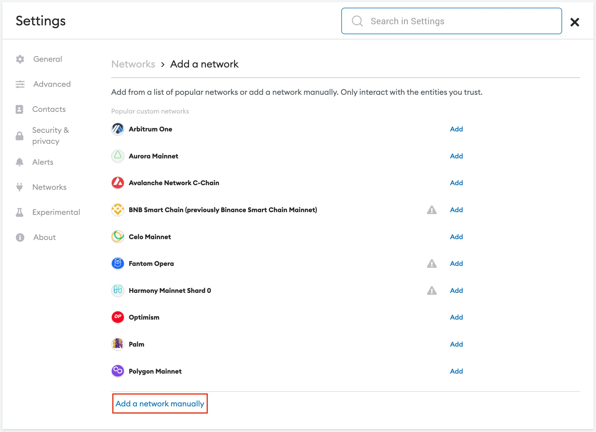

To test a decentralized application before deploying it to the Ethereum mainnet, web3 developers will deploy their smart contracts on a public testnet. [Sepolia](https://www.alchemy.com/overviews/sepolia-testnet) is a Proof-of-Stake testnet, and a popular test blockchain developers use to validate the functionality of their dapps before migrating them to Ethereum’s layer one blockchain.

This article will explain how to create a free Sepolia RPC endpoint on Alchemy and add the Sepolia testnet to your Metamask with that custom RPC endpoint. This will enable you to start deploying your smart contracts on the Sepolia testnet.

Once you're done adding Sepolia to MetaMask, you can [get free SepoliaETH](https://www.alchemy.com/overviews/sepolia-eth) from [Alchemy's Sepolia Faucet](https://sepoliafaucet.com/).

***

# 1. Sign Up for Alchemy

If you do not have an Alchemy account, [create a free account](https://dashboard.alchemy.com/). If you have an account, please [sign in](https://dashboard.alchemy.com/).

Alchemy’s free tier provides Sepolia testnet support, and gives developers access to the largest free plan in web3. Get access to full archive data, no daily request limits, access enhanced APIs, and 300,000,000 compute units per month on Supernode, the most reliable, scalable, and accurate RPC node solution in web3.

***

# 2. Create a Sepolia Application

From your dashboard, click the “create app” button. Next, complete the information about your dapp including:

* **Dapp Name** - name your app
* **Description** - describe your app
* **Chain** - Choose “Ethereum”
* **Network** - Choose “Sepolia”

***

# 3. Add Sepolia to Metamask

To start deploying smart contracts and interacting with test applications on the Sepolia test network, you need to connect your wallet to the Sepolia network.

To add the Sepolia testnet to Metamask, click the network button at the top of your wallet and click “Add Network”.

At the bottom of the page, click “Add a network manually”.

Next, go to your Alchemy dashboard, click "View Key" and then copy the “HTTPS URL”.

Go back to Metamask and paste your Sepolia RPC URL into the network configuration details along with the following information:

* **Network Name** - Sepolia Testnet
* **New RPC URL** - [https://eth-sepolia.g.alchemy.com/v2/\[YOUR-API-KEY](https://eth-sepolia.g.alchemy.com/v2/%5BYOUR-API-KEY)]
* **Chain ID** - 11155111
* **Currency Symbol** - SepoliaETH
* **Block explorer URL** - [https://sepolia.etherscan.io/](https://sepolia.etherscan.io/)

That's it!

Now your MetaMask wallet is connected to Sepolia 🎉

The last step is to [get free SepoliaETH](https://www.alchemy.com/overviews/sepolia-eth) from a [Faucet](https://sepoliafaucet.com/).

<Info>
  ⛓️ To explore other [free and public Sepolia RPC endpoints](https://www.alchemy.com/chain-connect/chain/sepolia), visit Alchemy Chain Connect.
</Info>
