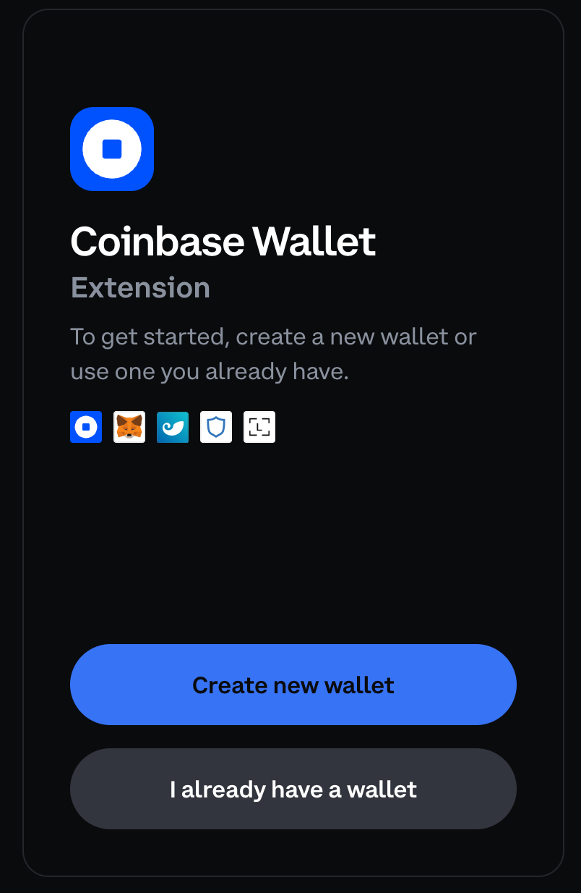
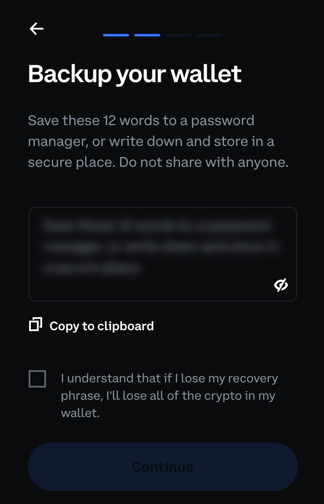
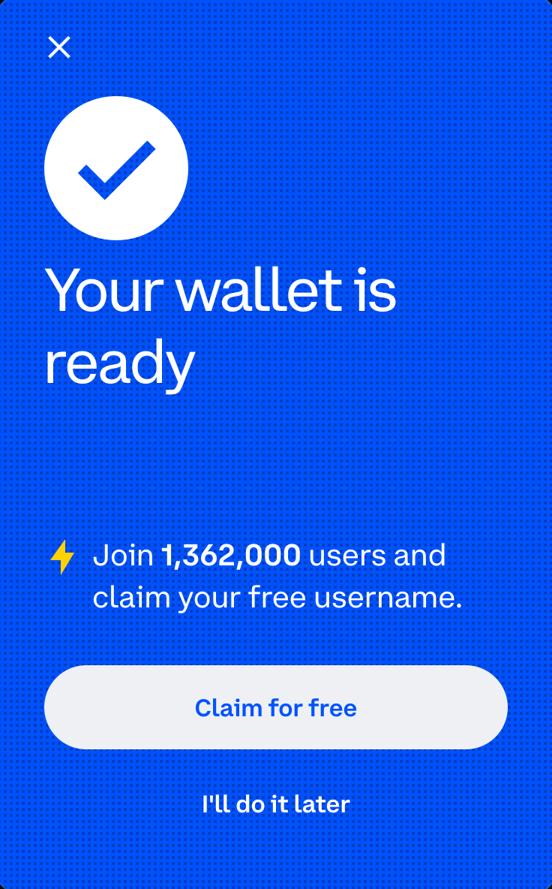
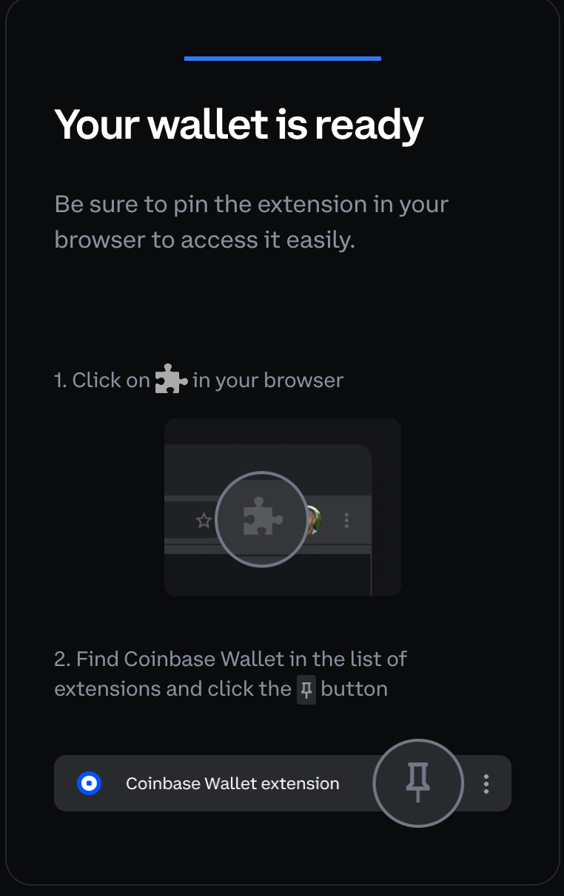

# What is Coinbase Wallet?

[Coinbase Wallet](https://www.coinbase.com/wallet) is another great choice for storing crypto and interacting with blockchain networks/apps.

Let’s go through the steps of setting up a brand new Coinbase Wallet together. **Please note, this wallet is only available on Google Chrome browser.**

## 1. Install Coinbase Wallet Extension

1. Go [here and install the Coinbase Wallet extension](https://chrome.google.com/webstore/detail/coinbase-wallet-extension/hnfanknocfeofbddgcijnmhnfnkdnaad?hl=en\&authuser=0) by selecting `Add to Chrome` button and then select `Add extension` on the pop-up.

2. You will then see this pop-up in a new tab:

## 2. Set Up New Wallet

1. Select `Create new wallet` button.

You will now see this screen:

2. Select the blurred portion of the screen to reveal your secret 12-word recovery phrase.

> **IMPORTANT: These are the 12 most important words of your web3 career! Record these words safely and NEVER share them with anyone. They are your claim to any funds you might store in your wallet.**

3. Take a few minutes and record your 12 words in a safe place.

> It is recommended you use a physical notebook to write these down. You can also store the 12 words on your computer but this means your wallet may be compromised if your computer is too.

4. Once you have safely recorded your secret 12 words, check the box and select `Continue`.

5. The site will now have you verify you recorded your 12-word recovery phrase by having you select your recorded words in a certain order.

6. Once you verify your phrase, the site will have you provide a password. The password is for safely accessing your wallet locally.

7. Select the `I agree to the terms & privacy policy` box and select `Submit`

You will see the following prompt:

8. Select `Claim for free` when the site prompts you to choose a wallet nickname. This is entirely optional but recommended so that Coinbase Wallet works best.

## 3. Pin the Coinbase Wallet Extension

1. After claiming a username, follow the instructions in the site's UI to pin the wallet extension to your browser navbar:

## 4. Enjoy Your New Wallet

1. Send, Receive and View your crypto/NFTs!

