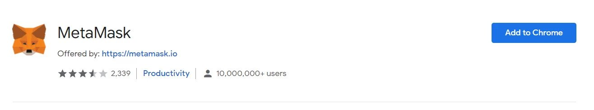

Metamask is by far the most popular Blockchain wallet used to store crypto and connect to decentralized Applications. understanding how to setup a Metamask wallet, though, might be confusing.

By the end of this article, you will learn how to install MetaMask, create a new account, and how Metamask works.

Let’s jump straight into the tutorial.

## What is Metamask?

Metamask, funded by Consensys, is a browser plugin and mobile application used as a digital wallet to store and exchange cryptocurrencies and NFTs. The Metamask wallet can be installed like any regular plugin or mobile application.

Blockchain Wallets are completely anonymous and you won’t need your email or any personal information to create your Metamask wallet.

By connecting to Blockchain-based Decentralized applications (DApps), users can spend and collect coins in games, stake tokens in Decentralized finance (DeFi) applications, and trade them on decentralized exchanges, and pools.

The Metamask wallet also provides users with an entry point into the emerging world of Web3, constituting, de facto, an universal signup and identity.

Now that we have a brief understanding of what Metamask is and why it matters, let’s learn how to setup a Metamask wallet.

## Install MetaMask on Chrome

First of all, browse to metamask.io and click on download:

In this tutorial, we’re using Chrome but the same will apply to Firefox or any other supported device.

Click on the “Install Metamask for Chrome” big blue button:

And add MetaMask to Chrome:

his will install MetaMask in your browser.

Next, to setup our Metamask wallet we’ll need to create a new account.

## How to Setup a MetaMask Wallet – Signup

Once installed, clicking on the MetaMask extension icon will redirect you to the wallet setup page.

Clicking on “Get Started“, will let you choose to import an already existing Wallet, using the mnemonic, a 12-words phrase, or to create a new wallet. Click on Create a Wallet:

At this point, you’ll need to create a new password and accept MetaMask’s terms of services.

The password will only be responsible for securing your MetaMask extension on that device, and not your wallets. Make sure to not share your password with anyone.

Once you’ll have confirmed your password, MetaMask will show you your Secret Recovery Phrase, a list of 12 words used to access your wallet. The Secret Recovery Phrase is also called Seed Phrase or Mnemonic, you can read more about how mnemonics work in this article.

MetaMask requires you to store the seed phrase in a safe place. This will be the only way to recover your funds from a new device, browser, or should MetaMask reset. The most common method used to store the seed phrase is to write your 12-word phrase on a piece of paper and store it in a safe place.

It’s very very important that you:

Do not share your Secret Recovery Phrase with anyone, as this will give full access to your wallet. Save the phrase in a secure place. Note: if you lose your seed phrase, MetaMask can’t help you recover your wallet and your funds will be lost forever.

With this in mind, copy the Secret Recovery Phrase in a secure place, and click Next.

MetaMask will now ask you to copy the Secret Recovery Phrase, to confirm you’ve actually saved it:

Congratulations! 🎉

You’ve just created your first MetaMask wallet, and are now ready to receive and send crypto, as well as interact with decentralized applications.
