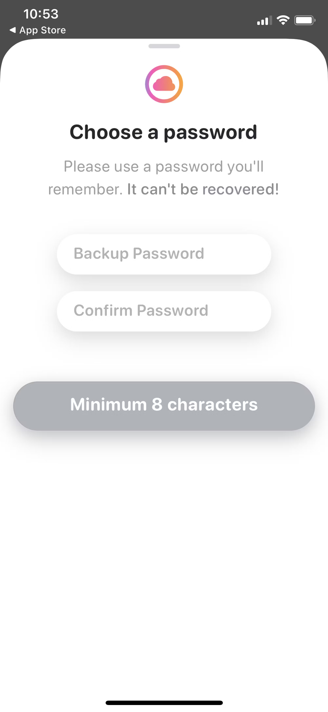

# What is Rainbow?

Rainbow is a fun, simple, and secure way to create an Ethereum wallet, collect NFTs, and explore the world of Web3. You can use Rainbow to purchase, manage, and display Ethereum-based assets.

Rainbow is an excellent choice for storing crypto and interacting with blockchain networks and applications. Let's go through the steps of setting up a new Rainbow wallet together:

## 1. Install Rainbow Wallet Mobile Application

1. Navigate to [Rainbow's download page](https://rainbow.me/?_branch_match_id=1192294268543225580\&utm_source=branch\&utm_campaign=learn\&utm_medium=referral&_branch_referrer=H4sIAAAAAAAAA8soKSkottLXL8pLKk8sKNBLzs%2FVT07MLUjMTM%2FTz0lNLMoDAMk0iBoiAAAA) and click on the download button for your specific kind of device, i.e., [Android](https://play.google.com/store/apps/details?id=me.rainbow&%24web_only=true&_branch_match_id=1192294268543225580\&utm_source=branch\&utm_campaign=web-home\&utm_medium=marketing&_branch_referrer=H4sIAAAAAAAAA8soKSkottLXL8pLKk8sKNBLzs%2FVD0s0MfQIDzbzr0gCAIiGbKYfAAAA) or [iOS](https://apps.apple.com/us/app/rainbow-ethereum-wallet/id1457119021?%24web_only=true&_branch_match_id=1192294268543225580\&utm_source=branch\&utm_campaign=web-home\&utm_medium=marketing&_branch_referrer=H4sIAAAAAAAAA8soKSkottLXL8pLKk8sKNBLzs%2FV90%2F1TcnN9jLzr0gCAI5wN7gfAAAA).

2. After clicking on the *download* button for either of the operating devices (Android or iOS), you'll be redirected to the download pages for each individual OS and you can then complete the installation of Rainbow on your device.

## 2. Set Up Wallet

1. After a successful installation of the Rainbow mobile application on your device, you can now go ahead to set it up. Open the application and click on the \*\* Get a new wallet\*\* button. A new Ethereum wallet would be provisioned for you.

You now have your first Ethereum wallet, but you need to back it up so you don't lose it.

2. **Backup Your Rainbow Wallet**: Choose your backup method for your Ethereum wallet.

In Rainbow, you can instantly back up your wallet using the Backup feature (shown in the first screenshot below).

If you prefer to back your wallet up manually on a piece of paper or other physical object, then you have that option too! Just make sure your secret phrase is secure in a separate location. Either way, you can always change your mind later and edit your backup within the app's settings.

If you choose to backup using either iCloud or Google Drive, then you'll set a password for your backup. \*\*Make sure you save this password someplace safe! \*\*You'll need it if/when you ever need to recover your wallet.

If you choose to backup your wallet manually, you'll need to make a copy of your wallet's **secret phrase**. These words are the keys to your wallet, and they are for your eyes only.

## 3. Enjoy Your New Wallet

You can then proceed to send, receive, and trade crypto assets on your ZenGo wallet!!
