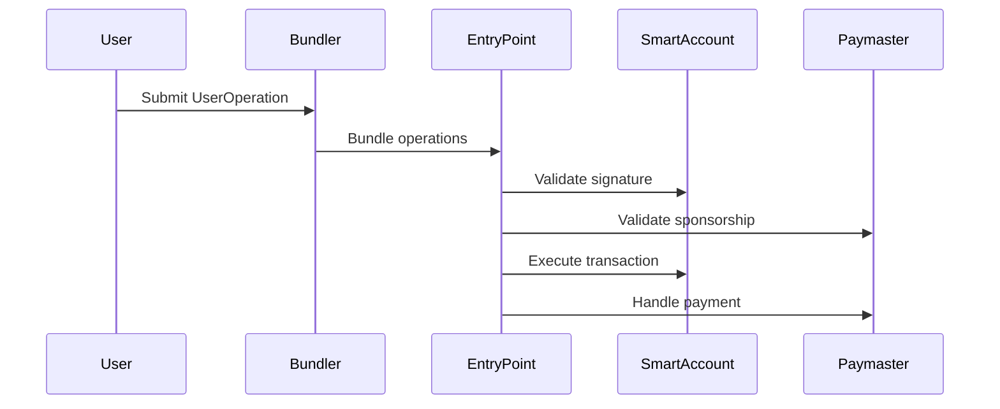

# Account Abstraction

Account Abstraction (ERC-4337) is a standard that enables smart contract wallets to function as first-class accounts on Ethereum, providing enhanced functionality while maintaining compatibility with existing infrastructure.

## What is Account Abstraction?

Account Abstraction removes the distinction between externally owned accounts (EOAs) and smart contracts, allowing smart contracts to initiate transactions and pay for gas. This enables:

* **Programmable transaction validation** - Custom signature schemes and authorization logic
* **Flexible gas payment** - Pay gas with any token or have others sponsor it
* **Batch operations** - Execute multiple transactions atomically
* **Account recovery** - Built-in recovery mechanisms

## ERC-4337 Architecture

ERC-4337 introduces several key components:

### User Operations

User Operations are like transactions but for smart contract accounts:

```typescript
interface UserOperation {
  sender: string;           // Smart account address
  nonce: string;           // Anti-replay protection
  initCode: string;        // Account creation code (if needed)
  callData: string;        // The actual call data
  callGasLimit: string;    // Gas limit for the call
  verificationGasLimit: string; // Gas for verification
  preVerificationGas: string;   // Gas for pre-verification
  maxFeePerGas: string;    // Maximum gas price
  maxPriorityFeePerGas: string; // Priority fee
  paymasterAndData: string;     // Paymaster info (if any)
  signature: string;       // Account signature
}
```

### EntryPoint Contract

The EntryPoint is a singleton contract that:

* Validates User Operations
* Executes transactions on behalf of smart accounts
* Handles gas payments and refunds
* Manages paymaster interactions

### Bundlers

Bundlers are services that:

* Collect User Operations from users
* Bundle them into regular transactions
* Submit bundles to the EntryPoint contract
* Earn fees for their service

### Paymasters

Paymasters are contracts that can:

* Sponsor gas fees for users
* Accept alternative payment methods
* Implement custom gas payment logic

## Account Abstraction Flow

1. **User creates User Operation** - Specifies transaction intent
2. **Bundler validates** - Checks operation validity
3. **Bundler submits to EntryPoint** - Packages operations
4. **EntryPoint validates** - Verifies signatures and gas
5. **EntryPoint executes** - Performs the actual transaction
6. **Paymaster handles payment** - Processes gas payment (if applicable)



## Benefits of Account Abstraction

### For Users

* **Better UX** - No need to understand gas or private key management
* **Flexible authentication** - Use biometrics, social login, or hardware keys
* **Account recovery** - Multiple recovery options beyond seed phrases
* **Gasless transactions** - Applications can sponsor user transactions

### for Developers

* **Enhanced security** - Implement custom validation logic
* **Better onboarding** - Reduce friction for new users
* **Flexible payment models** - Accept payments in any token
* **Advanced functionality** - Batch transactions, scheduled operations, etc.

## Account Kit Implementation

Account Kit leverages ERC-4337 to provide smart wallet functionality:

<Tabs>
  <Tab title="React">
    ```tsx
    import { useSmartAccountClient } from "@alchemy/aa-alchemy/react";

    function MyComponent() {
      const { client } = useSmartAccountClient({
        type: "LightAccount", // ERC-4337 compatible
      });

      const sendUserOperation = async () => {
        const result = await client.sendUserOperation({
          uo: {
            target: "0x...",
            data: "0x",
            value: 0n,
          },
        });
        
        console.log("UserOperation hash:", result);
      };

      return (
        <button onClick={sendUserOperation}>
          Send Transaction
        </button>
      );
    }
    ```
  </Tab>

  <Tab title="JavaScript">
    ```javascript
    import { createAlchemySmartAccountClient } from "@alchemy/aa-alchemy";

    const client = createAlchemySmartAccountClient({
      account,
      chain: sepolia,
      apiKey: "YOUR_API_KEY",
    });

    // Send a User Operation
    const userOpHash = await client.sendUserOperation({
      uo: {
        target: "0x...",
        data: "0x",
        value: 0n,
      },
    });

    // Wait for transaction receipt
    const receipt = await client.waitForUserOperationTransaction({
      hash: userOpHash,
    });
    ```
  </Tab>
</Tabs>

## Gas Abstraction

One of the most powerful features is gas abstraction:

### Sponsored Transactions

```typescript
// Configure gas sponsorship
const clientWithSponsorship = createAlchemySmartAccountClient({
  account,
  chain: sepolia,
  apiKey: "YOUR_API_KEY",
  gasManagerConfig: {
    policyId: "YOUR_POLICY_ID",
  },
});

// Users don't need ETH for gas
const result = await clientWithSponsorship.sendUserOperation({
  uo: {
    target: contractAddress,
    data: encodedData,
  },
});
```

### Pay Gas with Tokens

```typescript
// Pay gas with USDC instead of ETH
const clientWithTokenPayment = createAlchemySmartAccountClient({
  account,
  chain: sepolia,
  apiKey: "YOUR_API_KEY",
  paymasterAndData: await getPaymasterData({
    token: "USDC",
    amount: parseUnits("1", 6), // 1 USDC
  }),
});
```

## Smart Account Validation

Smart accounts can implement custom validation logic:

```solidity
// Example validation function in a smart account
function validateUserOp(
    UserOperation calldata userOp,
    bytes32 userOpHash,
    uint256 missingAccountFunds
) external returns (uint256 validationData) {
    // Custom validation logic
    if (userOp.nonce < currentNonce) {
        return SIG_VALIDATION_FAILED;
    }
    
    // Verify signature
    bytes32 hash = userOpHash.toEthSignedMessageHash();
    if (owner != hash.recover(userOp.signature)) {
        return SIG_VALIDATION_FAILED;
    }
    
    // Pay required funds
    if (missingAccountFunds > 0) {
        (bool success,) = payable(msg.sender).call{
            value: missingAccountFunds
        }("");
        require(success);
    }
    
    return 0; // Valid
}
```

## Common Patterns

### Batch Transactions

```typescript
// Execute multiple operations atomically
const batchResult = await client.sendUserOperation({
  uo: [
    {
      target: tokenContract,
      data: encodeTransfer(recipient1, amount1),
    },
    {
      target: tokenContract,
      data: encodeTransfer(recipient2, amount2),
    },
  ],
});
```

### Session Keys

```typescript
// Grant temporary permissions
const sessionKey = generatePrivateKey();

await client.sendUserOperation({
  uo: {
    target: smartAccountAddress,
    data: encodeAddSessionKey(sessionKey, permissions),
  },
});
```

## Security Considerations

* **Signature validation** - Ensure robust signature schemes
* **Nonce management** - Prevent replay attacks
* **Gas limits** - Set appropriate limits to prevent DoS
* **Paymaster security** - Validate paymaster contracts
* **Upgrade safety** - Secure upgrade mechanisms

## Next Steps

* [Explore smart wallet types](/docs/wallets/authorization/smart-account-types/light-account)
* [Set up gas sponsorship](/docs/wallets/transactions/gas-sponsorship/sponsor-gas)
* [Learn about bundler APIs](/docs/wallets/transactions/bundler-apis/bundler-methods)
* [Understand signer packages](/docs/wallets/overview/advanced/signer-packages)
