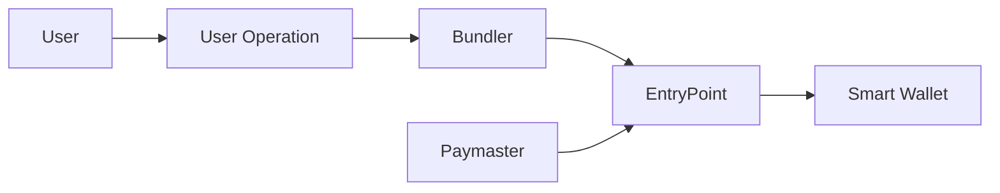

# Smart Wallets Overview

Smart wallets are programmable wallets that run on smart contracts rather than being controlled by a single private key. They provide enhanced security, better user experience, and advanced functionality compared to traditional externally owned accounts (EOAs).

## What are Smart Wallets?

Smart wallets, also known as smart contract accounts, are accounts controlled by smart contract code instead of private keys. This enables:

* **Programmable security policies** - Custom authorization logic
* **Account recovery** - Multiple ways to recover access
* **Batch transactions** - Execute multiple operations in one transaction
* **Gas sponsorship** - Third parties can pay for transaction fees
* **Session keys** - Temporary permissions for specific actions

## Key Benefits

### Enhanced Security

Smart wallets provide multiple layers of security:

* **Multi-factor authentication** - Require multiple forms of verification
* **Spending limits** - Set daily/monthly spending caps
* **Time-locked transactions** - Add delays for large transfers
* **Account freezing** - Temporarily disable account in case of compromise

### Better User Experience

* **Gasless transactions** - Users don't need to hold ETH for gas
* **Social recovery** - Recover accounts using trusted contacts
* **Batch operations** - Multiple actions in a single transaction
* **Custom transaction logic** - Automate complex workflows

### Flexibility

* **Upgradeable logic** - Update account functionality over time
* **Plugin architecture** - Add new features as needed
* **Cross-chain compatibility** - Work across different blockchains

## Account Kit Smart Wallet Types

Account Kit supports several types of smart wallets:

### Light Account

A simple, gas-optimized smart wallet suitable for most use cases:

* Single owner by default
* Upgradeable to more complex account types
* Minimal gas overhead
* ERC-4337 compatible

### Modular Account

A feature-rich smart wallet with plugin support:

* Plugin-based architecture
* Multi-owner support
* Advanced permission systems
* Session key management

### Multi-Owner Light Account

Extension of Light Account with multiple owners:

* Shared ownership model
* Configurable thresholds
* Owner management capabilities

## How Smart Wallets Work

Smart wallets operate through the ERC-4337 Account Abstraction standard:

1. **User Operation** - User creates a transaction intent
2. **Bundler** - Collects and packages user operations
3. **EntryPoint** - Validates and executes operations
4. **Paymaster** - Optionally sponsors gas fees



## Smart Wallet vs EOA Comparison

| Feature | Smart Wallet | EOA |
|---------|--------------|-----|
| **Gas Payment** | Flexible (can be sponsored) | Must hold ETH |
| **Security** | Programmable, multi-factor | Single private key |
| **Recovery** | Multiple recovery methods | Lost key = lost account |
| **Batch Transactions** | Yes | No |
| **Upgradability** | Yes | No |
| **Complexity** | Higher | Lower |

## Getting Started

To start using smart wallets with Account Kit:

<Tabs>
  <Tab title="React">
    ```tsx
    import { useSmartAccountClient } from "@alchemy/aa-alchemy/react";

    function MyComponent() {
      const { client, address } = useSmartAccountClient({
        type: "LightAccount",
      });

      return (
        <div>
          <p>Smart Wallet Address: {address}</p>
        </div>
      );
    }
    ```
  </Tab>

  <Tab title="JavaScript">
    ```javascript
    import { createLightAccount } from "@alchemy/aa-accounts";
    import { createAlchemySmartAccountClient } from "@alchemy/aa-alchemy";

    const account = await createLightAccount({
      signer: yourSigner,
      chain: sepolia,
    });

    const client = createAlchemySmartAccountClient({
      account,
      chain: sepolia,
      apiKey: "YOUR_API_KEY",
    });
    ```
  </Tab>
</Tabs>

## Common Use Cases

### DeFi Applications

* **Automated strategies** - Execute complex DeFi operations
* **Risk management** - Built-in spending limits and controls
* **Gas optimization** - Batch multiple DeFi interactions

### Gaming

* **In-game economies** - Sponsor gas for players
* **Asset management** - Batch NFT transfers and trades
* **Session keys** - Temporary permissions for gameplay

### Enterprise

* **Treasury management** - Multi-signature controls
* **Employee wallets** - Sponsored transactions for staff
* **Compliance** - Built-in regulatory controls

## Security Considerations

When working with smart wallets:

* **Audit smart contracts** - Ensure code is secure
* **Understand permissions** - Know what each key can do
* **Monitor activity** - Watch for unusual transactions
* **Keep recovery methods safe** - Secure backup options
* **Test thoroughly** - Verify functionality before mainnet

## Next Steps

* [Learn about Account Abstraction](/docs/wallets/overview/concepts/account-abstraction)
* [Set up your first smart wallet](/docs/wallets/overview/setup/react-setup)
* [Explore smart account types](/docs/wallets/authorization/smart-account-types/light-account)
* [Understand signer packages](/docs/wallets/overview/advanced/signer-packages)
