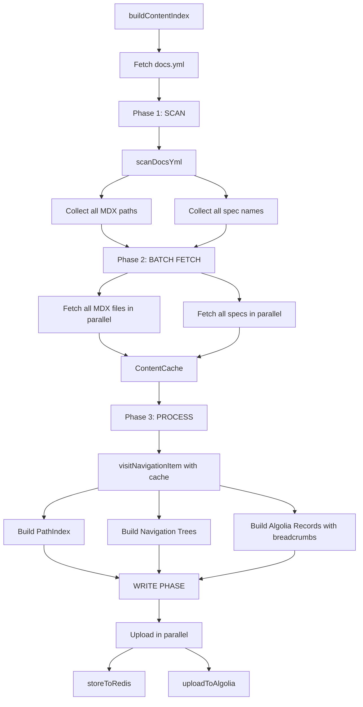

# Content Indexer

Content Indexer is a single entry-point content indexing system that builds path
indexes, navigation trees, and Algolia search records from remote docs files. It
represents the core system that powers the Alchemy docs site's static generation
system. It processes `docs.yml` configuration files from multiple Github repos
to generate three key outputs:

1. **Path Index**: Maps URL paths to content sources (MDX files, API specs)
2. **Navigation Trees**: Hierarchical sidebar navigation for each documentation tab
3. **Algolia Index**: Searchable content records with metadata

The system is optimized for processing **4000+ pages** using a 3-phase parallel
fetching architecture that minimizes API calls.

## Architecture

### 3-Phase Processing



### Why This Architecture?

With **4000+ pages**, GitHub API calls are the primary bottleneck. This 3-phase approach:

1. **Maximizes parallelization**: All fetches happen simultaneously
2. **Eliminates wait time**: No sequential blocking between fetches
3. **Single-pass processing**: Build all outputs together with all data
   available

## Key Concepts

### Constructed Data

* **Path Index**: Used by Next.js routing to determine which content to render
  for a given URL
  * Maps paths like `reference/ethereum-api-quickstart` to MDX files or API
    operations
  * Stored in Redis for fast lookup at runtime

* **Navigation Trees**: Used to render sidebar navigation
  * Hierarchical structure with sections, pages, and API endpoints
  * One tree per tab (e.g., "reference", "guides")
  * Stored in Redis

* **Algolia Index**: Used for site-wide search
  * Flat list of searchable pages with content, title, breadcrumbs
  * Uploaded to Algolia for full-text search
  * Updated atomically to avoid search downtime

### ContentCache

The `ContentCache` class provides O(1) lookup for all fetched content:

* **MDX files**: Stores frontmatter and raw MDX body
* **API specs**: Stores parsed OpenAPI/OpenRPC specifications

By fetching everything upfront in Phase 2, we eliminate duplicate GitHub API
calls during processing.

### Relatively Stable ObjectIDs for Algolia

Algolia requires unique `objectID` for each record. We generate deterministic
hashes (SHA-256, first 16 chars) from content-based identifiers:

* **All pages (MDX and API methods)**: Hash of last breadcrumb + title (e.g., hash of
  `"NFT API Endpoints:getNFTsForCollection"`)
  * Based on logical position in navigation hierarchy + page title
  * Stable as long as content structure and title don't change
  * Changes when page is renamed or moved to different section
  * Generates clean IDs like `"a3f2c8e1b9d4f6a7"`

**Why this approach?** Since we replace the entire index on each run (atomic swap),
absolute stability isn't critical. Content-based IDs are simple and work consistently for all content types.
There is no field that provides absolute stability since everything can change.

**Why hashes?** Provides compact, opaque identifiers that don't expose internal
structure while maintaining uniqueness.

## Design Decisions

### 1. Three-Phase Architecture

**Why?** With 4000+ pages, GitHub API calls dominate execution time. By fetching
everything upfront in parallel, we significantly reduce total runtime.

**Alternative considered:** Fetch-as-you-go

* **Pros:** Simpler code, streaming approach
* **Cons:** Sequential fetches, slower for large repos

### 2. ContentCache for O(1) Lookups

**Why?** Processing requires multiple lookups (ex. frontmatter for slugs, content
for Algolia). A Map-based cache makes these instant.

### 3. Single-Pass Processing

**Why?** Build all outputs (index, nav, Algolia) in one traversal to avoid
processing each item multiple times.

**Alternative considered:** Separate passes for each output

* **Pros:** Simpler logic per pass
* **Cons:** Slower, harder to maintain breadcrumbs

### 4. Atomic Index Swap for Algolia

Ordinarily we could upload records individually to prod index and use `objectIDs`
to update records in place. The problem is our IDs are based on file paths, which
can change (files renamed, URLs restructured). When a path changes, we generate a
new objectID, leaving the old record orphaned in the index. Instead of managing
deletes and updates, we maintain separate indices for each content source (docs
vs wallets) and fully rebuild/replace the entire index on each run. This is done
via an atomic index swap.

**How it works:**

1. Upload to temporary index
2. Copy settings from production
3. Atomic move (replace production with temp index)

**Why?** Ensure all records are up-to-date. Zero down-time: prevent users from ever seeing empty
search results during index updates.

**Alternative considered:** Update records in-place

* **Pros:** Simpler
* **Cons:** High risk of orphaned records

### 5. Separate Indices for Docs and Wallets

Docs and Wallets content is indexed separately because their docs.yml is
maintained separately. That means we need to update one without the other. Since
we cannot update records in place, an atomic index swap of both docs and wallets
content would mean we need to generate both content simultaneously which is
inefficient. Instead, maintain separate indices and have the frontend search
both indices simultaneously. The same also applies to changelog which has a
separate indexer.

**Why?** Independent update schedules

**How to search both:** Frontend uses `multipleQueries` API or InstantSearch's
multi-index feature.

## Directory Structure

```text
content-indexer/
├── collectors/              # Output collectors (Phase 3)
│   ├── algolia.ts              # Collects Algolia search records
│   ├── navigation-trees.ts     # Collects navigation trees by tab
│   ├── path-index.ts           # Collects path index entries
│   └── processing-context.ts   # Unified context encapsulating all collectors
├── core/                    # Core processing logic
│   ├── scanner.ts              # Phase 1: Scan docs.yml for paths/specs
│   ├── batch-fetcher.ts        # Phase 2: Parallel fetch all content
│   ├── content-cache.ts        # Phase 2: In-memory cache for fetched content
│   ├── build-all-outputs.ts    # Phase 3: Main orchestrator
│   └── path-builder.ts         # Hierarchical URL path builder
├── visitors/                # Visitor pattern for processing (Phase 3)
│   ├── index.ts                # Main dispatcher (visitNavigationItem)
│   ├── visit-page.ts           # Processes MDX pages
│   ├── visit-section.ts        # Processes sections (with recursion)
│   ├── visit-link.ts           # Processes external links
│   ├── visit-api-reference.ts  # Orchestrates API spec processing
│   └── processors/
│       ├── process-openapi.ts  # Processes OpenAPI specifications
│       └── process-openrpc.ts  # Processes OpenRPC specifications
├── uploaders/               # Upload to external services
│   ├── algolia.ts              # Uploads to Algolia with atomic swap
│   └── redis.ts                # Stores to Redis (path index & nav trees)
├── utils/                   # Utility functions
│   ├── openapi.ts              # OpenAPI-specific utilities
│   ├── openrpc.ts              # OpenRPC-specific utilities
│   ├── navigation-helpers.ts   # Navigation construction helpers
│   ├── truncate-record.ts      # Truncates Algolia records to size limit
│   └── normalization.ts        # Path normalization utilities
└── index.ts                 # Main entry point (buildContentIndex)
```

## Data Flow

### Phase 1: Scan

First, fetch the `docs.yml` file from GitHub. Then scan it:

```typescript
scanDocsYml(docsYml) → { mdxPaths: Set<string>, specNames: Set<string> }
```

* Recursively walks `docs.yml` navigation structure
* Collects all unique MDX file paths from `page` and `section` items
* Collects all unique API spec names from `api` items
* Uses Sets to avoid duplicates
* **No additional I/O** - just traversing the YAML structure

### Phase 2: Batch Fetch

```typescript
batchFetchContent(scanResult, repoConfig) → ContentCache
```

* Converts Sets to arrays and maps over them
* Fetches all MDX files in parallel with `Promise.all`
* Fetches all API specs in parallel with `Promise.all`
* Parses frontmatter from MDX files using `gray-matter`
* Stores everything in `ContentCache` for O(1) lookup
* **Maximum parallelization** - all I/O happens simultaneously

### Phase 3: Process

```typescript
buildAllOutputs(docsYml, repo, cache)
  → { pathIndex, navigationTrees, algoliaRecords }
```

* Uses visitor pattern to walk `docs.yml` navigation structure
* `visitNavigationItem` dispatcher routes to type-specific visitors:
  * `visitPage` for MDX pages
  * `visitSection` for sections (recursive)
  * `visitApiReference` for API specs (delegates to OpenAPI/OpenRPC processors)
  * `visitLink` for external links
* For each item, looks up content in cache (O(1) lookup)
* `ProcessingContext` encapsulates three collectors:
  * `PathIndexCollector` for path index entries
  * `NavigationTreesCollector` for navigation tree items
  * `AlgoliaCollector` for search records
* Passes `navigationAncestors` through recursion for breadcrumbs
* Returns all three outputs simultaneously

### Write Phase

```typescript
Promise.all([
  storeToRedis(index, navigationTrees),
  uploadToAlgolia(algoliaRecords),
]);
```

* Writes to Redis and Algolia in parallel
* Algolia uses atomic swap (temp index → production)

## Usage

### Running the Indexer

```bash
# Index main docs
pnpm generate:content-index

# Index wallet docs
pnpm generate:wallet-content-index
```

### Environment Variables

Required for Redis and Algolia upload:

```bash
# Redis (required for path index and navigation trees)
KV_REST_API_READ_ONLY_TOKEN=your_token
KV_REST_API_TOKEN=your_token
KV_REST_API_URL=your_url
KV_URL=your_url

# Algolia (required for search index)
ALGOLIA_APP_ID=your_app_id
ALGOLIA_ADMIN_API_KEY=your_admin_key
# Base name for indices (branch/type will be auto-appended)
# Examples: main_alchemy_docs, main_alchemy_docs_sdk, abc_alchemy_docs
ALGOLIA_INDEX_NAME_BASE=alchemy_docs

# GitHub (optional - increases API rate limits)
GITHUB_TOKEN=your_personal_access_token
```

The indexer will skip uploads for any service with missing credentials.

## Troubleshooting

### "No cached spec found for api-name"

**Cause:** Spec name in docs.yml doesn't match filename in metadata.json

**Fix:** Check `API_NAME_TO_FILENAME` mapping in `lib/utils/apiSpecs.ts`

### "Failed to fetch MDX file"

**Cause:** File path in docs.yml doesn't exist in GitHub repo

**Fix:**

1. Verify file exists in GitHub
2. Check `repoConfig.stripPathPrefix` and `repoConfig.docsPrefix` are correct
3. Ensure path in docs.yml matches actual file path

### Slow indexing performance

**Possible causes:**

1. Check network connection to GitHub API
2. Verify GitHub API rate limits aren't being hit
3. Check if any individual file/spec is timing out

### Algolia records missing breadcrumbs

**Cause:** Navigation ancestors not being passed through correctly

**Fix:** Verify `visitNavigationItem` and visitor functions are receiving and
forwarding `navigationAncestors` array correctly through the visitor chain
