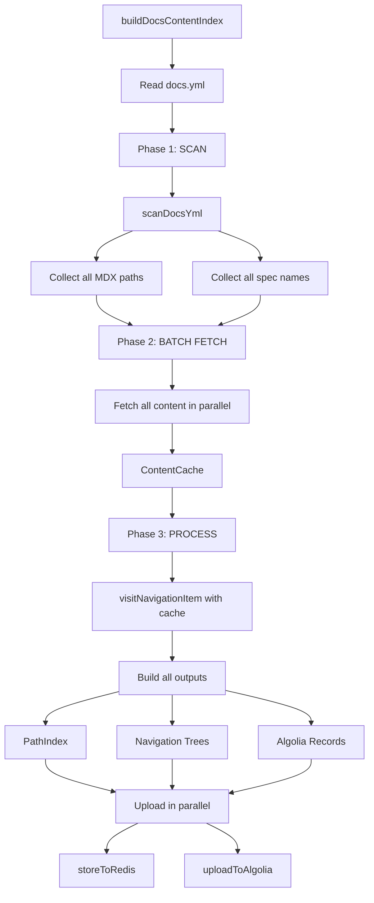
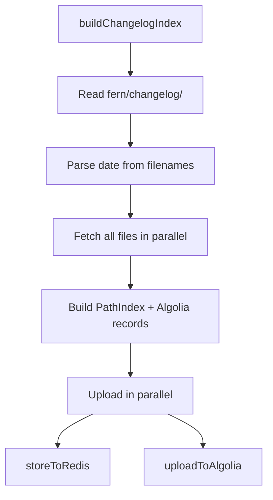

# Content Indexer

Content Indexer is the indexing system that builds path indexes, navigation trees, and Algolia search records for the Alchemy docs site. It lives in the `docs` repository and processes documentation from three sources:

1. **Main Docs** - Manual content from `docs/fern/docs.yml` (local filesystem)
2. **SDK References** - Generated content from `aa-sdk/docs/docs.yml` (GitHub API)
3. **Changelog** - Entries from `docs/fern/changelog/*.md` (local filesystem)

## Three Indexers

The system provides three independent indexers, each triggered by different content changes:

### 1. Main Indexer (`pnpm index:main`)

Indexes manual documentation content from the local `docs` repository.

* **Trigger**: Changes to `docs/fern/docs.yml` or manual content files
* **Source**: Local filesystem (`docs/fern/`)
* **Modes**:
  * `production` - Full indexing with Algolia upload (default)
  * `preview` - Branch-scoped indexing without Algolia upload
* **Updates**:
  * `{branch}/path-index:main` (Redis, 30-day TTL for preview branches)
  * `{branch}/nav-tree:{tab}` for all tabs (Redis, 30-day TTL for preview branches)
  * `{branch}_alchemy_docs` (Algolia, production mode only)

### 2. SDK Indexer (`pnpm index:sdk`)

Indexes SDK reference documentation from the `aa-sdk` repository.

* **Trigger**: Changes to `aa-sdk/docs/docs.yml`
* **Source**: GitHub API (aa-sdk repo)
* **Updates**:
  * `{branch}/path-index:sdk` (Redis)
  * `{branch}/nav-tree:wallets` (Redis, merged with existing manual content)
  * `{branch}_alchemy_docs_sdk` (Algolia)

### 3. Changelog Indexer (`pnpm index:changelog`)

Indexes changelog entries from date-based markdown files.

* **Trigger**: Changes to `docs/fern/changelog/*.md`
* **Source**: Local filesystem (`docs/fern/changelog/`)
* **Updates**:
  * `{branch}/path-index:changelog` (Redis)
  * No navigation tree (changelogs don't have a sidebar)
  * `{branch}_alchemy_docs_changelog` (Algolia)

## Key Outputs

Each indexer generates up to three outputs:

1. **Path Index**: Maps URL paths to content sources (MDX files, API specs)
2. **Navigation Trees**: Hierarchical sidebar navigation for each documentation tab
3. **Algolia Index**: Searchable content records with metadata

All data is **branch-scoped** to support preview environments.

### Preview Mode vs Production Mode

**Production Mode** (default):

* Uploads to both Redis and Algolia
* Redis keys have no expiration (permanent)
* Creates branch-scoped Algolia indices

**Preview Mode** (`--mode=preview`):

* Uploads to Redis only (skips Algolia)
* Redis keys expire after 30 days (automatic cleanup)
* Uses production Algolia indices for search
* Only available for main and changelog indexers (SDK indexer is production-only)

## Architecture

### Main & SDK Indexers: 3-Phase Processing

Both the main and SDK indexers use a unified `buildDocsContentIndex` function that processes `docs.yml` files through three phases:



**Key difference between main and SDK:**

* **Main**: Reads from local filesystem (`docs/fern/`)
* **SDK**: Fetches from GitHub API (`aa-sdk/docs/`)

### Changelog Indexer: Simpler Flow

The changelog indexer reads date-based markdown files directly:



**Simpler because:**

* No `docs.yml` to parse
* No navigation trees needed
* Direct file-to-route mapping

### Why This Architecture?

With **4000+ pages**, this 3-phase approach:

1. **Maximizes parallelization**: All content fetched simultaneously
2. **Eliminates duplicate fetches**: Single fetch per file, cached for all uses
3. **Single-pass processing**: Build all outputs in one traversal

## Key Concepts

### Branch-Scoped Keys

All Redis keys and Algolia indices are scoped by branch to support preview environments:

```text
Redis (with TTL for preview branches):
- main/path-index:main (no expiration)
- main/nav-tree:wallets (no expiration)
- feature-abc/path-index:main (30-day TTL)
- feature-abc/nav-tree:wallets (30-day TTL)

Algolia (production mode only):
- main_alchemy_docs
- main_alchemy_docs_sdk
- main_alchemy_docs_changelog

Note: Preview branches do NOT create Algolia indices.
Preview environments use production search indices.
```

### Wallets Navigation Tree Merging

The wallets tab navigation tree requires special handling because it contains both:

* **Manual content** (from main indexer)
* **SDK references** (from SDK indexer)

**Bidirectional merging** ensures neither indexer overwrites the other:

* **Main indexer**: Reads existing wallets tree → preserves SDK sections → merges with new manual sections
* **SDK indexer**: Reads existing wallets tree → preserves manual sections → merges with new SDK sections

SDK Reference sections are always positioned **second-to-last** (before Resources section).

### Output Data Structures

* **Path Index**: Used by Next.js routing to determine which content to render for a given URL
  * Maps paths like `wallets/getting-started` to MDX files or API operations
  * Contains metadata: type (mdx/openapi/openrpc), file path, source, tab
  * Stored in Redis for fast lookup at runtime: `{branch}/path-index:{type}`

* **Navigation Trees**: Used to render sidebar navigation
  * Hierarchical structure with sections, pages, and API endpoints
  * One tree per top-level tab (guides, wallets, reference, etc.)
  * Stored in Redis: `{branch}/nav-tree:{tab}`

* **Algolia Index**: Used for site-wide search
  * Flat list of searchable pages with content, title, breadcrumbs
  * Markdown automatically stripped to plain text for better search results
  * Uploaded to Algolia for full-text search: `{branch}_alchemy_docs[_{type}]`
  * Updated atomically to avoid search downtime

### ContentCache

The `ContentCache` class provides O(1) lookup for all fetched content:

* **MDX files**: Stores frontmatter and raw MDX body
* **API specs**: Stores parsed OpenAPI/OpenRPC specifications

By fetching everything upfront in Phase 2, we eliminate duplicate API calls during processing.

### Markdown Stripping

All Algolia records automatically have markdown syntax stripped using the `remove-markdown` package in `truncateRecord()`. This ensures search results contain clean, readable text without formatting artifacts.

### Relatively Stable ObjectIDs for Algolia

Algolia requires unique `objectID` for each record. We generate deterministic
hashes (SHA-256, first 16 chars) from content-based identifiers:

* **All pages (MDX and API methods)**: Hash of last breadcrumb + title (e.g., hash of
  `"NFT API Endpoints:getNFTsForCollection"`)
  * Based on logical position in navigation hierarchy + page title
  * Stable as long as content structure and title don't change
  * Changes when page is renamed or moved to different section
  * Generates clean IDs like `"a3f2c8e1b9d4f6a7"`

**Why this approach?** Since we replace the entire index on each run (atomic swap),
absolute stability isn't critical. Content-based IDs are simple and work consistently for all content types.
There is no field that provides absolute stability since everything can change.

**Why hashes?** Provides compact, opaque identifiers that don't expose internal
structure while maintaining uniqueness.

## Design Decisions

### 1. Three Independent Indexers

**Why?** Content updates happen independently:

* Main docs change frequently (manual edits)
* SDK refs change when aa-sdk releases
* Changelog entries added weekly

Running separate indexers allows efficient, targeted updates without re-processing unrelated content.

### 2. Wallets Navigation Tree Merging

The wallets tab requires special handling because it contains both manual and SDK content. We use **bidirectional merging**:

* **Main indexer**: Preserves existing SDK sections when updating manual content
* **SDK indexer**: Preserves existing manual sections when updating SDK refs

This prevents either indexer from accidentally overwriting the other's content. The merge logic lives in `utils/nav-tree-merge.ts`.

### 3. Branch-Scoped Storage

All Redis keys and Algolia indices include the branch name to support preview environments:

```text
main/path-index:main       → Production
feature-xyz/path-index:main → Preview branch
```

This allows preview deployments to have independent data without interfering with production.

### 4. Separate Algolia Indices

Main, SDK, and changelog content use separate Algolia indices:

```text
- main_alchemy_docs
- main_alchemy_docs_sdk
- main_alchemy_docs_changelog
```

**Why?** Each indexer runs independently, so separate indices allow atomic updates without affecting other content. The frontend searches all indices simultaneously using Algolia's multi-index feature.

### 5. Atomic Index Swap for Algolia

Each indexer fully replaces its Algolia index on every run using atomic swap:

1. Upload to temporary index
2. Copy settings from production
3. Atomic move (replace production with temp)

**Why?** Our objectIDs are content-based. When files move or are renamed, we generate new IDs, leaving old records orphaned. Full replacement ensures the index is always clean and up-to-date with zero search downtime.

### 6. Markdown Stripping for Search

All Algolia records have markdown syntax automatically stripped using `remove-markdown`. This happens in `truncateRecord()` before size checking, ensuring search results contain clean, readable text.

## Directory Structure

```text
content-indexer/
├── index.ts                 # CLI entry point with unified runner
├── indexers/                # Indexer implementations
│   ├── main.ts                 # buildDocsContentIndex (main & SDK)
│   └── changelog.ts            # buildChangelogIndex
├── collectors/              # Output collectors (Phase 3)
│   ├── algolia.ts              # Collects Algolia search records
│   ├── navigation-trees.ts     # Collects navigation trees by tab
│   ├── path-index.ts           # Collects path index entries
│   └── processing-context.ts   # Unified context encapsulating all collectors
├── core/                    # Core processing logic (3-phase pipeline)
│   ├── scanner.ts              # Phase 1: Scan docs.yml for paths/specs
│   ├── batch-fetcher.ts        # Phase 2: Parallel fetch all content
│   ├── content-cache.ts        # Phase 2: In-memory cache for fetched content
│   ├── build-all-outputs.ts    # Phase 3: Main orchestrator
│   └── path-builder.ts         # Hierarchical URL path builder
├── visitors/                # Visitor pattern for processing (Phase 3)
│   ├── index.ts                # Main dispatcher (visitNavigationItem)
│   ├── visit-page.ts           # Processes MDX pages
│   ├── visit-section.ts        # Processes sections (with recursion)
│   ├── visit-link.ts           # Processes external links
│   ├── visit-api-reference.ts  # Orchestrates API spec processing
│   └── processors/
│       ├── process-openapi.ts  # Processes OpenAPI specifications
│       └── process-openrpc.ts  # Processes OpenRPC specifications
├── uploaders/               # Upload to external services
│   ├── algolia.ts              # Uploads to Algolia with atomic swap
│   └── redis.ts                # Stores to Redis with branch scoping
├── utils/                   # Utility functions
│   ├── filesystem.ts           # Local file reading utilities
│   ├── github.ts               # GitHub API utilities
│   ├── nav-tree-merge.ts       # Wallets nav tree merging logic
│   ├── openapi.ts              # OpenAPI-specific utilities
│   ├── openrpc.ts              # OpenRPC-specific utilities
│   ├── navigation-helpers.ts   # Navigation construction helpers
│   ├── truncate-record.ts      # Truncates Algolia records to size limit
│   └── normalization.ts        # Path normalization utilities
└── types/                   # TypeScript type definitions
    ├── indexer.ts              # IndexerResult interface
    └── ...                     # Other type definitions
```

## Data Flow (Main & SDK Indexers)

### Phase 1: Scan

Read `docs.yml` (from filesystem or GitHub), then scan it:

```typescript
scanDocsYml(docsYml) → { mdxPaths: Set<string>, specNames: Set<string> }
```

* Recursively walks `docs.yml` navigation structure
* Collects all unique MDX file paths from `page` and `section` items
* Collects all unique API spec names from `api` items
* Uses Sets to avoid duplicates
* **No additional I/O** - just traversing the YAML structure

### Phase 2: Batch Fetch

```typescript
batchFetchContent(scanResult, source) → ContentCache
```

* Converts Sets to arrays and maps over them
* Fetches all content in parallel with `Promise.all`
  * **Filesystem source**: Reads local files with `fs.readFile`
  * **GitHub source**: Fetches via GitHub API with `octokit`
* Parses frontmatter from MDX files using `gray-matter`
* Stores everything in `ContentCache` for O(1) lookup
* **Maximum parallelization** - all I/O happens simultaneously

### Phase 3: Process

```typescript
buildAllOutputs(docsYml, contentCache, repoConfig)
  → { pathIndex, navigationTrees, algoliaRecords }
```

* Uses visitor pattern to walk `docs.yml` navigation structure
* `visitNavigationItem` dispatcher routes to type-specific visitors:
  * `visitPage` for MDX pages
  * `visitSection` for sections (recursive)
  * `visitApiReference` for API specs (delegates to OpenAPI/OpenRPC processors)
  * `visitLink` for external links
* For each item, looks up content in cache (O(1) lookup)
* `ProcessingContext` encapsulates three collectors:
  * `PathIndexCollector` for path index entries
  * `NavigationTreesCollector` for navigation tree items
  * `AlgoliaCollector` for search records
* Passes `navigationAncestors` through recursion for breadcrumbs
* Returns all three outputs simultaneously

### Upload Phase

```typescript
Promise.all([
  storeToRedis(pathIndex, navigationTrees, { branchId, indexerType }),
  uploadToAlgolia(algoliaRecords, { indexerType, branchId }),
]);
```

* Writes to Redis and Algolia in parallel
* Branch-scoped keys for preview support
* Special handling for wallets nav tree (bidirectional merge)
* Algolia uses atomic swap (temp index → production)

## Changelog Indexer Flow

The changelog indexer uses a simpler flow:

1. **Read directory**: List all files in `fern/changelog/`
2. **Parse filenames**: Extract dates from `YYYY-MM-DD.md` pattern
3. **Fetch in parallel**: Read all files with `Promise.all`
4. **Build outputs**: Create path index + Algolia records (no nav trees)
5. **Upload**: Write to Redis and Algolia in parallel

## Usage

### Running the Indexers

```bash
# Main indexer (production mode - default)
pnpm index:main

# Main indexer (preview mode - branch-scoped)
pnpm index:main:preview

# SDK indexer (fetches from aa-sdk repo, production only)
pnpm index:sdk

# Changelog indexer
pnpm index:changelog
```

### Environment Variables

Create a `.env` file (see `.env.example`):

```bash
# Redis (required for path index and navigation trees)
KV_REST_API_READ_ONLY_TOKEN=your_token
KV_REST_API_TOKEN=your_token
KV_REST_API_URL=your_url
KV_URL=your_url

# Algolia (required for search index)
ALGOLIA_APP_ID=your_app_id
ALGOLIA_ADMIN_API_KEY=your_admin_key
# Base name for indices (branch and type will be auto-appended)
# Examples: main_alchemy_docs, main_alchemy_docs_sdk, feature-abc_alchemy_docs
ALGOLIA_INDEX_NAME_BASE=alchemy_docs

# GitHub (required for SDK indexer, optional for main - increases API rate limits)
GH_TOKEN=your_personal_access_token
```

### Testing

```bash
# Run all tests
pnpm test:run

# Run with coverage report
pnpm test:coverage

# Watch mode
pnpm test
```

## Development

### Running Locally

1. Set up environment variables in `.env`
2. Run an indexer:
   ```bash
   pnpm index:main:preview
   ```
3. Check Redis/Algolia to verify data was written

### Adding New Content Types

To add a new content type that requires indexing:

1. Create a new indexer in `indexers/` (or extend existing)
2. Add npm script to `package.json`
3. Update `index.ts` entry point to include new indexer type
4. Update `storeToRedis` and `uploadToAlgolia` if new storage patterns needed

### Testing

The test suite covers:

* **Core logic**: 95-100% coverage for collectors, visitors, processors
* **Integration**: Full pipeline tests for each indexer
* **Edge cases**: Truncation, merging, error handling

Low coverage in I/O utilities (`filesystem.ts`, `github.ts`) is expected and acceptable.

## Troubleshooting

### "No cached spec found for api-name"

**Cause:** Spec name in docs.yml doesn't match filename in metadata.json

**Fix:** Check `API_NAME_TO_FILENAME` mapping in `utils/apiSpecs.ts`

### "Failed to read docs.yml"

**Cause:**

* (Main indexer) File doesn't exist locally at `fern/docs.yml`
* (SDK indexer) GitHub API authentication failed or file path incorrect

**Fix:**

1. Verify file exists at expected location
2. Check `GH_TOKEN` environment variable is set (for SDK indexer)
3. Verify `repoConfig.docsPrefix` is correct

### "Failed to read changelog file"

**Cause:** Changelog file doesn't follow expected `YYYY-MM-DD.md` naming pattern

**Fix:** Ensure all changelog files in `fern/changelog/` are named like `2025-11-20.md`

### SDK References not appearing in wallets sidebar

**Cause:** Main indexer ran after SDK indexer and didn't preserve SDK sections

**Fix:**

1. Verify `mergeWalletsNavTree` is being called in `storeToRedis`
2. Check Redis to see if SDK sections exist: `GET main/nav-tree:wallets`
3. Re-run SDK indexer after main indexer to restore SDK sections
